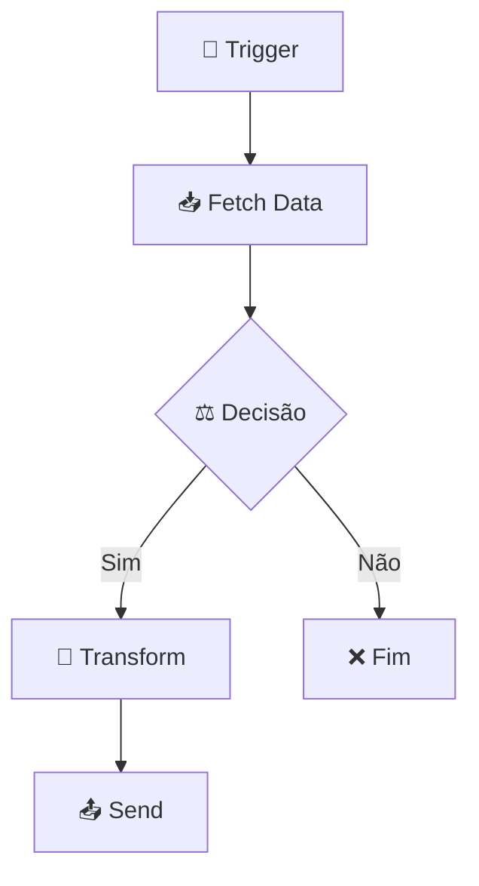

# n8n Flow Analyzer

Skill de análise e documentação de workflows n8n com foco em **comunicação inter-agentes** e **handoff para o Antigravity (Python/EDW)**.

> **Objetivo da equipe**: Todo fluxo do n8n que for migrado para Python no Antigravity precisa **antes** passar por esta skill. A skill NÃO codifica — produz documentação acionável que o agente do Antigravity usará como especificação.
>
> **Substitui** a skill `documentador-n8n` para fluxos da MindFlow.

> **Antes de começar**: leia (ou releia) `Usefull_Skills/docs/conventions.md`. É a fonte da verdade para naming (`{workflow}_{OQF}`), retries (`run_step_with_retry`), separação API↔Worker, rastreabilidade (`workflow_id` / `from_workflow` / `execution_id`) e stack permitida (FastAPI, httpx, arq, supabase, joblib). O Migration Brief gerado precisa ser coerente com essas regras.

---

## Quando Ativar

- O usuário pede para **documentar/analisar um fluxo** (por nome, ID, ou pedindo a lista).
- O usuário pede para **listar workflows do n8n**.
- O usuário pede para **preparar um fluxo para o Antigravity** ou para migração para Python.
- O usuário pede para **documentar todos os fluxos ativos**.
- O usuário cola um **JSON exportado do n8n** no chat (fallback).
- O usuário menciona explicitamente esta skill (`n8n-flow-analyzer`).

---

## Processo de Execução

### Etapa 0 — Obter o fluxo

**Opção A (preferida) — Via n8n MCP:**

1. Se o usuário não informou ID/nome, chame `n8n_list_workflows` e apresente os candidatos (id, nome, active, updatedAt). Aguarde a seleção. Nunca invente IDs.
2. Chame `n8n_get_workflow` com `id=<id>` e `mode="full"` para obter o JSON completo. Modes mais leves só servem para listar; a análise exige o JSON inteiro.
3. **Obrigatório**: chame `n8n_executions` filtrando por `workflowId=<id>` e `status=success`, pegando 1–2 execuções recentes. Use o `inputData` do trigger e o `outputData` do último nó como exemplos REAIS de I/O na seção "Exemplos de Payload Real" do doc.

   **Anonimização (obrigatória)**: antes de escrever no doc, substitua dados sensíveis por placeholders:
   - telefones → `+55XX9XXXXXXXX`
   - nomes próprios → `<NOME>`
   - emails → `<EMAIL>`
   - tokens/API keys em payloads → `<REDACTED>`
   - IDs internos da Mindflow (UUIDs de workflow, agent_id) podem ficar — não são sensíveis.

   Se nenhuma execução de sucesso estiver disponível, registre no doc: "_Sem execução recente — exemplos a coletar_".

**Opção B (fallback) — JSON colado:**

Se o usuário colar o JSON direto no chat, pule a Opção A e siga para a Etapa 1. Sem MCP, não há como gerar a seção de payload real — registre o aviso acima.

**Erros comuns no MCP:**
- `401 unauthorized`: a API Key do n8n expirou. Avise o usuário para renovar no painel (`https://n8n-mcp-n8n.bkpxmb.easypanel.host`) e atualizar `N8N_API_KEY` em `.claude/mcp.json`.
- Workflow inexistente: peça confirmação do ID/nome antes de chamar de novo.

### Etapa 1 — Parse do JSON

Extraia:

1. **Metadados do workflow**: `name`, `id`, `active`, `tags` (se houver).
2. **Lista de nós** (`nodes`): para cada nó, capture `name`, `type`, `parameters`, `position`, `credentials` (apenas nome/tipo, nunca valor).
3. **Conexões** (`connections`): mapeie origem → destino. Identifique conexões condicionais (IF, Switch) e rotule as saídas.

### Etapa 2 — Classificação dos Nós

Classifique cada nó:

| Categoria | Tipos n8n Comuns | Ícone | Mapa EDW (Python) |
|-----------|-----------------|-------|-------------------|
| **Trigger** | `webhook`, `scheduleTrigger`, `manualTrigger`, `formTrigger` | 🔵 / 📝 | Endpoint FastAPI |
| **Webhook Response** | `respondToWebhook` | 📨 | `return 202 Accepted` na API |
| **Fetch/Input** | `httpRequest` (GET), queries em DB | 📥 | `httpx.AsyncClient().get()` |
| **Database** | `supabase`, `postgres`, `redis` | 🗄️ | `supabase` singleton / `asyncpg` / Redis client |
| **AI/LLM** | `@n8n/n8n-nodes-langchain.*`, `openAi` | 🧠 | SDK próprio (`openai`, `langchain`) — chamada async |
| **Transform** | `set`, `code`, `functionItem` | 🔧 | Função Python pura |
| **Decision** | `if`, `switch` | ⚖️ | `if/elif` no worker |
| **Wait/Schedule** | `wait`, `scheduleTrigger` | ⏰ | `arq.enqueue_job(_defer_until=...)` |
| **Output/Send** | `httpRequest` (POST/PUT/DELETE), envios externos | 📤 | `httpx.AsyncClient().post()` |
| **Utility** | `noOp`, `stickyNote`, `merge` | 🔩 | Não migra (ou vira merge no orquestrador) |

> **Dica**: nós `httpRequest` podem ser Fetch OU Output — classifique pelo método HTTP (GET = Fetch; POST/PUT/DELETE = Output).

### Etapa 3 — Identificação de Comunicação Inter-Workflows

Esta etapa diferencia esta skill da antiga `documentador-n8n`.

Para cada nó **Output/Send** (`httpRequest` POST/PUT), analise:

1. **URL de destino**: endpoint interno da Mindflow (ex: `*.easypanel.host`, `{{$env.MINDFLOW_WEBHOOK_URL}}`) ou API externa (Retell, Supabase, Google Sheets)?
2. **Payload enviado**: identifique campos de rastreabilidade EDW (`workflow_id`, `workflow_name`, `from_workflow`, `execution_id`) e campos de negócio (`numero`, `agent_id`, etc.).
3. **Credenciais/Headers**: identifique autenticação (Bearer, API Keys, Header Auth). Apenas tipo e nome, nunca valor.

Para cada nó **Trigger** (`webhook`), analise:
- URL/path do webhook.
- Cross-reference: quem está chamando este webhook (procure no INDEX.md ou em outros workflows já documentados).

Registre cada conexão inter-workflow:

```
[Workflow Origem] ---(método HTTP, endpoint)---> [Workflow Destino]
  Payload: { campo1, campo2, ... }
  Rastreabilidade: { execution_id, from_workflow }
  Auth: X-API-Key (env var: MINDFLOW_WEBHOOK_AUTH)
```

### Etapa 4 — Geração da Documentação Individual

Crie `docs/n8n-workflows/workflow-<nome-kebab-case>.md`:

````markdown
# Workflow: `<nome_do_workflow>`

> **Status n8n**: Ativo/Inativo
> **Trigger**: Webhook / Schedule / Manual / Form
> **ID n8n**: `<id>`
> **Última execução analisada**: `<execution_id>` em `<data>`

---

## Descrição Geral

[2-3 frases sobre o que o workflow faz, baseado nos nós.]

## Diagrama de Fluxo



## Comunicação com Outros Workflows

| Direção | Workflow | Endpoint | Método | Dados Passados |
|---------|----------|----------|--------|----------------|
| ← Recebe de | `workflow_x` | /webhook/path | POST | execution_id, numero |
| → Envia para | `workflow_y` | /webhook/other | POST | payload completo |

### Dados de Rastreabilidade

| Campo | Valor/Origem | Obrigatório |
|-------|-------------|-------------|
| `execution_id` | Gerado no trigger | ✅ |
| `from_workflow` | Nome deste workflow | ✅ |
| `workflow_id` | Constante fixa | ✅ |

## Exemplos de Payload Real (anonimizado)

**Trigger input** (execução `<execution_id>`):
```json
{
  "numero": "+55XX9XXXXXXXX",
  "agent_id": "agent_abc123",
  "nome": "<NOME>"
}
```

**Output final** (último nó):
```json
{
  "call_id": "call_xyz789",
  "status": "scheduled"
}
```

## Detalhamento dos Nós

### 1. `<nome_do_no>` (🔵 Trigger)
- **Tipo n8n**: `n8n-nodes-base.webhook`
- **Descrição**: [o que faz]
- **Configuração**: path, método, auth
- **Saídas**: → `<próximo_nó>`

[... repetir para cada nó ...]

## Variáveis de Ambiente Utilizadas

| Variável | Uso no Workflow |
|----------|-----------------|
| `SUPABASE_URL` | Conexão com banco |
| `RETELL_API_KEY` | Autenticação no envio |

## Credenciais n8n Utilizadas

| Nome da Credencial | Tipo | Nós que Usam |
|--------------------|------|--------------|
| `Supabase account` | Supabase | Fetch Data |
````

### Etapa 5 — Migration Brief (Antigravity / Python)

**Esta é a entrega central** para o Antigravity. Anexe ao mesmo `.md` da Etapa 4:

````markdown
## 🚀 Migration Brief — Antigravity / Python

> Especificação para o agente do Antigravity reimplementar este workflow em Python conforme `Usefull_Skills/docs/conventions.md` (EDW).

### Camada API (FastAPI)

- **Endpoint sugerido**: `POST /webhook/<path>`
- **Schema Pydantic de entrada** (`schemas.py`):

```python
class <Workflow>Input(BaseModel):
    numero: str
    agent_id: str
    # ... campos inferidos do trigger e do exemplo real
```

- **Resposta**: `202 Accepted` + `execution_id`
- **Validações obrigatórias**: [ex: `quando_ligar` precisa de timezone offset]

### Camada Worker (ARQ)

Mapa nó n8n → step EDW (cada step executa via `run_step_with_retry`):

| # | n8n node | Step EDW (`{wf}_{OQF}`) | I/O | Lib Python | Retries | Async? |
|---|----------|-------------------------|-----|------------|---------|--------|
| 1 | "Fetch Prompt" (Supabase) | `pre_call_processing_fetch_prompt` | in: numero; out: prompt | `supabase` singleton | 3 | sim |
| 2 | "Format Payload" (Code) | `pre_call_processing_format_payload` | in: prompt+dados; out: payload | puro Python | 0 | sim |
| 3 | "Create Retell Call" (HTTP POST) | `pre_call_processing_create_retell_call` | in: payload; out: call_id | `httpx.AsyncClient` | 3 | sim |

### Comunicação Externa (Saídas)

Para cada chamada HTTP externa: URL, método, headers (auth → env var), payload, retorno esperado.

### Variáveis de Ambiente Necessárias (.env)

| Variável | Origem n8n | Uso no Python |
|----------|-----------|----------------|
| `RETELL_API_KEY` | credencial "Retell Auth" | header `Authorization` |
| `SUPABASE_URL` | credencial Supabase | client singleton |

### Rastreabilidade Obrigatória (conventions.md)

- `workflow_id`: `<fixo, ex: pre_call_processing_v1>`
- `from_workflow`: `<nome>` (quando chamado por outro workflow)
- `execution_id`: UUID gerado pela API
- Persistir em: `workflow_executions` (master) + `workflow_step_executions` (detail).

### Pontos de Atenção / Divergências do EDW

- [ex: este workflow tem um nó "Wait" — em EDW vira `arq.enqueue_job(_defer_until=...)`]
- [ex: usa `requests` síncrono em Code node — migrar para `httpx.AsyncClient`]
- [ex: lógica ML inline — extrair para `worker.py` com modelo carregado no `startup` Singleton]
- [ex: nó merge sem chave de correlação — exigir `execution_id` na junção]

### Status de Migração

- [ ] Documentado
- [ ] Schemas Pydantic definidos
- [ ] API endpoint implementado
- [ ] Worker steps implementados
- [ ] Validado em ambiente de teste
- [ ] Migrado em produção
````

### Etapa 6 — Atualização do INDEX.md

Atualize `docs/n8n-workflows/INDEX.md`. Se já existir uma entrada para este workflow, **atualize** em vez de duplicar. Adicione a coluna **Status migração**:

```markdown
| # | Workflow | Trigger | Chama | É Chamado Por | Status migração | Doc |
|---|----------|---------|-------|---------------|-----------------|-----|
| 1 | `call_predict` | Webhook | `pre_call_processing` | — | 🟡 Documentado | [link](./workflow-call-predict.md) |
| 2 | `pre_call_processing` | Webhook | Retell AI | `call_predict` | 🟢 Migrado | [link](./workflow-pre-call-processing.md) |
```

Legenda de status: ⚪ Pendente · 🟡 Documentado · 🔵 Em migração · 🟢 Migrado

Atualize também o diagrama Mermaid macro, o "Mapa de Rastreabilidade" e "Serviços Externos" acumulando o que este workflow trouxe.

---

## Regras Obrigatórias

1. **Não codifique implementação.** Esta skill APENAS documenta. Schemas Pydantic e assinaturas de função no Migration Brief **são documentação**, não implementação — sem corpo de função real, sem lógica de negócio em Python. A implementação acontece no Antigravity, usando este doc como spec.

2. **Anonimize sempre** dados sensíveis dos exemplos reais (telefones, nomes, emails, tokens). Ver Etapa 0.

3. **Nomenclatura**: arquivos em `kebab-case` (`workflow-call-predict.md`). Workflows no texto em `snake_case` (`call_predict`). Steps EDW seguem `{workflow_name}_{OQF}` (conventions.md).

4. **Pasta de saída**: sempre `docs/n8n-workflows/`. Crie se não existir.

5. **INDEX.md é acumulativo**: nunca sobrescreva — atualize/adicione entradas. Se já há entrada para o workflow, atualize.

6. **Pergunte antes de assumir**: se o JSON não deixar claro o propósito de um nó ou conexão, pergunte ao usuário em vez de inventar.

7. **Diagrama Mermaid obrigatório**: todo workflow DEVE ter `flowchart TD`.

8. **Comunicação inter-agentes é prioridade**: a seção "Comunicação com Outros Workflows" + o Migration Brief são as partes mais importantes. Não economize detalhe ali.

9. **Credenciais**: nunca inclua valores reais. Apenas nomes, tipos e env var correspondente.

10. **Coerência com `conventions.md`**: o Migration Brief precisa respeitar — naming, retries com `run_step_with_retry`, separação API↔Worker (API responde 202, Worker faz o resto), stack permitida (FastAPI, httpx, arq, supabase, joblib; proibido: Flask, `requests` síncrono, `time.sleep`, `BackgroundTasks`, `APScheduler`).

---

## Fluxo de Interação com o Usuário

```
1. Usuário pede para documentar um fluxo (por nome/id, ou pede a lista).
2. Você chama `n8n_list_workflows` se necessário, `n8n_get_workflow` (mode=full)
   e `n8n_executions` (status=success, limit=2) para colher JSON + exemplos reais.
   Fallback: aceitar JSON colado pelo usuário.
3. Você analisa, classifica os nós, mapeia comunicação inter-workflows e
   gera a doc + Migration Brief.
4. Você pergunta: "Há contexto de negócio que não está no JSON que eu deva incluir?"
5. Usuário complementa (ou não).
6. Você salva o `.md`, atualiza o INDEX.md (com status migração) e informa:
   "Workflow documentado e pronto para Antigravity. Próximo?"
```

---

## Compatibilidade

- **n8n versions**: JSONs exportados de n8n v1.x e v2.x.
- **MCP**: requer servidor `n8n` configurado em `mcp.json` (ferramentas `n8n_list_workflows`, `n8n_get_workflow`, `n8n_executions`).
- **Portabilidade**: skill autocontida em um único arquivo. Para reaproveitar em outro projeto, copie `n8n-flow-analyzer/` para `.agents/Skills/` (ou equivalente).
