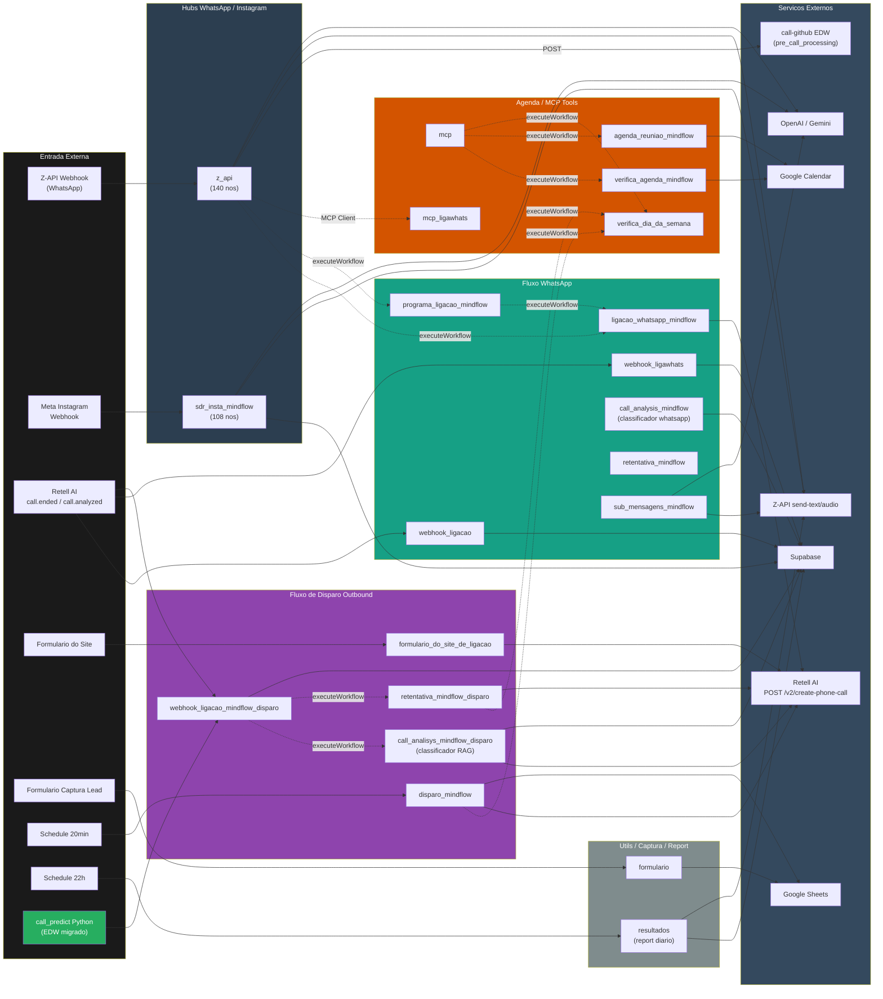

# Mapa de Workflows n8n — Mindflow

> Documentacao gerada pela skill `n8n-flow-analyzer`.
> Pre-requisito obrigatorio antes da migracao para Antigravity (Python/EDW conforme [conventions.md](../conventions.md)).
> Ultima atualizacao: 2026-05-14

---

## Diagrama de Comunicacao (Visao Macro)

> **Legenda**: setas solidas = HTTP/Webhook; setas tracejadas = `executeWorkflow` (chamada in-process n8n). `call_predict` (Python EDW ja migrado) entra como fonte externa em `webhook_ligacao_mindflow_disparo`.

---

## Workflows Documentados (21 ativos + 1 referenciado)

Legenda Status migracao: ⚪ Pendente · 🟡 Documentado · 🔵 Em migracao · 🟢 Migrado

| # | Workflow | Trigger | Chama | E Chamado Por | Status migracao | Doc |
|---|----------|---------|-------|---------------|-----------------|-----|
| 1 | `ligacao_whatsapp_mindflow` | executeWorkflow | Retell AI, Supabase, OpenAI | `z_api`, `programa_ligacao_mindflow` | 🟡 Documentado | [link](./workflow-ligacao-whatsapp-mindflow.md) |
| 2 | `disparo_mindflow` | Schedule 20min | Retell AI, Sheets, Supabase, OpenAI, `verifica_dia_da_semana` | — (auto) | 🟡 Documentado | [link](./workflow-disparo-mindflow.md) |
| 3 | `call_analysis_mindflow` | executeWorkflow | OpenAI, Supabase RAG | (cross-ref pendente) | 🟡 Documentado | [link](./workflow-call-analysis-mindflow.md) |
| 4 | `webhook_ligawhats` | Webhook publico | Supabase | Retell AI (externo) | 🟡 Documentado | [link](./workflow-webhook-ligawhats.md) |
| 5 | `retentativa_mindflow` | (ver doc) | Retell, Supabase, sub-workflows | (cross-ref pendente) | 🟡 Documentado | [link](./workflow-retentativa-mindflow.md) |
| 6 | `formulario` | Webhook publico | Google Sheets | Form externo | 🟡 Documentado | [link](./workflow-formulario.md) |
| 7 | `webhook_ligacao` | Webhook publico | Supabase | Retell AI (externo) | 🟡 Documentado | [link](./workflow-webhook-ligacao.md) |
| 8 | `agenda_reuniao_mindflow` | executeWorkflow | Google Calendar | `mcp` | 🟡 Documentado | [link](./workflow-agenda-reuniao-mindflow.md) |
| 9 | `verifica_agenda_mindflow` | executeWorkflow | Google Calendar | `mcp` | 🟡 Documentado | [link](./workflow-verifica-agenda-mindflow.md) |
| 10 | `sub_mensagens_mindflow` | executeWorkflow | Z-API, OpenAI, Supabase, Postgres | (cross-ref pendente) | 🟡 Documentado | [link](./workflow-sub-mensagens-mindflow.md) |
| 11 | `call_analisys_mindflow_disparo` | executeWorkflow | Retell, Z-API, Supabase RAG, OpenAI | `webhook_ligacao_mindflow_disparo` | 🟡 Documentado | [link](./workflow-call-analisys-mindflow-disparo.md) |
| 12 | `verifica_dia_da_semana` | executeWorkflow | (puro Code) | `disparo_mindflow`, `retentativa_mindflow_disparo`, `mcp` | 🟡 Documentado | [link](./workflow-verifica-dia-da-semana.md) |
| 13 | `retentativa_mindflow_disparo` | executeWorkflow | Retell, Supabase, `verifica_dia_da_semana` | `webhook_ligacao_mindflow_disparo` | 🟡 Documentado | [link](./workflow-retentativa-mindflow-disparo.md) |
| 14 | `mcp` | mcpTrigger | `verifica_agenda_mindflow`, `agenda_reuniao_mindflow`, `verifica_dia_da_semana` | LLM Agent Retell (tools) | 🟡 Documentado | [link](./workflow-mcp.md) |
| 15 | `formulario_do_site_de_ligacao` | Webhook publico | Retell, OpenAI | Form site externo | 🟡 Documentado | [link](./workflow-formulario-do-site-de-ligacao.md) |
| 16 | `sdr_insta_mindflow` | Webhook publico | Instagram, Z-API, OpenAI, Gemini, Supabase, MCP | Meta Instagram (externo) | 🟡 Documentado | [link](./workflow-sdr-insta-mindflow.md) |
| 17 | `programa_ligacao_mindflow` | Webhook publico | `ligacao_whatsapp_mindflow` | `z_api` (toolWorkflow legado) | 🟡 Documentado | [link](./workflow-programa-ligacao-mindflow.md) |
| 18 | `webhook_ligacao_mindflow_disparo` | Webhook publico | `call_analisys_mindflow_disparo`, `retentativa_mindflow_disparo`, Supabase, EDW call-predict | Retell AI, `call_predict` (externo) | 🟡 Documentado | [link](./workflow-webhook-ligacao-mindflow-disparo.md) |
| 19 | `resultados` | Schedule 22h | Supabase, Z-API | — (auto) | 🟡 Documentado | [link](./workflow-resultados.md) |
| 20 | `z_api` | Webhook publico | `ligacao_whatsapp_mindflow`, `programa_ligacao_mindflow`, `mcp_ligawhats`, EDW pre_call_processing | Z-API provider (externo) | 🟡 Documentado | [link](./workflow-z-api.md) |
| 21 | `mcp_ligawhats` | mcpTrigger | (ver doc) | `z_api` (MCP Client) | 🟡 Documentado | [link](./workflow-mcp-ligawhats.md) |
| — | `call_predict` (Python) | Webhook FastAPI | `pre_call_processing` (EDW), Supabase, XGBoost | Forms externos / hubs | 🟢 Migrado | [doc Python](../workflow.md) |

---

## Mapa de Rastreabilidade

> Campos EDW obrigatorios conforme [conventions.md](../conventions.md#-comunicacao-entre-workflows): `workflow_id`, `from_workflow`, `execution_id`.
>
> **Estado atual nos workflows n8n: AUSENTE em quase todos.** Lacuna critica para migracao — todo sub-workflow chamado in-process via `executeWorkflow` precisa passar a receber esses campos. Webhooks externos (Retell, formularios, Z-API provider) terao `execution_id` gerado pela API FastAPI.

| Campo | Origem (na migracao) | Destino | Obrigatorio | Estado n8n atual |
|-------|---------------------|---------|-------------|------------------|
| `workflow_id` | Constante fixa no codigo (ex: `pre_call_processing_v1`) | `workflow_executions` + payloads inter-WF | ✅ | ❌ ausente |
| `from_workflow` | Nome do workflow chamador | payloads inter-WF | ✅ | ❌ ausente |
| `execution_id` | UUID gerado pela API que recebeu o webhook | `workflow_executions` (master) + `workflow_step_executions` (detail) + propagado em sub-chamadas | ✅ | ❌ ausente |
| `Retell call.metadata.workflow_execution_id` | Propagado pelo `call_predict` Python | Retorna no webhook Retell para correlacionar | ✅ | 🟢 ja existe parcialmente em `webhook_ligacao_mindflow_disparo` |

---

## Servicos Externos

| Servico | Tipo | Workflows que Usam |
|---------|------|-------------------|
| **Retell AI** (`api.retellai.com/v2/create-phone-call`) | LLM voice agent (outbound) | `ligacao_whatsapp_mindflow`, `disparo_mindflow`, `formulario_do_site_de_ligacao`, `call_analisys_mindflow_disparo`, `retentativa_mindflow_disparo` |
| **Retell AI** (webhook receivers) | LLM voice agent (event sink) | `webhook_ligacao`, `webhook_ligawhats`, `webhook_ligacao_mindflow_disparo` |
| **Z-API** (`api.z-api.io`) | WhatsApp Business API (send-text / send-audio / send-reaction) | `z_api`, `sub_mensagens_mindflow`, `sdr_insta_mindflow`, `call_analisys_mindflow_disparo`, `resultados` |
| **Supabase** (REST + Vector) | Database (calls, leads, prompts) + RAG (`documents_fil` 1536 dims) | `webhook_ligawhats`, `webhook_ligacao`, `webhook_ligacao_mindflow_disparo`, `call_analysis_mindflow`, `call_analisys_mindflow_disparo`, `disparo_mindflow`, `retentativa_mindflow_disparo`, `sdr_insta_mindflow`, `z_api`, `sub_mensagens_mindflow`, `resultados`, `ligacao_whatsapp_mindflow` |
| **Postgres MindFlow** | Chat memory (Langchain memoryPostgresChat) | `z_api`, `sdr_insta_mindflow`, `sub_mensagens_mindflow` |
| **Google Calendar** | OAuth2 — calendario `Diagnostico MIndflow` + calendario feriados BR | `verifica_agenda_mindflow`, `agenda_reuniao_mindflow`, `mcp` |
| **Google Sheets** | OAuth2 — planilhas `df_expanded_numbers`, `Leads Forms` | `disparo_mindflow`, `formulario` |
| **OpenAI** | gpt-4.1-nano (T=0.3), gpt-4.1-mini, gpt-4o-mini, whisper, tts-1-hd (voz `nova`), embeddings-3-small 1536 dims | `call_analisys_mindflow_disparo`, `call_analysis_mindflow`, `z_api`, `sdr_insta_mindflow`, `sub_mensagens_mindflow`, `disparo_mindflow`, `ligacao_whatsapp_mindflow`, `formulario_do_site_de_ligacao` |
| **Google Gemini** | gemini-2.5-flash (video) | `sdr_insta_mindflow`, `z_api` |
| **Instagram Graph API v21.0** | DMs Meta | `sdr_insta_mindflow` |
| **call-github EDW** (`call-github.bkpxmb.easypanel.host/webhook`) | pre_call_processing Python (EDW migrado) | `z_api` (tool `programa_ligacao` ativa) |
| **call-predict-github** (`call-predict-github.bkpxmb.easypanel.host`) | Python EDW (Lead Scoring + Timing Predict, ja migrado) | `webhook_ligacao_mindflow_disparo` |
| **n8n MCP Server** (interno) | Tools para LLM Agent | `mcp` expoe; `z_api`/`sdr_insta_mindflow` consomem `mcp_ligawhats` |

---

## Cluster de Migracao Sugerido (para o Antigravity)

Agrupamento proposto por dominio para permitir migracao incremental em vez de big-bang:

1. **Cluster `disparo_outbound`** (alta prioridade — fluxo critico de receita):
   `webhook_ligacao_mindflow_disparo` + `call_analisys_mindflow_disparo` + `retentativa_mindflow_disparo` + `verifica_dia_da_semana`. Ja se integra com `call_predict` Python existente.

2. **Cluster `agenda_tools`** (baixo risco, util como POC FastMCP):
   `mcp` + `verifica_agenda_mindflow` + `agenda_reuniao_mindflow`. Bug ja conhecido em `agendar_reuniao` (Bad Request em execucoes) precisa ser resolvido antes.

3. **Cluster `whatsapp_hub`** (alta complexidade — quebrar em sub-modulos):
   `z_api` (140 nos!) deve virar 5-6 servicos Antigravity: `z_api_ingress` / `z_api_media_normalizer` / `z_api_buffer` / `z_api_sdr_agent` (LLM agent dedicado) / `z_api_egress`. Auxiliares: `sub_mensagens_mindflow`, `ligacao_whatsapp_mindflow`, `programa_ligacao_mindflow`, `mcp_ligawhats`, `webhook_ligawhats`, `webhook_ligacao`, `call_analysis_mindflow`, `retentativa_mindflow`.

4. **Cluster `instagram_sdr`** (alta complexidade — quebrar em sub-modulos):
   `sdr_insta_mindflow` (108 nos) → `sdr_insta_intake` + `sdr_insta_media` + `sdr_insta_responder`.

5. **Cluster `intake_forms`** (baixo risco):
   `formulario` + `formulario_do_site_de_ligacao` + `disparo_mindflow` (schedule).

6. **Cluster `observability`** (baixo risco):
   `resultados` (report diario).

---

## Bandeiras Cruzadas (riscos comuns a todos os workflows)

Estes pontos aparecem repetidamente nos Migration Briefs individuais e merecem politica unificada:

1. **Credenciais hardcoded em texto plano**: Retell Bearer, Z-API tokens, Client-Token, X-API-Key do EDW. Identificados em pelo menos 8 workflows. Politica: **rotacionar todas apos migracao** e mover para `.env` via Easypanel.
2. **Webhooks publicos sem autenticacao**: `formulario`, `programa_ligacao_mindflow`, `formulario_do_site_de_ligacao`, `webhook_ligawhats`, `webhook_ligacao`, `mcp`, `mcp_ligawhats` (MCP authentication: "none"). Politica: adicionar `X-API-Key` ou HMAC (especialmente `x-retell-signature` nos webhooks Retell).
3. **Rastreabilidade EDW ausente**: nenhum workflow propaga `execution_id`/`from_workflow`/`workflow_id`. Politica: contrato Pydantic na migracao forca esses campos como obrigatorios.
4. **`Wait` n8n**: aparece em `retentativa_mindflow_disparo`, `programa_ligacao_mindflow`, `sub_mensagens_mindflow`, `z_api`. Politica: substituir por `arq.enqueue_job(_defer_until=...)` — `time.sleep`/`BackgroundTasks`/`APScheduler` proibidos por [conventions.md](../conventions.md#%EF%B8%8F-stack-tecnol%C3%B3gica).
5. **LLM para tarefas deterministicas**: normalizacao de telefone via gpt-4.1-mini (3 workflows). Politica: substituir por regex puro Python — economia de custo + latencia + 0% falha de parsing.
