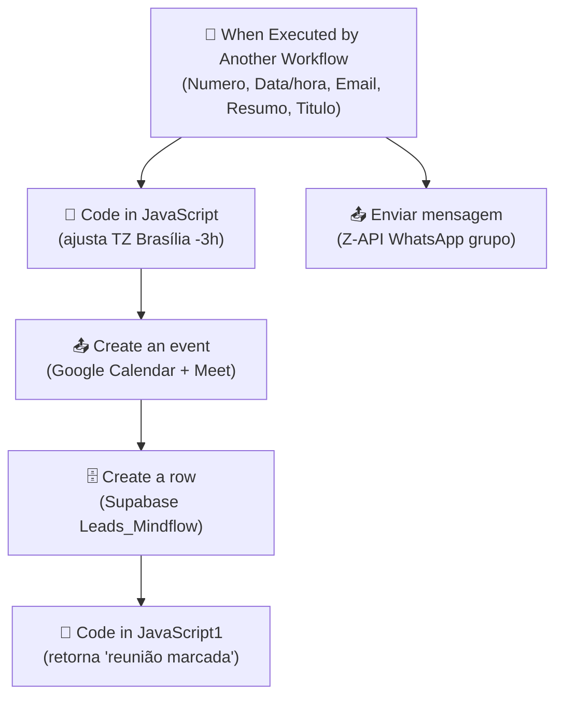

# Workflow: `agenda_reuniao_mindflow`

> **Status n8n**: Ativo
> **Trigger**: Execute Workflow (sub-workflow invocado por outro workflow n8n)
> **ID n8n**: `ELqE1Mbt9DLmAb6wc5M3e`
> **Tag**: Mindflow
> **Última execução analisada**: `485041` em `2026-05-06T13:36:04Z` (success)

---

## Descrição Geral

Sub-workflow chamado quando um lead aceita marcar reunião durante a ligação do agente de voz Mindflow. Recebe dados do lead (número, data/hora desejada, email, resumo da ligação, título), ajusta o fuso horário para Brasília, cria um evento no Google Calendar do calendário "Diagnóstico MIndflow" com link do Google Meet, registra o status "Reunião marcada" na tabela `Leads_Mindflow` no Supabase e dispara uma notificação WhatsApp via Z-API para o grupo interno da equipe Iatize/Mindflow.

Diferente de `verifica_agenda_mindflow` (que consulta horários livres antes da escolha), este workflow **executa o agendamento efetivo** após o lead confirmar o slot.

## Diagrama de Fluxo



> Observação: o trigger dispara DUAS branches em paralelo — uma cria o evento+linha; a outra notifica o WhatsApp imediatamente (não espera a criação do evento).

## Comunicação com Outros Workflows

| Direção | Workflow / Serviço | Endpoint | Método | Dados Passados |
|---------|--------------------|----------|--------|----------------|
| Recebe de | `verifica_agenda_mindflow` (id `d1Rj8b4TmPpIaZIVd116T`, conforme `parentExecution.workflowId` nas execuções) | n8n internal (Execute Workflow) | invoke | `Numero, Data/hora, Email, Resumo, Titulo` |
| Envia para | Google Calendar API | `googleapis.com/calendar/v3/events` | POST | event payload + attendees + Meet |
| Envia para | Supabase `Leads_Mindflow` | REST | POST (insert row) | `Email, Etapa CRM, Reunião Marcada` |
| Envia para | Z-API WhatsApp | `api.z-api.io/instances/.../send-text` | POST | mensagem texto p/ grupo `120363424280785137-group` |

### Dados de Rastreabilidade

| Campo | Valor/Origem | Obrigatório no n8n |
|-------|-------------|--------------------|
| `execution_id` | Gerado pelo n8n (ex: `485041`) | Implícito |
| `parentExecution.workflowId` | Workflow chamador (`d1Rj8b4TmPpIaZIVd116T`) | Implícito |
| `workflow_id` | Não propagado no payload | Ausente (lacuna EDW) |
| `from_workflow` | Não propagado no payload | Ausente (lacuna EDW) |

## Exemplos de Payload Real (anonimizado)

**Trigger input** (execução `485041`):
```json
{
  "Numero": "+55XX9XXXXXXXX",
  "Data/hora": "2026-05-07T10:00:00.000Z",
  "Email": "<EMAIL>",
  "Resumo ": "Equipe de vendas com gargalo em preparo e técnica, busca solução de automação de atendimento e diagnóstico MindFlow.",
  "Titulo": "Atendimento - <NOME>"
}
```

**Output Google Calendar (`Create an event`)**:
```json
{
  "id": "j6jh2u0g83mgtdgpu29n0ecpv8",
  "summary": "Atendimento - <NOME>",
  "start": {"dateTime": "2026-05-07T07:00:00-03:00", "timeZone": "America/New_York"},
  "end":   {"dateTime": "2026-05-07T08:00:00-03:00", "timeZone": "America/New_York"},
  "hangoutLink": "https://meet.google.com/wdg-ewvf-paa",
  "status": "confirmed"
}
```

**Output Supabase (`Create a row`)**:
```json
{
  "id": 1148,
  "created_at": "2026-05-06T13:36:07.260223+00:00",
  "Etapa CRM": "Reunião marcada",
  "Reunião Marcada": "2026-05-07T10:00:00.000Z",
  "Email": "<EMAIL>"
}
```

**Output final (`Code in JavaScript1`)**:
```json
{ "mensagem": "reunião marcada" }
```

## Detalhamento dos Nós

### 1. `When Executed by Another Workflow` (📝 Trigger)
- **Tipo n8n**: `n8n-nodes-base.executeWorkflowTrigger` (v1.1)
- **Descrição**: Ponto de entrada do sub-workflow. Define o schema esperado: `Numero`, `Data/hora`, `Email`, `Resumo ` (com espaço), `Titulo`.
- **Saídas**: → `Code in JavaScript` e → `Enviar mensagem` (fan-out paralelo).

### 2. `Code in JavaScript` (🔧 Transform)
- **Tipo n8n**: `n8n-nodes-base.code` (v2)
- **Descrição**: Converte `Data/hora` (string ISO) para `Date` aplicando offset manual de Brasília (-3h). Usa `getTimezoneOffset()` do runtime n8n + ajuste de 180 min.
- **Atenção**: A lógica é frágil — depende do TZ do runtime n8n. Resultado é um objeto `Date` JS, não string ISO normalizada.
- **Saídas**: → `Create an event`.

### 3. `Create an event` (📤 Output — Google Calendar)
- **Tipo n8n**: `n8n-nodes-base.googleCalendar` (v1.3)
- **Calendário**: `c_0c05c1269e9b6880ecd85c1083e3ff63c6632b53e8d0e72e55db17baec6e8291@group.calendar.google.com` (Diagnóstico MIndflow).
- **Start/End**: `Data/hora + 3h` até `Data/hora + 4h` (compensação extra de TZ aplicada em cima do node 2 — possível double-shift).
- **Attendees**: email do lead + `renato.paranhos@iatize-ia.com`, `gabriel.neves@iatize-ia.com`, `iatize.mkt@iatize-ia.com`.
- **Conferência**: Google Meet (`hangoutsMeet`) auto-gerado.
- **Credencial**: `Google Calendar account` (OAuth2).
- **Saídas**: → `Create a row`.

### 4. `Create a row` (🗄️ Database — Supabase)
- **Tipo n8n**: `n8n-nodes-base.supabase` (v1)
- **Tabela**: `Leads_Mindflow`.
- **Campos**: `Email`, `Etapa CRM` = "Reunião marcada", `Reunião Marcada` = data/hora original.
- **Atenção**: Faz INSERT (cria linha nova) em vez de UPDATE — pode duplicar leads. `Etapa CRM` é setado duas vezes no array (redundância).
- **Credencial**: `supabase Mindflow`.
- **Saídas**: → `Code in JavaScript1`.

### 5. `Code in JavaScript1` (🔩 Utility)
- **Tipo n8n**: `n8n-nodes-base.code` (v2)
- **Descrição**: Retorna `{ mensagem: "reunião marcada" }`. Função: sinalizar sucesso ao workflow chamador.

### 6. `Enviar mensagem` (📤 Output — Z-API)
- **Tipo n8n**: `n8n-nodes-base.httpRequest` (v4.2)
- **URL**: `https://api.z-api.io/instances/3E5F252F583800117B3E5ED75F1870FF/token/<REDACTED>/send-text`
- **Header**: `Client-Token: <REDACTED>` (hardcoded no JSON).
- **Body**: `phone=120363424280785137-group`, `message` formatada com Titulo/Data-hora/Numero/Email/Resumo.
- **onError**: `continueRegularOutput` (não bloqueia o fluxo se a notificação falhar).
- **Atenção**: Roda em paralelo com a branch principal — pode disparar WhatsApp ANTES do evento ser criado.

## Variáveis de Ambiente Utilizadas

| Variável | Uso no Workflow |
|----------|-----------------|
| (nenhuma via `$env`) | Tokens Z-API e instance ID estão hardcoded no JSON do node `Enviar mensagem` |

## Credenciais n8n Utilizadas

| Nome da Credencial | Tipo | ID | Nós que Usam |
|--------------------|------|----|--------------|
| `Google Calendar account` | googleCalendarOAuth2Api | `0rdPXKo5BIdKaW3s` | Create an event |
| `supabase Mindflow` | supabaseApi | `xPgzw7ayw9gmHNlh` | Create a row |

---

## Migration Brief - Antigravity / Python

> Especificação para reimplementar este workflow em Python conforme `Usefull_Skills/docs/conventions.md` (EDW). **NENHUM código Python foi implementado** nesta entrega — apenas spec.

### Camada API (FastAPI)

- **Endpoint sugerido**: `POST /webhook/agenda-reuniao-mindflow`
- **Schema Pydantic de entrada** (`schemas.py`):

```python
class AgendaReuniaoMindflowInput(BaseModel):
    numero: str                # tel E.164
    data_hora: datetime        # ISO 8601 com timezone OBRIGATÓRIO
    email: EmailStr
    resumo: str
    titulo: str
    # rastreabilidade EDW (a ADICIONAR — hoje ausentes no n8n)
    from_workflow: str         # ex: "verifica_agenda_mindflow"
    execution_id: UUID         # propagada do chamador
```

- **Resposta**: `202 Accepted` + `execution_id` (UUID gerado).
- **Validações obrigatórias**: `data_hora` precisa de timezone offset (rejeita com `400` se naive). Email válido. Número E.164.
- **Ação API**: validar, gravar `workflow_executions` (status `PENDING`) e enfileirar em `arq` — responde 202.

### Camada Worker (ARQ)

Mapa n8n -> step EDW (cada step executa via `run_step_with_retry`):

| # | n8n node | Step EDW (`agenda_reuniao_mindflow_<OQF>`) | I/O | Lib Python | Retries | Async? |
|---|----------|-------------------------------------------|-----|------------|---------|--------|
| 1 | Trigger | `agenda_reuniao_mindflow_validate_input` | in: payload bruto; out: payload normalizado (datetime BR) | `pydantic`, `zoneinfo` | 0 | sim |
| 2 | Code in JavaScript | `agenda_reuniao_mindflow_normalize_timezone` | in: data_hora ISO; out: datetime America/Sao_Paulo | `zoneinfo` (`parse_iso_to_br`) | 0 | sim |
| 3 | Create an event | `agenda_reuniao_mindflow_create_calendar_event` | in: payload normalizado; out: `event_id`, `meet_link` | `httpx.AsyncClient` + Google Calendar API v3 | 3 | sim |
| 4 | Create a row | `agenda_reuniao_mindflow_upsert_lead_status` | in: email+data; out: row_id | `supabase` singleton | 3 | sim |
| 5 | Enviar mensagem (paralelo) | `agenda_reuniao_mindflow_notify_whatsapp_group` | in: dados reunião; out: message_id | `httpx.AsyncClient` (Z-API) | 2 | sim, em `asyncio.gather` |
| 6 | Code in JavaScript1 | (não migra — substituído por update final em `workflow_executions` → `SUCCESS`) | — | — | — | — |

> A notificação WhatsApp (step 5) deve rodar em paralelo via `asyncio.gather` com tolerância a falha (`return_exceptions=True`) — não bloqueia o sucesso geral.

### Comunicação Externa (Saídas)

| Destino | URL | Método | Headers | Payload | Retorno |
|---------|-----|--------|---------|---------|---------|
| Google Calendar | `https://www.googleapis.com/calendar/v3/calendars/{cal_id}/events?conferenceDataVersion=1&sendUpdates=all` | POST | `Authorization: Bearer <token OAuth>` | summary, start, end, attendees[], conferenceData | `id`, `hangoutLink` |
| Supabase | `${SUPABASE_URL}/rest/v1/Leads_Mindflow` | POST (ou PATCH se UPSERT) | `apikey`, `Authorization`, `Prefer: return=representation` | `Email, Etapa CRM, Reunião Marcada` | row JSON |
| Z-API | `https://api.z-api.io/instances/${ZAPI_INSTANCE}/token/${ZAPI_TOKEN}/send-text` | POST | `Client-Token: ${ZAPI_CLIENT_TOKEN}` | `phone, message, delayTyping` | `zaapId, messageId` |

### Variáveis de Ambiente Necessárias (.env)

| Variável | Origem n8n | Uso no Python |
|----------|-----------|----------------|
| `GOOGLE_CALENDAR_CLIENT_ID` | credencial OAuth2 | refresh token flow |
| `GOOGLE_CALENDAR_CLIENT_SECRET` | credencial OAuth2 | refresh token flow |
| `GOOGLE_CALENDAR_REFRESH_TOKEN` | credencial OAuth2 | renovar access token |
| `GOOGLE_CALENDAR_ID_DIAGNOSTICO` | hardcoded no node | calendário destino |
| `SUPABASE_URL` | credencial `supabase Mindflow` | client singleton |
| `SUPABASE_SERVICE_KEY` | credencial `supabase Mindflow` | client singleton |
| `ZAPI_INSTANCE_ID` | hardcoded URL | montar URL |
| `ZAPI_TOKEN` | hardcoded URL | montar URL |
| `ZAPI_CLIENT_TOKEN` | hardcoded header | header `Client-Token` |
| `ZAPI_GROUP_ID_REUNIOES` | hardcoded body | grupo destino WhatsApp |
| `MEETING_ATTENDEES_INTERNAL` | hardcoded array | lista de convidados internos (CSV) |
| `REDIS_URL` | infra | ARQ (`RedisSettings.from_dsn`) |

### Rastreabilidade Obrigatória (conventions.md)

- `workflow_id`: `agenda_reuniao_mindflow_v1` (constante fixa).
- `from_workflow`: recebido no payload (esperado: `verifica_agenda_mindflow`).
- `execution_id`: UUID gerado pela API no `POST /webhook/agenda-reuniao-mindflow`.
- Persistir em: `workflow_executions` (master, PENDING -> RUNNING -> SUCCESS|FAILED) + `workflow_step_executions` (uma linha por step com `attempt`, `status`).

### Pontos de Atenção / Divergências do EDW

- **Sem rastreabilidade EDW hoje**: o payload n8n não carrega `workflow_id`/`from_workflow`/`execution_id`. A API Python deve EXIGIR `from_workflow` e `execution_id` do chamador (`verifica_agenda_mindflow`) e gerar `execution_id` próprio se ausente.
- **Double-shift de timezone**: node `Code in JavaScript` aplica -3h e o node `Create an event` aplica `+ 3h`/`+ 4h` em cima. Validar com produto qual é o comportamento desejado e migrar com **uma única** conversão via `parse_iso_to_br`. O output real mostra `timeZone: "America/New_York"` no Google Calendar — mais um sinal de inconsistência.
- **INSERT em vez de UPSERT**: `Create a row` cria nova linha em `Leads_Mindflow` em vez de atualizar o lead existente. Em Python, usar `upsert` por `Email` (ou `Número`) para não duplicar.
- **Secrets hardcoded**: tokens Z-API e Client-Token estão embutidos no JSON do n8n. Em Python, mover 100% para `.env`.
- **Branch paralela não estruturada**: WhatsApp é disparado em paralelo com o agendamento — em EDW, usar `asyncio.gather` explícito e logar ambos como steps separados em `workflow_step_executions`.
- **Lista de attendees fixa no node**: hardcoded com emails do time Iatize. Migrar para env var CSV ou tabela de configuração.
- **`onError: continueRegularOutput` no Z-API**: replicar como `try/except` com `SKIPPED` status no step (não derrubar o workflow se notificação falhar).
- **Confirmação ao chamador**: hoje retorna `{mensagem: "reunião marcada"}` para o workflow pai. No EDW, o pai não fica esperando — ele recebeu `202` + `execution_id` e consulta `workflow_executions` se precisar do resultado.

### Status de Migração

- [x] Documentado
- [ ] Schemas Pydantic definidos
- [ ] API endpoint implementado
- [ ] Worker steps implementados
- [ ] Validado em ambiente de teste
- [ ] Migrado em produção
