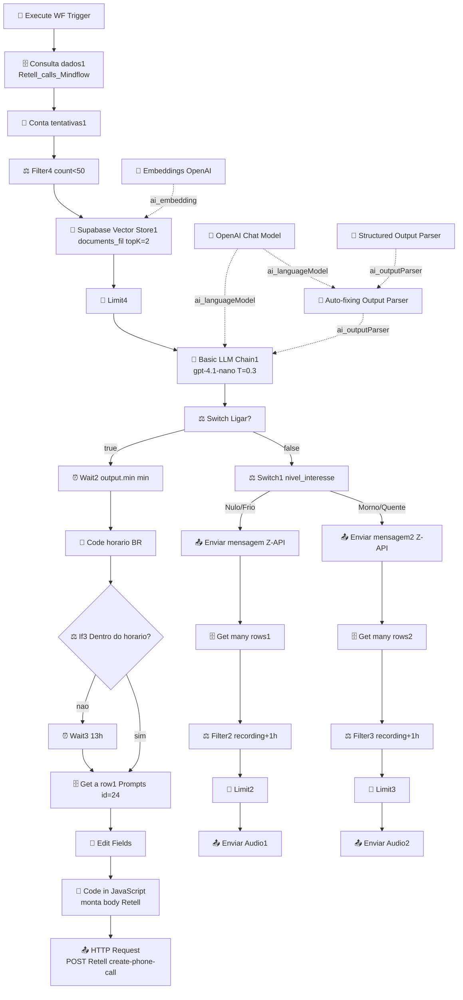

# Workflow: `call_analisys_mindflow_disparo`

> **Status n8n**: Ativo
> **Trigger**: Execute Workflow (chamado por outro workflow)
> **ID n8n**: `TIlfG7Qd6UoFMCp0`
> **Tag**: Mindflow
> **Última execucao analisada**: `493793` em `2026-05-13T19:56:52Z` (chamado por workflow pai `mMC4xqHJMyTTQmZe`)

---

## 1. Descricao Geral

Workflow de **producao** que classifica transcricoes de ligacoes outbound (Retell AI agent `agent_1e4cfa23e3910c557d82167949` - "Agente Mindflow Disparo") usando LLM `gpt-4.1-nano` (temperature `0.3`) com RAG via Supabase Vector Store na tabela `documents_fil` (embeddings OpenAI 1536 dims, `topK=2`).

A classificacao produz JSON estruturado (`pense`, `Ligar?`, `min`, `alerta_sdr`, `causa_raiz`, `nivel_interesse`, `drop_state`, `context`) seguindo regras invioveis (Humano+Nulo PROIBIDO; numero errado = Frio sempre). Com base no resultado:

- **Ligar = true** -> espera `output.min` minutos -> verifica horario comercial -> agenda re-disparo via API Retell.
- **Ligar = false** -> ramo "Switch1" por temperatura (Quente/Morno/Frio/Nulo) -> envia alerta SDR no grupo WhatsApp via Z-API + audio do recording.

Diferente do workflow `call_analysis Mindflow` (`2W8Is-...`) que processa o fluxo WhatsApp -- este eh **exclusivo do fluxo de disparo outbound**.

## 2. Diagrama de Fluxo



## 3. Comunicacao com Outros Workflows

| Direcao | Workflow | Endpoint / Tipo | Metodo | Dados Passados |
|---------|----------|-----------------|--------|----------------|
| <- Recebido de | Workflow pai (`mMC4xqHJMyTTQmZe` -- provavel orquestrador do disparo) | Execute Workflow Trigger | Sub-workflow | `Email_Lead`, `transcrição`, `numero`, `nome`, `prompt` |
| -> Envia para | **Retell AI** | `POST https://api.retellai.com/v2/create-phone-call` | POST | `from_number=iatizeia`, `to_number`, `override_agent_id=agent_1e4cfa23e3910c557d82167949`, `retell_llm_dynamic_variables{customer_name, prompt, now, contexto, email, numero_do_lead}` |
| -> Envia para | **Z-API (WhatsApp)** grupo `120363424280785137-group` | `POST z-api.io/.../send-text` e `/send-audio` | POST | alerta SDR formatado + audio (`recording_url`) |
| <-> Le/escreve | **Supabase** | `Retell_calls_Mindflow` (getAll), `Prompts` (get id=24), `documents_fil` (vector RAG) | - | filtro por `Numero`; tentativas; RAG few-shot |

### Dados de Rastreabilidade

| Campo | Valor/Origem | Obrigatorio |
|-------|-------------|-------------|
| `execution_id` | n8n (`493793`) ligado a `parentExecution.executionId=493792` | ✅ |
| `from_workflow` | nao propagado explicitamente -- inferido do `parentExecution.workflowId` | ⚠️ ausente |
| `workflow_id` | nao usado -- migracao deve adicionar `call_analisys_mindflow_disparo_v1` | ❌ ausente |

## 4. Exemplo de Payload Real (anonimizado)

**Trigger input** (execucao `493793`):
```json
{
  "Email_Lead": "<EMAIL>",
  "transcrição": "User: Alo?\nAgent: Oi, tudo bem? Estou falando com o <NOME>, da <EMPRESA>? Aqui e o Caique, da MindFlow.\nUser: Nao, eu ja falei isso.\nAgent: Perfeito, <NOME>, obrigado por confirmar...\nUser: Nao, nao e o <NOME>.\nAgent: Ah, entendi! Desculpa, acho que houve um erro no cadastro do nome.\nUser: Notim\nAgent: Tranquilo, sem problemas! Vou encerrar por aqui entao.",
  "numero": "+55XX9XXXXXXXX",
  "nome": "<NOME>",
  "prompt": "<SystemPrompt do agente Retell SDR Kaique -- few-shot com 6 etapas (Abertura, Diagnostico, Discovery, Pitch, Objecoes, Close), regras de pronuncia, gerenciamento de interrupcao, Identity Challenge>"
}
```

**Output esperado do LLM Chain** (JSON):
```json
{
  "pense": "Lead negou ser a pessoa buscada -- numero errado confirmado.",
  "Ligar?": false,
  "min": 0,
  "alerta_sdr": "❌ *FRIO* | <NOME> -- numero errado, pessoa negou identidade. Nao ligar.",
  "context": "Tentativa de contato com lead falhou -- atendente nao e o lead buscado. Encerrar fluxo.",
  "causa_raiz": "Humano",
  "nivel_interesse": "Frio",
  "drop_state": "Abertura"
}
```

## 5. Detalhamento dos Nos (31 nos)

### Entrada e Validacao de Limite
1. **When Executed by Another Workflow** (📝 Trigger) -- `executeWorkflowTrigger` -- declara inputs: `Email_Lead`, `transcricao`, `numero`, `nome`, `prompt`.
2. **Consulta dados1** (🗄️) -- Supabase `Retell_calls_Mindflow` getAll filtrado por `Numero`, limit 51. Conta historico do lead.
3. **Conta tentativas1** (🔧) -- `summarize` agregando campo `data` (contagem de tentativas).
4. **Filter4** (⚖️) -- so prossegue se `count_data < 50` (cap de tentativas por lead).

### RAG (Few-shot dinamico)
5. **Embeddings OpenAI1** (🧠) -- `embeddingsOpenAi` 1536 dims (cred. `OpenAi account`).
6. **Supabase Vector Store1** (🧠) -- `vectorStoreSupabase` em `documents_fil` mode=`load`, `topK=2`, prompt = `transcrição` do trigger. Devolve 2 exemplos similares com `pageContent` e `metadata.Text_to_meta`.
7. **Limit4** (🔩) -- garante 1 item para o LLM.

### Classificacao LLM (NUCLEO)
8. **OpenAI Chat Model1** (🧠) -- `lmChatOpenAi` `gpt-4.1-nano`, `temperature=0.3`. Compartilhado entre LLM Chain e Auto-fixing Parser.
9. **Structured Output Parser1** (🧠) -- JSON schema manual: enums em `causa_raiz` (Humano|Caixa Postal|URA|Queda|Falha), `nivel_interesse` (Quente|Morno|Frio|Nulo), `drop_state` (Abertura|Discovery|Pitch|Close|Nulo); `Ligar?` boolean; `min` number; campos required.
10. **Auto-fixing Output Parser1** (🧠) -- envolve o Structured. Prompt de fix instrui remover markdown ```` ```json ```` e texto conversacional. Crucial para robustez.
11. **Basic LLM Chain1** (🧠) -- **CORE**. System prompt extenso: `<role>` Estrategista Conversao, `<context>` (horario BR + max 2 ligacoes/dia), `<passo1_causa_raiz>` (Humano/Caixa Postal/URA/Queda/Falha com criterios), `<passo2_nivel_interesse>`, `<regra_inviolavel>` (Humano+Nulo PROIBIDO; numero errado = Frio sempre), `<passo3_ligar>`, `<passo4_min>` (Caixa Postal/URA/Queda/Falha = 120 min; Morno = 180; Quente = 1440; override fora 09-18h Seg-Sex = 1440), `<drop_state_guia>`, `<alerta_sdr_guia>` (🔥 Quente/🟡 Morno/❌ Frio/⚪ Nulo), `<combinacoes_validas>` (tabela referencia), `<exemplos>` injeta RAG. Promptype=`define`, texto = `transcricao`.

### Roteamento por decisao
12. **Switch** (⚖️) -- ramifica em `output["Ligar?"]==="true"` vs `"false"` (comparacao **string** com boolean -- bug ja documentado em sessoes anteriores; n8n converte mas validador Python deve normalizar).

### Ramo LIGAR = true (re-disparo)
13. **Wait2** (⏰) -- aguarda `output.min` minutos.
14. **Code** (🔧) -- JS calcula `dataHoraBrasilia` e `resultado` = "Dentro do horario" (7-19h BR) ou "Fora do horario".
15. **If3** (⚖️) -- se "Dentro do horario" -> direto; senao -> Wait3.
16. **Wait3** (⏰) -- 13 horas.
17. **Get a row1** (🗄️) -- Supabase `Prompts` get id=24 (template do prompt do Retell).
18. **Edit Fields** (🔧) -- set: `prompt` = `Ligação/txt` da row, `numero`, `nome`, `contexto` (do LLM), `email`.
19. **Code in JavaScript** (🔧) -- monta body Retell: limpa prompt (remove markdown/quebras), define `from_number=iatizeia`, `override_agent_id`, `retell_llm_dynamic_variables`.
20. **HTTP Request** (📤) -- `POST https://api.retellai.com/v2/create-phone-call`, header `Authorization: Bearer <REDACTED>` (chave Retell hardcoded -- migrar p/ env).

### Ramo LIGAR = false (alerta SDR + audio)
21. **Switch1** (⚖️) -- 4 saidas por `nivel_interesse`: Nulo, Frio, Morno, Quente. Nulo/Frio -> `Enviar mensagem`; Morno/Quente -> `Enviar mensagem2`.
22. **Enviar mensagem** (📤) -- POST Z-API `send-text` para grupo, mensagem rica (Lead, Numero, Temperatura, Causa, Etapa drop_state, Analise pense, CRM context, Transcricao).
23. **Enviar mensagem2** (📤) -- variante com campo `⏰ Proxima ligacao em min` (Morno/Quente). Auth header `Client-Token: <REDACTED>`.
24. **Get many rows1 / Get many rows2** (🗄️) -- Supabase `Retell_calls_Mindflow` getAll por `Numero` (busca recording_url).
25. **Filter2 / Filter3** (⚖️) -- `recording_url` notEmpty AND `created_at > now-1h`.
26. **Limit2 / Limit3** (🔩) -- pega 1.
27. **Enviar Audio1 / Enviar Audio2** (📤) -- POST Z-API `send-audio` para o mesmo grupo, `audio=recording_url`, `waveform=true`.

## 6. Variaveis de Ambiente Utilizadas (a criar na migracao)

| Variavel | Uso |
|----------|-----|
| `OPENAI_API_KEY` | `gpt-4.1-nano` + embeddings 1536 |
| `SUPABASE_URL`, `SUPABASE_KEY` | client singleton (Retell_calls_Mindflow, Prompts, documents_fil) |
| `RETELL_API_KEY` | Bearer header em `create-phone-call` (atualmente hardcoded `key_540f...` -- **MIGRAR**) |
| `ZAPI_INSTANCE_ID`, `ZAPI_TOKEN`, `ZAPI_CLIENT_TOKEN` | URLs `api.z-api.io/instances/.../token/.../send-text|send-audio` (todos hardcoded hoje) |
| `ZAPI_GROUP_PHONE` | `120363424280785137-group` (hardcoded) |
| `RETELL_AGENT_DISPARO_ID` | `agent_1e4cfa23e3910c557d82167949` (hardcoded) |
| `PROMPTS_TABLE_ID` | `24` (hoje hardcoded) |

## 7. Credenciais n8n Utilizadas

| Nome | Tipo | Nos |
|------|------|-----|
| `OpenAi account` (`Z2Wx2mpVaJdfm52V`) | `openAiApi` | Embeddings OpenAI1, OpenAI Chat Model1 |
| `supabase Mindflow` (`xPgzw7ayw9gmHNlh`) | `supabaseApi` | Supabase Vector Store1, Consulta dados1, Get a row1, Get many rows1, Get many rows2 |
| Z-API | inline (Client-Token em header) | Enviar mensagem(2), Enviar Audio1/2 |
| Retell | inline (Bearer hardcoded) | HTTP Request |

---

## 🚀 Migration Brief -- Antigravity / Python

> Especificacao para reimplementar em Python conforme `conventions.md` (EDW). Sem implementacao -- apenas spec.

### Camada API (FastAPI)

- **Endpoint sugerido**: `POST /webhook/call-analisys-disparo` (chamado pelo orquestrador `mMC4xqHJMyTTQmZe` ao receber callback Retell).
- **Schema Pydantic de entrada** (`schemas.py`):

```python
class CallAnalisysDisparoInput(BaseModel):
    Email_Lead: EmailStr
    transcricao: str = Field(alias="transcrição")
    numero: str
    nome: str
    prompt: str
    from_workflow: Optional[str] = None
    execution_id: Optional[str] = None
```

- **Resposta**: `202 Accepted` + `execution_id` UUID gerado.
- **Validacoes**: `numero` em E.164; `transcricao` nao vazia.

### Camada Worker (ARQ) -- Steps EDW

| # | n8n node | Step (`call_analisys_mindflow_disparo_{OQF}`) | I/O | Lib | Retries | Async |
|---|----------|-----------------------------------------------|-----|-----|---------|-------|
| 1 | Consulta dados1 | `..._fetch_call_history` | in: numero; out: rows[] | supabase singleton | 3 | sim |
| 2 | Filter4 (count<50) | `..._validate_attempt_cap` | in: rows; out: bool | python puro | 0 | sim |
| 3 | Supabase Vector Store1 | `..._rag_few_shot_lookup` | in: transcricao; out: 2 exemplos | langchain + supabase vecstore | 3 | sim |
| 4 | Basic LLM Chain1 | `..._classify_transcript` | in: transcricao + few-shot; out: dict JSON | `openai` async, `gpt-4.1-nano` T=0.3 | 3 | sim |
| 5 | Auto-fixing Output Parser | `..._parse_and_validate` | in: raw output; out: dict validado Pydantic | pydantic + manual fallback parser | 2 | sim |
| 6 | Wait2 / If3 / Wait3 | `..._schedule_recall` | in: min + now BR; out: defer_until | `arq.enqueue_job(_defer_until=...)` | 0 | sim |
| 7 | Get a row1 + Edit Fields + Code in JavaScript | `..._build_retell_payload` | in: prompt template id=24 + dados; out: body | python puro | 0 | sim |
| 8 | HTTP Request Retell | `..._create_retell_call` | in: body; out: call_id | `httpx.AsyncClient` | 3 | sim |
| 9 | Switch1 + Enviar mensagem(2) | `..._send_sdr_alert` | in: classificacao; out: msg_id Z-API | `httpx.AsyncClient` | 3 | sim |
| 10 | Get many rows + Filter + Limit + Enviar Audio | `..._send_recording_audio` | in: numero; out: msg_id Z-API | supabase + httpx | 3 | sim |

### Pontos de Atencao / Divergencias Criticas

1. **Boolean comparado como string no Switch** -- node n8n compara `$json.output["Ligar?"]` (boolean) com strings `"true"`/`"false"`. n8n faz coercao loose, mas em Python deve ser `if classification.ligar is True:` -- nunca `str(...)`. **Bug historico ja corrigido aqui no n8n -- preservar logica correta em Python.**

2. **Auto-fixing Output Parser** -- camada de retry semantico ao redor do Structured Parser, com prompt explicito p/ remover markdown. Em Python: tentar `model_validate_json` -> em falha, segunda chamada LLM com prompt-de-fix -> em falha, levantar `ValidationError`. **Manter os dois niveis** (parser puro + retry LLM).

3. **`<regra_inviolavel>` no validador Pydantic** -- mesmo com schema correto, LLM pode violar regras (`Humano+Nulo`, numero errado != Frio). Implementar `@model_validator(mode='after')`:
   - `causa_raiz == "Humano" and nivel_interesse == "Nulo"` -> rejeitar e retentar.
   - `ligar is False and min != 0` -> normalizar `min=0`.
   - `causa_raiz != "Humano" and nivel_interesse != "Nulo"` -> rejeitar e retentar.

4. **System prompt grande (~6KB)** -- extrair para arquivo `prompts/call_analisys_disparo_v1.txt` ou tabela `Prompts` no Supabase (mesma usada para id=24). Versionar.

5. **Wait2 + Wait3 + If3 (horario comercial)** -- substituir por **calculo unico de `defer_until`** em `_schedule_recall`: se `min == 0` -> nao agendar; senao calcular `now_br + min`, se cair fora de 7-19h BR (ou Sab/Dom) -> push para proximo dia util 09h. Persistir em `workflow_executions.output_data` + Redis ARQ.

6. **Rastreabilidade ausente no payload** -- workflow atual nao propaga `from_workflow`/`workflow_id`. Adicionar na chamada do orquestrador. Persistir mestre-detalhe (`workflow_executions` + `workflow_step_executions`).

7. **RAG `documents_fil`** -- manter `topK=2` e injecao no system prompt como secao `<exemplos>` com `pageContent` + `metadata.Text_to_meta`. Garantir colecao indexada no Supabase com mesmo modelo embedding (text-embedding-3-small ou ada-002 1536 dims).

8. **Credenciais hardcoded** -- Bearer Retell, Z-API instance/token/client-token e grupo destino estao em nos `httpRequest` em texto puro. **Migrar TODAS para env vars no .env**.

9. **Loop tarifario Z-API** -- envia texto + busca recording + envia audio. Se `recording_url` ausente apos 1h, audio nao eh enviado (Filter2/3). Em Python: agendar `_send_recording_audio` como job separado com `_defer_until=now+5min`, com `max_tries=12` (1h).

10. **Limit nodes apos getAll** -- n8n retorna multiplas linhas, Limit pega 1. Em Python: `.limit(1).order("created_at", desc=True)`.

### Status de Migracao

- [x] Documentado
- [ ] Schemas Pydantic definidos
- [ ] System prompt extraido para arquivo/Supabase versionado
- [ ] Validador post-LLM com regras invioveis implementado
- [ ] API endpoint implementado
- [ ] Worker steps implementados (10 steps EDW)
- [ ] RAG `documents_fil` integrado via langchain async
- [ ] Z-API + Retell credenciais migradas p/ .env
- [ ] Validado em ambiente de teste
- [ ] Migrado em producao
