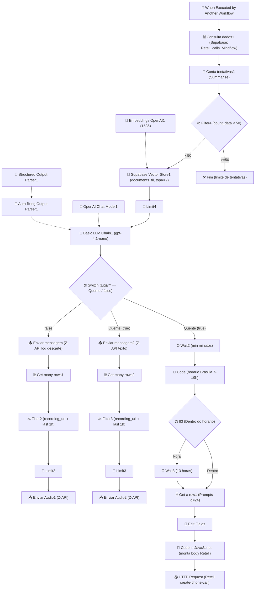

# Workflow: `call_analysis_mindflow`

> **Status n8n**: Ativo
> **Trigger**: Execute Workflow Trigger (sub-workflow chamado por outro fluxo)
> **ID n8n**: `2W8Is-KvdM-m4nSfM2IHc`
> **Última execução analisada**: `485047` em `2026-05-06T13:36:40Z` (success)

---

## Descricao Geral

Sub-workflow disparado pelo fluxo de WhatsApp (parent `E4KkBa9_ECTmg2wNyxlzj`) ao receber a transcricao final de uma ligacao Retell AI. Classifica a intencionalidade comercial do lead (`Quente | Morno | Frio | Nulo`) via LLM `gpt-4.1-nano` com RAG (top-K=2 sobre `documents_fil` do Supabase) e decide o proximo passo: (a) reagendar nova ligacao Retell apos delay dinamico (Wait + If horario comercial), (b) interromper o fluxo para proteger o chip, ou (c) descartar o lead. Em paralelo envia logs e o audio da ultima ligacao para o grupo WhatsApp via Z-API.

## Diagrama de Fluxo



## Comunicacao com Outros Workflows

| Direcao | Workflow | Endpoint | Metodo | Dados Passados |
|---------|----------|----------|--------|----------------|
| Recebe de | `ligacao_whatsapp_mindflow` (parent `E4KkBa9_ECTmg2wNyxlzj`) | Execute Workflow Trigger interno do n8n | n8n internal | `Email_Lead`, `transcrição`, `numero`, `nome`, `prompt` |
| Envia para | Retell AI | `POST https://api.retellai.com/v2/create-phone-call` | POST | `from_number`, `to_number`, `override_agent_id`, `retell_llm_dynamic_variables{customer_name, prompt, now, contexto, email, numero_do_lead}` |
| Envia para | Z-API (WhatsApp grupo) | `POST https://api.z-api.io/instances/<INST>/token/<TOK>/send-text` e `/send-audio` | POST | Alerta SDR, log descarte, audio `recording_url` |

> Observacao: parente do workflow `TIlfG7Qd6UoFMCp0` (call-analysis do fluxo "disparo"). Este aqui eh especifico para leads originados de WhatsApp.

### Dados de Rastreabilidade

| Campo | Valor/Origem | Obrigatorio |
|-------|--------------|-------------|
| `numero` | Recebido do parent | Sim |
| `nome` | Recebido do parent | Sim |
| `Email_Lead` | Recebido do parent | Sim |
| `transcrição` | Recebido do parent (Retell AI) | Sim |
| `prompt` | Recebido do parent (template de prompt do agente) | Sim |
| `execution_id` | NAO existe nativamente (n8n usa `executionId` interno) | Adicionar na migracao |
| `from_workflow` | NAO existe (inferido como `ligacao_whatsapp_mindflow`) | Adicionar na migracao |
| `workflow_id` | NAO existe (constante a fixar como `call_analysis_mindflow_v1`) | Adicionar na migracao |

## Exemplos de Payload Real (anonimizado)

**Trigger input** (execucao `485047`):
```json
{
  "Email_Lead": "<EMAIL>",
  "transcrição": "User: Alô? \nAgent: Oi, <NOME>, tudo bem? Aqui é o Kaíque, da MindFlow.\n... (transcricao completa Retell)\n",
  "numero": "+55XX9XXXXXXXX",
  "nome": "<NOME>",
  "prompt": "."
}
```

**Output LLM (Basic LLM Chain1)** — estrutura conforme schema:
```json
{
  "pense": "Lead engajou, aceitou demo e confirmou agendamento.",
  "Ligar?": false,
  "min": 1440.0,
  "alerta_sdr": "🔥 Lead Quente — agendou reunião",
  "context": "Empresa de vendas, ~200 leads/mes, gargalo em time. Aceitou demo amanha 10h.",
  "causa_raiz": "Humano",
  "nivel_interesse": "Quente",
  "drop_state": "Close"
}
```

**Payload final enviado ao Retell (quando reagenda)**:
```json
{
  "from_number": "iatizeia",
  "to_number": "+55XX9XXXXXXXX",
  "override_agent_id": "agent_0380733a4e3a74142e33500107",
  "metadata": {},
  "retell_llm_dynamic_variables": {
    "customer_name": "<NOME>",
    "prompt": "<prompt limpo, sem markdown>",
    "now": "2026-05-06T13:50:00.000Z",
    "contexto": "<contexto resumido pela LLM>",
    "email": "<EMAIL>.",
    "numero_do_lead": "+55XX9XXXXXXXX"
  },
  "custom_sip_headers": {"X-Custom-Header": "Custom Value"}
}
```

## Detalhamento dos Nos

### 1. `When Executed by Another Workflow` (Trigger)
- **Tipo n8n**: `n8n-nodes-base.executeWorkflowTrigger` v1.1
- **Descricao**: Entry point sub-workflow. Recebe payload do parent (fluxo WhatsApp).
- **Campos esperados**: `Email_Lead`, `transcrição`, `numero`, `nome`, `prompt`.
- **Saidas**: -> `Consulta dados1`

### 2. `Consulta dados1` (Database)
- **Tipo n8n**: `n8n-nodes-base.supabase` v1
- **Operacao**: `getAll` em `Retell_calls_Mindflow` filtrando `Numero == numero` (todas as tentativas anteriores).
- **Cred**: `supabase Mindflow`.
- **Saidas**: -> `Conta tentativas1`

### 3. `Conta tentativas1` (Transform)
- **Tipo n8n**: `n8n-nodes-base.summarize` v1.1
- **Acao**: Conta linhas (`field=data`) gerando `count_data`.
- **Saidas**: -> `Filter4`

### 4. `Filter4` (Decision)
- **Tipo n8n**: `n8n-nodes-base.filter` v2.3
- **Condicao**: `count_data < 50` (limite global de tentativas por lead).
- **Saidas**: -> `Supabase Vector Store1` (passa) | corta o fluxo (>=50).

### 5. `Supabase Vector Store1` (AI/RAG)
- **Tipo n8n**: `@n8n/n8n-nodes-langchain.vectorStoreSupabase` v1.3
- **Modo**: `load`, tabela `documents_fil`, `topK=2`, query = transcrição.
- **Embeddings**: `Embeddings OpenAI1` (text-embedding-3-small / 1536 dims).
- **Saidas**: -> `Limit4`

### 6. `Embeddings OpenAI1` (AI helper)
- **Tipo n8n**: `@n8n/n8n-nodes-langchain.embeddingsOpenAi` v1.2
- **Saidas**: ai_embedding -> `Supabase Vector Store1`

### 7. `Limit4` (Utility)
- **Tipo n8n**: `n8n-nodes-base.limit` v1
- **Acao**: Garante apenas 1 item adiante (evita fan-out da busca vetorial).
- **Saidas**: -> `Basic LLM Chain1`

### 8. `Basic LLM Chain1` (AI/LLM principal)
- **Tipo n8n**: `@n8n/n8n-nodes-langchain.chainLlm` v1.7
- **Descricao**: Classifica intencionalidade comercial. Prompt grande com `<role>`, `<analysis>`, `<stop_rules>`, `<decision_matrix>`, `<examples>` (usando os 2 docs RAG como few-shot).
- **Saida JSON**: `pense`, `Ligar?`, `min`, `alerta_sdr`, `context`, `causa_raiz`, `nivel_interesse`, `drop_state`.
- **Saidas**: -> `Switch`

### 9. `OpenAI Chat Model1` (AI helper)
- **Tipo n8n**: `@n8n/n8n-nodes-langchain.lmChatOpenAi` v1.2
- **Modelo**: `gpt-4.1-nano`, `temperature=0.3`.
- **Cred**: `OpenAi account`.

### 10. `Structured Output Parser1` (AI helper)
- **Tipo n8n**: `@n8n/n8n-nodes-langchain.outputParserStructured` v1.3
- **Schema**: enums fechados em `causa_raiz`/`nivel_interesse`/`drop_state`.

### 11. `Auto-fixing Output Parser1` (AI helper)
- **Tipo n8n**: `@n8n/n8n-nodes-langchain.outputParserAutofixing` v1
- **Acao**: Repara JSON quando o LLM devolve markdown ou texto extra.

### 12. `Switch` (Decision)
- **Tipo n8n**: `n8n-nodes-base.switch` v3.4
- **Regras**: rota 0 = `Ligar?` truthy (qualquer valor verdadeiro/`"Quente"`); rota 1 = `Ligar?` false/nulo.
- **Saidas**: rota 0 -> `Enviar mensagem2` + `Wait2`; rota 1 -> `Enviar mensagem` (descarte).

### 13. `Enviar mensagem2` (Output)
- **Tipo n8n**: `n8n-nodes-base.httpRequest` v4.2
- **Acao**: POST Z-API `send-text` para grupo WhatsApp com alerta SDR (lead, contato, temperatura, proxima ligacao em N min, pensamento, drop_state, causa_raiz, transcricao).
- **Saidas**: -> `Get many rows2`

### 14. `Get many rows2` -> `Filter3` -> `Limit3` -> `Enviar Audio2`
- **Tipos**: supabase getAll / filter / limit / httpRequest.
- **Acao**: Busca o `recording_url` da ultima ligacao (criada na ultima hora) e envia o audio para o grupo WhatsApp via Z-API `send-audio`.

### 15. `Wait2` (Wait)
- **Tipo n8n**: `n8n-nodes-base.wait` v1.1
- **Acao**: Aguarda `output.min` minutos (delay dinamico decidido pela LLM, ex: 120/180/1440).
- **Saidas**: -> `Code`

### 16. `Code` (Transform)
- **Tipo n8n**: `n8n-nodes-base.code` v2
- **Acao**: Calcula hora em America/Sao_Paulo e classifica `resultado` = "Dentro do horario" (7-19h) ou "Fora do horario".
- **Saidas**: -> `If3`

### 17. `If3` (Decision)
- **Tipo n8n**: `n8n-nodes-base.if` v2.2
- **Condicao**: `resultado == "Dentro do horario"`.
- **Saidas**: true -> `Get a row1`; false -> `Wait3` (13h) -> `Get a row1`.

### 18. `Wait3` (Wait)
- **Tipo n8n**: `n8n-nodes-base.wait` v1.1
- **Acao**: Aguarda 13 horas (cobre overnight 19h->08h dia seguinte).

### 19. `Get a row1` (Database)
- **Tipo n8n**: `n8n-nodes-base.supabase` v1
- **Acao**: Busca o registro da tabela `Prompts` com `id=24` (template do prompt Retell para reagendamento).
- **Saidas**: -> `Edit Fields`

### 20. `Edit Fields` (Transform)
- **Tipo n8n**: `n8n-nodes-base.set` v3.4
- **Acao**: Monta payload base: `prompt` (de `Ligação/txt`), `numero`, `nome`, `contexto` (vindo da LLM), `email` (com ponto final concatenado por compatibilidade Retell).
- **Saidas**: -> `Code in JavaScript`

### 21. `Code in JavaScript` (Transform)
- **Tipo n8n**: `n8n-nodes-base.code` v2
- **Acao**: Limpa markdown do prompt e monta body Retell (`from_number`, `to_number`, `override_agent_id`, `retell_llm_dynamic_variables`, `custom_sip_headers`).
- **Saidas**: -> `HTTP Request`

### 22. `HTTP Request` (Output)
- **Tipo n8n**: `n8n-nodes-base.httpRequest` v4.2
- **Acao**: POST `https://api.retellai.com/v2/create-phone-call` com Bearer hardcoded.
- **Atencao**: Bearer token hardcoded no node (devera virar env var `RETELL_API_KEY` na migracao).

### 23. `Enviar mensagem` (Output - branch descarte)
- **Tipo n8n**: `n8n-nodes-base.httpRequest` v4.2
- **Acao**: POST Z-API `send-text` com LOG DE DESCARTE (lead, contato, pense, nivel_interesse, drop_state, causa_raiz, transcricao). Interrompe o fluxo para proteger o chip.
- **Saidas**: -> `Get many rows1`

### 24. `Get many rows1` -> `Filter2` -> `Limit2` -> `Enviar Audio1`
- **Acao**: Mesmo padrao do branch quente: pega `recording_url` da ultima hora e envia o audio para o grupo WhatsApp via Z-API `send-audio`.

## Variaveis de Ambiente Utilizadas

| Variavel | Uso no Workflow |
|----------|-----------------|
| (nenhuma explicita) | Todas as credenciais estao em credenciais n8n ou hardcoded |
| `RETELL_API_KEY` (futura) | Bearer hoje hardcoded no node `HTTP Request` |
| `ZAPI_INSTANCE_ID` / `ZAPI_TOKEN` / `ZAPI_CLIENT_TOKEN` (futuras) | Hoje todos hardcoded nos nodes Z-API |
| `ZAPI_GROUP_PHONE` (futura) | Hoje hardcoded `120363424280785137-group` |
| `SUPABASE_URL` / `SUPABASE_KEY` | Via credencial `supabase Mindflow` |
| `OPENAI_API_KEY` | Via credencial `OpenAi account` |

## Credenciais n8n Utilizadas

| Nome da Credencial | Tipo | Nos que Usam |
|--------------------|------|--------------|
| `supabase Mindflow` | `supabaseApi` | `Consulta dados1`, `Get many rows1`, `Get many rows2`, `Get a row1`, `Supabase Vector Store1` |
| `OpenAi account` | `openAiApi` | `OpenAI Chat Model1`, `Embeddings OpenAI1` |

---

## Migration Brief — Antigravity / Python

> Especificacao para o agente Antigravity reimplementar este workflow em Python conforme `Usefull_Skills/docs/conventions.md` (EDW).

### Camada API (FastAPI)

- **Endpoint sugerido**: `POST /webhook/call-analysis-mindflow` (chamado pelo worker do workflow `ligacao_whatsapp_mindflow` apos a ligacao Retell concluir; substitui o "Execute Workflow Trigger").
- **Schema Pydantic de entrada** (`schemas.py` — apenas declaracao):

```python
class CallAnalysisMindflowInput(BaseModel):
    Email_Lead: str
    transcricao: str  # campo "transcrição" no n8n; aceitar alias
    numero: str
    nome: str
    prompt: str
    # Rastreabilidade EDW (obrigatoria — adicionar na migracao)
    workflow_id: str  # constante: "call_analysis_mindflow_v1"
    from_workflow: str  # ex: "ligacao_whatsapp_mindflow"
    execution_id: str  # UUID gerado pela API pai
    parent_execution_id: Optional[str] = None
```

- **Resposta**: `202 Accepted` + `execution_id`
- **Validacoes**: numero E.164, transcricao nao vazia, email valido.

### Camada Worker (ARQ)

Mapa no n8n -> step EDW (cada step roda via `run_step_with_retry`):

| # | n8n node | Step EDW (`call_analysis_mindflow_<OQF>`) | I/O | Lib Python | Retries | Async? |
|---|----------|-------------------------------------------|-----|------------|---------|--------|
| 1 | `Consulta dados1` | `call_analysis_mindflow_fetch_attempts` | in: numero; out: lista calls | `supabase` singleton | 3 | sim |
| 2 | `Conta tentativas1` + `Filter4` | `call_analysis_mindflow_check_attempts_limit` | in: lista; out: bool (count<50) | puro Python | 0 | sim |
| 3 | `Supabase Vector Store1` + `Embeddings OpenAI1` + `Limit4` | `call_analysis_mindflow_rag_search` | in: transcricao; out: top2 docs | `langchain` async + `supabase` (1536 dims, topK=2) | 3 | sim |
| 4 | `Basic LLM Chain1` (+ Structured/Autofix parsers) | `call_analysis_mindflow_classify_call` | in: transcricao+RAG; out: JSON `{pense, Ligar?, min, alerta_sdr, context, causa_raiz, nivel_interesse, drop_state}` | `openai` async (gpt-4.1-nano, temp=0.3) + Pydantic enums | 3 | sim |
| 5 | `Switch` | `call_analysis_mindflow_route_decision` | in: classify; out: branch (`reagendar` / `descartar`) | puro Python | 0 | sim |
| 6a (branch reagendar) | `Enviar mensagem2` | `call_analysis_mindflow_send_sdr_alert` | in: alerta_sdr; out: status Z-API | `httpx.AsyncClient` | 3 | sim |
| 6b (branch reagendar) | `Wait2` | `call_analysis_mindflow_schedule_delay` | in: min; out: defer_at | `arq.enqueue_job(_defer_until=...)` | 0 | sim |
| 7 | `Code` + `If3` | `call_analysis_mindflow_check_business_hours` | in: now BR; out: bool | puro Python (`zoneinfo`) | 0 | sim |
| 8 | `Wait3` (fora do horario) | `call_analysis_mindflow_defer_to_morning` | in: now; out: defer_at +13h | `arq.enqueue_job(_defer_until=...)` | 0 | sim |
| 9 | `Get a row1` | `call_analysis_mindflow_fetch_prompt_template` | in: id=24; out: prompt | `supabase` singleton | 3 | sim |
| 10 | `Edit Fields` + `Code in JavaScript` | `call_analysis_mindflow_build_retell_payload` | in: prompt+contexto+lead; out: body Retell | puro Python | 0 | sim |
| 11 | `HTTP Request` (Retell) | `call_analysis_mindflow_create_retell_call` | in: body; out: call_id | `httpx.AsyncClient` | 3 | sim |
| 12 | `Get many rows2/Filter3/Limit3/Enviar Audio2` | `call_analysis_mindflow_send_last_recording` | in: numero; out: status | `supabase` + `httpx.AsyncClient` | 3 | sim |
| 13a (branch descartar) | `Enviar mensagem` | `call_analysis_mindflow_send_discard_log` | in: classify; out: status Z-API | `httpx.AsyncClient` | 3 | sim |
| 13b (branch descartar) | `Get many rows1/Filter2/Limit2/Enviar Audio1` | `call_analysis_mindflow_send_last_recording_discard` | in: numero; out: status | `supabase` + `httpx.AsyncClient` | 3 | sim |

### Comunicacao Externa (Saidas)

- **Retell AI** — `POST https://api.retellai.com/v2/create-phone-call`, header `Authorization: Bearer <RETELL_API_KEY>`, body = `body` montado no step 10.
- **Z-API send-text** — `POST https://api.z-api.io/instances/{ZAPI_INSTANCE_ID}/token/{ZAPI_TOKEN}/send-text`, header `Client-Token: {ZAPI_CLIENT_TOKEN}`.
- **Z-API send-audio** — idem, endpoint `/send-audio`, body com `recording_url`.
- **Supabase** — leituras em `Retell_calls_Mindflow`, `Prompts`, `documents_fil` (vector store 1536 dims).

### Variaveis de Ambiente Necessarias (.env)

| Variavel | Origem n8n | Uso no Python |
|----------|-----------|---------------|
| `RETELL_API_KEY` | Bearer hardcoded em `HTTP Request` | header `Authorization` |
| `RETELL_OVERRIDE_AGENT_ID` | Hardcoded `agent_0380733a4e3a74142e33500107` em `Code in JavaScript` | body Retell |
| `ZAPI_INSTANCE_ID` | Hardcoded `3E5F252F583800117B3E5ED75F1870FF` | URL Z-API |
| `ZAPI_TOKEN` | Hardcoded `B2DBDB410613AA53131EC271` | URL Z-API |
| `ZAPI_CLIENT_TOKEN` | Hardcoded `F0d852a09139d4b6b94b23c77c8a67debS` | header `Client-Token` |
| `ZAPI_GROUP_PHONE` | Hardcoded `120363424280785137-group` | body Z-API |
| `OPENAI_API_KEY` | Cred `OpenAi account` | SDK openai (gpt-4.1-nano + embeddings) |
| `SUPABASE_URL` | Cred `supabase Mindflow` | singleton |
| `SUPABASE_KEY` | Cred `supabase Mindflow` | singleton |
| `REDIS_URL` | (Easypanel injetado) | `RedisSettings.from_dsn(REDIS_URL)` para ARQ |
| `MAX_CALL_ATTEMPTS` | Hardcoded `50` em `Filter4` | guard no step 2 |
| `BUSINESS_HOURS_START` / `BUSINESS_HOURS_END` | Hardcoded `7` / `19` em `Code` | step 7 |
| `OFF_HOURS_DEFER_HOURS` | Hardcoded `13` em `Wait3` | step 8 |

### Rastreabilidade Obrigatoria (conventions.md)

- `workflow_id`: `call_analysis_mindflow_v1` (fixo)
- `from_workflow`: `ligacao_whatsapp_mindflow` (quando chamado pelo fluxo WhatsApp)
- `execution_id`: UUID gerado pela API
- `parent_execution_id`: UUID da execucao do parent workflow
- Persistir em: `workflow_executions` (master, status PENDING -> RUNNING -> SUCCESS|FAILED) + `workflow_step_executions` (detail, um registro por step com `attempt`).

### Pontos de Atencao / Divergencias do EDW

- **Sem rastreabilidade EDW hoje**: workflow nao carrega `workflow_id` / `from_workflow` / `execution_id`. Adicionar na assinatura do endpoint.
- **Segredos hardcoded**: Bearer Retell, instance/token/client-token Z-API e `phone` do grupo. Migrar tudo para env vars.
- **2 nos `Wait`**: `Wait2` (delay dinamico em minutos, vindo da LLM) e `Wait3` (13h fixo overnight). Ambos viram `arq.enqueue_job(_defer_until=...)` — JAMAIS `time.sleep` ou `BackgroundTasks`.
- **RAG**: `documents_fil` com OpenAI embeddings 1536 dims, topK=2 — bate com conventions; manter exatamente.
- **LLM auto-fixing**: o n8n tem 2 parsers em cadeia (structured + autofixing). Em Python, usar Pydantic + 1 retry com `response_format={"type":"json_object"}` (ou langchain `OutputFixingParser`) — nao usar simulacao.
- **Filter4 (count<50)**: limite global de tentativas. Documentar em DB ou env, nao deixar magic number.
- **Email com ponto final**: `Edit Fields` concatena `.` no email (`{{$json.Email_Lead}}.`) — provavelmente hack para forcar Retell a soletrar; replicar mas marcar como divida tecnica.
- **`Switch` rota Quente**: usa operador `boolean.true` sobre string `"Quente"` (loose validation). Em Python, comparar explicitamente `Ligar? is True` (Pydantic ja garante bool).
- **Z-API hardcoded para grupo**: nao multi-tenant. Se for migrar para mais clientes, parametrizar por `tenant_id`.
- **`now` no payload Retell**: usar `get_utc_now()` em ISO8601 conforme conventions.

### Status de Migracao

- [x] Documentado
- [ ] Schemas Pydantic definidos
- [ ] API endpoint implementado
- [ ] Worker steps implementados
- [ ] Validado em ambiente de teste
- [ ] Migrado em producao
