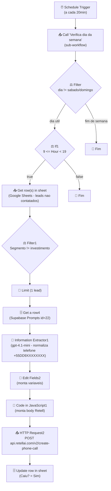

# Workflow: `disparo_mindflow`

> **Status n8n**: Ativo
> **Trigger**: Schedule (a cada 20 minutos)
> **ID n8n**: `1ZvjFWoIc2I3i6N8`
> **Ultima execucao analisada**: `494018` em `2026-05-13T23:00:21Z` (sucesso, parou em `If1` por estar fora do horario comercial 09h-19h)

---

## Descricao Geral

Workflow agendado que dispara ligacoes outbound automatizadas via Retell AI a partir de uma base de leads em Google Sheets. A cada 20 minutos, dentro de horario comercial (09h-19h, dias uteis), o fluxo seleciona 1 lead nao contatado (`Caiu? == ""`), filtra fora segmentos de `investimento`, normaliza o telefone via LLM, monta o payload com prompt persistido no Supabase e dispara a chamada, marcando a planilha como contatada (`Caiu? = "Sim"`).

## Diagrama de Fluxo



## Comunicacao com Outros Workflows

| Direcao | Workflow | Endpoint | Metodo | Dados Passados |
|---------|----------|----------|--------|----------------|
| ← Recebe de | — (auto-trigger por schedule) | — | — | — |
| → Envia para (sub-wf n8n) | `verifica_dia_da_semana` (id `2pXT7Evf-O6uBdPIJO7dm`) | execucao via `executeWorkflow` (mesmo n8n) | call_workflow | `{ "dia": "<ISO now>" }` |
| → Envia para (externo) | Retell AI | `https://api.retellai.com/v2/create-phone-call` | POST | `from_number`, `to_number`, `override_agent_id`, `metadata`, `retell_llm_dynamic_variables`, `custom_sip_headers` |
| → Persiste em | Google Sheets `df_expanded_numbers` (doc `1565hO_bVJl5C5Rt5TUaE5TSMSlf5GXYFiAVLRGzKsNg`) | Sheets API | UPDATE | `Phone_Number`, `Caiu? = "Sim"` |
| → Le de | Supabase tabela `Prompts` | Supabase REST | SELECT | `id == "22"` -> retorna `Ligacao/txt` |

### Dados de Rastreabilidade

| Campo | Valor/Origem | Obrigatorio |
|-------|--------------|-------------|
| `execution_id` | Gerado pelo n8n (ex: `494018`) | ✅ (n8n nativo) |
| `from_workflow` | Nao propagado no payload (Retell nao recebe) | ❌ ⚠️ Ambiguo: ausente, precisa ser adicionado na migracao |
| `workflow_id` | Nao propagado | ❌ ⚠️ Ambiguo: ausente |
| `agent_id` (Retell) | Hardcoded `agent_0380733a4e3a74142e33500107` no Code node | ✅ |
| `Phone_Number` (chave de matching no Sheets) | Coluna da planilha | ✅ |

## Exemplos de Payload Real (anonimizado)

**Trigger input** (execucao `494018`):
```json
{
  "timestamp": "2026-05-13T20:00:21.017-03:00",
  "Readable date": "May 13th 2026, 8:00:21 pm",
  "Day of week": "Wednesday",
  "Year": "2026",
  "Month": "May",
  "Day of month": "13",
  "Hour": "20",
  "Minute": "00",
  "Timezone": "America/Sao_Paulo (UTC-03:00)"
}
```

**Sub-workflow `verifica_dia_da_semana` retornou**:
```json
{
  "dia": "2026-05-13",
  "diaSemana": "quarta-feira"
}
```

**Pin data do Information Extractor (exemplo gravado)**:
```json
{
  "output": {
    "Nome": "<NOME>",
    "Numero": "+55XX9XXXXXXXX"
  }
}
```

**Body POST Retell (estrutura esperada — execucao real interrompida em `If1` por Hour=20 fora do limite < 19)**:
```json
{
  "from_number": "iatizeia",
  "to_number": "+55XX9XXXXXXXX",
  "override_agent_id": "agent_0380733a4e3a74142e33500107",
  "metadata": {},
  "retell_llm_dynamic_variables": {
    "customer_name": "<NOME>",
    "prompt": "<prompt sanitizado da tabela Prompts id=22>",
    "now": "2026-05-13T23:00:21.125Z",
    "contexto": "Primeiro contato. Nome da empresa: <EMPRESA>\nSegmento: <SEGMENTO>",
    "numero_do_lead": "+55XX9XXXXXXXX",
    "empresa": "Nome da empresa: <EMPRESA>\nSeguimento: <SEGMENTO>",
    "email": "<EMAIL>"
  },
  "custom_sip_headers": {
    "X-Custom-Header": "Custom Value"
  }
}
```

> _Execucoes 494018 e 494011 ambas pararam em `If1` (Hour=20 e Hour=19, fora do range 9 <= Hour < 19). Payload final do Retell representado a partir da estrutura do Code node, ja anonimizado._

## Detalhamento dos Nos

### 1. `schedule_trigger` (⏰ Trigger)
- **Tipo n8n**: `n8n-nodes-base.scheduleTrigger`
- **Descricao**: Cron a cada 20 minutos.
- **Configuracao**: `interval = 20 minutes`, timezone `America/Sao_Paulo`.
- **Saidas**: -> `call_'verifica_dia_da_semana'`

### 2. `call_'verifica_dia_da_semana'` (📤 Sub-workflow / 🔩 Utility)
- **Tipo n8n**: `n8n-nodes-base.executeWorkflow`
- **Descricao**: Invoca workflow auxiliar `verifica_dia_da_semana` (`2pXT7Evf-O6uBdPIJO7dm`) que recebe `dia = $now` e devolve `{ dia, diaSemana }`.
- **Configuracao**: `mode=once`, `source=database`, input `{ "dia": "{{ $now }}" }`.
- **Saidas**: -> `filter`

### 3. `filter` (⚖️ Decisao)
- **Tipo n8n**: `n8n-nodes-base.filter`
- **Descricao**: Garante `diaSemana != "sabado" AND diaSemana != "domingo"`.
- **Saidas**: -> `if1` (passa) | nada (fim de semana = workflow encerra)

### 4. `if1` (⚖️ Decisao - horario comercial)
- **Tipo n8n**: `n8n-nodes-base.if`
- **Descricao**: `9 <= Number(Hour) < 19` baseado no `Schedule Trigger.Hour`.
- **Configuracao**: combinator `and`.
- **Saidas**: branch 0 (true) -> `get_row(s)_in_sheet`; branch 1 (false) -> nada.

### 5. `get_row(s)_in_sheet` (📥 Fetch)
- **Tipo n8n**: `n8n-nodes-base.googleSheets`
- **Descricao**: Le leads da aba `df_expanded_numbers` (gid `1745411980`) filtrando `Caiu? == ""` (leads ainda nao contatados).
- **Configuracao**: documentId `1565hO_bVJl5C5Rt5TUaE5TSMSlf5GXYFiAVLRGzKsNg`, `returnFirstMatch=false`.
- **Saidas**: -> `filter1`

### 6. `filter1` (⚖️ Decisao - segmento)
- **Tipo n8n**: `n8n-nodes-base.filter`
- **Descricao**: Exclui leads cujo `Segmento` contem "investimento" (case insensitive).
- **Saidas**: -> `limit`

### 7. `limit` (🔧 Transform)
- **Tipo n8n**: `n8n-nodes-base.limit`
- **Descricao**: Pega apenas o primeiro lead (`maxItems=1`, `keep=firstItems`).
- **Saidas**: -> `get_a_row4`

### 8. `get_a_row4` (🗄️ Database - Supabase)
- **Tipo n8n**: `n8n-nodes-base.supabase`
- **Descricao**: Busca o prompt da tabela `Prompts` onde `id == "22"`. Coluna `Ligacao/txt` contem o template usado pelo Retell LLM.
- **Saidas**: -> `information_extractor1`

### 9. `information_extractor1` (🧠 AI / LLM)
- **Tipo n8n**: `@n8n/n8n-nodes-langchain.informationExtractor`
- **Descricao**: Usa gpt-4.1-mini (temperature 0.2) para extrair e normalizar `Nome` (string, opcional) e `Numero` (string obrigatoria no formato `+55DD9XXXXXXXX`).
- **Configuracao**: `retryOnFail=true`, `waitBetweenTries=3000ms`. Input = `Phone_Number\nNOME_SOCIO` do lead.
- **Dependencia**: `openai_chat_model9` (ai_languageModel).
- **Saidas**: -> `edit_fields2`

### 10. `openai_chat_model9` (🧠 AI Sub-no)
- **Tipo n8n**: `@n8n/n8n-nodes-langchain.lmChatOpenAi`
- **Descricao**: Modelo gpt-4.1-mini com `temperature=0.2`. Conexao `ai_languageModel` para `information_extractor1`.

### 11. `edit_fields2` (🔧 Transform - Set)
- **Tipo n8n**: `n8n-nodes-base.set`
- **Descricao**: Monta as variaveis para o Retell:
  - `prompt` <- `Get a row4.Ligacao/txt`
  - `numero` <- `output.Numero` (normalizado pelo LLM)
  - `nome` <- `output.Nome`
  - `contexto` <- string com `Razao_Social` + `Segmento`
  - `email` <- `EMAIL_SOCIO` da planilha
  - `empresa` <- string com `Razao_Social` + `Segmento`
- **Saidas**: -> `code_in_javascript1`

### 12. `code_in_javascript1` (🔧 Transform - Code)
- **Tipo n8n**: `n8n-nodes-base.code` (`runOnceForAllItems`)
- **Descricao**: Sanitiza o `prompt` (remove quebras de linha, caracteres markdown ``` * _ ~ # > ``, troca aspas duplas por simples) e constroi o objeto `body` para a API do Retell (campos detalhados em "Comunicacao").
- **⚠️ Ambiguo**: `from_number = "iatizeia"` — parece alias do trunk Retell; nao e um numero E.164. Validar com infraestrutura Retell.
- **Saidas**: -> `http_request2`

### 13. `http_request2` (📤 Output - Retell)
- **Tipo n8n**: `n8n-nodes-base.httpRequest`
- **Descricao**: POST `https://api.retellai.com/v2/create-phone-call` com body JSON.
- **Configuracao**: `Authorization: Bearer <REDACTED>` hardcoded no header (NAO usa credencial n8n). `onError = continueRegularOutput`, `alwaysOutputData = true`.
- **⚠️ Ambiguo / Critico**: API key Retell esta em texto plano no JSON do workflow — deve virar env var na migracao.
- **Saidas**: -> `update_row_in_sheet`

### 14. `update_row_in_sheet` (🗄️ Database - Sheets)
- **Tipo n8n**: `n8n-nodes-base.googleSheets`
- **Descricao**: Atualiza a linha do lead com `Caiu? = "Sim"`, fazendo match por `Phone_Number` (referencia `Limit.Phone_Number`).
- **⚠️ Ambiguo**: usa `Limit.Phone_Number` (formato original da planilha) e nao o numero normalizado pelo LLM — match correto na planilha, mas requer atencao na migracao.

## Variaveis de Ambiente Utilizadas

| Variavel | Uso no Workflow |
|----------|-----------------|
| — (hardcoded) `RETELL_API_KEY` | Bearer no header do `http_request2` — atualmente em texto plano |
| — (hardcoded) `RETELL_AGENT_ID` | `agent_0380733a4e3a74142e33500107` em `code_in_javascript1` |
| — (hardcoded) `RETELL_FROM_NUMBER` | `iatizeia` em `code_in_javascript1` |
| — (hardcoded) `SHEETS_DOCUMENT_ID` | `1565hO_bVJl5C5Rt5TUaE5TSMSlf5GXYFiAVLRGzKsNg` em ambos Sheets nodes |
| — (hardcoded) `SHEETS_GID` | `1745411980` (aba `df_expanded_numbers`) |
| — (hardcoded) `SUPABASE_PROMPT_ID` | `22` em `get_a_row4` |
| TZ | `America/Sao_Paulo` (workflow setting) |

## Credenciais n8n Utilizadas

| Nome da Credencial | Tipo | Nos que Usam |
|--------------------|------|--------------|
| `google sheets Mindflow` | `googleSheetsOAuth2Api` | `get_row(s)_in_sheet`, `update_row_in_sheet` |
| `supabase Mindflow` | `supabaseApi` | `get_a_row4` |
| `OpenAi account` | `openAiApi` | `openai_chat_model9` |
| _(sem credencial n8n)_ | Bearer hardcoded | `http_request2` (Retell) ⚠️ |

---

## 🚀 Migration Brief — Antigravity / Python

> Especificacao para o agente do Antigravity reimplementar este workflow em Python conforme `Usefull_Skills/docs/conventions.md` (EDW).

### Camada API (FastAPI)

- **Endpoint sugerido**: `POST /webhook/disparo-mindflow/trigger`
  - Tambem aceita ser disparado por scheduler externo (cron do arq ou similar) — ver Pontos de Atencao.
- **Schema Pydantic de entrada** (declarativo, sem implementacao):

```python
class DisparoMindflowTriggerInput(BaseModel):
    now: datetime  # com timezone offset (ex: -03:00) — validacao conforme conventions.md
    # Sem outros campos: o workflow se auto-alimenta da planilha
```

- **Resposta**: `202 Accepted` + `{ "execution_id": "<uuid>" }`
- **Validacoes obrigatorias**:
  - `now` precisa ter timezone offset.
  - API apenas cria registro mestre em `workflow_executions` (PENDING), enfileira o job ARQ e retorna 202. Toda logica vai para o worker.

### Camada Worker (ARQ)

Mapa no n8n -> step EDW (`{workflow_name}_{OQF}` em `snake_case`, executado via `run_step_with_retry`):

| # | n8n node | Step EDW | I/O | Lib Python | Retries | Async? |
|---|----------|----------|-----|------------|---------|--------|
| 1 | `schedule_trigger` | `disparo_mindflow_trigger_tick` | in: `now`; out: `now_br` | `datetime`/`zoneinfo` puro | 0 | sim |
| 2 | `call_'verifica_dia_da_semana'` | `disparo_mindflow_check_weekday` | in: `now_br`; out: `dia_semana` | funcao Python pura (sem chamar sub-workflow) | 0 | sim |
| 3 | `filter` (sabado/domingo) | `disparo_mindflow_gate_weekday` | in: `dia_semana`; out: bool | branch local | 0 | sim |
| 4 | `if1` (horario comercial) | `disparo_mindflow_gate_business_hours` | in: `now_br`; out: bool | branch local | 0 | sim |
| 5 | `get_row(s)_in_sheet` | `disparo_mindflow_fetch_leads_sheet` | in: doc/gid; out: `list[Lead]` (`Caiu? == ""`) | `gspread` async wrapper ou Sheets v4 via `httpx.AsyncClient` | 3 | sim |
| 6 | `filter1` (segmento != investimento) | `disparo_mindflow_filter_segment` | in: leads; out: leads_filtrados | Python puro | 0 | sim |
| 7 | `limit (1)` | `disparo_mindflow_pick_lead` | in: leads; out: 1 lead | Python puro | 0 | sim |
| 8 | `get_a_row4` (Supabase Prompts id=22) | `disparo_mindflow_fetch_prompt` | in: prompt_id; out: prompt_template | `supabase` singleton (async) | 3 | sim |
| 9 | `information_extractor1` (LLM) | `disparo_mindflow_normalize_phone` | in: phone+name; out: `{nome, numero (E.164 +55DD9XXXXXXXX)}` | `openai` (async) — _ou_ regex/lib local (preferido se determinismo basta) | 3 | sim |
| 10 | `edit_fields2` + `code_in_javascript1` | `disparo_mindflow_build_retell_payload` | in: lead+prompt+normalized; out: payload dict | Python puro (mesma sanitizacao do Code node) | 0 | sim |
| 11 | `http_request2` | `disparo_mindflow_create_retell_call` | in: payload; out: `call_id` | `httpx.AsyncClient.post` | 3 | sim |
| 12 | `update_row_in_sheet` | `disparo_mindflow_mark_lead_called` | in: `Phone_Number` (original); out: ack | Sheets API async | 3 | sim |

### Comunicacao Externa (Saidas)

| Destino | URL | Metodo | Headers / Auth | Payload (resumo) | Retorno esperado |
|---------|-----|--------|----------------|-------------------|-------------------|
| Retell AI | `https://api.retellai.com/v2/create-phone-call` | POST | `Authorization: Bearer ${RETELL_API_KEY}` | `from_number`, `to_number`, `override_agent_id`, `retell_llm_dynamic_variables {customer_name, prompt, now, contexto, numero_do_lead, empresa, email}`, `custom_sip_headers` | `{ call_id, ... }` |
| Google Sheets | Sheets v4 (`spreadsheets.values.update`) | PATCH | OAuth2 (service account) | `Phone_Number`, `Caiu?="Sim"` | 200 OK |
| Supabase | `<SUPABASE_URL>/rest/v1/Prompts?id=eq.22` | GET | apikey + Authorization | — | `[{ "Ligacao/txt": "..." }]` |
| OpenAI (opcional) | `https://api.openai.com/v1/chat/completions` | POST | Bearer | gpt-4.1-mini temp=0.2 | extracao Nome/Numero |

### Variaveis de Ambiente Necessarias (.env)

| Variavel | Origem n8n | Uso no Python |
|----------|------------|----------------|
| `RETELL_API_KEY` | hardcoded no `http_request2` | header Authorization |
| `RETELL_AGENT_ID` | hardcoded no `code_in_javascript1` (`agent_0380733a4e3a74142e33500107`) | `override_agent_id` |
| `RETELL_FROM_NUMBER` | hardcoded (`iatizeia`) | `from_number` |
| `SUPABASE_URL` | credencial `supabase Mindflow` | client singleton |
| `SUPABASE_SERVICE_KEY` | credencial `supabase Mindflow` | client singleton |
| `SUPABASE_PROMPT_ID_DISPARO` | hardcoded `22` no `get_a_row4` | parametro do fetch |
| `GOOGLE_SHEETS_DOC_ID` | hardcoded | doc dos leads |
| `GOOGLE_SHEETS_LEADS_GID` | hardcoded `1745411980` | aba |
| `GOOGLE_SHEETS_SA_JSON` | credencial OAuth2 `google sheets Mindflow` | service account |
| `OPENAI_API_KEY` | credencial `OpenAi account` | normalizador de telefone (se mantido via LLM) |
| `REDIS_URL` | n/a (novo) | ARQ — `RedisSettings.from_dsn` (Easypanel) |
| `TZ` / `APP_TZ` | setting do workflow | `America/Sao_Paulo` |

### Rastreabilidade Obrigatoria (conventions.md)

- `workflow_id`: `disparo_mindflow_v1`
- `from_workflow`: `disparo_mindflow` (ou `scheduler` quando disparado por cron)
- `execution_id`: UUID gerado pela API no momento do tick.
- Persistir em:
  - `workflow_executions` (master): status PENDING -> RUNNING -> SUCCESS|FAILED; `output_data` com `call_id` Retell + `lead_phone`.
  - `workflow_step_executions` (detail): 1 linha por step da tabela acima, com `attempt`, `input_data`, `output_data`, `status`.
- **Propagar `execution_id` e `from_workflow` para o payload Retell em `metadata` ou `retell_llm_dynamic_variables`** — hoje o workflow n8n NAO faz isso (campo `metadata: {}`).

### Pontos de Atencao / Divergencias do EDW

- **Schedule -> arq + cron**: n8n usa `scheduleTrigger` a cada 20min. No EDW, manter como cron externo (ex: arq `cron_jobs` ou container scheduler) chamando `POST /webhook/disparo-mindflow/trigger`. **NUNCA** usar `APScheduler` ou `BackgroundTasks` (proibido pelo conventions.md).
- **Sub-workflow `verifica_dia_da_semana` desnecessario**: a logica e trivial (`weekday() not in (5,6)`); colapsar em funcao Python local — nao replicar como microservico.
- **Gate de horario comercial**: hoje usa `Schedule Trigger.Hour` (string). No Python, usar `datetime.now(zoneinfo.ZoneInfo("America/Sao_Paulo")).hour`.
- **API key Retell hardcoded**: critico. Mover para `RETELL_API_KEY` env var imediatamente na migracao.
- **`requests` sincrono no Code node JS**: vira `httpx.AsyncClient` no Python.
- **LLM para normalizar telefone**: caro e nao deterministico. Avaliar substituir por `phonenumbers` (lib Python) com fallback LLM apenas para casos ambiguos.
- **Race condition na planilha**: dois ticks proximos podem pegar o mesmo lead (filtro `Caiu? == ""` + Limit(1) nao bloqueia). Migrar para Supabase com `UPDATE ... RETURNING` (lock otimista) ou flag intermediario `PROCESSING`.
- **Match no `update_row_in_sheet` usa `Limit.Phone_Number` (formato original) e nao o numero normalizado** — preservar esse comportamento na migracao para nao quebrar o match.
- **Falta de rastreabilidade EDW**: `metadata: {}` vai vazio para Retell. Adicionar `execution_id`, `from_workflow`, `workflow_id`.
- **Trigger nao recebe payload externo**: e auto-acionado. API endpoint pode ser apenas interno/protected (cron-only).
- **`Caiu?`** literal portugues — manter nome da coluna na planilha para nao quebrar leitura/escrita.

### Status de Migracao

- [ ] Documentado
- [ ] Schemas Pydantic definidos
- [ ] API endpoint implementado
- [ ] Worker steps implementados
- [ ] Cron externo configurado (substituindo Schedule Trigger n8n)
- [ ] Validado em ambiente de teste
- [ ] Migrado em producao
