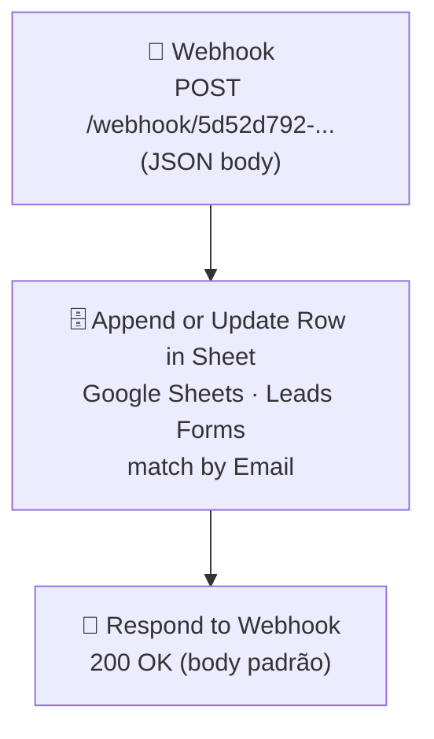

# Workflow: `formulario`

> **Status n8n**: Ativo
> **Trigger**: Webhook HTTP (POST)
> **ID n8n**: `DyXxa31k5jr2a8bqZhZR5`
> **Tags**: `Mindflow`
> **Owner (n8n project)**: Gabriel (`gabriel.neves@iatize-ia.com`)
> **Última versão ativa**: `4551b4e8-6416-4f7c-9e37-97ccc6f240e7` (publicada em `2026-03-02`)
> **Última execução analisada**: _Sem execução recente — exemplos a coletar_ (apenas `pinData` disponível para inferência)

---

## Descrição Geral

Workflow simples de captura de leads vindos de um formulário externo (site/landing page). Recebe um POST com dados de contato (`nome`, `melhor_email`, `nome_empresa`, `numero_contato`, `tamanho_equipe_vendas`) e faz **upsert** desses dados numa planilha Google Sheets (`Leads Forms`), usando o `Email` como chave de matching. Após gravar a linha, responde ao chamador via `Respond to Webhook`.

Apesar de estar taggeado como `Mindflow`, **não tem relação com o RAG `documents_fil` nem com formTrigger nativo do n8n** — é um webhook HTTP genérico que persiste leads numa planilha. Não alimenta classificadores nem dispara outros workflows.

## Diagrama de Fluxo



## Comunicação com Outros Workflows

| Direção | Workflow / Origem | Endpoint | Método | Dados Passados |
|---------|-------------------|----------|--------|----------------|
| ← Recebe de | Formulário externo (site/landing) — `user-agent: python-requests/2.32.5` no pin | `https://n8nwebhook.n8nmindflow.com.br/webhook/5d52d792-9feb-417e-aa51-4b29e9894631` | POST | `melhor_email`, `nome`, `nome_empresa`, `numero_contato`, `tamanho_equipe_vendas` |
| → Envia para | Google Sheets `Leads Forms` (planilha `1OVnlp5CgR_rXubNQJ77s0awm_cacUcc__cVElk8wTjU`, aba `Página1`) | Google Sheets API (OAuth2) | `appendOrUpdate` (upsert) | linha mapeada (ver Detalhamento) |

**Não há comunicação com outros workflows n8n.** É um ponto-folha (leaf): captura de lead que termina na planilha. Não chama `pre_call_processing`, `call_predict`, nem nenhum endpoint Mindflow interno.

### Dados de Rastreabilidade

| Campo | Valor/Origem | Obrigatório no fluxo atual? |
|-------|--------------|------------------------------|
| `execution_id` | Não existe (n8n não propaga) | ❌ — workflow não segue padrão EDW |
| `from_workflow` | Não existe | ❌ |
| `workflow_id` | Não existe | ❌ |

> Hoje **não há rastreabilidade EDW**. Na migração, ver Migration Brief abaixo.

## Exemplos de Payload Real (anonimizado)

_Sem execução recente — exemplos a coletar_

> O `executions.json` retornou `data: []`. O único exemplo disponível é o `pinData` do nó Webhook (dados de teste no editor n8n), reproduzido abaixo já anonimizado.

**Trigger input** (pinData de teste — não é uma execução real):
```json
{
  "headers": {
    "host": "n8nwebhook.n8nmindflow.com.br",
    "user-agent": "python-requests/2.32.5",
    "content-type": "application/json",
    "x-forwarded-for": "<REDACTED>",
    "x-forwarded-proto": "https"
  },
  "body": {
    "melhor_email": "<EMAIL>",
    "nome": "<NOME>",
    "nome_empresa": "<NOME_EMPRESA>",
    "numero_contato": "+55XX9XXXXXXXX",
    "tamanho_equipe_vendas": 5
  },
  "webhookUrl": "https://n8nwebhook.n8nmindflow.com.br/webhook/5d52d792-9feb-417e-aa51-4b29e9894631",
  "executionMode": "production"
}
```

**Output final** (Respond to Webhook): retorna o body padrão do n8n (echo do último nó); sem corpo customizado configurado.

## Detalhamento dos Nós

### 1. `Webhook` (📝 Trigger)
- **Tipo n8n**: `n8n-nodes-base.webhook` (typeVersion 2.1)
- **Descrição**: Recebe POST público do formulário externo.
- **Configuração**:
  - `httpMethod`: `POST`
  - `path`: `5d52d792-9feb-417e-aa51-4b29e9894631`
  - `responseMode`: `responseNode` (a resposta é controlada pelo nó `Respond to Webhook`)
  - **Sem autenticação configurada** (webhook aberto)
- **URL pública**: `https://n8nwebhook.n8nmindflow.com.br/webhook/5d52d792-9feb-417e-aa51-4b29e9894631`
- **Saídas**: → `Append or update row in sheet`

### 2. `Append or update row in sheet` (🗄️ Database — Google Sheets)
- **Tipo n8n**: `n8n-nodes-base.googleSheets` (typeVersion 4.7)
- **Descrição**: Faz upsert do lead na planilha `Leads Forms`. Se já existir uma linha com o mesmo `Email`, atualiza; senão, insere.
- **Configuração**:
  - `operation`: `appendOrUpdate`
  - `documentId`: `1OVnlp5CgR_rXubNQJ77s0awm_cacUcc__cVElk8wTjU` (planilha "Leads Forms")
  - `sheetName`: `gid=0` (aba "Página1")
  - `matchingColumns`: `["Email"]`
  - **Mapeamento de colunas** (mappingMode `defineBelow`):
    | Coluna Sheet | Expressão n8n |
    |--------------|----------------|
    | `Email` | `{{ $json.body.melhor_email }}` |
    | `Nome` | `{{ $json.body.nome }}` |
    | `Nome da empresa` | `{{ $json.body.nome_empresa }}` |
    | `Numero` | `{{ $json.body.numero_contato }}` |
    | `Numero de funcionários` | `{{ $json.body.tamanho_equipe_vendas }}` |
- **Credencial**: `google sheets Mindflow` (OAuth2, ID `xDo9r8pHPSWB9k2E`)
- **Saídas**: → `Respond to Webhook`

### 3. `Respond to Webhook` (📨 Webhook Response)
- **Tipo n8n**: `n8n-nodes-base.respondToWebhook` (typeVersion 1.4)
- **Descrição**: Devolve a resposta HTTP ao cliente do formulário. Sem body customizado — retorna o output do nó anterior (linha inserida/atualizada).
- **Configuração**: `options: {}` (defaults)
- **Saídas**: — (fim do fluxo)

## Variáveis de Ambiente Utilizadas

| Variável | Uso no Workflow |
|----------|-----------------|
| _(nenhuma direta)_ | O workflow não usa `$env.*` em nenhum nó. Autenticação Google Sheets é via credencial OAuth2 armazenada no n8n. |

## Credenciais n8n Utilizadas

| Nome da Credencial | Tipo | Nós que Usam |
|--------------------|------|--------------|
| `google sheets Mindflow` (id `xDo9r8pHPSWB9k2E`) | `googleSheetsOAuth2Api` | `Append or update row in sheet` |

---

## Migration Brief — Antigravity / Python

> Especificação para o agente do Antigravity reimplementar este workflow em Python conforme `Usefull_Skills/docs/conventions.md` (EDW). Workflow trivial: 1 POST → 1 upsert → 200 OK.

### Camada API (FastAPI)

- **Endpoint sugerido**: `POST /webhook/formulario` (ou manter o slug atual `/webhook/5d52d792-9feb-417e-aa51-4b29e9894631` para não quebrar formulários publicados — preferir alias).
- **Schema Pydantic de entrada** (`schemas.py`):

```python
class FormularioInput(BaseModel):
    melhor_email: EmailStr
    nome: str
    nome_empresa: str
    numero_contato: str  # tel sem máscara, ex: "55XX9XXXXXXXX"
    tamanho_equipe_vendas: int | str  # n8n aceita ambos; normalizar para int
```

- **Resposta**: `202 Accepted` + `{"execution_id": "<uuid>"}` (diferente do n8n atual que devolve o eco da linha; cliente do form não usa o body).
- **Validações obrigatórias**:
  - `melhor_email` válido (EmailStr).
  - `numero_contato` apenas dígitos (normalizar; rejeitar `400 Bad Request` se vazio).
  - `tamanho_equipe_vendas` coerção para `int` (n8n aceita string `"5"`; manter retrocompatibilidade).

### Camada Worker (ARQ)

Mapa nó n8n → step EDW (cada step via `run_step_with_retry`):

| # | n8n node | Step EDW (`formulario_<OQF>`) | I/O | Lib Python | Retries | Async? |
|---|----------|--------------------------------|-----|------------|---------|--------|
| 1 | `Append or update row in sheet` | `formulario_upsert_lead_sheet` | in: `FormularioInput`; out: `{spreadsheet_id, row, updated_at}` | `gspread` (sync wrap em `asyncio.to_thread`) ou `httpx.AsyncClient` direto na Sheets API v4 | 3 | sim |
| 2 | _(não existe no n8n)_ | `formulario_persist_lead_supabase` (sugestão) | in: `FormularioInput`; out: `{lead_id}` | `supabase` singleton | 3 | sim |

> **Nota sobre o step 2**: o n8n atual **não** persiste em Supabase, só em Sheets. Recomenda-se adicionar um step de espelhamento em uma tabela `leads_formulario` no Supabase para rastreabilidade e analytics — alinhar com o usuário antes de implementar.

### Comunicação Externa (Saídas)

**Google Sheets API v4** — `spreadsheets.values.batchUpdate` (ou `append` + lookup por `Email`):
- **URL**: `https://sheets.googleapis.com/v4/spreadsheets/1OVnlp5CgR_rXubNQJ77s0awm_cacUcc__cVElk8wTjU/values/...`
- **Headers**: `Authorization: Bearer <oauth_token>` (refresh token de service account ou OAuth2 user).
- **Payload**: linha com `[Nome, Nome da empresa, Numero, Email, Numero de funcionários]`.
- **Retorno esperado**: `{ "spreadsheetId", "updates": { "updatedRows": 1 } }`.

### Variáveis de Ambiente Necessárias (.env)

| Variável | Origem n8n | Uso no Python |
|----------|-----------|----------------|
| `GOOGLE_SHEETS_SA_JSON` (path ou JSON inline) | credencial `google sheets Mindflow` (OAuth2) | autenticar `gspread` / Sheets API. Preferir Service Account com escopo `https://www.googleapis.com/auth/spreadsheets`. |
| `FORMULARIO_SHEET_ID` | hardcoded no nó (`1OVnlp5CgR_...`) | ID da planilha "Leads Forms" |
| `FORMULARIO_SHEET_TAB` | hardcoded (`gid=0` / `Página1`) | nome da aba |
| `SUPABASE_URL`, `SUPABASE_KEY` | (novo — se adicionar step de espelhamento) | client singleton |
| `REDIS_URL` | infra Easypanel | `arq` worker (RedisSettings.from_dsn) |

### Rastreabilidade Obrigatória (conventions.md)

- `workflow_id`: `formulario_v1` (fixo)
- `from_workflow`: campo opcional no body — formulários públicos não passam, mas se vier (ex: campanha A/B), gravar.
- `execution_id`: UUID gerado pela API ao receber o POST.
- Persistir em:
  - `workflow_executions` (master) — status `PENDING` → `RUNNING` → `SUCCESS`/`FAILED`, com `input_data` = body recebido (sem mascarar; é dado do próprio lead).
  - `workflow_step_executions` (detail) — um registro por tentativa do step `formulario_upsert_lead_sheet`.

### Pontos de Atenção / Divergências do EDW

- **Webhook aberto, sem autenticação**: hoje qualquer um com a URL pode inserir leads. Na migração, considerar:
  - Token compartilhado em header `X-Form-Token` validado contra env var `FORMULARIO_WEBHOOK_TOKEN`, **ou**
  - Captcha (hCaptcha/Turnstile) no frontend com validação server-side, **ou**
  - Rate-limit por IP no FastAPI (slowapi). Alinhar com o usuário antes de impor break-change.
- **Sem rastreabilidade hoje**: o n8n não grava `execution_id` em nenhum lugar. Após migração, todo POST passa a ter UUID + master/detail no Supabase — ganho líquido.
- **Resposta atual difere do padrão EDW**: n8n devolve eco da linha (200 OK); EDW prescreve `202 Accepted` + `execution_id`. Validar com o cliente do form (provavelmente ignora o body — só checa status code).
- **`appendOrUpdate` por Email**: usar mesma chave de matching no Python para preservar o comportamento de não duplicar leads que reenviam o form.
- **`tamanho_equipe_vendas`**: tipo inconsistente (string no Sheets, mas pode vir int no JSON). Forçar `int` no Pydantic e converter na escrita.
- **Sem `Wait`, sem `Code`, sem ML**: workflow é I/O puro — migração direta, baixa complexidade. Não há `time.sleep`, `BackgroundTasks`, `APScheduler` ou `requests` a substituir.
- **Não chama outros workflows**: nenhum `httpRequest` para `*.easypanel.host` — escopo de migração isolado.

### Status de Migração

- [x] Documentado
- [ ] Schemas Pydantic definidos
- [ ] API endpoint implementado
- [ ] Worker steps implementados
- [ ] Validado em ambiente de teste
- [ ] Migrado em produção
