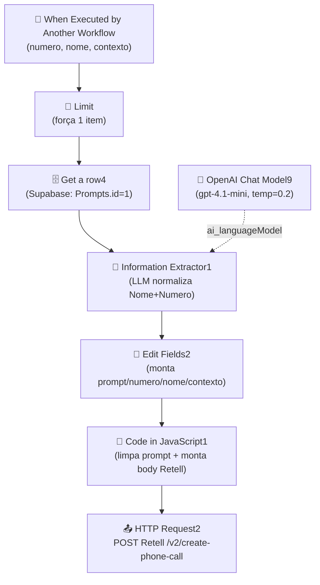

# Workflow: `ligacao_whatsapp_mindflow`

> **Status n8n**: Ativo
> **Trigger**: Execute Workflow (chamado por outro workflow n8n)
> **ID n8n**: `1KRSGQYXjxvIMJdHWQant`
> **Última execução analisada**: `493677` em `2026-05-13T19:08:08Z` (status: success, ~3.6s)

---

## Descrição Geral

Sub-workflow disparado por outro fluxo da Mindflow (geralmente o `z-api` / WhatsApp inbound) para realizar uma ligação de voz de qualificação consultiva via Retell AI ao lead que acabou de interagir no WhatsApp. Busca o prompt da persona "Kaique" na tabela `Prompts` do Supabase, normaliza o telefone do lead via LLM (gpt-4.1-mini) garantindo o formato `+55DD9XXXXXXXX`, monta o payload do Retell com `retell_llm_dynamic_variables` e dispara `POST /v2/create-phone-call`. Não persiste resultado, não confirma sucesso ao chamador.

---

## Diagrama de Fluxo



---

## Comunicação com Outros Workflows

| Direção | Workflow | Endpoint | Método | Dados Passados |
|---------|----------|----------|--------|----------------|
| ← Recebe de | `z-api` (workflowId `titwcyjWYvdBTF5Bj3pAN`, trigger Webhook) | Execute Workflow (in-process n8n) | n8n internal | `numero`, `nome`, `contexto` |
| → Envia para | Retell AI (externo) | `https://api.retellai.com/v2/create-phone-call` | POST | `from_number`, `to_number`, `override_agent_id`, `retell_llm_dynamic_variables` (customer_name, prompt, now, contexto, numero_do_lead), `metadata`, `custom_sip_headers` |

> Não há webhook HTTP de entrada — o trigger é `executeWorkflowTrigger`, então a invocação é estritamente n8n→n8n (in-process). A identidade do chamador foi confirmada via `parentExecution.workflowId` nas execuções recentes.

### Dados de Rastreabilidade

| Campo | Valor/Origem | Obrigatório | Observação |
|-------|--------------|-------------|------------|
| `workflow_id` | — (n8o presente) | ❌ no n8n | A migrar como constante fixa `ligacao_whatsapp_mindflow_v1` |
| `from_workflow` | — (não passado pelo chamador) | ❌ no n8n | Inferido como `z_api` no Antigravity |
| `execution_id` | — (não há) | ❌ no n8n | Antigravity precisa gerar UUID na API |
| `numero` | input do chamador | ✅ | Validar formato `+55...` |
| `nome` | input do chamador | ✅ | Pode conter emojis (ver exemplo) |
| `contexto` | input do chamador | ✅ | Texto livre, vira `retell_llm_dynamic_variables.contexto` |

⚠️ **Ambiguo**: o workflow n8n NÃO carrega `workflow_id`, `from_workflow` nem `execution_id` no payload. Toda rastreabilidade EDW precisa ser adicionada na migração — hoje é um buraco.

---

## Exemplos de Payload Real (anonimizado)

**Trigger input** (execução `493677`, chamado por `z-api` exec `493676`):

```json
{
  "numero": "+55XX9XXXXXXXX",
  "nome": "<NOME>",
  "contexto": "Lead acaba da enviar mensagem no whatsapp. Provavelmente nos conheceu atravéz do tráfego pago. Primeira interação"
}
```

**Saída do `Information Extractor1`** (LLM normaliza o número):

```json
{
  "output": {
    "Nome": "<NOME>",
    "Numero": "+55XX9XXXXXXXX"
  }
}
```

**Body enviado ao Retell** (`HTTP Request2`):

```json
{
  "from_number": "555196506656",
  "to_number": "+55XX9XXXXXXXX",
  "override_agent_id": "agent_f95ee856fb3d220f42171318dc",
  "metadata": {},
  "retell_llm_dynamic_variables": {
    "customer_name": "<NOME>.",
    "prompt": "<prompt completo da persona Kaique, single-line, sem markdown>",
    "now": "2026-05-13T19:08:11.333Z",
    "contexto": "Lead acaba da enviar mensagem no whatsapp...",
    "numero_do_lead": "+55XX9XXXXXXXX"
  },
  "custom_sip_headers": {
    "X-Custom-Header": "Custom Value"
  }
}
```

**Resposta do Retell** (último nó):

```json
{
  "call_id": "call_<REDACTED>",
  "call_type": "phone_call",
  "agent_id": "agent_f95ee856fb3d220f42171318dc",
  "agent_version": 11,
  "agent_name": "Agente Mindflow (whatsapp)",
  "call_status": "registered",
  "from_number": "555196506656",
  "to_number": "+55XX9XXXXXXXX",
  "direction": "outbound"
}
```

---

## Detalhamento dos Nós

### 1. `When Executed by Another Workflow` (🔵 Trigger)
- **Tipo n8n**: `n8n-nodes-base.executeWorkflowTrigger` v1.1
- **Descrição**: Ponto de entrada — recebe `numero`, `nome`, `contexto` de outro workflow n8n.
- **Configuração**: `workflowInputs.values = [numero, nome, contexto]`.
- **Saídas**: → `Limit`

### 2. `Limit` (🔩 Utility)
- **Tipo n8n**: `n8n-nodes-base.limit` v1
- **Descrição**: Garante que apenas 1 item passe adiante (limit padrão = 1).
- **Configuração**: vazio (default).
- **Saídas**: → `Get a row4`

### 3. `Get a row4` (🗄️ Database)
- **Tipo n8n**: `n8n-nodes-base.supabase` v1
- **Descrição**: Busca a linha de prompts no Supabase (tabela `Prompts`, id=1). Retorna colunas `Ligação/txt`, `Prompt_Text`, `Pormpt_Name`, `Prompt Insta`.
- **Configuração**: `operation=get`, `tableId=Prompts`, filtro `id=1`.
- **Credencial**: `supabase Mindflow` (tipo `supabaseApi`).
- **Saídas**: → `Information Extractor1`

### 4. `Information Extractor1` (🧠 LLM)
- **Tipo n8n**: `@n8n/n8n-nodes-langchain.informationExtractor` v1.2
- **Descrição**: Extrai e normaliza `Nome` e `Numero` (telefone BR no padrão `+55DD9XXXXXXXX`) a partir do texto bruto vindo do chamador. Usa o LLM auxiliar `OpenAI Chat Model9`.
- **Configuração**: input `text` = `numero + \n + nome` do trigger; atributos obrigatórios `Nome` e `Numero`; `retryOnFail=true`, `waitBetweenTries=3000ms`.
- **Saídas**: → `Edit Fields2`

### 5. `OpenAI Chat Model9` (🧠 LLM - sub-nó)
- **Tipo n8n**: `@n8n/n8n-nodes-langchain.lmChatOpenAi` v1.3
- **Descrição**: Modelo subordinado ao Information Extractor.
- **Configuração**: `model=gpt-4.1-mini`, `temperature=0.2`.
- **Credencial**: `OpenAi account` (tipo `openAiApi`).
- **Saídas**: alimenta `Information Extractor1` via porta `ai_languageModel`.

### 6. `Edit Fields2` (🔧 Transform)
- **Tipo n8n**: `n8n-nodes-base.set` v3.4
- **Descrição**: Monta o objeto final com `prompt` (vindo de `Get a row4`.`Ligação/txt`), `numero` e `nome` (vindos do Information Extractor) e `contexto` (vindo do trigger original).
- **Saídas**: → `Code in JavaScript1`

### 7. `Code in JavaScript1` (🔧 Transform)
- **Tipo n8n**: `n8n-nodes-base.code` v2
- **Descrição**: Limpa o prompt (remove quebras de linha, caracteres markdown `` ` * _ ~ # > ``, troca `"` por `'`) e monta o `body` final para a Retell, incluindo `now = new Date().toISOString()`.
- **Configuração relevante**: hardcoded `from_number=555196506656` e `override_agent_id=agent_f95ee856fb3d220f42171318dc`.
- **Saídas**: → `HTTP Request2`

### 8. `HTTP Request2` (📤 Output)
- **Tipo n8n**: `n8n-nodes-base.httpRequest` v4.2
- **Descrição**: Dispara a ligação na Retell AI.
- **Configuração**: `POST https://api.retellai.com/v2/create-phone-call`, header `Authorization: Bearer key_<REDACTED>` (token HARDCODED no nó — divergência grave), body = `{{$json.body}}`, `alwaysOutputData=true`, `onError=continueRegularOutput`.
- **Saídas**: nenhuma (último nó). Resposta com `call_id` não é propagada de volta ao chamador.

---

## Variáveis de Ambiente Utilizadas

| Variável | Uso no Workflow | Observação |
|----------|-----------------|------------|
| _(nenhuma `$env.X` explícita)_ | — | Token Retell hardcoded; credenciais Supabase/OpenAI via credentials store do n8n |

---

## Credenciais n8n Utilizadas

| Nome da Credencial | Tipo | Nós que Usam |
|--------------------|------|--------------|
| `supabase Mindflow` | `supabaseApi` | `Get a row4` |
| `OpenAi account` | `openAiApi` | `OpenAI Chat Model9` |
| _(inline)_ Retell API Key | header `Authorization: Bearer` | `HTTP Request2` (HARDCODED — migrar para env var) |

---

## 🚀 Migration Brief — Antigravity / Python

> Especificação para o agente do Antigravity reimplementar este workflow em Python conforme `Usefull_Skills/docs/conventions.md` (EDW).

### Camada API (FastAPI)

- **Endpoint sugerido**: `POST /webhook/ligacao-whatsapp-mindflow`
- **Schema Pydantic de entrada** (`schemas.py`, apenas declaração de tipos — sem corpo):

```python
class LigacaoWhatsappMindflowInput(BaseModel):
    numero: str           # telefone bruto do lead; será normalizado p/ +55DD9XXXXXXXX no worker
    nome: str             # pode conter emojis/sufixos
    contexto: str         # texto livre p/ retell_llm_dynamic_variables.contexto
    from_workflow: Optional[str] = None   # rastreabilidade EDW (ex: "z_api")
    execution_id: Optional[str] = None    # UUID propagado pelo chamador, se houver
```

- **Comportamento**: validar payload, criar registro em `workflow_executions` (status `PENDING`), enfileirar via `arq.enqueue_job("run_ligacao_whatsapp_mindflow", payload)`, responder `202 Accepted` com `{execution_id}`.
- **Resposta**:
```python
class LigacaoWhatsappMindflowAccepted(BaseModel):
    execution_id: str
    status: Literal["PENDING"]
```
- **Validações obrigatórias**:
  - `numero`: regex permissiva (qualquer formato BR aceito — normalização é no worker)
  - `nome`: não vazio (≤ 200 chars; emojis permitidos)
  - `contexto`: não vazio (≤ 2000 chars)

### Camada Worker (ARQ)

Mapa nó n8n → step EDW (todos via `run_step_with_retry`, prefixo `ligacao_whatsapp_mindflow_`):

| # | n8n node | Step EDW (`{wf}_{OQF}`) | I/O | Lib Python | Retries | Async? |
|---|----------|-------------------------|-----|------------|---------|--------|
| 1 | When Executed by Another Workflow | _(API — não é step)_ | — | FastAPI | — | — |
| 2 | Limit | _(não migra — input já é singular na API)_ | — | — | — | — |
| 3 | Get a row4 (Supabase) | `ligacao_whatsapp_mindflow_fetch_prompt` | in: `prompt_id=1`; out: row da tabela `Prompts` (campos `Ligação/txt`, `Prompt_Text`) | `supabase` singleton | 3 | sim |
| 4 | Information Extractor1 + OpenAI Chat Model9 | `ligacao_whatsapp_mindflow_normalize_phone` | in: `numero`+`nome` brutos; out: `{nome, numero_e164}` | `openai` AsyncClient (gpt-4.1-mini, temp=0.2, structured output) | 2 (já era 2 no n8n) | sim |
| 5 | Edit Fields2 | _(merge — não migra como step; faz parte de `build_retell_payload`)_ | — | Python puro | 0 | — |
| 6 | Code in JavaScript1 | `ligacao_whatsapp_mindflow_build_retell_payload` | in: `{prompt_text, numero_e164, nome, contexto}`; out: dict pronto p/ Retell | Python puro (regex de limpeza) | 0 | sim |
| 7 | HTTP Request2 | `ligacao_whatsapp_mindflow_create_retell_call` | in: payload; out: `{call_id, call_status, agent_id, ...}` | `httpx.AsyncClient` | 3 | sim |

> **Alternativa de simplificação**: a normalização do telefone pode virar regex Python pura (sem LLM) — o prompt do n8n é determinístico (sempre retorna `+55DD9XXXXXXXX`). Recomendado discutir com o time antes de migrar.

### Comunicação Externa (Saídas)

**Retell AI — Criar ligação**
- **URL**: `https://api.retellai.com/v2/create-phone-call`
- **Método**: `POST`
- **Headers**: `Authorization: Bearer {RETELL_API_KEY}`, `Content-Type: application/json`
- **Payload**:
```python
{
  "from_number": "555196506656",            # constante p/ env var RETELL_FROM_NUMBER
  "to_number": numero_e164,
  "override_agent_id": "agent_f95ee856fb3d220f42171318dc",  # env var RETELL_AGENT_ID_WHATSAPP
  "metadata": {"execution_id": execution_id, "from_workflow": from_workflow},
  "retell_llm_dynamic_variables": {
    "customer_name": nome,
    "prompt": prompt_limpo,
    "now": get_utc_now(),
    "contexto": contexto,
    "numero_do_lead": numero_e164,
  },
  "custom_sip_headers": {"X-Custom-Header": "Custom Value"},
}
```
- **Retorno esperado**: `200` + `{call_id, call_status="registered", agent_id, to_number, ...}`. Persistir `call_id` em `workflow_executions.output_data` e status final `SUCCESS`.

**Supabase — Fetch prompt**
- Singleton `supabase` client; chamada `from_("Prompts").select("*").eq("id", 1).single()`.
- Variáveis: `SUPABASE_URL`, `SUPABASE_KEY`.

**OpenAI — Normalização (opcional)**
- `openai.AsyncOpenAI`, `model=gpt-4.1-mini`, `temperature=0.2`, `response_format` JSON schema com campos `Nome` e `Numero`.

### Variáveis de Ambiente Necessárias (.env)

| Variável | Origem n8n | Uso no Python |
|----------|-----------|---------------|
| `SUPABASE_URL` | credencial `supabase Mindflow` | client singleton |
| `SUPABASE_KEY` | credencial `supabase Mindflow` | client singleton |
| `OPENAI_API_KEY` | credencial `OpenAi account` | `openai.AsyncOpenAI` (se manter normalização via LLM) |
| `RETELL_API_KEY` | header inline em `HTTP Request2` (HOJE HARDCODED) | header `Authorization: Bearer ...` |
| `RETELL_FROM_NUMBER` | hardcoded `555196506656` | payload Retell |
| `RETELL_AGENT_ID_WHATSAPP` | hardcoded `agent_f95ee856fb3d220f42171318dc` | payload Retell |
| `REDIS_URL` | — | `RedisSettings.from_dsn(...)` p/ ARQ |
| `SUPABASE_PROMPT_ID` (opcional) | hardcoded `1` | parametrizar prompt_id |

### Rastreabilidade Obrigatória (conventions.md)

- `workflow_id`: constante fixa `ligacao_whatsapp_mindflow_v1`
- `from_workflow`: vem do chamador (esperado `z_api` — quem chama hoje); se ausente, registrar `unknown` e logar warning
- `execution_id`: UUID gerado pela API (FastAPI) na hora do `POST /webhook/...`
- Persistir em:
  - `workflow_executions` (master): `PENDING` na API → `RUNNING` no worker → `SUCCESS` (com `call_id` em `output_data`) ou `FAILED` (com `error_details`)
  - `workflow_step_executions` (detail): um registro por tentativa de cada step via `run_step_with_retry`

### Pontos de Atenção / Divergências do EDW

- **Token Retell HARDCODED** no nó `HTTP Request2` (n8n) — em Python obrigatoriamente migrar para env var `RETELL_API_KEY`. Bloquear deploy se o token vazado em código for re-detectado.
- **`from_number` e `override_agent_id` hardcoded** no nó `Code in JavaScript1` — migrar para env vars (suporta multi-tenant no futuro).
- **Trigger é `executeWorkflowTrigger`**, não webhook HTTP: em Python vira endpoint FastAPI normal. O chamador `z_api` precisa ser ajustado para fazer `POST /webhook/ligacao-whatsapp-mindflow` em vez de chamar n8n→n8n.
- **Sem rastreabilidade EDW no payload de entrada** (`workflow_id`/`from_workflow`/`execution_id` ausentes): migração tem que injetar esses campos como `Optional` no schema e preencher defaults.
- **Normalização de telefone via LLM** é caro/lento (gpt-4.1-mini, ~1.5s p/ execução) para uma tarefa determinística — fortemente recomendado migrar para regex Python pura no step `ligacao_whatsapp_mindflow_normalize_phone`, mantendo o LLM apenas como fallback.
- **Sem persistência de `call_id`** no workflow n8n: a resposta da Retell hoje é descartada. No Antigravity, gravar em `workflow_executions.output_data`.
- **Limpeza de prompt agressiva** (remove ``` ` * _ ~ # > ``` e troca `"` por `'`) — replicar exatamente para não quebrar o comportamento do agente Retell.
- **Nó `Limit`** é cosmético: API recebe 1 item por request por design, não migra como step.
- **`onError=continueRegularOutput`** no HTTP Request: significa que falha na Retell hoje passa silenciosamente. Em EDW, falha do step `create_retell_call` deve marcar `workflow_executions.status=FAILED` (sem `continue` silencioso).

### Status de Migração

- [ ] Documentado
- [ ] Schemas Pydantic definidos
- [ ] API endpoint `/webhook/ligacao-whatsapp-mindflow` implementado
- [ ] Worker steps (`fetch_prompt`, `normalize_phone`, `build_retell_payload`, `create_retell_call`) implementados
- [ ] Env vars adicionadas no Easypanel (RETELL_API_KEY, RETELL_FROM_NUMBER, RETELL_AGENT_ID_WHATSAPP)
- [ ] Chamador `z_api` ajustado para usar HTTP em vez de executeWorkflow n8n
- [ ] Validado em ambiente de teste (ligação de fato disparada na Retell)
- [ ] Migrado em produção
