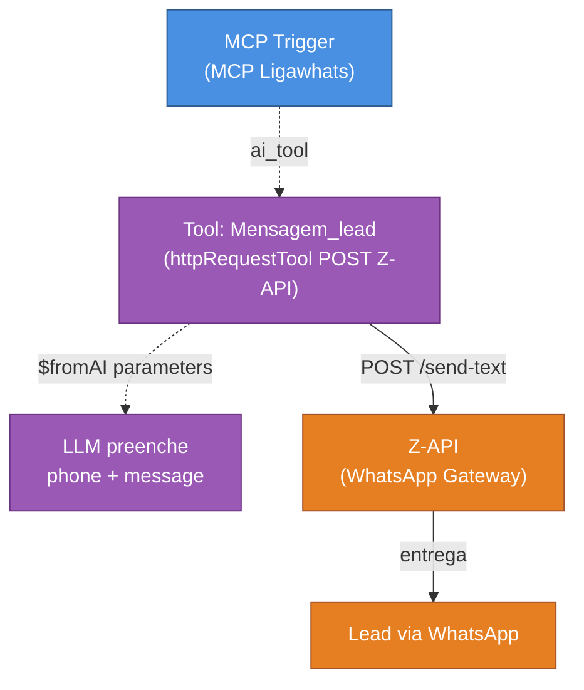

# Workflow: `mcp_ligawhats`

> **Status n8n**: Ativo
> **Trigger**: MCP Trigger (Model Context Protocol — webhook LangChain)
> **ID n8n**: `zSZlwlPC8SJy62CgLs3Nq`
> **Última execução analisada**: _Sem execução recente disponível_

---

## Descricao Geral

Workflow que atua como **MCP Server** (Model Context Protocol) expondo ferramentas (tools) consumidas por agentes LLM externos — tipicamente os agentes Retell AI das ligacoes WhatsApp da Mindflow. Atualmente expoe **uma unica tool** chamada `Mensagem_lead`, que envia mensagem de texto via Z-API (gateway WhatsApp) para o lead quando o agente detecta interesse em fechar pedido. O LLM consumidor preenche dinamicamente `phone` (numero formatado) e `message` (texto da mensagem) via `$fromAI()`.

## Diagrama de Fluxo



## Comunicacao com Outros Workflows

| Direcao | Workflow/Servico | Endpoint | Metodo | Dados Passados |
|---------|------------------|----------|--------|----------------|
| Recebe de | Agente LLM (Retell AI / ligacao WhatsApp) | `/mcp/f3260c85-fe8f-4ddb-9969-6b29e5136273` (MCP path) | MCP protocol (SSE/HTTP) | Chamada de tool com `parameters0_Value` (phone) e `parameters1_Value` (message) |
| Envia para | Z-API (WhatsApp Gateway) | `https://api.z-api.io/instances/<INSTANCE_ID>/token/<TOKEN>/send-text` | POST | `{ phone, message }` |

### Dados de Rastreabilidade

| Campo | Valor/Origem | Obrigatorio |
|-------|--------------|-------------|
| `execution_id` | Nao gerado (workflow nao registra rastreio EDW) | Ausente (gap) |
| `from_workflow` | Nao propagado | Ausente (gap) |
| `workflow_id` | Nao propagado | Ausente (gap) |

> **Observacao**: como MCP server, este workflow nao gera `execution_id` proprio nem propaga rastreio EDW. O `execution_id` deveria vir do agente chamador (ligacao WhatsApp) e ser logado junto ao envio Z-API.

## Exemplos de Payload Real (anonimizado)

_Sem execucao recente disponivel_

Estrutura esperada (inferida do schema da tool):

**Tool call input** (do LLM):
```json
{
  "parameters0_Value": "+55XX9XXXXXXXX",
  "parameters1_Value": "Ola <NOME>, confirmando seu pedido..."
}
```

**Request enviado ao Z-API** (apos transformacao):
```json
{
  "phone": "55XXXXXXXXXX",
  "message": "Ola <NOME>, confirmando seu pedido..."
}
```

## Detalhamento dos Nos

### 1. `MCP Ligawhats` (MCP Trigger)
- **Tipo n8n**: `@n8n/n8n-nodes-langchain.mcpTrigger` (typeVersion 2)
- **Descricao**: Expoe um endpoint MCP que LLMs externos chamam para descobrir e invocar tools deste servidor.
- **Configuracao**:
  - `path`: `f3260c85-fe8f-4ddb-9969-6b29e5136273`
  - `webhookId`: `f3260c85-fe8f-4ddb-9969-6b29e5136273`
- **Saidas**: tools registradas via conexao `ai_tool` → `Mensagem_lead`.

### 2. `Mensagem_lead` (Tool / httpRequestTool)
- **Tipo n8n**: `n8n-nodes-base.httpRequestTool` (typeVersion 4.3)
- **Descricao da tool (exposta ao LLM)**: "Gatilho: Interesse demonstrado -> Acao: Enviar mensagem de follow up de fechamento do pedido por WhatsApp."
- **Configuracao**:
  - Metodo: `POST`
  - URL: `https://api.z-api.io/instances/<INSTANCE_ID>/token/<TOKEN>/send-text`
  - Headers: `Client-Token: <Z_API_CLIENT_TOKEN>` (atualmente hardcoded — ver Pontos de Atencao)
  - Body params (preenchidos pelo LLM via `$fromAI()`):
    - `phone`: numero do lead em formato `55DDXXXXXXXX` (12 digitos, sem `+`, sem o `9` extra). Prompt da tool instrui conversao de `+55DD9XXXXXXXX` para `55DDXXXXXXXX`.
    - `message`: texto da mensagem de confirmacao.
- **Saidas**: resposta do Z-API retorna para o LLM chamador.

## Variaveis de Ambiente Utilizadas

Nenhuma — todos os secrets (`INSTANCE_ID`, `TOKEN`, `Client-Token`) estao **hardcoded** no JSON do workflow.

| Variavel sugerida (apos migracao) | Uso |
|-----------------------------------|-----|
| `ZAPI_INSTANCE_ID` | ID da instancia Z-API |
| `ZAPI_TOKEN` | Token da instancia Z-API |
| `ZAPI_CLIENT_TOKEN` | Header `Client-Token` para autenticacao Z-API |

## Credenciais n8n Utilizadas

Nenhuma credencial n8n nativa — autenticacao Z-API esta inline no header e na URL (anti-padrao).

---

## Migration Brief — Antigravity / Python

> Especificacao para reimplementar este MCP server em Python conforme `conventions.md` (EDW).

### Decisao Aberta — Estrategia de Portabilidade

Duas opcoes validas (registrar como **divergencia/decisao aberta** com o time):

1. **Opcao A — FastMCP (recomendada, autorizada em `conventions.md`)**: portar para Python usando **FastMCP** (framework do `Anthropic` para MCP servers). Vantagens: stack unificada com o resto da Mindflow (FastAPI + httpx + arq), rastreio EDW completo (`workflow_id`, `from_workflow`, `execution_id`), secrets via env, testavel.
2. **Opcao B — Manter no n8n como MCP server externo**: aceitar como gateway WhatsApp legado e nao migrar. So faz sentido se outras tools forem adicionadas rapidamente apenas no n8n.

**Recomendacao**: Opcao A (FastMCP). O workflow tem 2 nos e secrets hardcoded — ja paga sozinho a migracao.

### Camada MCP (FastMCP)

- **Server name**: `mcp_ligawhats`
- **Tools expostas**:
  ```python
  @mcp.tool()
  async def mensagem_lead(phone: str, message: str) -> dict:
      """Gatilho: Interesse demonstrado -> Acao: Enviar mensagem de follow up
      de fechamento do pedido por WhatsApp.

      Args:
          phone: Numero do lead no formato 55DDXXXXXXXX (12 digitos, sem +, sem 9 extra).
          message: Texto da mensagem de confirmacao para enviar ao lead.
      """
      ...
  ```
- **Schema Pydantic de entrada** (`schemas.py`):
  ```python
  class MensagemLeadInput(BaseModel):
      phone: str  # 12 digitos, validar regex ^55\d{10}$
      message: str
      execution_id: Optional[str] = None  # rastreio EDW
      from_workflow: Optional[str] = None
  ```

### Camada Worker (assincrono via httpx)

Como a tool e sincrona do ponto de vista do LLM (espera resposta), nao usa `arq` enfileirado — executa direto via `httpx.AsyncClient`. Persistencia EDW ocorre **apos** o envio.

| # | Node n8n | Step EDW (`mcp_ligawhats_<oqf>`) | I/O | Lib Python | Retries | Async? |
|---|----------|----------------------------------|-----|------------|---------|--------|
| 1 | `Mensagem_lead` (validacao do phone) | `mcp_ligawhats_normalize_phone` | in: phone bruto; out: phone 12 digitos | `re` puro | 0 | sim |
| 2 | `Mensagem_lead` (envio Z-API) | `mcp_ligawhats_send_whatsapp` | in: phone+message; out: zapi_response | `httpx.AsyncClient` | 3 | sim |
| 3 | (novo) registro rastreio | `mcp_ligawhats_log_execution` | in: payload+response; out: ok | `supabase` singleton | 3 | sim |

Cada step deve rodar via `run_step_with_retry()` (exponential backoff + jitter, cap 30s).

### Comunicacao Externa (Saidas)

| Servico | URL | Metodo | Auth (env var) | Payload |
|---------|-----|--------|----------------|---------|
| Z-API | `https://api.z-api.io/instances/{ZAPI_INSTANCE_ID}/token/{ZAPI_TOKEN}/send-text` | POST | Header `Client-Token: {ZAPI_CLIENT_TOKEN}` | `{ phone, message }` |

### Variaveis de Ambiente Necessarias (.env)

| Variavel | Origem n8n | Uso no Python |
|----------|-----------|----------------|
| `ZAPI_INSTANCE_ID` | hardcoded na URL | path da URL Z-API |
| `ZAPI_TOKEN` | hardcoded na URL | path da URL Z-API |
| `ZAPI_CLIENT_TOKEN` | hardcoded em header | header `Client-Token` |
| `SUPABASE_URL` / `SUPABASE_KEY` | (novo) | rastreio EDW |
| `MCP_LIGAWHATS_BIND_HOST` / `_PORT` | (novo) | bind do FastMCP server |

### Rastreabilidade Obrigatoria (conventions.md)

- `workflow_id`: `mcp_ligawhats_v1`
- `from_workflow`: recebido do agente chamador (ligacao WhatsApp / Retell)
- `execution_id`: UUID — deve ser propagado pelo agente chamador via metadata MCP ou gerado no server e devolvido ao LLM
- Persistir em: `workflow_executions` (master) + `workflow_step_executions` (detail) — mesmo modelo dos demais workflows.

### Pontos de Atencao / Divergencias do EDW

- **Secrets hardcoded** (`INSTANCE_ID`, `TOKEN`, `Client-Token`) no JSON — risco de vazamento. Mover para `.env` imediatamente apos migracao. **Apos rotacao, considerar invalidar os tokens atuais.**
- **Sem rastreio EDW**: workflow nao registra `execution_id`, `from_workflow` nem grava em `workflow_executions` / `workflow_step_executions`. Implementar do zero na versao Python.
- **Normalizacao de phone delegada ao LLM** via prompt em `$fromAI()`: fragil (LLM pode errar formato). Migrar para validacao deterministica com regex `^\+?55\d{2}9?\d{8}$` + transformacao Python (`phone.replace("+", "").removeprefix("55").lstrip("9")`-style logic).
- **Decisao aberta sobre estrategia**: FastMCP (Opcao A) vs manter n8n (Opcao B) — registrar deliberacao do time antes de iniciar.
- **Uma unica tool exposta**: workflow esta subutilizado como MCP server. Avaliar se outras acoes WhatsApp (enviar audio, enviar imagem, consultar status) devem ser adicionadas no MCP server portado.
- **Sem execucoes recentes** no dump: validar em producao se a tool esta sendo de fato chamada pelos agentes LLM, ou se virou codigo morto.

### Status de Migracao

- [x] Documentado
- [ ] Decisao FastMCP vs n8n tomada
- [ ] Secrets rotacionados e movidos para `.env`
- [ ] Schemas Pydantic definidos
- [ ] MCP server FastMCP implementado
- [ ] Rastreio EDW integrado
- [ ] Validado em ambiente de teste
- [ ] Migrado em producao
