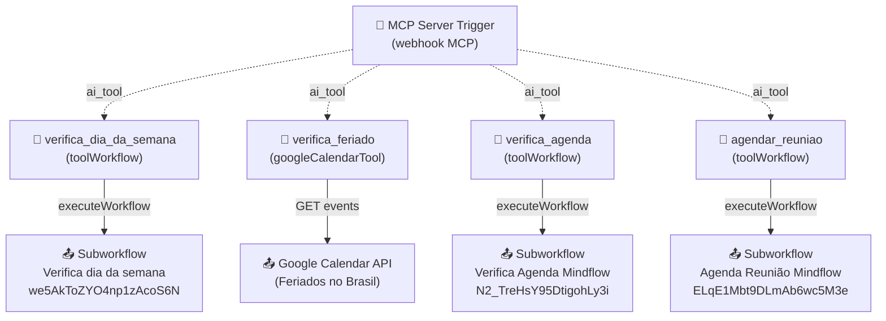

# Workflow: `mcp`

> **Status n8n**: Ativo
> **Trigger**: MCP Server Trigger (webhook `c9259be0-6d0a-4859-81a5-00f058f09a36`, sem auth)
> **ID n8n**: `d1Rj8b4TmPpIaZIVd116T`
> **Slug**: `mcp`
> **Tags**: `Mindflow`
> **Última execução analisada**: `489899` em `2026-05-09T18:18:04.604Z`

---

## Descrição Geral

Servidor MCP (Model Context Protocol) que expõe um conjunto de "tools" para um agente LLM externo (tipicamente o agente de voz Retell ou um chatbot consumidor de MCP) consumir durante uma conversa/ligação. As tools cobrem o fluxo de agendamento: verificar dia da semana, verificar feriados nacionais, checar disponibilidade na agenda e criar a reunião no Google Calendar. As tools `verifica_dia_da_semana`, `verifica_agenda` e `agendar_reuniao` delegam a sub-workflows n8n; `verifica_feriado` consulta o Google Calendar diretamente.

Este workflow é distinto do "MCP ligawhats" (`zSZlwlPC8SJy62CgLs3Nq`).

## Diagrama de Fluxo



## Comunicação com Outros Workflows

| Direção | Workflow | Endpoint / Mecanismo | Método | Dados Passados |
|---------|----------|----------------------|--------|----------------|
| ← Recebe de | Agente LLM (Retell / cliente MCP) | `/mcp/c9259be0-6d0a-4859-81a5-00f058f09a36` (MCP Server Trigger) | MCP (HTTP/SSE) | Tool calls do LLM (`tool_name` + args) |
| → Envia para | `verifica_dia_da_semana` (`we5AkToZYO4np1zAcoS6N`) | n8n `executeWorkflow` | sync | `{ dia: "YYYY-MM-DD" }` |
| → Envia para | `verifica_agenda` (`N2_TreHsY95DtigohLy3i`, Verifica Agenda Mindflow) | n8n `executeWorkflow` | sync | `{ "Data inicial": ISO8601, "Data final": ISO8601 }` |
| → Envia para | `agendar_reuniao` (`ELqE1Mbt9DLmAb6wc5M3e`, Agenda Reunião Mindflow) | n8n `executeWorkflow` | sync | `{ Numero, "Data/hora", Email, "Resumo ", Titulo }` |
| → Envia para | Google Calendar API (calendário `pt-br.brazilian#holiday@group.v.calendar.google.com`) | REST `events.list` | GET | `timeMin`, `timeMax` |

### Dados de Rastreabilidade

| Campo | Valor/Origem | Obrigatório |
|-------|--------------|-------------|
| `tool_name` | Inferido pela escolha do LLM | ✅ |
| `tool_args` | Gerado pelo LLM (`$fromAI(...)`) | ✅ |
| `execution_id` | Gerado pelo n8n a cada chamada de tool | ✅ (no n8n) |
| `from_workflow` | Não propagado no fluxo atual — gap p/ EDW | ❌ (gap) |
| `workflow_id` | `d1Rj8b4TmPpIaZIVd116T` (fixo) | — |

## Exemplos de Payload Real (anonimizado)

**Tool call recebida — `agendar_reuniao`** (execução `489899`, `2026-05-09T18:18:04Z`):

```json
{
  "tool": "agendar_reuniao",
  "query": {
    "Numero": "+55XX9XXXXXXXX",
    "Data_hora": "2026-05-13T09:00:00.000-03:00",
    "Email": "<EMAIL>",
    "Resumo_": "Onboarding Portaria Virtual - <CLIENTE>. Diagnostico e demonstracao de IA para automacao comercial.",
    "Titulo": "<NOME>"
  }
}
```

**Output retornado pela tool** (sub-workflow `ELqE1Mbt9DLmAb6wc5M3e` falhou):

```json
{
  "error": "There was an error: \"Bad request - please check your parameters\""
}
```

> Nota: as duas execuções recentes capturadas (`489899` e `489897`) marcam status `success` no MCP, porém retornam erro do sub-workflow `agendar_reuniao`. Ver Pontos de Atenção.

## Detalhamento dos Nós

### 1. `MCP Server Trigger` (🔵 Trigger MCP)
- **Tipo n8n**: `@n8n/n8n-nodes-langchain.mcpTrigger` (v2)
- **Webhook ID**: `c9259be0-6d0a-4859-81a5-00f058f09a36`
- **Autenticação**: `none` (público — risco, ver Pontos de Atenção)
- **Descrição**: Expõe o endpoint MCP ao qual o LLM externo (agente Retell) se conecta. Lista as tools disponíveis e roteia tool calls aos nós `toolWorkflow`/`googleCalendarTool` conectados pelo edge `ai_tool`.
- **Saídas**: ferramentas roteadas dinamicamente conforme a escolha do LLM.

### 2. `verifica_dia_da_semana` (🔧 Tool → Sub-workflow)
- **Tipo n8n**: `@n8n/n8n-nodes-langchain.toolWorkflow` (v2.2)
- **Sub-workflow chamado**: `we5AkToZYO4np1zAcoS6N` ("Verifica dia da semana")
- **Descrição (prompt para o LLM)**: "Verificar qual dia da semana é uma data. Usar antes de agendar para evitar fins de semana."
- **Parâmetros (gerados pelo LLM via `$fromAI`)**:
  - `dia` (string) — formato `YYYY-MM-DD`.
- **Retorno esperado**: `{ dia_semana: "segunda-feira" | ... }`.

### 3. `verifica_feriado` (🔧 Tool → Google Calendar)
- **Tipo n8n**: `n8n-nodes-base.googleCalendarTool` (v1.3)
- **Calendário consultado**: `pt-br.brazilian#holiday@group.v.calendar.google.com` (feriados nacionais BR)
- **Operação**: `event.getAll` com `timeMin` / `timeMax` parametrizados pelo LLM
- **Credencial**: `Google Calendar account` (OAuth2)
- **Descrição**: Detecta se a data alvo cai em feriado nacional/estadual; se positivo, retorna nome do feriado para o LLM sugerir próximo dia útil.
- **Parâmetros**:
  - `Before` (string ISO 8601) — janela superior (usado como nome interno do parâmetro pelo n8n; semanticamente é a data a checar).
- **Retorno**: lista de eventos do calendário de feriados na janela; vazio = sem feriado.

### 4. `verifica_agenda` (🔧 Tool → Sub-workflow)
- **Tipo n8n**: `@n8n/n8n-nodes-langchain.toolWorkflow` (v2.2)
- **Sub-workflow chamado**: `N2_TreHsY95DtigohLy3i` ("Verifica Agenda Mindflow")
- **Descrição**: Verifica disponibilidade do profissional na agenda entre `Data inicial` e `Data final`. Deve ser chamada SEMPRE antes de propor horário.
- **Parâmetros (via `$fromAI`)**:
  - `Data inicial` (string ISO 8601 com timezone)
  - `Data final` (string ISO 8601 com timezone)
- **Retorno**: `{ disponivel: bool, horarios_livres?: [] }`.

### 5. `agendar_reuniao` (🔧 Tool → Sub-workflow)
- **Tipo n8n**: `@n8n/n8n-nodes-langchain.toolWorkflow` (v2.2)
- **Sub-workflow chamado**: `ELqE1Mbt9DLmAb6wc5M3e` ("Agenda Reunião Mindflow")
- **Descrição**: Cria evento no Google Calendar e envia convite ao lead. Pré-requisitos: dia útil entre 9h-18h, validado por feriado/agenda.
- **Parâmetros (via `$fromAI`)**:
  - `Numero` (string) — telefone do lead
  - `Data/hora` (string ISO 8601 com timezone) — `YYYY-MM-DDTHH:mm:ss.sss±HH:mm`
  - `Email` (string) — email do lead
  - `Resumo ` (string, com espaço no nome do campo) — resumo dos desafios
  - `Titulo` (string) — título do evento (`Atendimento - nome do lead`)
- **Retorno**: payload do sub-workflow (sucesso ou erro).

## Variáveis de Ambiente Utilizadas

| Variável | Uso no Workflow |
|----------|-----------------|
| _Nenhuma referência explícita a env vars no JSON_ | Credenciais são gerenciadas pelo n8n Credentials Store (Google OAuth2). |

## Credenciais n8n Utilizadas

| Nome da Credencial | Tipo | Nós que Usam |
|--------------------|------|--------------|
| `Google Calendar account` (id `0rdPXKo5BIdKaW3s`) | `googleCalendarOAuth2Api` | `verifica_feriado` |

> Os 3 sub-workflows chamados (`we5AkToZ...`, `N2_TreHs...`, `ELqE1Mbt...`) carregam suas próprias credenciais (Google Calendar do `andre`, etc.), fora do escopo deste doc.

---

## Migration Brief — Antigravity / Python

> Especificação para reimplementar este workflow como servidor MCP em Python, alinhado a `Usefull_Skills/docs/conventions.md` (EDW).

### Camada API (FastMCP server)

`FastMCP` é a stack autorizada para servidores MCP (ver conventions.md → "Frameworks: FastAPI ou FastMCP"). Cada tool n8n vira um decorator `@mcp.tool()`.

- **Bind**: `mcp = FastMCP(name="mindflow-mcp")` exposto em endpoint público (rota MCP nativa; substitui o webhook `c9259be0-...`).
- **Autenticação**: o MCP atual está sem auth (`authentication: "none"`). No FastMCP, adicionar bearer token (`MCP_BEARER_TOKEN`) verificado por middleware — ver Pontos de Atenção.
- **Handlers das tools**: cada handler é `async`, faz uma chamada `httpx.AsyncClient` aos endpoints dos sub-workflows (após migração desses para Python) ou consome diretamente o serviço externo.

### Tools Expostas (declarações apenas)

```python
# schemas.py
class VerificaDiaInput(BaseModel):
    dia: str  # YYYY-MM-DD

class VerificaDiaOutput(BaseModel):
    dia_semana: str

class VerificaFeriadoInput(BaseModel):
    data: str  # ISO 8601 com timezone

class VerificaFeriadoOutput(BaseModel):
    eh_feriado: bool
    nome_feriado: Optional[str] = None

class VerificaAgendaInput(BaseModel):
    data_inicial: str  # ISO 8601 com timezone
    data_final: str    # ISO 8601 com timezone

class VerificaAgendaOutput(BaseModel):
    disponivel: bool
    horarios_livres: Optional[list[str]] = None

class AgendarReuniaoInput(BaseModel):
    numero: str
    data_hora: str  # ISO 8601 com timezone
    email: str
    resumo: str
    titulo: str

class AgendarReuniaoOutput(BaseModel):
    event_id: Optional[str] = None
    status: str  # "scheduled" | "error"
    error: Optional[str] = None
```

```python
# mcp_server.py — somente declarações
@mcp.tool()
async def verifica_dia_da_semana(payload: VerificaDiaInput) -> VerificaDiaOutput: ...

@mcp.tool()
async def verifica_feriado(payload: VerificaFeriadoInput) -> VerificaFeriadoOutput: ...

@mcp.tool()
async def verifica_agenda(payload: VerificaAgendaInput) -> VerificaAgendaOutput: ...

@mcp.tool()
async def agendar_reuniao(payload: AgendarReuniaoInput) -> AgendarReuniaoOutput: ...
```

### Mapeamento n8n → step EDW (`mcp_<OQF>` snake_case)

| # | n8n node | Step EDW | I/O | Lib Python | Retries | Async? |
|---|----------|----------|-----|------------|---------|--------|
| 1 | `MCP Server Trigger` | _(transporte MCP — não é step)_ | tool calls do LLM | `FastMCP` | — | sim |
| 2 | `verifica_dia_da_semana` | `mcp_verifica_dia_da_semana` | in: `dia`; out: `dia_semana` | `datetime` (puro) ou `httpx` p/ subworkflow | 2 | sim |
| 3 | `verifica_feriado` | `mcp_verifica_feriado` | in: `data`; out: `eh_feriado`, `nome_feriado` | `httpx.AsyncClient` → Google Calendar API | 3 | sim |
| 4 | `verifica_agenda` | `mcp_verifica_agenda` | in: `data_inicial`, `data_final`; out: `disponivel`, `horarios_livres` | `httpx.AsyncClient` → endpoint `/verifica_agenda` | 3 | sim |
| 5 | `agendar_reuniao` | `mcp_agendar_reuniao` | in: `numero`, `data_hora`, `email`, `resumo`, `titulo`; out: `event_id`, `status` | `httpx.AsyncClient` → endpoint `/agendar_reuniao` | 3 | sim |

> Cada handler executa via `run_step_with_retry()` (conventions.md), registrando tentativa em `workflow_step_executions` com `step_name` = `mcp_<oqf>` e `execution_id` propagado.

### Comunicação Externa (Saídas dos handlers)

| Tool | Destino | Método | Auth | Payload (request) | Retorno |
|------|---------|--------|------|-------------------|---------|
| `verifica_dia_da_semana` | API Python `verifica_dia_da_semana` (ou cálculo local com `datetime`) | POST | Bearer `MINDFLOW_WEBHOOK_AUTH` | `{ dia }` | `{ dia_semana }` |
| `verifica_feriado` | `https://www.googleapis.com/calendar/v3/calendars/pt-br.brazilian%23holiday%40group.v.calendar.google.com/events` | GET | OAuth2 Bearer (`GOOGLE_CALENDAR_TOKEN`) | query `timeMin`, `timeMax` | lista de eventos |
| `verifica_agenda` | API Python `verifica_agenda` | POST | Bearer `MINDFLOW_WEBHOOK_AUTH` | `{ data_inicial, data_final }` | `{ disponivel, horarios_livres }` |
| `agendar_reuniao` | API Python `agenda_reuniao` | POST | Bearer `MINDFLOW_WEBHOOK_AUTH` | `{ numero, data_hora, email, resumo, titulo }` | `{ event_id, status }` |

### Variáveis de Ambiente Necessárias (.env)

| Variável | Origem n8n | Uso no Python |
|----------|------------|----------------|
| `MCP_BEARER_TOKEN` | _(novo — não existe no n8n)_ | Auth do servidor MCP |
| `GOOGLE_CALENDAR_TOKEN` | credencial `Google Calendar account` (OAuth2) | Bearer p/ Google Calendar API |
| `MINDFLOW_WEBHOOK_AUTH` | header X-API-Key dos sub-workflows | Auth nas chamadas internas |
| `VERIFICA_DIA_URL` | `we5AkToZYO4np1zAcoS6N` | URL do serviço Python equivalente |
| `VERIFICA_AGENDA_URL` | `N2_TreHsY95DtigohLy3i` | URL do serviço Python equivalente |
| `AGENDA_REUNIAO_URL` | `ELqE1Mbt9DLmAb6wc5M3e` | URL do serviço Python equivalente |
| `SUPABASE_URL` / `SUPABASE_KEY` | — | Rastreabilidade EDW (`workflow_step_executions`) |
| `REDIS_URL` | — | ARQ (se houver step assíncrono futuro) |

### Rastreabilidade Obrigatória (conventions.md)

- `workflow_id`: `mcp_v1` (fixo).
- `from_workflow`: `mcp` quando este servidor chama um sub-workflow Python migrado (precisa ser injetado nos POSTs, gap atual).
- `execution_id`: UUID gerado por chamada de tool — propagar nos POSTs aos sub-workflows.
- Persistir em `workflow_executions` (master por tool call) + `workflow_step_executions` (cada `mcp_<oqf>`).

### Pontos de Atenção / Divergências do EDW

1. **MCP Trigger sem autenticação** (`authentication: "none"`). Em produção EDW exigir Bearer/API key — qualquer cliente pode invocar tools hoje.
2. **Erro recorrente em `agendar_reuniao`**: ambas execuções analisadas (`489899`, `489897`) retornaram `"Bad request - please check your parameters"` do sub-workflow `ELqE1Mbt9DLmAb6wc5M3e`. Investigar contrato (campo `Resumo ` com espaço final, ou validação `Data/hora`).
3. **Campo com espaço (`"Resumo "`)** vai contra naming Pythonic — renomear para `resumo` na migração (já aplicado nos schemas acima).
4. **`from_workflow` / `execution_id` ausentes** nos payloads das tools — precisam ser injetados pelo handler Python para fechar a cadeia EDW.
5. **`verifica_feriado` usa `timeMin = "Data final"` literal** (string, não expressão `=...`) no JSON do n8n. Provável bug — confirmar se foi intencional ou erro de configuração. Em Python, mapear corretamente: `timeMin = data`, `timeMax = data + 1 dia`.
6. **`$fromAI` com `$fromAI('Before', ...)` em `verifica_feriado`**: nome do parâmetro (`Before`) destoa do propósito (data a verificar). Renomear para `data` no FastMCP.
7. **Sub-workflows ainda em n8n**: até `verifica_dia_da_semana`, `verifica_agenda` e `agenda_reuniao` serem migrados, os handlers do MCP Python fazem `httpx` para os webhooks n8n existentes (ponte temporária).
8. **MCP Trigger não retorna dados estruturados próprios** — só roteia. O retorno da tool é o output do sub-workflow; manter esse contrato no FastMCP.

### Status de Migração

- [x] Documentado
- [ ] Schemas Pydantic definidos
- [ ] FastMCP server implementado
- [ ] Handlers das 4 tools implementados
- [ ] Auth Bearer adicionado
- [ ] Rastreabilidade `mcp_<oqf>` integrada ao Supabase
- [ ] Validado em ambiente de teste
- [ ] Migrado em produção
