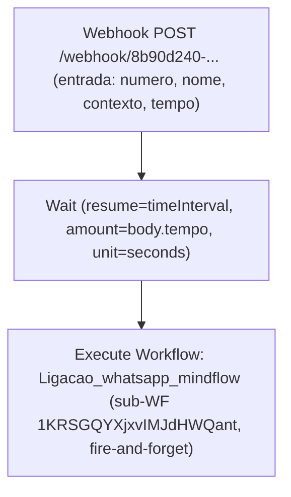

# Workflow: `programa_ligacao_mindflow`

> **Status n8n**: Ativo
> **Trigger**: Webhook (POST)
> **ID n8n**: `kpHlIJlHiDTaUEBr9GtsP`
> **Slug**: `programa-ligacao-mindflow`
> **Versao ativa**: `a61a0cb7-1fbd-4465-9de1-c8ed91c59b5f`
> **Ultima execucao analisada**: `492756` em `2026-05-12T21:08:45Z`
> **Tags**: Mindflow
> **Owner n8n**: Gabriel (gabriel.neves@iatize-ia.com)

---

## Descricao Geral

Workflow minimo (3 nos) que funciona como **agendador/temporizador de ligacao WhatsApp**. Recebe payload via webhook contendo `numero`, `nome`, `contexto` e `tempo` (segundos de espera), aguarda o intervalo informado (no `Wait`) e em seguida dispara o sub-workflow `Ligacao_whatsapp_mindflow` (ID `1KRSGQYXjxvIMJdHWQant`) passando os campos de negocio. O parametro `amount` do `Wait` esta vazio na exportacao (expressao `=`), mas a referencia logica e o campo `body.tempo` recebido no webhook (todas as execucoes analisadas tem `tempo: "0"`, resultando em wait imediato).

E uma camada de **defer/postpone** simples para chamadas WhatsApp, separada do fluxo de ligacoes Retell (call_predict / pre_call_processing). Nao executa ML, nao chama Retell, nao persiste em Supabase.

## Diagrama de Fluxo



> Legenda: Webhook = trigger | Wait = scheduler | Execute Workflow = output/sub-WF call.

## Comunicacao com Outros Workflows

| Direcao | Workflow | Endpoint / Mecanismo | Metodo | Dados Passados |
|---------|----------|----------------------|--------|----------------|
| <- Recebe de | Caller externo (n8n interno, app, ou backend Python) | `POST /webhook/8b90d240-fd18-4302-b0b4-f71c8b7aac52` | POST JSON | `numero`, `nome`, `contexto`, `tempo` |
| -> Chama (sub-WF) | `Ligacao_whatsapp_mindflow` (`1KRSGQYXjxvIMJdHWQant`) | n8n Execute Workflow (in-process) | `executeWorkflow` (waitForSubWorkflow=false, fire-and-forget) | `numero`, `nome`, `contexto` |

### Cross-reference com `call_predict` (Python https://call-predict-github.bkpxmb.easypanel.host)

- **Nao ha evidencia direta** de que o `call_predict` Python chame este webhook nas execucoes analisadas. Os payloads observados (`numero`, `nome`, `contexto`, `tempo`) **divergem** do schema canonico de `call_predict` (`numero`, `agent_id`, `quando_ligar`, etc.).
- O `user-agent: n8n` nas execucoes recentes (e `axios/1.13.5` no pinData) indica que o caller atual e outro **workflow n8n** ou um cliente HTTP generico, NAO o servico Python `call-predict`.
- Provavel: este workflow e um atalho **WhatsApp-only** acionado por workflows de UI/CRM internos. O equivalente Retell+ML segue por `call_predict -> pre_call_processing`.

### Dados de Rastreabilidade

| Campo | Valor / Origem no n8n | Obrigatorio EDW |
|-------|-----------------------|------------------|
| `execution_id` | n8n gera (`492756`, `492711`) | Sim (na migracao) |
| `from_workflow` | **Ausente** no payload do webhook | Sim (a adicionar) |
| `workflow_id` | **Ausente** no payload (n8n usa `kpHlIJlHiDTaUEBr9GtsP` interno) | Sim (a fixar `programa_ligacao_mindflow_v1`) |
| `sub_execution_id` | n8n preenche em `metadata.subExecution.executionId` (ex: `492757`) | Util para correlacao |

> Migracao EDW DEVE introduzir os tres campos canonicos no payload de entrada (ou gera-los na API). Hoje o workflow trabalha cego de rastreabilidade.

## Exemplos de Payload Real (anonimizado)

**Trigger input** (execucao `492756`, 2026-05-12T21:08:45Z):
```json
{
  "headers": {
    "host": "n8n-mcp-n8n.bkpxmb.easypanel.host",
    "user-agent": "n8n",
    "content-type": "application/json",
    "x-forwarded-proto": "https"
  },
  "body": {
    "numero": "+55XX9XXXXXXXX",
    "nome": "<NOME>",
    "contexto": "...",
    "tempo": "0"
  }
}
```

**Saida do no `Call 'Ligacao_whatsapp_mindflow'`** (execucao `492756`):
```json
{
  "numero": "+55XX9XXXXXXXX",
  "nome": "<NOME>",
  "contexto": "...",
  "_subExecution": {
    "executionId": "492757",
    "workflowId": "1KRSGQYXjxvIMJdHWQant"
  }
}
```

> Observacao: o webhook responde `200 OK` imediatamente (modo `onReceived`) sem corpo definido. O sub-workflow roda em fire-and-forget (`waitForSubWorkflow: false`).

## Detalhamento dos Nos

### 1. `Webhook` (Trigger)
- **Tipo n8n**: `n8n-nodes-base.webhook` (v2.1)
- **ID interno**: `73bd4052-5aa6-463c-a61c-8b4c7830dd3a`
- **Webhook ID / Path**: `8b90d240-fd18-4302-b0b4-f71c8b7aac52`
- **Metodo**: POST
- **Auth**: `none` (publico, sem autenticacao no nivel n8n)
- **Response mode**: `onReceived` (responde 200 antes de processar)
- **URL producao**: `https://n8n-mcp-n8n.bkpxmb.easypanel.host/webhook/8b90d240-fd18-4302-b0b4-f71c8b7aac52`
- **Saidas**: -> `Wait`

### 2. `Wait` (Scheduler)
- **Tipo n8n**: `n8n-nodes-base.wait` (v1.1)
- **ID interno**: `afc8a48d-9175-4412-a517-6308afcf68c9`
- **webhookId**: `9829cd4d-d9e6-48ae-8f54-51b31ec28916` (usado quando o resume e via webhook; aqui o resume e timeInterval)
- **Parametros**: `resume: timeInterval`, `unit: seconds`, `amount: =` (expressao vazia na exportacao, sem fallback explicito)
- **Comportamento observado**: como `body.tempo = "0"`, o wait passa imediatamente. Se `tempo` chegasse > 0, o n8n persistiria o run e despertaria via `resumeToken`.
- **Saidas**: -> `Call 'Ligacao_whatsapp_mindflow'`

### 3. `Call 'Ligacao_whatsapp_mindflow'` (Sub-WF / Output)
- **Tipo n8n**: `n8n-nodes-base.executeWorkflow` (v1.3)
- **ID interno**: `f5bc1a58-a112-406b-a81d-0b370cd453bd`
- **Target workflow**: `Ligacao_whatsapp_mindflow` (`1KRSGQYXjxvIMJdHWQant`)
- **Mode**: `once`, source `database`, operation `call_workflow`
- **waitForSubWorkflow**: `false` (fire-and-forget — nao bloqueia, nao recebe retorno do sub-WF)
- **Mapeamento de inputs**:
  - `numero`  <- `$json.body.numero`
  - `nome`    <- `$json.body.nome`
  - `contexto` <- `$json.body.contexto`
- **Atencao**: `tempo` recebido no webhook **nao** e propagado ao sub-WF (so foi usado pelo `Wait`).
- **Saidas**: ultimo no (sem destino).

## Variaveis de Ambiente Utilizadas

Nenhuma `$env.*` referenciada na exportacao do workflow. Toda a configuracao e estatica/inline ou vem do body do webhook.

| Variavel | Uso no Workflow |
|----------|-----------------|
| — | — |

## Credenciais n8n Utilizadas

Nenhum no usa credencial (sem auth no webhook, sub-WF roda in-process).

| Nome da Credencial | Tipo | Nos que Usam |
|--------------------|------|--------------|
| — | — | — |

---

## Migration Brief — Antigravity / Python

> Especificacao para reimplementar este workflow em Python EDW conforme `Usefull_Skills/docs/conventions.md`.

### Camada API (FastAPI)

- **Endpoint sugerido**: `POST /webhook/programa_ligacao_mindflow`
- **Schema Pydantic de entrada** (`schemas.py`):

```python
class ProgramaLigacaoMindflowInput(BaseModel):
    numero: str
    nome: str
    contexto: str
    tempo: int = 0                 # segundos de espera antes do disparo
    # Rastreabilidade EDW (a injetar; ausentes no n8n original)
    workflow_id: str = "programa_ligacao_mindflow_v1"
    from_workflow: Optional[str] = None
    execution_id: Optional[str] = None  # gerado pela API se vier nulo
```

- **Resposta**: `202 Accepted` + `{ "execution_id": <uuid> }`
- **Validacoes**:
  - `tempo >= 0` (rejeitar negativo com 400).
  - `numero` em formato E.164 / digit-only normalizado.
  - Se `tempo > 0`, agendar via `arq.enqueue_job(..., _defer_until=now + tempo)`.
  - Se `tempo == 0`, enfileirar imediato.

### Camada Worker (ARQ)

Mapa no n8n -> step EDW (cada step via `run_step_with_retry`):

| # | n8n node | Step EDW (`programa_ligacao_mindflow_<OQF>`) | I/O | Lib Python | Retries | Async |
|---|----------|----------------------------------------------|-----|------------|---------|-------|
| 1 | Webhook (trigger) | `programa_ligacao_mindflow_validate_input` | in: payload bruto; out: `ProgramaLigacaoMindflowInput` validado + `execution_id` | Pydantic | 0 | sim |
| 2 | Wait | `programa_ligacao_mindflow_agendamento_redis` | in: `tempo`; out: confirmacao de scheduling (imediato vs `_defer_until`) | `arq` + Redis | 0 (job nativo) | sim |
| 3 | Call 'Ligacao_whatsapp_mindflow' | `programa_ligacao_mindflow_dispatch_whatsapp` | in: `numero, nome, contexto, execution_id, from_workflow=programa_ligacao_mindflow_v1`; out: id do job/exec downstream | `httpx.AsyncClient` (POST no proximo WF) ou `arq.enqueue_job` no worker do `Ligacao_whatsapp_mindflow` | 3 | sim |

> O step 2 deve ser registrado em `workflow_step_executions` com status `SUCCESS` e `output_data` contendo `scheduled_for` (ISO 8601 UTC) — conforme conventions.md §Agendamento.

### Comunicacao Externa (Saidas)

- **Downstream**: `Ligacao_whatsapp_mindflow` (sub-workflow n8n hoje). Apos migracao, opcoes:
  1. **Recomendado**: chamar o futuro endpoint Python `/webhook/ligacao_whatsapp_mindflow` via `httpx.AsyncClient().post(...)` enviando `execution_id` + `from_workflow="programa_ligacao_mindflow_v1"`.
  2. Alternativa: `arq.enqueue_job("ligacao_whatsapp_mindflow_entrypoint", ...)` se forem servicos no mesmo cluster Redis.
- **Auth**: enquanto Ligacao_whatsapp_mindflow nao migrar, manter chamada para o webhook n8n existente (`/webhook/<id-ligacao-whatsapp>`) com header `X-API-Key` se o no destino exigir (definir em env).

### Variaveis de Ambiente Necessarias (.env)

| Variavel | Origem n8n | Uso no Python |
|----------|-----------|----------------|
| `REDIS_URL` | — | `RedisSettings.from_dsn(...)` para ARQ (deferral) |
| `SUPABASE_URL` | — | Singleton para `workflow_executions` / `workflow_step_executions` |
| `SUPABASE_SERVICE_KEY` | — | Auth do client supabase |
| `LIGACAO_WHATSAPP_WEBHOOK_URL` | URL do sub-WF n8n / proxima API | Destino do dispatch downstream |
| `LIGACAO_WHATSAPP_WEBHOOK_AUTH` | — (hoje sem auth) | Header se vier a existir |

### Rastreabilidade Obrigatoria (conventions.md)

- `workflow_id`: fixo `programa_ligacao_mindflow_v1`
- `from_workflow`: nome do caller (a aceitar via header `X-From-Workflow` ou body)
- `execution_id`: UUID gerado pela API ao receber o request
- Persistir:
  - `workflow_executions` (master): PENDING -> RUNNING -> SUCCESS/FAILED, `input_data`/`output_data` JSONB.
  - `workflow_step_executions` (detail): um registro por step (`validate_input`, `agendamento_redis`, `dispatch_whatsapp`).

### Pontos de Atencao / Divergencias do EDW

- **Sem rastreabilidade no n8n**: nem `workflow_id`, nem `from_workflow`, nem `execution_id` saem do payload de entrada — migracao DEVE incluir.
- **Sem auth no webhook**: trigger atual e publico (`authentication: none`). Em Python, **exigir** header `X-API-Key` ou Bearer (env var) — bloqueador de seguranca.
- **`Wait` com expressao vazia (`amount: =`)**: na pratica, todas as execucoes vistas usam `tempo: "0"`. Em Python, validar `tempo` como `int` no Pydantic e tratar 0 = enfileirar imediato.
- **`waitForSubWorkflow: false`**: o workflow nao recebe retorno do sub-WF. No EDW, mesmo fire-and-forget, gerar `execution_id` proprio e propagar como `from_workflow` para o downstream — permite cross-join entre as duas tabelas master.
- **`tempo` nao e propagado ao sub-WF**: comportamento intencional do n8n (usado so para o `Wait`). Manter no Python — passar so `numero, nome, contexto, execution_id, from_workflow`.
- **Sem timezone em `tempo`**: como e duracao (segundos relativa), nao se aplica regra de `quando_ligar` com offset. Se um dia trocar para datetime absoluto, exigir TZ (regra conventions.md §Gestao de Tempo).
- **Caller indefinido**: confirmar com o usuario quem dispara o webhook (`user-agent: n8n` -> outro WF; `axios/1.13.5` no pinData -> backend interno?). Documentar antes de migrar.

### Status de Migracao

- [x] Documentado
- [ ] Schemas Pydantic definidos
- [ ] API endpoint implementado
- [ ] Worker steps implementados
- [ ] Validado em ambiente de teste
- [ ] Migrado em producao
