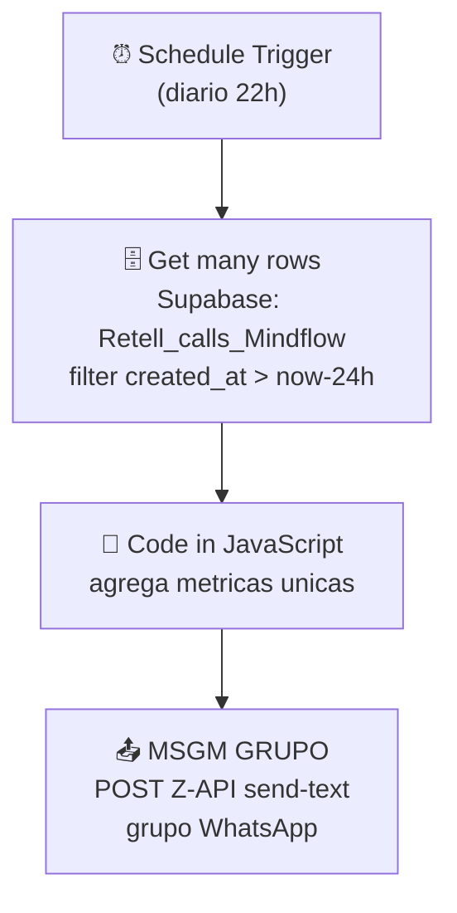

# Workflow: `resultados`

> **Status n8n**: Ativo
> **Trigger**: Schedule (cron diario - 22h, timezone do n8n)
> **ID n8n**: `r433QRk5zIQNfcwAuMN0-`
> **Tag**: `Mindflow`
> **Ultima execucao analisada**: `492993` em `2026-05-13T02:00:29Z` (sucesso, 4.1s)

---

## Descricao Geral

Workflow agendado de **reporting diario** das ligacoes feitas pela MindFlow. Roda 1x por dia (22h), busca todas as linhas inseridas nas ultimas 24h na tabela `Retell_calls_Mindflow` do Supabase, agrega metricas (total de ligacoes unicas, leads unicos, ligacoes com mais de 1 minuto) via codigo JavaScript e envia o resumo em texto para um **grupo do WhatsApp** atraves da API externa Z-API.

E um *report builder / digest builder*, sem efeito colateral em banco e sem comunicacao com outros workflows n8n.

## Diagrama de Fluxo



## Comunicacao com Outros Workflows

| Direcao | Workflow | Endpoint | Metodo | Dados Passados |
|---------|----------|----------|--------|----------------|
| <- Recebe de | _(nenhum)_ | Trigger interno (cron 22h) | - | - |
| -> Envia para | _(nenhum workflow n8n)_ | - | - | - |
| -> Sistema externo | **Z-API (WhatsApp)** | `api.z-api.io/instances/.../send-text` | POST | `phone` (grupo), `message`, `delayTyping` |
| <- Le de | **Supabase** (tabela `Retell_calls_Mindflow`, populada por outros workflows) | - | SELECT | linhas das ultimas 24h |

> Nao ha rastreabilidade EDW (workflow_id / from_workflow / execution_id) no payload — o workflow nao se comunica com outros fluxos da MindFlow e nao registra execucao em nenhuma tabela mestre.

### Dados de Rastreabilidade

| Campo | Valor/Origem | Obrigatorio |
|-------|--------------|-------------|
| `execution_id` | _Nao gerado_ — n8n usa o proprio execution interno | Sera obrigatorio no EDW |
| `from_workflow` | _N/A_ | Sera obrigatorio no EDW |
| `workflow_id` | _N/A_ | Sera obrigatorio (`resultados_v1`) |

## Exemplos de Payload Real (anonimizado)

**Trigger input** (execucao `492993` em `2026-05-13T02:00:29Z`):
```json
{
  "timestamp": "2026-05-12T22:00:29.022-04:00",
  "Readable date": "May 12th 2026, 10:00:29 pm",
  "Day of week": "Tuesday",
  "Hour": "22",
  "Timezone": "America/New_York (UTC-04:00)"
}
```

**Get many rows (Supabase)** — amostra de uma linha entre 155 retornadas:
```json
{
  "id": 174454,
  "created_at": "2026-05-12T12:21:05.698932+00:00",
  "Nome": "<NOME>",
  "Email": "<EMAIL>",
  "data": "12/05/2026 08",
  "Numero": "+55XX9XXXXXXXX",
  "status": "ongoing",
  "call_id": "call_<REDACTED>",
  "agent_id": "agent_<REDACTED>",
  "agent_name": "Agente Gatekeeper Mindflow Disparo",
  "Duracao": null,
  "from_number": "iatizeia",
  "to_number": "+55XX9XXXXXXXX"
}
```

**Code in JavaScript (agregacao)**:
```json
{
  "resumo": "Resumo das ligacoes:\n- Numero total de ligacoes: 155\n- Total de leads: 74\n- Ligacoes com mais de 1 minuto: 0",
  "total_ligacoes": 155,
  "total_leads": 74,
  "ligacoes_maior_1_min": 0
}
```

**MSGM GRUPO (resposta Z-API)**:
```json
{
  "zaapId": "<REDACTED>",
  "messageId": "<REDACTED>",
  "id": "<REDACTED>"
}
```

> Observacao: na execucao analisada, **`ligacoes_maior_1_min = 0`**, embora haja chamadas com `Duracao: "10010"` (10s) e similares. O codigo compara `Duracao > 60000`, mas o campo `Duracao` no Supabase aparenta estar em **milissegundos curtos / segundos** (10010 = 10s, nao 10s em ms ate 60000). Bug provavel — ver "Pontos de Atencao".

## Detalhamento dos Nos

### 1. `Schedule Trigger` (⏰ Trigger)
- **Tipo n8n**: `n8n-nodes-base.scheduleTrigger` (v1.3)
- **Descricao**: Dispara o fluxo diariamente as 22h (timezone do n8n, observada `America/New_York` UTC-04:00 na execucao real — atencao para divergencia com `America/Sao_Paulo` da EDW).
- **Configuracao**: `triggerAtHour: 22`
- **Saidas**: -> `Get many rows`

### 2. `Get many rows` (🗄️ Database / Fetch)
- **Tipo n8n**: `n8n-nodes-base.supabase` (v1)
- **Descricao**: SELECT em `Retell_calls_Mindflow` filtrando `created_at > now - 24h`.
- **Configuracao**:
  - `operation: getAll`
  - `tableId: Retell_calls_Mindflow`
  - `returnAll: true`
  - filtro: `created_at gt {{$now.minus(24, 'hours')}}`
- **Credencial**: `supabase Mindflow`
- **Saidas**: -> `Code in JavaScript` (155 itens na execucao analisada)

### 3. `Code in JavaScript` (🔧 Transform)
- **Tipo n8n**: `n8n-nodes-base.code` (v2)
- **Descricao**: Agrega metricas usando `Set`s para garantir unicidade:
  - `uniqueCallIds` (Set de `call_id`)
  - `uniqueLeads` (Set de `Numero`)
  - `callsOverOneMinute` (contador onde `Duracao > 60000`)
- **Saida**: `{ resumo, total_ligacoes, total_leads, ligacoes_maior_1_min }`
- **Saidas**: -> `MSGM GRUPO`

### 4. `MSGM GRUPO` (📤 Output / External)
- **Tipo n8n**: `n8n-nodes-base.httpRequest` (v4.2)
- **Descricao**: POST para Z-API enviando texto formatado para um grupo do WhatsApp.
- **Configuracao**:
  - URL: `https://api.z-api.io/instances/<INSTANCE>/token/<TOKEN>/send-text`
  - Header: `Client-Token: <REDACTED>` (hardcoded no node — *security smell*)
  - Body: `{ phone: "<GROUP_ID>-group", message: "*Resumo diario*\n{{ $json.resumo }}", delayTyping: 3 }`
- **Saidas**: fim do fluxo

## Variaveis de Ambiente Utilizadas

| Variavel | Uso no Workflow |
|----------|-----------------|
| _(nenhuma)_ | Credenciais Supabase via credencial n8n; instancia/token/Client-Token Z-API **hardcoded** no node HTTP. |

## Credenciais n8n Utilizadas

| Nome da Credencial | Tipo | Nos que Usam |
|--------------------|------|--------------|
| `supabase Mindflow` | `supabaseApi` | Get many rows |

---

## Migration Brief — Antigravity / Python

> Especificacao para o agente do Antigravity reimplementar este workflow em Python conforme `Usefull_Skills/docs/conventions.md` (EDW). **Nenhum codigo Python foi implementado nesta etapa.**

### Camada API (FastAPI)

Workflow nao tem trigger externo — e cron. Duas opcoes:

- **Opcao A (preferida)**: registrar uma cron `arq` (via `cron_jobs` na `WorkerSettings`) que enfileira o job todo dia as 22h `America/Sao_Paulo`. Sem endpoint HTTP.
- **Opcao B**: expor `POST /webhook/resultados/run` para disparo manual (debug), respondendo `202 Accepted` e enfileirando o mesmo job. Util para testes.

- **Schema Pydantic de entrada** (`schemas.py`):

```python
class ResultadosInput(BaseModel):
    janela_horas: int = 24
    # Opcional: permite override de janela em disparos manuais.
```

- **Resposta**: `202 Accepted` + `execution_id`

### Camada Worker (ARQ)

Mapa no n8n -> step EDW (cada step executa via `run_step_with_retry`):

| # | n8n node | Step EDW (`resultados_<OQF>`) | I/O | Lib Python | Retries | Async? |
|---|----------|-------------------------------|-----|------------|---------|--------|
| 1 | Schedule Trigger | `resultados_agendamento_cron` | in: -; out: `janela_horas`, `execution_id` | `arq` cron | 0 | sim |
| 2 | Get many rows | `resultados_fetch_calls_24h` | in: `janela_horas`; out: `List[CallRow]` | `supabase` singleton | 3 | sim |
| 3 | Code in JavaScript | `resultados_agregar_metricas` | in: `List[CallRow]`; out: `MetricsSummary` | puro Python (sets) | 0 | sim |
| 4 | MSGM GRUPO | `resultados_enviar_whatsapp_grupo` | in: `MetricsSummary`; out: `{zaapId, messageId}` | `httpx.AsyncClient` | 3 | sim |

### Comunicacao Externa (Saidas)

| Servico | URL | Metodo | Auth | Payload | Retorno |
|---------|-----|--------|------|---------|---------|
| Supabase | `${SUPABASE_URL}/rest/v1/Retell_calls_Mindflow` | GET | Bearer (`SUPABASE_KEY`) | filtro `created_at=gt.<iso>` | array de rows |
| Z-API (WhatsApp) | `https://api.z-api.io/instances/${ZAPI_INSTANCE}/token/${ZAPI_TOKEN}/send-text` | POST | header `Client-Token: ${ZAPI_CLIENT_TOKEN}` | `{ phone, message, delayTyping }` | `{ zaapId, messageId, id }` |

### Variaveis de Ambiente Necessarias (.env)

| Variavel | Origem n8n | Uso no Python |
|----------|------------|---------------|
| `SUPABASE_URL` | credencial `supabase Mindflow` | client singleton |
| `SUPABASE_KEY` | credencial `supabase Mindflow` | client singleton |
| `ZAPI_INSTANCE` | hardcoded na URL do node `MSGM GRUPO` | montar URL |
| `ZAPI_TOKEN` | hardcoded na URL do node `MSGM GRUPO` | montar URL |
| `ZAPI_CLIENT_TOKEN` | hardcoded no header `Client-Token` | header HTTP |
| `WHATSAPP_GROUP_ID_RESULTADOS` | hardcoded no body (`120363424280785137-group`) | body `phone` |
| `REDIS_URL` | n/a | `RedisSettings.from_dsn(...)` (arq) |
| `TZ_REPORT` (opcional) | n/a (cron rodava em UTC-04) | `America/Sao_Paulo` na EDW |

### Rastreabilidade Obrigatoria (conventions.md)

- `workflow_id`: `resultados_v1`
- `from_workflow`: `cron` (ou `manual` em disparos via endpoint debug)
- `execution_id`: UUID gerado no enqueue do cron job
- Persistir em: `workflow_executions` (master) + `workflow_step_executions` (detail), uma entrada por step (`resultados_fetch_calls_24h`, `resultados_agregar_metricas`, `resultados_enviar_whatsapp_grupo`).

### Pontos de Atencao / Divergencias do EDW

- **Bug semantico provavel no contador `ligacoes_maior_1_min`**: o codigo compara `Duracao > 60000`, mas pelos dados o campo `Duracao` parece estar em **segundos** (ex: `10010` para chamadas de poucos segundos) ou unidade nao-padronizada. Resultado real: `ligacoes_maior_1_min: 0` em 155 ligacoes. Validar unidade do `Duracao` na tabela `Retell_calls_Mindflow` antes de migrar e definir o threshold correto (provavelmente `> 60` se segundos).
- **Credenciais Z-API hardcoded no JSON do workflow**: instance, token e `Client-Token` estao em texto puro no node `MSGM GRUPO`. Na migracao **todos** devem virar env vars. Recomendar rotacao apos migracao (estavam expostos).
- **Timezone**: cron do n8n disparou em `America/New_York` (UTC-04:00) na execucao real, mas a EDW exige `America/Sao_Paulo`. Confirmar com o usuario o horario alvo desejado (22h Brasilia? 22h NY?) — afeta a janela de 24h e o conteudo do report.
- **`returnAll: true` sem paginacao explicita**: o nó Supabase do n8n carrega tudo em memoria. Em Python, usar paginacao via `range()` no PostgREST ou `.execute()` cuidando do limite default de 1000 linhas. Hoje 155 cabe, mas escalar quebra silenciosamente.
- **Sem rastreabilidade no n8n**: nao ha registro em `workflow_executions`. Na migracao, **obrigatorio** criar o registro mestre no inicio e atualizar em cada step (proibido `BackgroundTasks` FastAPI).
- **Stack proibida**: nao usar `requests`, `Flask`, `time.sleep`, `BackgroundTasks`, `APScheduler`. Cron via `arq cron_jobs`; HTTP via `httpx.AsyncClient`; banco via singleton `supabase`.

### Status de Migracao

- [x] Documentado
- [ ] Schemas Pydantic definidos
- [ ] API endpoint / cron job implementado
- [ ] Worker steps implementados
- [ ] Validado em ambiente de teste
- [ ] Migrado em producao
