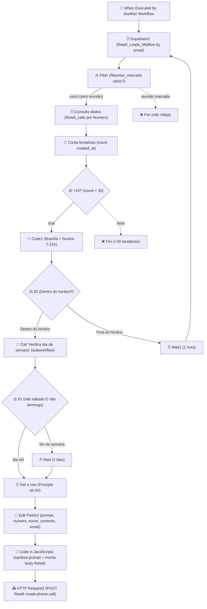

# Workflow: `retentativa_mindflow_disparo`

> **Status n8n**: Ativo
> **Trigger**: Execute Workflow (chamado por outro workflow n8n)
> **ID n8n**: `UUWtrT5gnevKHt1p`
> **Última execução analisada**: `494008` em `2026-05-13T22:37:10Z` (sucesso)
> **Tags**: `Mindflow`

---

## Descrição Geral

Workflow de **retentativa do fluxo de disparo (outbound Retell AI)** para a Mindflow. Acionado por outro workflow (geralmente `webhook_ligacao_mindflow_disparo` — `mMC4xqHJMyTTQmZe`, evento `call_analyzed`) quando uma ligação não foi atendida / não conectou. O fluxo decide se deve religar com base em:

1. Lead ainda **não tem reunião marcada** (filtro em `Retell_Leads_Midflow`).
2. **Total de tentativas anteriores** para o `Numero` é menor que 30.
3. Está **dentro do horário comercial** (07h–21h Brasília).
4. **Não é final de semana** (verifica via subworkflow `Verifica dia da semana`).
5. Se fora do horário, aguarda **1 hora** (`Wait1`) e reavalia.
6. Se for fim de semana, aguarda **2 dias** (`Wait`).

Quando todas as condições passam, busca o **prompt id=24** em `Prompts`, monta payload Retell com variáveis dinâmicas (customer_name, prompt, contexto, email) e dispara `POST https://api.retellai.com/v2/create-phone-call` para o agente `agent_1e4cfa23e3910c557d82167949` (Agente Mindflow Disparo).

## Diagrama de Fluxo



## Comunicação com Outros Workflows

| Direção | Workflow | ID | Endpoint / Tipo | Método | Dados Passados |
|---------|----------|----|------|--------|----------------|
| ← Recebe de | `webhook_ligacao_mindflow_disparo` | `mMC4xqHJMyTTQmZe` | Execute Workflow Trigger | n8n internal | `evento`, `Nome`, `Email`, `data`, `Numero`, `status`, `disconnection_reason` |
| → Chama (sub) | `Verifica dia da semana` | `2pXT7Evf-O6uBdPIJO7dm` | Execute Workflow | n8n internal | `dia` (now) → retorna `diaSemana` |
| → Envia para | **Retell AI** (externo) | — | `POST https://api.retellai.com/v2/create-phone-call` | POST | `from_number`, `to_number`, `override_agent_id`, `retell_llm_dynamic_variables`, `custom_sip_headers` |
| 🗄️ Lê de | Supabase `Retell_Leads_Midflow` | — | `eq email_lead = Email` | SELECT | — |
| 🗄️ Lê de | Supabase `Retell_calls_Mindflow` | — | `eq Numero = Numero` | SELECT | — |
| 🗄️ Lê de | Supabase `Prompts` | — | `id = 24` | SELECT | — |

### Dados de Rastreabilidade

| Campo | Valor/Origem | Obrigatório |
|-------|-------------|-------------|
| `execution_id` | ❌ **Não existe no payload**. n8n gera implícito (`494008`). | ⚠️ ausente |
| `from_workflow` | ❌ Implícito via `parentExecution.workflowId`. | ⚠️ ausente |
| `workflow_id` | ❌ Não propagado. | ⚠️ ausente |
| `Numero` / `Email` | Chave de negócio | ✅ |
| `agent_id` | Hardcoded `agent_1e4cfa23e3910c557d82167949` | ✅ |
| `parent execution_id` | Capturado pelo n8n em `metadata.parentExecution` (ex: `494005` do webhook `mMC4xqHJMyTTQmZe`) | ✅ (n8n) |

## Exemplos de Payload Real (anonimizado)

**Trigger input** (execução `494008`, do parent `494005` em `mMC4xqHJMyTTQmZe`):

```json
{
  "evento": "call_analyzed",
  "Nome": "<NOME>",
  "Email": "<EMAIL>",
  "data": "2026-05-13T18:37:10.362-04:00",
  "Numero": "+55XX9XXXXXXXX",
  "status": "Primeiro contato. Nome da empresa: <EMPRESA>\nSegmento: <SEGMENTO>. Você já tentou contato com esta pessoa e não obteve sucesso, não mencione isso no inicio da ligação, apenas se usuário mencionar.",
  "disconnection_reason": "dial_no_answer"
}
```

**Body montado para Retell** (`Code in JavaScript1` → `HTTP Request2`):

```json
{
  "from_number": "iatizeia",
  "to_number": "+55XX9XXXXXXXX",
  "override_agent_id": "agent_1e4cfa23e3910c557d82167949",
  "metadata": {},
  "retell_llm_dynamic_variables": {
    "customer_name": "<NOME>.",
    "prompt": "<prompt sanitizado, sem quebras/markdown>",
    "now": "2026-05-13T22:37:10.000Z",
    "contexto": "<status>. Você já tentou contato com esta pessoa e não obteve sucesso, não mencione isso no inicio da ligação, apenas se usuário mencionar.",
    "email": "<EMAIL>",
    "numero_do_lead": "+55XX9XXXXXXXX"
  },
  "custom_sip_headers": { "X-Custom-Header": "Custom Value" }
}
```

**Conta tentativas** (execução real — note que o caso disparou 30, mas o IF é `<30` → não religaria; provavelmente o branch true não foi seguido):

```json
{ "count_created_at": 30 }
```

## Detalhamento dos Nós

### 1. `When Executed by Another Workflow` (🔵 Trigger)
- **Tipo n8n**: `n8n-nodes-base.executeWorkflowTrigger` (v1.1)
- **Descrição**: Entrada chamada por outro workflow n8n (não é webhook HTTP).
- **Inputs declarados**: `evento`, `Nome`, `Email`, `data`, `Numero`, `status`, `disconnection_reason`.
- **Saídas**: → `Supabase2`.

### 2. `Supabase2` (🗄️ Database — Read)
- **Tipo n8n**: `n8n-nodes-base.supabase` (v1) | tabela `Retell_Leads_Midflow`.
- **Descrição**: Busca o lead por `email_lead = $json.Email`. Operation `get`.
- **alwaysOutputData**: true (mesmo sem registro, segue adiante).
- **Credencial**: `supabase Mindflow`.
- **Saídas**: → `Filter`.

### 3. `Filter` (⚖️ Decision)
- **Tipo n8n**: `n8n-nodes-base.filter` (v2.2).
- **Descrição**: Mantém apenas se `Reuniao_marcada` estiver **vazio**. Se o lead já marcou reunião, o item é descartado (sem religar).
- **Saídas**: → `Consulta dados` (única saída — itens reprovados não seguem).

### 4. `Consulta dados` (🗄️ Database — Read)
- **Tipo n8n**: `n8n-nodes-base.supabase` (v1) | tabela `Retell_calls_Mindflow`.
- **Descrição**: `getAll` filtrando por `Numero = trigger.Numero` (todas as tentativas anteriores do número).
- **Saídas**: → `Conta tentativas`.

### 5. `Conta tentativas` (🔧 Transform)
- **Tipo n8n**: `n8n-nodes-base.summarize` (v1.1).
- **Descrição**: Conta quantas linhas (`count_created_at`) — total de tentativas para o número.
- **Saídas**: → `<15?`.

### 6. `<15?` (⚖️ Decision)
- **Tipo n8n**: `n8n-nodes-base.if` (v2.2).
- **Descrição**: Condição `count_created_at < 30` (apesar do nome do nó dizer "15", o limiar real é 30).
- **Saídas**: true → `Code1`; false → fim (não religa).

### 7. `Code1` (🔧 Transform — JS)
- **Tipo n8n**: `n8n-nodes-base.code` (v2, `runOnceForEachItem`).
- **Descrição**: Calcula hora atual em America/Sao_Paulo. Adiciona `dataHoraBrasilia` (string `dd/MM/yyyy HH:mm`) e `resultado = "Dentro do horário"` se `7 <= hora < 21`, senão `"Fora do horário"`.
- **Saídas**: → `If2`.

### 8. `If2` (⚖️ Decision — janela horária)
- **Tipo n8n**: `n8n-nodes-base.if` (v2.2).
- **Descrição**: `resultado == "Dentro do horário"`?
- **Saídas**: true → `Call 'Verifica dia da semana'`; false → `Wait1`.

### 9. `Wait1` (⏰ Wait — fora do horário)
- **Tipo n8n**: `n8n-nodes-base.wait` (v1.1, `unit=hours`, default 1h).
- **Descrição**: Aguarda **1 hora** e retorna para `Supabase2` (reavalia tudo — lead, contagem, horário). Loop de re-checagem.
- **webhookId**: `3938ba9b-063f-4e47-a1e6-7d023ea8eaa2` (resume URL).
- **Saídas**: → `Supabase2`.

### 10. `Call 'Verifica dia da semana'` (🔁 Sub-workflow)
- **Tipo n8n**: `n8n-nodes-base.executeWorkflow` (v1.3).
- **Workflow chamado**: `2pXT7Evf-O6uBdPIJO7dm` (`Verifica dia da semana`).
- **Entrada**: `dia = {{$now}}`. Retorna `diaSemana` (string, ex: `"terça-feira"`, `"sábado"`).
- **Saídas**: → `If1`.

### 11. `If1` (⚖️ Decision — dia útil)
- **Tipo n8n**: `n8n-nodes-base.if` (v2.3, combinator AND).
- **Descrição**: `diaSemana != "sábado"` AND `diaSemana != "domingo"`.
- **Saídas**: true → `Get a row`; false → `Wait` (2 dias).

### 12. `Wait` (⏰ Wait — fim de semana)
- **Tipo n8n**: `n8n-nodes-base.wait` (v1.1, `amount=2 days`).
- **Descrição**: Aguarda **2 dias** e segue para `Get a row` (não reavalia horário/lead — assume que após 2 dias é seg/ter útil).
- **webhookId**: `5aa73e3a-c94a-4c44-ba81-eaeb7b8876c3`.
- **Saídas**: → `Get a row`.

### 13. `Get a row` (🗄️ Database — Read prompt)
- **Tipo n8n**: `n8n-nodes-base.supabase` (v1) | tabela `Prompts`, `id = 24`.
- **Descrição**: Busca o template de prompt fixo (`Ligação/txt`) para o disparo de retentativa.
- **Saídas**: → `Edit Fields2`.

### 14. `Edit Fields2` (🔧 Set)
- **Tipo n8n**: `n8n-nodes-base.set` (v3.4).
- **Descrição**: Monta variáveis para o body Retell:
  - `prompt` = `$json["Ligação/txt"]`
  - `numero` = trigger.Numero
  - `nome` = `Consulta dados.last().Nome` + `.` (do último registro Retell_calls)
  - `contexto` = `trigger.status` + sufixo "Você já tentou contato...".
  - `email` = trigger.Email.
- **Saídas**: → `Code in JavaScript1`.

### 15. `Code in JavaScript1` (🔧 Transform — JS)
- **Tipo n8n**: `n8n-nodes-base.code` (v2).
- **Descrição**: Sanitiza `prompt` (remove `\n`, `` ` ``, `*`, `_`, `~`, `#`, `>`, troca `"` por `'`) e constrói `body` final para Retell com `from_number=iatizeia`, `override_agent_id=agent_1e4cfa23e3910c557d82167949`, `retell_llm_dynamic_variables` e `custom_sip_headers`.
- **Saídas**: → `HTTP Request2`.

### 16. `HTTP Request2` (📤 Output — Retell)
- **Tipo n8n**: `n8n-nodes-base.httpRequest` (v4.2).
- **Descrição**: `POST https://api.retellai.com/v2/create-phone-call`. Header `Authorization: Bearer <RETELL_API_KEY>` (hoje **hardcoded no JSON** — issue de segurança).
- **Body**: `={{ $json.body }}`.
- **Saídas**: nenhuma (terminal).

## Variáveis de Ambiente Utilizadas

| Variável | Uso no Workflow |
|----------|-----------------|
| `RETELL_API_KEY` | (HOJE hardcoded `Bearer key_...` em `HTTP Request2`) — deve virar env var. |
| `SUPABASE_URL` / `SUPABASE_KEY` | Via credencial `supabase Mindflow` (3 nós Supabase). |

## Credenciais n8n Utilizadas

| Nome da Credencial | Tipo | Nós que Usam |
|--------------------|------|--------------|
| `supabase Mindflow` (id `xPgzw7ayw9gmHNlh`) | `supabaseApi` | `Supabase2`, `Consulta dados`, `Get a row` |
| (nenhuma — chave hardcoded) | HTTP Bearer | `HTTP Request2` ⚠️ |

---

## 🚀 Migration Brief — Antigravity / Python

> Especificação para reimplementação em Python conforme `Usefull_Skills/docs/conventions.md` (EDW).

### Camada API (FastAPI)

- **Endpoint sugerido**: `POST /workflow/retentativa-mindflow-disparo` (chamado por outro worker/endpoint da Mindflow, não pelo Retell diretamente).
- **Schema Pydantic de entrada** (`schemas.py`):

```python
class RetentativaMindflowDisparoInput(BaseModel):
    evento: Literal["call_analyzed"]
    nome: Optional[str] = Field(None, alias="Nome")
    email: EmailStr = Field(..., alias="Email")
    data: datetime               # ISO 8601 com timezone offset (validar!)
    numero: str = Field(..., alias="Numero")
    status: str
    disconnection_reason: Optional[str] = None

    # Rastreabilidade obrigatória (conventions.md)
    from_workflow: Optional[str] = None
    parent_execution_id: Optional[UUID] = None
```

- **Resposta**: `202 Accepted` + `{ "execution_id": UUID }`.
- **Validações**: `data` precisa de timezone offset; `numero` formato E.164; `email` válido.
- A API persiste master `workflow_executions` (status `PENDING`) e enfileira via `arq.enqueue_job("retentativa_mindflow_disparo_orchestrator", ...)`.

### Camada Worker (ARQ)

Mapa nó n8n → step EDW (`{workflow}_{OQF}`), executados via `run_step_with_retry`:

| # | n8n node | Step EDW | I/O | Lib Python | Retries | Async? |
|---|----------|----------|-----|------------|---------|--------|
| 1 | `Supabase2` | `retentativa_mindflow_disparo_fetch_lead` | in: email → out: lead row (Reuniao_marcada) | `supabase` singleton | 3 | sim |
| 2 | `Filter` | `retentativa_mindflow_disparo_check_meeting` | decide se aborta (Reuniao_marcada != None → SKIPPED + master FAILED/SKIPPED) | puro | 0 | sim |
| 3 | `Consulta dados` | `retentativa_mindflow_disparo_fetch_call_history` | in: numero → out: lista calls | `supabase` | 3 | sim |
| 4 | `Conta tentativas` | `retentativa_mindflow_disparo_count_attempts` | in: calls → out: count | puro | 0 | sim |
| 5 | `<15?` | `retentativa_mindflow_disparo_check_max_attempts` | aborta se count >= 30 | puro | 0 | sim |
| 6 | `Code1` + `If2` | `retentativa_mindflow_disparo_check_business_hours` | usa `get_br_now()`; in: now → out: dentro_horario bool | `zoneinfo` | 0 | sim |
| 7 | `Wait1` (1h, fora do horário) | `retentativa_mindflow_disparo_defer_outside_hours` | **`arq.enqueue_job("retentativa_mindflow_disparo_orchestrator", _defer_until=now+1h)`** e termina | arq | 0 | sim |
| 8 | `Call 'Verifica dia da semana'` + `If1` | `retentativa_mindflow_disparo_check_weekday` | usa `get_br_now().weekday()`; out: is_weekday | puro | 0 | sim |
| 9 | `Wait` (2 dias, fim de semana) | `retentativa_mindflow_disparo_defer_weekend` | **`arq.enqueue_job("retentativa_mindflow_disparo_dispatch", _defer_until=now+2d)`** (pula direto pro disparo após 2 dias) | arq | 0 | sim |
| 10 | `Get a row` | `retentativa_mindflow_disparo_fetch_prompt` | in: id=24 → out: prompt text | `supabase` | 3 | sim |
| 11 | `Edit Fields2` + `Code in JavaScript1` | `retentativa_mindflow_disparo_build_retell_payload` | sanitiza prompt + monta body | puro | 0 | sim |
| 12 | `HTTP Request2` | `retentativa_mindflow_disparo_create_retell_call` | POST Retell → out: call_id | `httpx.AsyncClient` | 3 | sim |

### Comunicação Externa (Saídas)

- **Retell AI**: `POST https://api.retellai.com/v2/create-phone-call` | Header `Authorization: Bearer ${RETELL_API_KEY}` | body conforme exemplo acima | retorno esperado `{ call_id: str, ... }` (200).
- **Supabase**: 3 leituras (`Retell_Leads_Midflow`, `Retell_calls_Mindflow`, `Prompts`). Sem escrita direta neste workflow — escrita acontece em `workflow_executions`/`workflow_step_executions`.

### Variáveis de Ambiente Necessárias (.env)

| Variável | Origem n8n | Uso no Python |
|----------|-----------|----------------|
| `RETELL_API_KEY` | (hardcoded em `HTTP Request2`) | header `Authorization: Bearer` |
| `RETELL_AGENT_ID_DISPARO` | hardcoded `agent_1e4cfa23e3910c557d82167949` | `override_agent_id` |
| `RETELL_FROM_NUMBER` | hardcoded `iatizeia` | `from_number` |
| `RETELL_PROMPT_ID` | hardcoded `24` | filtro Supabase Prompts |
| `RETELL_MAX_ATTEMPTS` | hardcoded `30` | limite em `check_max_attempts` |
| `SUPABASE_URL` / `SUPABASE_KEY` | credencial `supabase Mindflow` | client singleton |
| `REDIS_URL` | infra Easypanel | `RedisSettings.from_dsn(...)` ARQ |

### Rastreabilidade Obrigatória (conventions.md)

- `workflow_id`: fixo `retentativa_mindflow_disparo_v1`.
- `from_workflow`: `webhook_ligacao_mindflow_disparo` (recebido no payload — hoje não vem; **incluir no contrato**).
- `execution_id`: UUID gerado pela API ao criar `workflow_executions`.
- `parent_execution_id`: UUID da execução do workflow chamador.
- Persistir: `workflow_executions` (master) + um `workflow_step_executions` por step (incluindo os `_defer_*`).

### Pontos de Atenção / Divergências do EDW

- **CRÍTICO — Wait/Defer**: dois nós `Wait` (`Wait1` = 1h e `Wait` = 2d). Em EDW **proibido** `time.sleep`. Cada Wait vira `arq.enqueue_job(..., _defer_until=<dt>)`. **`Wait1` precisa re-enfileirar o orquestrador completo** (volta a `Supabase2` — reavalia lead/contagem/horário), enquanto **`Wait` (fim de semana) pula direto para `fetch_prompt` + disparo** (não reavalia). Persistir em `workflow_step_executions` o ato de agendar (`agendamento_redis`-like), conforme conventions §⏰.
- **Loop infinito possível**: `Wait1 → Supabase2 → ... → If2 (Fora) → Wait1`. Se algo ficar permanentemente fora do horário, loop continua. Proteger com limite (já existe via `count_attempts < 30`, mas o Wait1 não incrementa contador). **Adicionar TTL absoluto** (ex: aborta se `parent_data + 7d`).
- **Segurança**: Token Retell hardcoded no JSON do n8n → mover para `RETELL_API_KEY` (env var) imediatamente.
- **Inconsistência de naming**: nó `<15?` faz `< 30`. Em Python documentar como `check_max_attempts` (30) e remover ambiguidade.
- **Anti-deadlock**: `Filter` descarta itens sem propagar — em Python, virar `SKIPPED` explícito no step + master `SUCCESS` com `output_data = { skipped_reason: "meeting_already_scheduled" }`. **Não silenciar**.
- **`Conta tentativas` + `<15?` com count=30**: na execução real `494008`, count veio `30` → IF é `<30` (false) → não religa. Confirmar com produto se o limite é estrito (`< 30`) ou (`<= 30`).
- **Rastreabilidade ausente**: o trigger não recebe `execution_id`/`from_workflow` do chamador. Em Python, contrato precisa exigir esses campos no body do POST.
- **`Edit Fields2.nome`** concatena `.` no final do nome ("Nome.") — possível erro do n8n para o agente Retell pronunciar. Validar com produto antes de replicar.
- **Sanitização de prompt**: regex remove `\n`, markdown e troca `"` por `'` — replicar idêntico em `build_retell_payload` para paridade comportamental.
- **Subworkflow `Verifica dia da semana`** (`2pXT7Evf-O6uBdPIJO7dm`): documentar separadamente; em Python provavelmente nem precisa — `get_br_now().weekday()` resolve direto.

### Status de Migração

- [x] Documentado
- [ ] Schemas Pydantic definidos
- [ ] API endpoint implementado
- [ ] Worker steps implementados (atenção especial aos 2 nós Wait → `_defer_until`)
- [ ] Subworkflow `Verifica dia da semana` absorvido (`get_br_now().weekday()`)
- [ ] `RETELL_API_KEY` movido para env var
- [ ] Validado em ambiente de teste
- [ ] Migrado em produção
