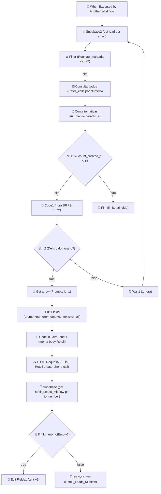

# Workflow: `retentativa_mindflow`

> **Status n8n**: Ativo
> **Trigger**: Execute Workflow Trigger (chamado por outro workflow)
> **ID n8n**: `B_AOhnNcx8fvQZusnu9N0`
> **Tag**: Mindflow
> **Versao**: `950d20d7-96e4-4f5e-afa0-c3e417ba0661` (publicada em 2026-03-16)
> **Ultima execucao analisada**: `485095` em `2026-05-06T14:13:43Z` (chamada pelo parent workflow `E4KkBa9_ECTmg2wNyxlzj` - execucao `485086`)

---

## Descricao Geral

Workflow responsavel por **executar a retentativa de ligacao** quando a tentativa anterior falhou (ex: `dial_no_answer`, `voicemail_reached`). Recebe o lead via Execute Workflow Trigger, valida no Supabase se ainda nao houve reuniao marcada, conta quantas tentativas ja existem (limite < 15), verifica se o horario corrente em Brasilia esta dentro da janela 9h-19h e, se sim, busca o prompt, monta o payload no formato Retell AI e dispara a ligacao via `POST /v2/create-phone-call`. Se estiver fora do horario, **aguarda 1h** e re-executa o ciclo (loop por meio de re-entrada no Supabase2). Diferente do `retentativa_mindflow_disparo` (`UUWtrT5gnevKHt1p`), este fluxo nao apenas enfileira: ele tambem realiza a chamada ao Retell.

## Diagrama de Fluxo



## Comunicacao com Outros Workflows

| Direcao | Workflow | Endpoint / Mecanismo | Metodo | Dados Passados |
|---------|----------|----------------------|--------|----------------|
| <- Recebe de | `call_analyzer` (parent `E4KkBa9_ECTmg2wNyxlzj`) | Execute Workflow Trigger interno do n8n | n/a | `evento`, `Nome`, `Email`, `data`, `Numero`, `status`, `disconnection_reason` |
| -> Envia para | Retell AI (externo) | `https://api.retellai.com/v2/create-phone-call` | POST | `from_number`, `to_number`, `override_agent_id`, `retell_llm_dynamic_variables` |
| -> Escreve em | Supabase `Retell_Leads_Midflow` | tabela | INSERT/UPDATE | `email_lead`, `tentativas`, `Data_horario_ligação`, `Nome`, `Numero` |
| -> Le de | Supabase `Retell_calls_Mindflow` | tabela | SELECT | filtra por `Numero` |
| -> Le de | Supabase `Prompts` | tabela | SELECT | filtra por `id=1` |

### Dados de Rastreabilidade

| Campo | Valor/Origem | Obrigatorio |
|-------|--------------|-------------|
| `execution_id` n8n | Gerado pelo n8n (ex: `485095`) | propagado via `parentExecution.executionId` |
| `from_workflow` | nao consta no payload (n8n usa `parentExecution`) | a adicionar no migration (EDW) |
| `workflow_id` | sem campo explicito; usar constante `retentativa_mindflow_v1` na migracao | a adicionar |
| `Numero` (lead) | Vem do parent | Sim |
| `Email` (lead) | Vem do parent | Sim |

## Exemplos de Payload Real (anonimizado)

**Trigger input** (execucao `485095`, parent `485086` em `E4KkBa9_ECTmg2wNyxlzj`):
```json
{
  "evento": "call_analyzed",
  "Email": "<EMAIL>",
  "data": "2026-05-06T10:13:43.275-04:00",
  "Numero": "+55XX9XXXXXXXX",
  "status": "not_connected. Você já tentou contato com esta pessoa e não obteve sucesso, não mencione isso no inicio da ligação, apenas se usuário mencionar.",
  "disconnection_reason": "dial_no_answer"
}
```

**Supabase2 output (lead)**:
```json
{
  "id": 1727,
  "email_lead": "<EMAIL>",
  "tentativas": "1",
  "Reuniao_marcada": null,
  "Nome": "<NOME>",
  "Numero": "+55XX9XXXXXXXX",
  "Data_horario_ligação": "2026-05-05T13:53:23.598-04:00"
}
```

**Payload final enviado ao Retell (Code in JavaScript1 -> HTTP Request2)**:
```json
{
  "from_number": "iatizeia",
  "to_number": "+55XX9XXXXXXXX",
  "override_agent_id": "agent_2117bcaaf68e8b7cc8e0d160f7",
  "metadata": {},
  "retell_llm_dynamic_variables": {
    "customer_name": "<NOME>.",
    "prompt": "<conteudo de Prompts.id=1, sanitizado>",
    "now": "2026-05-06T14:13:46.000Z",
    "contexto": "not_connected. Você já tentou contato com esta pessoa...",
    "email": "<EMAIL>",
    "numero_do_lead": "+55XX9XXXXXXXX"
  },
  "custom_sip_headers": { "X-Custom-Header": "Custom Value" }
}
```

## Detalhamento dos Nos

### 1. `When Executed by Another Workflow` (🔵 Trigger)
- **Tipo n8n**: `n8n-nodes-base.executeWorkflowTrigger` v1.1
- Recebe campos do workflow chamador: `evento`, `Nome`, `Email`, `data`, `Numero`, `status`, `disconnection_reason`.
- Sem auth proprio - confia no chamador interno.
- **Saidas**: -> `Supabase2`.

### 2. `Supabase2` (🗄️ Database)
- **Tipo**: `n8n-nodes-base.supabase` v1, `get` em `Retell_Leads_Midflow` por `email_lead = {{$json.Email}}`.
- Recupera o registro do lead para verificar status atual (especialmente `Reuniao_marcada`).
- `alwaysOutputData: true` - segue mesmo sem match.
- **Saidas**: -> `Filter`.

### 3. `Filter` (⚖️ Decision)
- **Tipo**: `n8n-nodes-base.filter` v2.2.
- Mantem apenas itens onde `Reuniao_marcada` esta vazia (lead ainda sem reuniao agendada).
- Se tem reuniao, descarta - encerra o fluxo silenciosamente.
- **Saidas**: -> `Consulta dados`.

### 4. `Consulta dados` (🗄️ Database)
- **Tipo**: `supabase` v1 - `getAll` em `Retell_calls_Mindflow` filtrando `Numero = {{$('When Executed by Another Workflow').item.json.Numero}}`.
- Retorna todas as tentativas/registros de chamada para esse numero.
- **Saidas**: -> `Conta tentativas`.

### 5. `Conta tentativas` (🔧 Transform)
- **Tipo**: `n8n-nodes-base.summarize` v1.1 - agrega por `count` em `created_at`.
- Produz `count_created_at` = quantidade total de eventos de chamada para o lead.
- **Saidas**: -> `<15?`.

### 6. `<15?` (⚖️ Decision)
- **Tipo**: `if` v2.2 - `count_created_at < 15`.
- Hard cap de 15 eventos historicos para evitar retentativas infinitas.
- Falso -> sai do fluxo sem fazer nada. True -> `Code1`.

### 7. `Code1` (🔧 Transform / JS)
- **Tipo**: `code` v2, `runOnceForEachItem`.
- Calcula `dataHoraBrasilia` e classifica `resultado` como "Dentro do horario" (9 <= h < 19, America/Sao_Paulo) ou "Fora do horario".
- **Saidas**: -> `If2`.

### 8. `If2` (⚖️ Decision)
- **Tipo**: `if` v2.2 - `resultado == "Dentro do horario"`.
- True -> segue para buscar prompt e ligar. False -> `Wait1`.

### 9. `Wait1` (⏰ Wait/Schedule)
- **Tipo**: `wait` v1.1, unidade `hours` (default 1h).
- `webhookId: 3938ba9b-063f-4e47-a1e6-7d023ea8eaa2` (resume via webhook do n8n).
- **CRITICO** na migracao EDW: vira `arq.enqueue_job(..., _defer_until=now+1h)`.
- **Saidas**: -> `Supabase2` (reentra no ciclo, re-valida estado do lead).

### 10. `Get a row` (🗄️ Database)
- **Tipo**: `supabase` v1, `get` em `Prompts` por `id = 1`.
- Busca o texto base da ligacao (campo `Ligação/txt`).
- **Saidas**: -> `Edit Fields2`.

### 11. `Edit Fields2` (🔧 Transform)
- **Tipo**: `set` v3.4.
- Monta variaveis: `prompt` (do Prompts), `numero` (do trigger), `nome` (do Consulta dados), `contexto` (concat `status` + frase fixa), `email` (do trigger).
- **Saidas**: -> `Code in JavaScript1`.

### 12. `Code in JavaScript1` (🔧 Transform)
- **Tipo**: `code` v2.
- Limpa o prompt (`\r\n`, markdown chars), monta `item.json.body` com `from_number: 'iatizeia'`, `to_number`, `override_agent_id: 'agent_2117bcaaf68e8b7cc8e0d160f7'` e `retell_llm_dynamic_variables`.
- **Saidas**: -> `HTTP Request2`.

### 13. `HTTP Request2` (📤 Output)
- **Tipo**: `httpRequest` v4.2 - `POST https://api.retellai.com/v2/create-phone-call`.
- Header `Authorization: Bearer <REDACTED>` (hardcoded no n8n - migrar para env var).
- Body: `{{$json.body}}`.
- **Saidas**: -> `Supabase` (proximo passo apenas para atualizar contador).

### 14. `Supabase` (🗄️ Database)
- **Tipo**: `supabase` v1 - `get` em `Retell_Leads_Midflow` por `Numero = {{$json.to_number}}`.
- Recarrega o lead apos disparo para decidir se cria/atualiza registro.
- **Saidas**: -> `If`.

### 15. `If` (⚖️ Decision)
- **Tipo**: `if` v2.2 - `Numero` notEmpty.
- True -> `Edit Fields1` (atualizar `tentativas`). False -> `Create a row` (criar novo registro).

### 16. `Edit Fields1` (🔧 Transform)
- **Tipo**: `set` v3.4 - cria campo `tent = Number($json.tentativas) + 1`.
- **Saidas**: nenhuma (terminal, atualizacao implicita nao conectada - provavel bug ou gap; nao persiste em lugar nenhum).

### 17. `Create a row` (🗄️ Database)
- **Tipo**: `supabase` v1 - `create` em `Retell_Leads_Midflow` com `email_lead`, `tentativas: 1`, `Data_horario_ligação`, `Nome`, `Numero`.
- Cria o registro inicial quando o lead nao existia.
- **Saidas**: terminal.

## Variaveis de Ambiente Utilizadas

| Variavel | Uso no Workflow |
|----------|-----------------|
| (Supabase URL/Key) | gerenciado pela credencial n8n - migrar para `SUPABASE_URL` / `SUPABASE_KEY` |
| (Retell API Key) | hardcoded no header `Authorization` - migrar para `RETELL_API_KEY` |
| `RETELL_AGENT_ID_FORMULARIO` | atualmente literal `agent_2117bcaaf68e8b7cc8e0d160f7` no Code node |

## Credenciais n8n Utilizadas

| Nome da Credencial | Tipo | Nos que Usam |
|--------------------|------|--------------|
| `supabase Mindflow` | supabaseApi | Supabase, Supabase2, Consulta dados, Get a row, Create a row |
| (nenhuma para Retell) | header inline | HTTP Request2 |

---

## 🚀 Migration Brief - Antigravity / Python

> Especificacao para o agente do Antigravity reimplementar este workflow em Python conforme `Usefull_Skills/docs/conventions.md` (EDW). Sem implementacao - somente spec.

### Camada API (FastAPI)

- **Endpoint sugerido**: `POST /retentativa_mindflow/run`
- **Schema Pydantic de entrada** (`schemas.py`):

```python
class RetentativaMindflowInput(BaseModel):
    evento: str
    Nome: Optional[str] = None
    Email: EmailStr
    data: Optional[str] = None  # ISO 8601 com offset
    Numero: str                  # +55XXXXXXXXXXX
    status: Optional[str] = None
    disconnection_reason: Optional[str] = None
    from_workflow: Optional[str] = None
    execution_id: Optional[str] = None  # UUID; gerado se ausente
```

- **Resposta**: `202 Accepted` com `{"execution_id": "<uuid>"}`.
- **Validacoes**:
  - `Numero` deve casar `^\+\d{10,15}$`.
  - Se `data` presente, exigir timezone offset (regra `quando_ligar` do conventions).
  - API apenas valida, persiste master em `workflow_executions` (PENDING) e enfileira ARQ. Nenhuma chamada externa ocorre na API.

### Camada Worker (ARQ)

Mapa no n8n -> step EDW (cada step roda via `run_step_with_retry`):

| # | n8n node | Step EDW (`retentativa_mindflow_<OQF>`) | I/O | Lib Python | Retries | Async? |
|---|----------|------------------------------------------|-----|------------|---------|--------|
| 1 | Supabase2 | `retentativa_mindflow_fetch_lead_por_email` | in: Email; out: lead | supabase singleton | 3 | sim |
| 2 | Filter | `retentativa_mindflow_filter_sem_reuniao` | in: lead; out: bool | puro Python | 0 | sim |
| 3 | Consulta dados | `retentativa_mindflow_fetch_historico_chamadas` | in: Numero; out: list | supabase singleton | 3 | sim |
| 4 | Conta tentativas | `retentativa_mindflow_contar_tentativas` | in: list; out: count | puro Python | 0 | sim |
| 5 | <15? | `retentativa_mindflow_validar_limite_15` | in: count; out: bool | puro Python | 0 | sim |
| 6 | Code1 + If2 | `retentativa_mindflow_validar_horario_br` | in: now BR; out: dentro/fora | `zoneinfo.ZoneInfo('America/Sao_Paulo')` | 0 | sim |
| 7 | Wait1 | `retentativa_mindflow_agendamento_redis` | in: ts; out: scheduled | `arq.enqueue_job(_defer_until=now+1h)` | 0 | sim |
| 8 | Get a row | `retentativa_mindflow_fetch_prompt` | in: id=1; out: texto | supabase singleton | 3 | sim |
| 9 | Edit Fields2 | `retentativa_mindflow_montar_variaveis` | in: prompt+lead+trigger; out: dict | puro Python | 0 | sim |
| 10 | Code in JavaScript1 | `retentativa_mindflow_format_payload_retell` | in: vars; out: body Retell | puro Python (regex sanitiza) | 0 | sim |
| 11 | HTTP Request2 | `retentativa_mindflow_create_retell_call` | in: body; out: call_id | `httpx.AsyncClient` | 3 | sim |
| 12 | Supabase | `retentativa_mindflow_fetch_lead_por_numero` | in: Numero; out: row | supabase singleton | 3 | sim |
| 13 | If + Edit Fields1 | `retentativa_mindflow_incrementar_tentativas` | in: row; out: updated | supabase singleton (UPDATE) | 3 | sim |
| 14 | Create a row | `retentativa_mindflow_criar_lead_inicial` | in: trigger; out: row | supabase singleton (INSERT) | 3 | sim |

### Comunicacao Externa (Saidas)

- **Retell AI** - `POST https://api.retellai.com/v2/create-phone-call`
  - Header: `Authorization: Bearer ${RETELL_API_KEY}`
  - Body: `from_number`, `to_number`, `override_agent_id` (env `RETELL_AGENT_ID_FORMULARIO`), `retell_llm_dynamic_variables`, `custom_sip_headers`.
  - Retorno esperado: `{ call_id: str, ... }`.

### Variaveis de Ambiente Necessarias (.env)

| Variavel | Origem n8n | Uso no Python |
|----------|------------|---------------|
| `SUPABASE_URL` | credencial `supabase Mindflow` | client singleton |
| `SUPABASE_KEY` | credencial `supabase Mindflow` | client singleton |
| `RETELL_API_KEY` | header literal em HTTP Request2 | `httpx` header |
| `RETELL_AGENT_ID_FORMULARIO` | literal `agent_2117bcaaf68e8b7cc8e0d160f7` no Code | payload Retell |
| `RETELL_FROM_NUMBER` | literal `iatizeia` no Code | payload Retell |
| `REDIS_URL` | implicito Easypanel | `RedisSettings.from_dsn` |
| `MAX_RETRIES_HISTORICO` | constante `15` no `<15?` | guard rail |
| `HORARIO_INICIO_BR` / `HORARIO_FIM_BR` | hardcoded 9/19 no Code1 | janela de discagem |
| `WAIT_HORAS` | hardcoded 1 no Wait1 | offset do `_defer_until` |

### Rastreabilidade Obrigatoria (conventions.md)

- `workflow_id`: `retentativa_mindflow_v1` (fixo).
- `from_workflow`: nome do chamador (ex: `call_analyzer`).
- `execution_id`: UUID gerado pela API e propagado em toda a cadeia (inclusive apos re-enfileiramento do Wait).
- Persistir em: `workflow_executions` (master, PENDING -> RUNNING -> SUCCESS/FAILED) + `workflow_step_executions` (cada step acima via `run_step_with_retry`).

### Pontos de Atencao / Divergencias do EDW

- **Wait1 (CRITICO)**: nao usar `time.sleep`/`BackgroundTasks`. Implementar como step `retentativa_mindflow_agendamento_redis` que faz `await arq_pool.enqueue_job("retentativa_mindflow_run", payload, _defer_until=datetime.now(UTC)+timedelta(hours=1))`. O job re-entra no proprio worker, retomando do step "fetch_lead_por_email" para revalidar `Reuniao_marcada`.
- **Loop entre Wait1 -> Supabase2**: garantir guarda anti-loop infinito via contador (`<15?`) + idempotencia em `execution_id`.
- **Re-execucao apos Wait nao mantem o mesmo `execution_id` do n8n**: na migracao, a job enfileirada deve carregar o `execution_id` original para nao quebrar a rastreabilidade.
- **Edit Fields1 sem saida**: o no incrementa `tent` mas nao persiste; reproducir esse bug seria errado - na migracao, o step `incrementar_tentativas` deve fazer o UPDATE explicito em `Retell_Leads_Midflow`.
- **Retell API Key hardcoded** no header - mover obrigatoriamente para env var (`RETELL_API_KEY`).
- **`agent_id` e `from_number` hardcoded** no Code node JS - extrair para env vars.
- **Code1 usa horario do servidor n8n com `toLocaleString("en-US", { timeZone: ... })`** - em Python use `datetime.now(ZoneInfo("America/Sao_Paulo"))` direto.
- **Filter sem chave de correlacao** - na migracao, sempre carregar lead+historico pelo `Numero` (canonico) e nao por `Email` para evitar drift entre duplicados.
- **Schema `Reuniao_marcada vazia`**: usar `IS NULL OR = ''` no Supabase Python (n8n filter "empty" cobre ambos).
- **`status` chega contaminado** com texto fixo concatenado (ver payload real) - sanitizar antes de gravar.
- **Sem `from_workflow`/`execution_id` no payload do trigger**: hoje a rastreabilidade depende do `parentExecution.executionId` do n8n. Na migracao, exigir esses campos no body do POST.

### Status de Migracao

- [x] Documentado
- [ ] Schemas Pydantic definidos
- [ ] API endpoint implementado
- [ ] Worker steps implementados (14 steps)
- [ ] Job ARQ de re-enfileiramento (Wait1) implementado
- [ ] Validado em ambiente de teste
- [ ] Migrado em producao
