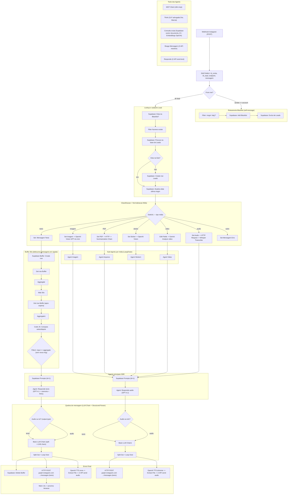

# Workflow: `sdr_insta_mindflow`

> **Status n8n**: Ativo
> **Trigger**: Webhook (Instagram Graph API — Meta)
> **ID n8n**: `efTaAsDenujN5NnFX8JpA`
> **Tags**: Mindflow
> **Total de nos**: 108 (incluindo stickies, sub-agents, parsers, memorias e tools)
> **Ultima atualizacao**: 2026-03-07
> **Ultima execucao analisada**: _Sem execucao recente disponivel_

---

## Descricao Geral

SDR (Sales Development Representative) automatizado para DMs do Instagram. O workflow recebe via webhook eventos do Instagram Messaging (Meta Graph API), filtra mensagens enviadas pelo proprio agente, gerencia blacklist (palavra-chave "obg"/"pare"), garante cadastro do lead no Supabase (tabela `Leads_Mindflow`) e roteia a mensagem por tipo (texto / audio / imagem / PDF / sticker / video / outro). Cada tipo possui um pipeline de pre-processamento (transcricao Whisper, analise de imagem GPT-4o-mini, analise de video Gemini 2.5 Flash, summarization de PDF) que normaliza para texto antes de chamar um Agent LangChain ("Responde texto" ou "Responde audio") com memoria persistente no Postgres, RAG vector store no Supabase (`documents_fil`) e tools auxiliares (MCP Client, Think, Reage, Responde). O fluxo aplica buffer de mensagens (30s wait + aggregate via tabela `Buffer`) para concatenar mensagens curtas em rajada, define se a resposta sai como texto ou audio (TTS OpenAI `tts-1-hd` voz "nova"), quebra em chunks via LLM Chain estruturado, e envia de volta via Instagram Graph API (`graph.instagram.com/v21.0`) — com fallback Z-API (whatsapp).

---

## Diagrama de Fluxo (Macro)



---

## Comunicacao com Outros Workflows

| Direcao | Workflow/Servico | Endpoint | Metodo | Dados Passados |
|---------|-----------------|----------|--------|----------------|
| Recebe de | Instagram Messenger (Meta) | `/webhook/f9cd8af7-f1df-4459-b3fb-9657bc262484` | POST | `body.entry[0].messaging[0]` (sender.id, message.text/attachments/etc) |
| Envia para | Instagram Graph API | `https://graph.instagram.com/v21.0/{Id_conta}/messages` | POST | `recipient.id`, `message.text` |
| Envia para | Z-API (WhatsApp) | `https://api.z-api.io/instances/.../send-audio` e `/send-text` e `/send-reaction` | POST | `phone`, `audio` base64, `message`, `messageId` |
| Tool externa | n8n MCP Server | `https://n8n-mcp-n8n.bkpxmb.easypanel.host/mcp/c9259be0-...` | MCP | (tool calls do agent SDR) |
| Database | Supabase Mindflow | `Leads_Mindflow`, `Blacklist_Mindflow`, `Buffer`, `Prompts`, `documents_fil` (vector RAG) | SDK | numero, mensagem, embeddings |
| Memoria | Postgres MindFlow | tabela LangChain chat_history (sessionKey = ID_lead) | SDK | historico (last 10 turns) |

Nao chama explicitamente outros workflows internos da MindFlow (`call_predict`, `pre_call_processing`, etc.). Atua de forma autonoma como agente de DM Instagram.

### Dados de Rastreabilidade

| Campo | Valor/Origem | Obrigatorio |
|-------|--------------|-------------|
| `Id_conta` | Constante hardcoded `17841474335042655` (conta Instagram MindFlow) | Sim |
| `ID_lead` | `$.body.entry[0].messaging[0].sender.id` (PSID Instagram) | Sim |
| `endpoint` | Constante `https://graph.instagram.com/v21.0` | Sim |
| `mensagem` | `$.body.entry[0].messaging[0].message.text` | Sim |
| `messageId` (mid) | `$.body.entry[0].messaging[0].message.mid` | Usado pelas tools |
| `execution_id` | _Nao gerado_ (workflow n8n nativo) | DIVERGENCIA EDW |
| `workflow_id` | _Nao gerado_ | DIVERGENCIA EDW |
| `from_workflow` | _Nao gerado_ | DIVERGENCIA EDW |

---

## Exemplos de Payload Real (anonimizado)

_Sem execucao recente disponivel_

Schema esperado de entrada (inferido do JSON):

```json
{
  "body": {
    "entry": [
      {
        "messaging": [
          {
            "sender": { "id": "<PSID>" },
            "recipient": { "id": "17841474335042655" },
            "message": {
              "mid": "<MID>",
              "text": "Oi, quero saber mais sobre Direito de Familia"
            }
          }
        ]
      }
    ],
    "phone": "+55XX9XXXXXXXX",
    "chatLid": "<CHAT_LID>",
    "messageId": "<MID>"
  }
}
```

---

## Detalhamento dos Nos (Agrupado por Funcao)

### 1. Trigger e Identificacao (3 nos)
- `Webhook` (`n8n-nodes-base.webhook`, POST, path `f9cd8af7-...`) — entrada Meta/Instagram
- `Edit Fields1` (`set`) — define `Id_conta`, `ID_lead`, `endpoint`, `mensagem` a partir do payload Meta
- `Respond to Webhook` — usado em fluxo paralelo de validacao (`hub.challenge`) para verificacao Meta

### 2. Roteamento Blacklist / Filtro de Self-Message (5 nos)
- `From me?` (`if`) — separa quando `Id_conta == ID_lead` (mensagem enviada pelo proprio bot)
- `msgm de Pare?` (`filter`) — verifica se conteudo == "obg" (lead pediu para parar)
- `Add to blacklist` (`supabase` insert `Blacklist_Mindflow`)
- `Exclui de leads` (`supabase` delete `Leads_Mindflow`)
- `Esta na Blacklist?` (`supabase` get `Blacklist_Mindflow`)

### 3. Lookup e Cadastro de Lead (5 nos)
- `Filter` — Numero notExists
- `Procura na base de leads` (`supabase` get `Leads_Mindflow`)
- `Esta na lista?` (`if`)
- `Create a row` (`supabase` insert em `Leads_Mindflow`)
- `Atualiza ultima mensagem (data)` (`supabase` update `data ultima msgm`)

### 4. Switch Roteador por Tipo de Midia (1 no — Switch1)
- `Switch1` (`switch` v3.1, DISABLED no JSON mas branches conectadas) — 7 saidas: texto / audio / imagem / PDF / sticker / video / outro (fallback). Cada saida define qual pipeline de pre-processamento sera usado.

### 5. Pipelines de Pre-Processamento por Midia (~14 nos)
- **Texto**: `Mensagem Texto1` (set) — sem transformacao adicional
- **Audio**: `Mensagem Audio1` (set URL) -> `HTTP Request` (download com Bearer Instagram) -> `Transcrever Audio1` (OpenAI Whisper, lang=pt) -> `Get a row3` (busca prompt) -> Agent `Responde audio`
- **Imagem**: `Mensagem Imagem1` -> `OpenAI1` (Vision GPT-4o-mini analyze) -> Sub-Agent `Imagem`
- **PDF**: `Mensagem Documento PDF` -> `HTTP Request1` (download) -> `Summarization Chain` (com `Recursive Character Text Splitter` + `OpenAI Chat Model8` gpt-4o-mini) -> Sub-Agent `Arquivos`
- **Sticker**: `Sticker` (set) -> `OpenAI` (Vision analyze stickerUrl) -> Sub-Agent `Sticker1`
- **Video**: `Edit Fields` -> `Analyze video` (Google Gemini 2.5 Flash) -> Sub-Agent `Video`
- **Erro**: `Mensagem Erro1` (set `<ErroFormatoMensagem>`)

### 6. Sub-Agents de Midia (4 LangChain Agents)
Cada um com `systemMessage` especializado em direito familiar/SDR para Dra. Marcia Mendes:
- `Imagem` (extratos, RGs, prints, notificacoes)
- `Arquivos` (contratos, boletos, PDFs)
- `Sticker1` (interpretacao emocional de figurinhas)
- `Video` (depoimentos, reclamacoes, provas)

Compartilham: `OpenAI Chat Model8` (gpt-4o-mini), `Postgres Chat Memory2` (sessionKey baseado em chatLid/phone), tools `Responde` e `Reage Mensagem1`.

### 7. Buffer 30s (Debounce de Rajada de Mensagens) (9 nos)
Pattern para concatenar mensagens curtas enviadas em sequencia antes de processar:
- `Create a row1` (Supabase insert `Buffer`)
- `Get a row` -> `Aggregate` (snapshot inicial)
- `Wait1` (30s)
- `Get a row1` -> `Aggregate1` (snapshot pos-espera)
- `Code in JavaScript` — compara `MensagensInput` vs `MensagensAggregate`
- `Filter1` — so prossegue se nao houve nova mensagem (debounce eficaz)
- `Get a row2` (busca prompt SDR id=1)

### 8. Agents Principais SDR (2 agents principais + 4 chat models + 2 memories + 2 parsers)
- `Responde texto` — Agent LangChain v2.2, system prompt vem da tabela `Prompts.Prompt_Text`, instrui usar tool `Consulta_Documento_SDR` (RAG) antes de responder. LMs: `OpenAI Chat Model1` (gpt-4.1 t=0.8) primary; `Google Gemini Chat Model` (gemini-pro-latest) fallback. Memoria: `Postgres Chat Memory` (sessionKey=ID_lead, ctx=10).
- `Responde audio` — Agent identico mas para mensagens originadas de audio transcrito. LMs: `OpenAI Chat Model5` (gpt-4.1 t=0.5) + `OpenAI Chat Model6` (gpt-4o-mini t=0.5) fallback. Memoria: `Postgres Chat Memory1`.
- Output Parsers Auto-fixing -> Structured ({type: texto|audio, output: string})

### 9. Tools dos Agents (5 tools)
- `MCP Client` (`mcpClientTool` apontando para n8n-mcp easypanel) — tools externas via MCP
- `Think` (`toolThink`) — Chain of Thought interno, simula raciocinio de advogada Dra. Marcia Mendes (Direito da Familia)
- `Consulta script` (`vectorStoreSupabase` retrieve-as-tool, tabela `documents_fil`, topK=3) com `Embeddings OpenAI` — RAG do script de vendas SDR
- `Reage Mensagem1` (`httpRequestTool` -> Z-API send-reaction) — envia emoji de reacao
- `Responde` (`httpRequestTool` -> Z-API send-text) — envio direto pelo agent (max 4 msgs/conversa)

### 10. Quebra de Resposta + Decisao Texto/Audio (~14 nos por pipeline x2)
Para cada Agent principal:
- `Audio ou txt` / `Audio ou txt1` (if) — usa `output.type` do parser
- `Basic LLM Chain` / `Basic LLM Chain1` (gpt-4.1-mini t=0.5) — quebra resposta em array `mensagens` (<240 chars) seguindo regras XML elaboradas sobre quando usar TEXTO vs AUDIO baseado em engajamento, dados estruturados, etc.
- `Structured Output Parser [Schema]` + `Auto-fixing Output Parser1` -> garante JSON `{mensagens: string[]}`
- `Split Out` (splitOut em `output.mensagens`)
- `Loop Over Items` (splitInBatches)
- `Wait` / `Wait3` (1.5s entre mensagens — humanizacao)

### 11. Envio Final (6 nos por pipeline)
- **Texto**: `HTTP Request2` / `HTTP Request3` (POST `{endpoint}/{Id_conta}/messages` com HTTP Header Auth `MIndflow insta`) — Instagram Graph API
- **Audio**: `Generate audio` (OpenAI TTS `tts-1-hd` voz "nova") / `Generate audio1` (voz "shimmer") -> `Extract from File` (binaryToProperty) -> `Enviar Audio` / `Enviar Audio1` (POST Z-API send-audio com Client-Token hardcoded)
- `Delete a row2` (Supabase delete `Buffer` para o lead)

### 12. Stickies/Notas Visuais (~20 nos)
Apenas anotacoes (`stickyNote`) — nao executam logica. Sao agrupadores visuais como "Tratamento de Mensagens", "Buffer", "IA", "Tools", "Envio das Respostas".

---

## Variaveis de Ambiente Utilizadas

| Variavel | Uso no Workflow |
|----------|-----------------|
| (Credenciais armazenadas em n8n credentials, nao em env vars diretas) | — |
| `INSTAGRAM_PAGE_ACCESS_TOKEN` | Header Authorization Bearer no HTTP Request para download de audio (hardcoded `IGACLJlrqXLx1BZ...`) — **deve migrar para env** |
| `Z_API_INSTANCE_ID` / `Z_API_TOKEN` / `Z_API_CLIENT_TOKEN` | URLs e headers Z-API (hardcoded inline `3E75ED6...` / `6627786...` / `F0d852a0...`) — **deve migrar para env** |
| `INSTAGRAM_ACCOUNT_ID` | `Id_conta = 17841474335042655` hardcoded em Edit Fields1 |
| `MCP_SDR_ENDPOINT` | `https://n8n-mcp-n8n.bkpxmb.easypanel.host/mcp/c9259be0-...` |

---

## Credenciais n8n Utilizadas

| Nome da Credencial | Tipo | Nos que Usam |
|--------------------|------|--------------|
| `OpenAi account` (id `Z2Wx2mpVaJdfm52V`) | openAiApi | Transcrever Audio1, OpenAI1, OpenAI, OpenAI Chat Model 1-8, Generate audio, Embeddings OpenAI |
| `Google Gemini(PaLM) Api account` (id `WqgUjb5TBCv5Mx3i`) | googlePalmApi | Analyze video, Google Gemini Chat Model |
| `supabase Mindflow` (id `xPgzw7ayw9gmHNlh`) | supabaseApi | Add to blacklist, Esta na Blacklist?, Procura na base de leads, Create a row, Atualiza ultima mensagem, Create a row1, Get a row1, Get a row2, Get a row3, Delete a row2, Exclui de leads, Consulta script (RAG) |
| `MindFlow` (id `iTWsjCHc1ki7IKui`) | postgres | Postgres Chat Memory, Postgres Chat Memory1, Postgres Chat Memory2 |
| `MIndflow insta` (id `8CJGvJ4ojUKts0Ej`) | httpHeaderAuth | HTTP Request2, HTTP Request3 (envio Instagram Graph) |

---

## Migration Brief — Antigravity / Python

> Especificacao para reimplementar em Python conforme `Usefull_Skills/docs/conventions.md` (EDW).
>
> **ALERTA — workflow muito complexo**: 108 nos, 7 pipelines de midia, 6+ LLMs distintos, 5 tools, RAG, memoria persistente, buffer com debounce, multiplos parsers. Recomenda-se **forte quebra em sub-modulos** (sub-workers ARQ separados ou sub-fluxos no Antigravity), nao implementar como um unico worker monolitico.

### Camada API (FastAPI)

- **Endpoint sugerido**: `POST /webhook/sdr-insta`
- **Endpoint validacao Meta**: `GET /webhook/sdr-insta` que retorna `hub.challenge` (substitui `Respond to Webhook`)
- **Schema Pydantic de entrada** (`schemas.py`):

```python
class InstagramSender(BaseModel):
    id: str  # PSID

class InstagramMessage(BaseModel):
    mid: str
    text: Optional[str] = None
    attachments: Optional[list[dict]] = None

class InstagramMessaging(BaseModel):
    sender: InstagramSender
    recipient: dict
    message: InstagramMessage

class InstagramEntry(BaseModel):
    messaging: list[InstagramMessaging]

class SdrInstaWebhookInput(BaseModel):
    body: dict  # campo body wrapping Meta payload
    # entry[0].messaging[0].sender.id, message.text, ...
```

- **Resposta**: `202 Accepted` + `execution_id` (UUID gerado API). API enfileira em `arq` e responde.
- **Validacoes**: rejeitar se `sender.id` ausente. Diferenciar self-message (sender.id == account_id).

### Camada Worker (ARQ) — Sub-modulos sugeridos

Dado o tamanho, recomendar **3 sub-workers ou 3 fluxos**:

**Sub-worker A: `sdr_insta_intake`** (pre-processamento lead/blacklist)

| # | n8n node | Step EDW (`sdr_insta_mindflow_<oqf>`) | I/O | Lib | Retries |
|---|----------|---------------------------------------|-----|-----|---------|
| 1 | `From me?` + `msgm de Pare?` | `sdr_insta_mindflow_check_self_or_stop` | in: payload; out: action (blacklist|process|skip) | puro Python | 0 |
| 2 | `Add to blacklist` + `Exclui de leads` | `sdr_insta_mindflow_add_blacklist` | in: phone; out: void | `supabase` singleton | 3 |
| 3 | `Esta na Blacklist?` | `sdr_insta_mindflow_check_blacklist` | in: ID_lead; out: is_blacklisted | `supabase` singleton | 3 |
| 4 | `Procura/Create/Atualiza Leads` | `sdr_insta_mindflow_upsert_lead` | in: ID_lead; out: lead row | `supabase` upsert | 3 |

**Sub-worker B: `sdr_insta_media`** (pre-processamento por tipo de midia — Switch1 + pipelines)

| # | n8n node | Step EDW | I/O | Lib | Retries |
|---|----------|----------|-----|-----|---------|
| 5 | `Switch1` | `sdr_insta_mindflow_classify_media` | in: message; out: media_type | puro Python | 0 |
| 6a | `HTTP Request + Transcrever Audio1` | `sdr_insta_mindflow_transcribe_audio` | in: audio_url; out: text | `httpx.AsyncClient` + `openai.AsyncOpenAI.audio.transcriptions` (whisper-1) | 3 |
| 6b | `OpenAI1` (Vision imagem) | `sdr_insta_mindflow_analyze_image` | in: image_url; out: description | `openai.AsyncOpenAI` gpt-4o-mini | 3 |
| 6c | `Summarization Chain` (PDF) | `sdr_insta_mindflow_summarize_pdf` | in: pdf_url; out: summary | `httpx` + LangChain summarize_chain ou prompt manual | 3 |
| 6d | `Analyze video` (Gemini) | `sdr_insta_mindflow_analyze_video` | in: video_url; out: description | `google-generativeai` async | 3 |
| 6e | `OpenAI` (Vision sticker) | `sdr_insta_mindflow_analyze_sticker` | in: sticker_url; out: description | igual 6b | 3 |
| 7 | Sub-agents `Imagem/Arquivos/Sticker1/Video` | `sdr_insta_mindflow_media_subagent_response` | in: description + history; out: reaction msg | LangChain Agent ou pure prompt c/ tools | 3 |

**Sub-worker C: `sdr_insta_responder`** (buffer + agent principal + envio)

| # | n8n node | Step EDW | I/O | Lib | Retries |
|---|----------|----------|-----|-----|---------|
| 8 | Buffer + Wait 30s + dedup | `sdr_insta_mindflow_debounce_buffer` | in: msg; out: aggregated_msg | `supabase` + `arq.enqueue_job(_defer_until=now+30s)` | 0 |
| 9 | `Get a row2` (Prompts) | `sdr_insta_mindflow_fetch_prompt` | in: id=1; out: system_prompt | `supabase` singleton | 3 |
| 10 | `Responde texto` / `Responde audio` Agent | `sdr_insta_mindflow_run_sdr_agent` | in: msg+prompt+history; out: {type, output} | LangChain Agent c/ tools (MCP, Think, RAG, Reage, Responde) | 3 |
| 11 | `Consulta script` RAG | `sdr_insta_mindflow_rag_lookup` | in: query; out: top3 docs | `supabase` vector + `openai` embeddings | 3 |
| 12 | `Basic LLM Chain` quebra resposta | `sdr_insta_mindflow_split_response` | in: long_text; out: list[str] | `openai` gpt-4.1-mini com structured output | 3 |
| 13 | `Generate audio` (TTS) | `sdr_insta_mindflow_synthesize_tts` | in: text; out: bytes mp3 | `openai.audio.speech` (tts-1-hd) | 3 |
| 14 | `HTTP Request2/3` envio IG | `sdr_insta_mindflow_send_instagram` | in: ID_lead+text; out: msg_id | `httpx.AsyncClient` | 3 |
| 15 | `Enviar Audio` Z-API | `sdr_insta_mindflow_send_zapi_audio` | in: phone+b64; out: msg_id | `httpx.AsyncClient` | 3 |
| 16 | Loop 1.5s entre msgs | `sdr_insta_mindflow_throttle_send` | in: list; out: void | `asyncio.sleep` (DENTRO de worker, OK) ou enqueue defer | 0 |

### Comunicacao Externa (Saidas)

| Destino | URL | Auth | Payload | Retorno |
|---------|-----|------|---------|---------|
| Instagram Graph | `https://graph.instagram.com/v21.0/{Id_conta}/messages` | HTTP Header Auth Bearer | `{recipient.id, message.text}` | `{message_id}` |
| Z-API send-audio | `https://api.z-api.io/instances/{id}/token/{token}/send-audio` | Header `Client-Token` | `{phone, audio (base64 data-uri), delayTyping, waveform}` | `{messageId}` |
| Z-API send-text | `.../send-text` | Header `Client-Token` | `{phone, message, messageId}` | `{messageId}` |
| Z-API send-reaction | `.../send-reaction` | Header `Client-Token` | `{phone, reaction, messageId}` | `{messageId}` |
| OpenAI Whisper | `https://api.openai.com/v1/audio/transcriptions` | Bearer | binary mp3 | `{text}` |
| OpenAI Chat/TTS/Vision | api.openai.com | Bearer | varies | varies |
| Google Gemini | generativelanguage.googleapis.com | API Key | video URL + prompt | description |
| MCP SDR | `https://n8n-mcp-n8n.bkpxmb.easypanel.host/mcp/c9259be0-...` | (none/internal) | MCP protocol | tool results |

### Variaveis de Ambiente Necessarias (.env)

| Variavel | Origem n8n | Uso no Python |
|----------|-----------|---------------|
| `OPENAI_API_KEY` | credencial "OpenAi account" | `openai.AsyncOpenAI` |
| `GOOGLE_GEMINI_API_KEY` | credencial "Google Gemini(PaLM)" | `google-generativeai` |
| `SUPABASE_URL` / `SUPABASE_KEY` | credencial "supabase Mindflow" | client singleton |
| `POSTGRES_DSN_MINDFLOW` | credencial "MindFlow" Postgres | `asyncpg` para chat memory ou tabela LangChain |
| `INSTAGRAM_GRAPH_TOKEN` | credencial "MIndflow insta" httpHeaderAuth | header Authorization |
| `INSTAGRAM_PAGE_ACCESS_TOKEN` | hardcoded `IGACLJlrqXLx1BZ...` no HTTP Request audio | header Bearer p/ download attachments |
| `INSTAGRAM_ACCOUNT_ID` | hardcoded `17841474335042655` | path da URL |
| `Z_API_INSTANCE_ID` | hardcoded `3E75ED6955A4A0BDE434EE5C772D9ACD` | path URL Z-API |
| `Z_API_TOKEN` | hardcoded `6627786976AB133F31F3CFF7` | path URL Z-API |
| `Z_API_CLIENT_TOKEN` | hardcoded `F0d852a09139d4b6b94b23c77c8a67debS` | header `Client-Token` |
| `MCP_SDR_ENDPOINT` | hardcoded URL | MCP client |
| `REDIS_URL` | (Easypanel inject) | `arq` RedisSettings.from_dsn |

### Rastreabilidade Obrigatoria (conventions.md)

- `workflow_id`: `sdr_insta_mindflow_v1`
- `from_workflow`: `instagram_webhook` (origem externa) ou nome do caller interno
- `execution_id`: UUID gerado pela API no recebimento do webhook
- Persistir em: `workflow_executions` (master) + `workflow_step_executions` (detail)
- `sessionKey` para memoria do agent: continuar usando `ID_lead` (PSID) — manter compatibilidade
- Manter chave de correlacao Buffer ⇄ Agent ⇄ Send: usar `execution_id`

### Pontos de Atencao / Divergencias do EDW

- **Workflow extremamente complexo (108 nos)**. Forte recomendacao: **quebrar em sub-modulos** no Antigravity (intake, media-processing, responder). Implementar como tres workers ARQ separados com handoff via Redis queues.
- **Buffer 30s via `Wait` + tabela Supabase**: substituir por `arq.enqueue_job(_defer_until=now+30s)` (job future) + chave de buffer no Redis (pattern `sdr:buffer:{lead_id}`) com TTL. Conferir se nova mensagem chegou no buffer antes de processar (debounce real, nao polling DB).
- **Sub-agents de midia (4 LangChain Agents)** + **Agents principais (2)** — todos no n8n usam LangChain LCEL. Em Python, decidir se mantem LangChain (`langchain-openai`) ou usa SDK puro com prompt templates. Migracoes complexas com tool-calling: preferir SDK OpenAI nativo + funcoes async.
- **Memoria Postgres chat_history**: LangChain usa tabela propria. Em Python, manter mesma tabela ou migrar para schema EDW. `sessionKey` esta inconsistente: `Responde texto` usa `ID_lead`, mas sub-agents de midia usam `chatLid | phone` (operador OR PostgreSQL?). Padronizar.
- **Hardcoded tokens**: tokens do Instagram, Z-API e Client-Token estao **em texto puro no JSON** — risco de seguranca. Migrar para `.env` obrigatorio.
- **Switch1 disabled** no JSON (campo `disabled: true`), mas conexoes ativas — verificar se isso e bug ou se a logica passa por outro caminho. Validar com usuario antes de migrar.
- **RAG**: vector store Supabase tabela `documents_fil` com 3 docs por consulta — bem mapeado. Manter mesma tabela ou migrar para schema EDW.
- **Tool `Consulta script` no n8n nao esta conectada** (`"ai_tool": [[]]`) — mas o prompt do Agent menciona obrigatoriedade de usar `Consulta_Documento_SDR`. Verificar com usuario se RAG esta ativo de fato ou foi desabilitado.
- **Quebra de mensagem via LLM Chain com prompt XML elaborado** definindo TEXTO vs AUDIO. Logica complexa de heuristica/score. Em Python: implementar como funcao deterministica + classificador LLM separado (nao misturar dois LLMs em cascata).
- **Cobranca de OpenAI**: TTS `tts-1-hd` + GPT-4.1 + GPT-4.1-mini + GPT-4o-mini + Whisper + Embeddings + Vision — muitos modelos. Avaliar consolidacao.
- **Gemini para video**: divergencia (Python stack padrao MindFlow e OpenAI). Manter se necessario ou substituir por gpt-4o video.
- **`Respond to Webhook` para validacao Meta**: nao se encaixa em padrao EDW (API responde 202). Criar endpoint GET separado para validacao do webhook Meta.
- **MCP Client** apontando para outro n8n — pode virar circulo de dependencia. Em Python, substituir por client MCP nativo (`fastmcp`) consumindo o mesmo endpoint, ou migrar as tools do MCP tambem.
- **Anonimizacao LGPD**: PDFs de leads (extratos, RGs) trafegam por OpenAI Vision — verificar acordo de dados e mascarar PII antes de enviar.
- **Sem rastreabilidade EDW nativa**: zero referencia a `execution_id`, `workflow_id`, `from_workflow`, `workflow_executions`, `workflow_step_executions` — implementacao Python deve adicionar tudo do zero.

### Status de Migracao

- [x] Documentado
- [ ] Sub-modulos definidos (intake / media / responder)
- [ ] Schemas Pydantic definidos
- [ ] API endpoint implementado
- [ ] Worker steps implementados (~16 steps em 3 sub-workers)
- [ ] RAG migrado
- [ ] Validado em ambiente de teste
- [ ] Migrado em producao
