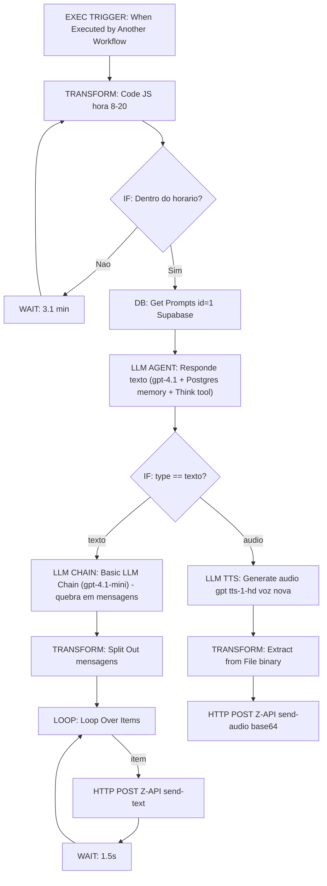

# Workflow: `sub_mensagens_mindflow`

> **Status n8n**: Ativo
> **Trigger**: Execute Workflow (sub-workflow) — `executeWorkflowTrigger`
> **ID n8n**: `Rj5YrcpmDzNceIamOa63k`
> **Slug**: `sub-mensagens-mindflow`
> **Tags**: `Mindflow`
> **Última execução analisada**: _Sem execução recente disponível_

---

## Descrição Geral

Sub-workflow responsável por gerar e enviar mensagens (texto ou audio) ao lead via WhatsApp (Z-API). Recebe `Numero`, `Etapa` e `Contexto` de um workflow pai; verifica se esta dentro do horario comercial (08h–20h, com retry/wait de 3.1 min ate cair no horario); busca o prompt mestre no Supabase (tabela `Prompts`, id=1); um agente LangChain (gpt-4.1 + Postgres memory por `Numero`) decide entre TEXTO ou AUDIO seguindo regras determinísticas + heuristica de score. Em texto, quebra a resposta em mensagens curtas (gpt-4.1-mini) e envia uma a uma via Z-API com 1.5s entre cada. Em audio, gera TTS (tts-1-hd, voz "nova") e envia o base64 via endpoint Z-API send-audio.

## Diagrama de Fluxo



## Comunicacao com Outros Workflows

| Direcao | Workflow | Endpoint | Metodo | Dados Passados |
|---------|----------|----------|--------|----------------|
| <- Recebe de | Outros workflows da Mindflow (chamadores deste sub-workflow) | `executeWorkflow` (chamada interna n8n por ID `Rj5YrcpmDzNceIamOa63k`) | n/a (RPC n8n) | `Numero`, `Etapa`, `Contexto` |
| -> Envia para | Z-API (WhatsApp - externo) | `https://api.z-api.io/instances/<instance>/token/<token>/send-text` | POST | `phone`, `message` |
| -> Envia para | Z-API (WhatsApp - externo) | `https://api.z-api.io/instances/<instance>/token/<token>/send-audio` | POST | `phone`, `audio` (base64 mp3), `viewOnce`, `waveform` |
| -> Consulta | Supabase (Mindflow) | tabela `Prompts` (id=1) | GET (Supabase node) | retorna `Prompt_Text` |
| -> Persiste | Postgres MindFlow (chat memory) | tabela do `memoryPostgresChat` | session key = `Numero` | historico de turnos (janela 10) |
| -> Chama | OpenAI | LLMs gpt-4.1, gpt-4.1-mini, gpt-4o-mini; TTS tts-1-hd | POST | prompts/textos |

**Observacao**: Como o trigger e `executeWorkflowTrigger` (chamado por `Execute Workflow` em outro fluxo n8n), nao ha endpoint HTTP externo. A invocacao ocorre dentro do mesmo runtime n8n.

### Dados de Rastreabilidade

| Campo | Valor/Origem | Obrigatorio | Observacao |
|-------|--------------|-------------|------------|
| `Numero` | input do trigger (vindo do parent) | sim | usado como `phone` Z-API e `sessionKey` da memoria |
| `Etapa` | input do trigger | sim | injetado no prompt do agente |
| `Contexto` | input do trigger | sim | injetado no prompt do agente |
| `workflow_id` | **AUSENTE** | n/a | nao ha rastreabilidade EDW no fluxo atual |
| `from_workflow` | **AUSENTE** | n/a | nao ha rastreabilidade EDW no fluxo atual |
| `execution_id` | **AUSENTE** | n/a | nao ha rastreabilidade EDW no fluxo atual |

## Exemplos de Payload Real (anonimizado)

_Sem execucao recente disponivel_ — `executions.json` retornou `data: []`.

Pin data disponivel no JSON (dev/teste):
```json
{
  "Numero": "+55XX9XXXXXXXX",
  "Etapa": null,
  "Contexto": null,
  "Data/hora reuniao": null
}
```

## Detalhamento dos Nos

### 1. `When Executed by Another Workflow` (EXEC TRIGGER)
- Tipo: `n8n-nodes-base.executeWorkflowTrigger` v1.1
- Recebe `Numero`, `Etapa`, `Contexto` de outro workflow n8n via `Execute Workflow`.

### 2. `Code in JavaScript` (TRANSFORM)
- Tipo: `n8n-nodes-base.code` v2
- Calcula `horaAtual` (no fuso do servidor n8n) e retorna `status = "Dentro do horario"` se 8 <= hora < 20, senao `"Fora do horario"`.

### 3. `If` (DECISION)
- Compara `$json.status == "Dentro do horario"`.
- True -> `Get a row2`; False -> `Wait` (3.1 min, depois reavalia hora).

### 4. `Wait` (WAIT)
- Tipo: `wait` v1.1; 3.1 minutos. Loop de busy-wait ate cair no horario.

### 5. `Get a row2` (DB)
- Tipo: `n8n-nodes-base.supabase` v1; `get` tabela `Prompts` filtrando `id = 1`.
- Saida usada como `Prompt_Text` no system message do agente.

### 6. `Responde texto` (LLM AGENT)
- Tipo: `@n8n/n8n-nodes-langchain.agent` v2.2; `retryOnFail`, `needsFallback`.
- Prompt: "Gere uma mensagem de acordo com contexto e etapa do atendimento". System obriga uso da tool `Consulta_Documento_SDR` (nao definida neste workflow — provavelmente injetada via parent ou erro do template).
- Modelos: `OpenAI Chat Model1` (gpt-4.1 temp 0.8 principal) + `OpenAI Chat Model2` (gpt-4o-mini fallback).
- Memoria: `Postgres Chat Memory` (sessao por `Numero`, janela 10).
- Output parser: `Auto-fixing Output Parser2` -> schema `{type: texto|audio, output: string}` (parser fixado por `OpenAI Chat Model4` gpt-4.1-mini).
- Tool: `Think` (CoT — assistente da "Dra. Marcia Mendes", Direito da Familia — indica template white-label de SDR juridico).

### 7. `Audio ou txt` (DECISION)
- Tipo: `if` v2.2; checa `$json.output.type == "texto"`.
- True -> `Basic LLM Chain`; False -> `Generate audio`.

### 8. `Basic LLM Chain` (LLM CHAIN)
- Tipo: `@n8n/n8n-nodes-langchain.chainLlm` v1.6; `retryOnFail`.
- Modelo: `OpenAI Chat Model3` (gpt-4.1-mini temp 0.5).
- Prompt embute regra extensa TEXTO vs AUDIO (defs/hard_blocks/use_audio/heuristic) — embora ja decidido pelo no anterior, aqui apenas estrutura a resposta em array de mensagens curtas (<=240 chars).
- Output parser: `Auto-fixing Output Parser1` -> `{mensagens: string[]}`.

### 9. `Split Out1` (TRANSFORM)
- Tipo: `splitOut` v1; `fieldToSplitOut: output.mensagens` — gera 1 item por mensagem.

### 10. `Loop Over Items1` (LOOP)
- Tipo: `splitInBatches` v3. Saida 0 (done) vazia; saida 1 (loop) -> `Enviar mensagem1`.

### 11. `Enviar mensagem1` (HTTP POST — Z-API send-text)
- URL: `https://api.z-api.io/instances/<INSTANCE_TEXT>/token/<TOKEN_TEXT>/send-text` (hardcoded).
- Header: `Client-Token: <REDACTED>`.
- Body: `phone = Numero`, `message = output.mensagens` (item atual).

### 12. `Wait3` (WAIT)
- 1.5s entre mensagens; retorna ao `Loop Over Items1`.

### 13. `Generate audio` (LLM TTS)
- Tipo: `@n8n/n8n-nodes-langchain.openAi` v1.8; `resource=audio`, `model=tts-1-hd`, `voice=nova`, `input=$json.output.output`.

### 14. `Extract from File1` (TRANSFORM)
- `extractFromFile` v1, `binaryToPropery` — converte o binario TTS para campo `data` (base64).

### 15. `Enviar Audio` (HTTP POST — Z-API send-audio)
- URL: `https://api.z-api.io/instances/<INSTANCE_AUDIO>/token/<TOKEN_AUDIO>/send-audio` (hardcoded; instancia DIFERENTE do send-text).
- Body JSON: `{phone, audio: "data:audio/mpeg;base64,...", viewOnce: false, waveform: true}`.

### 16. `Think` (AI TOOL — CoT)
- `@n8n/n8n-nodes-langchain.toolThink` v1.1. Tool de raciocinio interno (Chain of Thought) usada pelo agente.

### 17–nn. Subcomponentes LLM (cadeia)
- `OpenAI Chat Model1` (gpt-4.1 t=0.8) — principal do agente.
- `OpenAI Chat Model2` (gpt-4o-mini) — fallback do agente.
- `OpenAI Chat Model3` (gpt-4.1-mini t=0.5) — para o `Basic LLM Chain`.
- `OpenAI Chat Model4` (gpt-4.1-mini) — para o `Auto-fixing Output Parser2`.
- `Postgres Chat Memory` — sessao por `Numero`, janela 10.
- `Auto-fixing Output Parser1` + `Structured Output Parser [Schema]` (`{mensagens: []}`).
- `Auto-fixing Output Parser2` + `Structured Output Parser [Schema]2` (`{type, output}`).
- Sticky Notes (Sticky Note, 6, 12, 13, 14): documentacao visual no canvas — nao executavel.

## Variaveis de Ambiente Utilizadas

| Variavel | Uso no Workflow |
|----------|-----------------|
| _(nenhuma)_ | Tudo hardcoded (URLs Z-API com instancia/token na URL, `Client-Token` literal no header). **Forte divergencia EDW** — deve virar env. |

## Credenciais n8n Utilizadas

| Nome da Credencial | Tipo | Nos que Usam |
|--------------------|------|--------------|
| `OpenAi account` | `openAiApi` | OpenAI Chat Model1/2/3/4, Generate audio |
| `supabase Mindflow` | `supabaseApi` | Get a row2 |
| `MindFlow` | `postgres` | Postgres Chat Memory |

---

## Migration Brief — Antigravity / Python

> Especificacao para reimplementar conforme `Usefull_Skills/docs/conventions.md` (EDW). Sem Python implementado nesta entrega.

### Camada API (FastAPI)

- **Endpoint sugerido**: `POST /webhook/sub-mensagens-mindflow`
- **Schema Pydantic de entrada** (`schemas.py`):

```python
class SubMensagensMindflowInput(BaseModel):
    numero: str            # E.164 ou ddd+numero
    etapa: Optional[str] = None
    contexto: Optional[str] = None
    # rastreabilidade EDW obrigatoria
    from_workflow: str
    execution_id: Optional[str] = None  # gerado se ausente
```

- **Resposta**: `202 Accepted` + `{execution_id, status: "queued"}`
- **Validacoes**: `numero` nao vazio; pelo menos `etapa` ou `contexto`; `from_workflow` obrigatorio.

### Camada Worker (ARQ)

Mapa no n8n -> step EDW (`sub_mensagens_mindflow_<OQF>`, todos via `run_step_with_retry`):

| # | n8n node | Step EDW | I/O | Lib Python | Retries | Async |
|---|----------|----------|-----|------------|---------|-------|
| 1 | Code in JavaScript + If/Wait | `sub_mensagens_mindflow_check_business_hours` | in: now BR; out: dentro/fora + next_window | `datetime`/`zoneinfo` America/Sao_Paulo | 0 | sim |
| 1b | (substituir busy-wait) | agendamento via `arq.enqueue_job(_defer_until=...)` para proxima janela 08:00 BR | — | `arq` | — | sim |
| 2 | Get a row2 (Supabase Prompts id=1) | `sub_mensagens_mindflow_fetch_prompt` | in: id=1; out: Prompt_Text | `supabase` singleton | 3 | sim |
| 3 | Responde texto (agent + memory + Think) | `sub_mensagens_mindflow_generate_response` | in: prompt+etapa+contexto+memoria; out: `{type, output}` | `openai` async / `langchain-openai` | 3 | sim |
| 4 | Postgres Chat Memory | `sub_mensagens_mindflow_load_save_memory` | in: numero; out: turnos | `asyncpg` | 3 | sim |
| 5 | Audio ou txt (If) | branch in-process (if/elif) | — | puro | 0 | sim |
| 6a | Basic LLM Chain + Split Out | `sub_mensagens_mindflow_split_text_message` | in: texto; out: `mensagens: list[str]` (<=240 chars) | `openai` async + parser | 2 | sim |
| 7a | Loop + Enviar mensagem1 + Wait3 | `sub_mensagens_mindflow_send_text_chunk` por item, com `asyncio.sleep(1.5)` entre (ou enqueue serial) | in: phone+text; out: zapi_response | `httpx.AsyncClient` | 3 | sim |
| 6b | Generate audio (TTS) | `sub_mensagens_mindflow_generate_audio_tts` | in: texto+voice=nova; out: bytes mp3 | `openai` async (audio) | 3 | sim |
| 7b | Extract from File + Enviar Audio | `sub_mensagens_mindflow_send_audio` | in: phone+base64; out: zapi_response | `httpx.AsyncClient` | 3 | sim |

### Comunicacao Externa (Saidas)

- **Z-API send-text**: `POST https://api.z-api.io/instances/{ZAPI_INSTANCE_TEXT}/token/{ZAPI_TOKEN_TEXT}/send-text`, header `Client-Token: {ZAPI_CLIENT_TOKEN}`, body `{phone, message}`.
- **Z-API send-audio**: `POST https://api.z-api.io/instances/{ZAPI_INSTANCE_AUDIO}/token/{ZAPI_TOKEN_AUDIO}/send-audio`, header `Client-Token: {ZAPI_CLIENT_TOKEN}`, body `{phone, audio: data:audio/mpeg;base64,..., viewOnce, waveform}`.
- **Supabase**: client singleton, `.table("Prompts").select("Prompt_Text").eq("id", 1).single()`.
- **OpenAI**: chat completions (gpt-4.1, gpt-4.1-mini, gpt-4o-mini) e audio.speech (tts-1-hd, voice=nova).
- **Postgres**: pool `asyncpg`, tabela equivalente a `memoryPostgresChat` para historico por `numero`.

### Variaveis de Ambiente Necessarias (.env)

| Variavel | Origem n8n | Uso no Python |
|----------|-----------|---------------|
| `ZAPI_INSTANCE_TEXT` | URL hardcoded no `Enviar mensagem1` | path da URL send-text |
| `ZAPI_TOKEN_TEXT` | URL hardcoded | path da URL send-text |
| `ZAPI_INSTANCE_AUDIO` | URL hardcoded no `Enviar Audio` | path da URL send-audio |
| `ZAPI_TOKEN_AUDIO` | URL hardcoded | path da URL send-audio |
| `ZAPI_CLIENT_TOKEN` | header `Client-Token` hardcoded | header dos POSTs Z-API |
| `OPENAI_API_KEY` | credencial `OpenAi account` | SDK openai |
| `SUPABASE_URL` / `SUPABASE_KEY` | credencial `supabase Mindflow` | client singleton |
| `POSTGRES_DSN` (MindFlow) | credencial `MindFlow` | pool asyncpg p/ chat memory |
| `REDIS_URL` | infra Easypanel | `RedisSettings.from_dsn(...)` ARQ |
| `BUSINESS_HOURS_START` / `BUSINESS_HOURS_END` | hardcoded 8/20 no Code | janela comercial BR |

### Rastreabilidade Obrigatoria (conventions.md)

- `workflow_id`: `sub_mensagens_mindflow_v1` (fixo).
- `from_workflow`: vindo do parent (parametro obrigatorio).
- `execution_id`: UUID gerado pela API.
- Persistir em `workflow_executions` (master: PENDING -> RUNNING -> SUCCESS/FAILED) + `workflow_step_executions` (cada step acima).

### Pontos de Atencao / Divergencias do EDW

- **Sem rastreabilidade**: nao ha `workflow_id`/`from_workflow`/`execution_id` no payload atual — campos precisam ser adicionados ao contrato com workflows chamadores.
- **Busy-wait de 3.1 min** (`Wait` -> `Code` -> `If`) para fora de horario: substituir por `arq.enqueue_job(_defer_until=<proximo 08:00 BR>)` (conventions §Agendamento Persistente). `time.sleep` proibido.
- **Hora calculada no fuso do servidor n8n** (`new Date().getHours()`) — em Python usar `zoneinfo.ZoneInfo("America/Sao_Paulo")` para corrigir.
- **Tokens Z-API hardcoded** (instancia, token, Client-Token) em 2 nos com instancias diferentes para text e audio — migrar 100% para env e nunca commitar.
- **Tool `Consulta_Documento_SDR` referenciada no system prompt mas nao definida** no JSON — investigar se vem de outro workflow/credencial; em Python provavelmente vira chamada httpx ao RAG MindFlow.
- **Loop com Wait 1.5s entre mensagens**: em EDW preferir enfileirar cada chunk com `_defer_until = now + i*1.5s` em vez de `asyncio.sleep` dentro de uma task longa, evitando segurar worker.
- **Duas decisoes redundantes texto/audio**: o agente ja retorna `{type}`, mas o `Basic LLM Chain` reaplica regras de TEXTO vs AUDIO no prompt. Em Python, unificar para 1 decisao deterministica.
- **Template de origem (NOCODE STARTUP / Dra. Marcia Mendes - Direito Familia)**: prompts contem persona white-label que precisa ser parametrizada/limpa para o caso real Mindflow.
- **`message` recebe `output.mensagens` (array) num no que envia 1 por loop** — confirmar que o `splitOut` realmente entrega string por item (e nao array).
- **Sem execution log**: `executions.json` vazio impede validar payload real — primeira tarefa pos-migracao e coletar payloads reais com parent workflow.

### Status de Migracao

- [x] Documentado
- [ ] Schemas Pydantic definidos
- [ ] API endpoint implementado
- [ ] Worker steps implementados
- [ ] Validado em ambiente de teste
- [ ] Migrado em producao
