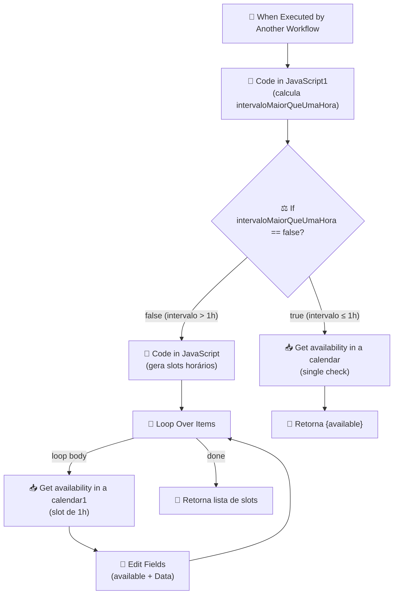

# Workflow: `verifica_agenda_mindflow`

> **Status n8n**: Ativo
> **Trigger**: Execute Workflow (chamado por outro workflow)
> **ID n8n**: `N2_TreHsY95DtigohLy3i`
> **Tag**: `Mindflow`
> **Última execução analisada**: `489892` em `2026-05-09T18:16:30.144Z` (success)

---

## Descrição Geral

Workflow utilitário (sub-workflow) que verifica a disponibilidade de horários no Google Calendar `Diagnóstico MIndflow`. Recebe um intervalo (`Data inicial`, `Data final`) e responde se está livre. Caso o intervalo seja maior que 1 hora, ele é fatiado em janelas de 1 hora, e cada janela é verificada individualmente, retornando uma lista `[{Data, available}]`. Provável uso: ferramenta consultada por LLM/Agente (Retell + MCP) durante uma ligação — diferente de `agenda_reuniao` que cria o evento.

---

## Diagrama de Fluxo



---

## Comunicação com Outros Workflows

| Direção | Workflow | Endpoint / Tipo | Método | Dados Passados |
|---------|----------|------------------|--------|----------------|
| ← Recebe de | `d1Rj8b4TmPpIaZIVd116T` (workflow pai — provável agente Retell/LLM) | `executeWorkflowTrigger` (chamada interna n8n) | call | `Data inicial`, `Data final` |
| → Envia para | Google Calendar API | `calendar.freebusy/availability` (calendar `c_0c05c1269e9b6880ecd85c1083e3ff63c6632b53e8d0e72e55db17baec6e8291@group.calendar.google.com`) | GET (OAuth2) | `timeMin`, `timeMax` |
| → Retorna para | Workflow chamador | retorno do `executeWorkflowTrigger` | — | `available: bool` (caso ≤1h) OU `[{Data, available}]` (caso >1h) |

### Dados de Rastreabilidade

| Campo | Valor/Origem | Obrigatório |
|-------|-------------|-------------|
| `execution_id` | Não presente — herdado de `parentExecution.executionId` | Não (gap) |
| `from_workflow` | Não presente — inferível via `parentExecution.workflowId` (`d1Rj8b4TmPpIaZIVd116T`) | Não (gap) |
| `workflow_id` | Não presente no payload | Não (gap) |

> **Gap EDW**: este workflow não propaga metadados de rastreabilidade no payload — apenas o n8n registra `parentExecution` internamente. Migração para EDW exigirá adicionar `execution_id` e `from_workflow` no schema de entrada.

---

## Exemplos de Payload Real (anonimizado)

**Trigger input** (execução `489892`):
```json
{
  "Data inicial": "2026-05-13T09:00:00.000-03:00",
  "Data final": "2026-05-13T09:30:00.000-03:00"
}
```

**Saída de `Code in JavaScript1`** (calcula bandeira de intervalo):
```json
{
  "Data inicial": "2026-05-13T09:00:00.000-03:00",
  "Data final": "2026-05-13T09:30:00.000-03:00",
  "intervaloMaiorQueUmaHora": false
}
```

**Saída final do ramo `≤ 1h`** (último nó executado — `Get availability in a calendar`):
```json
{
  "available": true
}
```

**Pin data (exemplo de entrada > 1h preparado no editor):**
```json
{
  "Data inicial": "2026-01-28T09:00:00.000-05:00",
  "Data final": "2026-01-28T19:00:00.000-05:00"
}
```

**Saída esperada do ramo `> 1h`** (após loop, lista acumulada):
```json
[
  { "available": true,  "Data": "2026-01-28T14:00:00.000Z" },
  { "available": false, "Data": "2026-01-28T15:00:00.000Z" },
  { "available": true,  "Data": "2026-01-28T16:00:00.000Z" }
]
```

> **Nota**: o nó `parentExecution.workflowId` (`d1Rj8b4TmPpIaZIVd116T`) é UUID interno e não é PII — mantido.

---

## Detalhamento dos Nós

### 1. `When Executed by Another Workflow` (🔵 Trigger)
- **Tipo n8n**: `n8n-nodes-base.executeWorkflowTrigger` (v1.1)
- **Descrição**: Entrada do sub-workflow. Recebe `Data inicial` e `Data final` (ambos string ISO 8601).
- **Configuração**: `inputSource: workflowInputs`, campos `Data inicial: string`, `Data final: string`.
- **Saídas**: → `Code in JavaScript1`.

### 2. `Code in JavaScript1` (🔧 Transform — JS)
- **Tipo n8n**: `n8n-nodes-base.code` (v2, `runOnceForAllItems`)
- **Descrição**: Calcula a flag `intervaloMaiorQueUmaHora` (diferença em ms > 3.600.000).
- **Saída**: `{ Data inicial, Data final, intervaloMaiorQueUmaHora: bool }`.
- **Próximo nó**: → `If`.

### 3. `If` (⚖️ Decisão)
- **Tipo n8n**: `n8n-nodes-base.if` (v2.2)
- **Condição**: `$json.intervaloMaiorQueUmaHora == false` (operator `boolean.false`).
- **Saídas**:
  - **true** (intervalo ≤ 1h) → `Get availability in a calendar` (check direto).
  - **false** (intervalo > 1h) → `Code in JavaScript` (fatia em slots).

### 4. `Get availability in a calendar` (📥 Fetch — Google Calendar)
- **Tipo n8n**: `n8n-nodes-base.googleCalendar` (v1.3)
- **Operation**: `availability` no calendar `Diagnóstico MIndflow` (id `c_0c05c1...@group.calendar.google.com`).
- **Parâmetros**: `timeMin = {{ $json["Data inicial"] }}`, `timeMax = {{ $json["Data final"] }}`.
- **Credencial**: `Google Calendar account` (OAuth2).
- **Saída**: `{ available: bool }` (último nó do ramo curto).

### 5. `Code in JavaScript` (🔧 Transform — JS, gera slots)
- **Tipo n8n**: `n8n-nodes-base.code` (v2, `runOnceForAllItems`)
- **Descrição**: Itera de `Data inicial` até `Data final` em passos de 1h, emitindo um item `{ Data: <ISO> }` por slot. Inclui parser tolerante a `-03:0` → `-03:00`.
- **Saídas**: array de N itens → `Loop Over Items`.

### 6. `Loop Over Items` (🔩 Utility — SplitInBatches)
- **Tipo n8n**: `n8n-nodes-base.splitInBatches` (v3, `batchSize: 1`)
- **Descrição**: Itera item-a-item. Saída 0 (done) não conectada — termina o ramo; saída 1 (loop body) → `Get availability in a calendar1`.

### 7. `Get availability in a calendar1` (📥 Fetch — Google Calendar por slot)
- **Tipo n8n**: `n8n-nodes-base.googleCalendar` (v1.3)
- **Operation**: `availability` no mesmo calendar.
- **Parâmetros**: `timeMin = {{ $json.Data }}`, `timeMax = Data + 1h` (calculado inline).
- **Credencial**: `Google Calendar account` (OAuth2).
- **Saída**: `{ available: bool }` → `Edit Fields`.

### 8. `Edit Fields` (🔧 Transform — Set)
- **Tipo n8n**: `n8n-nodes-base.set` (v3.4, `includeOtherFields: false`)
- **Descrição**: Reconstrói o item de saída: `{ available: bool, Data: $('Code in JavaScript').item.json.Data }`.
- **Próximo nó**: → `Loop Over Items` (volta para próxima iteração).

---

## Variáveis de Ambiente Utilizadas

| Variável | Uso no Workflow |
|----------|-----------------|
| _(nenhuma explícita)_ | Credenciais OAuth2 são gerenciadas pelo n8n internamente |

> Na migração EDW, será necessário introduzir variáveis para `GOOGLE_CALENDAR_ID` (atualmente hard-coded), `GOOGLE_OAUTH_CLIENT_ID`, `GOOGLE_OAUTH_CLIENT_SECRET`, `GOOGLE_OAUTH_REFRESH_TOKEN`.

## Credenciais n8n Utilizadas

| Nome da Credencial | Tipo | Nós que Usam |
|--------------------|------|--------------|
| `Google Calendar account` | `googleCalendarOAuth2Api` | `Get availability in a calendar`, `Get availability in a calendar1` |

---

## Migration Brief — Antigravity / Python

> Especificação para o agente do Antigravity reimplementar este workflow em Python conforme `Usefull_Skills/docs/conventions.md` (EDW). **Nenhuma linha de Python implementada — só spec.**

### Camada API (FastAPI)

- **Endpoint sugerido**: `POST /webhook/verifica-agenda-mindflow`
- **Schema Pydantic de entrada** (`schemas.py`):

```python
class VerificaAgendaInput(BaseModel):
    data_inicial: str          # ISO 8601 com timezone offset obrigatório
    data_final: str            # ISO 8601 com timezone offset obrigatório
    execution_id: Optional[str] = None  # propagado por workflow pai; gerado se ausente
    from_workflow: Optional[str] = None # rastreabilidade EDW
```

- **Resposta**: `202 Accepted` + `{ execution_id }` (worker preenche o resultado em `workflow_executions.output_data`).
- **Validações obrigatórias**:
  - `data_inicial` e `data_final` precisam ter timezone offset (`-03:00`, `Z`, etc) — caso contrário `400 Bad Request` (conventions.md §Gestão de Tempo).
  - `data_final > data_inicial`.

> **Divergência arquitetural importante**: o workflow original é síncrono (sub-workflow chamado por LLM tool, retorna disponibilidade na mesma chamada). Se a migração precisar manter latência baixa para uso por agente Retell durante chamada, considerar endpoint síncrono `GET /verifica-agenda?inicio=...&fim=...` que responde `200 OK` com a disponibilidade (fora do padrão 202+worker, mas alinhado ao caso de uso de ferramenta LLM). Confirmar com PO antes de migrar.

### Camada Worker (ARQ)

Mapa nó n8n → step EDW (cada step via `run_step_with_retry`):

| # | n8n node | Step EDW (`{wf}_{OQF}`) | I/O | Lib Python | Retries | Async? |
|---|----------|-------------------------|-----|------------|---------|--------|
| 1 | `Code in JavaScript1` | `verifica_agenda_mindflow_calcular_intervalo` | in: `data_inicial`, `data_final`; out: `intervalo_maior_que_1h: bool` | puro Python (`datetime`) | 0 | sim |
| 2 | `If` | `verifica_agenda_mindflow_decidir_modo` | in: flag; out: `"single" \| "slots"` | puro Python | 0 | sim |
| 3a | `Get availability in a calendar` (ramo single) | `verifica_agenda_mindflow_consultar_disponibilidade_unica` | in: intervalo; out: `{ available: bool }` | `httpx.AsyncClient` + Google Calendar `freeBusy` ou `events.list` | 3 | sim |
| 3b | `Code in JavaScript` (ramo slots) | `verifica_agenda_mindflow_gerar_slots_horarios` | in: intervalo; out: lista de slots ISO de 1h | puro Python | 0 | sim |
| 4 | `Loop Over Items` + `Get availability in a calendar1` + `Edit Fields` | `verifica_agenda_mindflow_consultar_disponibilidade_slots` | in: lista de slots; out: `[{ data, available }]` | `httpx.AsyncClient` com `asyncio.gather` (paralelizar — ganho vs. loop sequencial do n8n) | 3 por slot | sim |

### Comunicação Externa (Saídas)

| Destino | URL | Método | Auth (env var) | Payload | Retorno |
|---------|-----|--------|----------------|---------|---------|
| Google Calendar API | `https://www.googleapis.com/calendar/v3/freeBusy` | POST | `Authorization: Bearer <token>` (token obtido via OAuth2 refresh com `GOOGLE_OAUTH_REFRESH_TOKEN`) | `{ timeMin, timeMax, items: [{ id: GOOGLE_CALENDAR_ID }] }` | `{ calendars: { <id>: { busy: [...] } } }` — derivar `available` |

> Alternativa: endpoint `GET /calendars/{id}/events?timeMin=...&timeMax=...&singleEvents=true` se preferir lista de eventos.

### Variáveis de Ambiente Necessárias (.env)

| Variável | Origem n8n | Uso no Python |
|----------|-----------|----------------|
| `GOOGLE_CALENDAR_ID` | hard-coded `c_0c05c1...@group.calendar.google.com` | parâmetro `calendarId` da API |
| `GOOGLE_OAUTH_CLIENT_ID` | credencial `Google Calendar account` | refresh do access token |
| `GOOGLE_OAUTH_CLIENT_SECRET` | credencial `Google Calendar account` | refresh do access token |
| `GOOGLE_OAUTH_REFRESH_TOKEN` | credencial `Google Calendar account` | refresh do access token |
| `SUPABASE_URL`, `SUPABASE_SERVICE_KEY` | implícito EDW | persistência mestre-detalhe |
| `REDIS_URL` | implícito EDW (Easypanel) | ARQ |

### Rastreabilidade Obrigatória (conventions.md)

- `workflow_id`: `verifica_agenda_mindflow_v1` (fixo).
- `from_workflow`: vindo do payload (workflow pai — atualmente `d1Rj8b4TmPpIaZIVd116T`, a documentar separadamente).
- `execution_id`: UUID gerado pela API se ausente.
- Persistir em: `workflow_executions` (master, `input_data` = janela solicitada; `output_data` = resultado) + `workflow_step_executions` (detail por step).

### Pontos de Atenção / Divergências do EDW

- **Loop sequencial → paralelo**: o n8n usa `SplitInBatches` (batch=1) que verifica cada slot de 1h sequencialmente. Em Python, paralelizar com `asyncio.gather` reduz drasticamente a latência para janelas grandes (ex: 10h → 10 chamadas paralelas em vez de seriais).
- **Sem rastreabilidade no payload**: o workflow original não carrega `execution_id`/`from_workflow`. A versão EDW deve **adicionar** esses campos ao schema (opcionais para retrocompat, mas registrados se chegarem).
- **Calendar ID hard-coded**: mover para `GOOGLE_CALENDAR_ID` env var.
- **Parser de data tolerante**: o JS atual corrige `-03:0` → `-03:00`. Em Python, **rejeitar** payloads malformados com `400` (conventions.md exige timezone válido).
- **Caso de uso síncrono (LLM tool)**: avaliar se o padrão 202+worker faz sentido aqui, ou se este workflow merece um endpoint síncrono dedicado para uso como ferramenta MCP/Retell (ver "Divergência arquitetural" acima).
- **Sem retries no n8n**: o original não tem retry; o EDW ganhará retries automáticos via `run_step_with_retry` (3 tentativas com backoff exponencial) nas chamadas Google Calendar.
- **Granularidade fixa de 1h**: o slot fixo de 60min é uma decisão de negócio — confirmar se diagnósticos podem ter outras durações (30min/45min) antes de hardcodar.

### Status de Migração

- [x] Documentado
- [ ] Schemas Pydantic definidos
- [ ] API endpoint implementado
- [ ] Worker steps implementados
- [ ] Validado em ambiente de teste
- [ ] Migrado em produção
