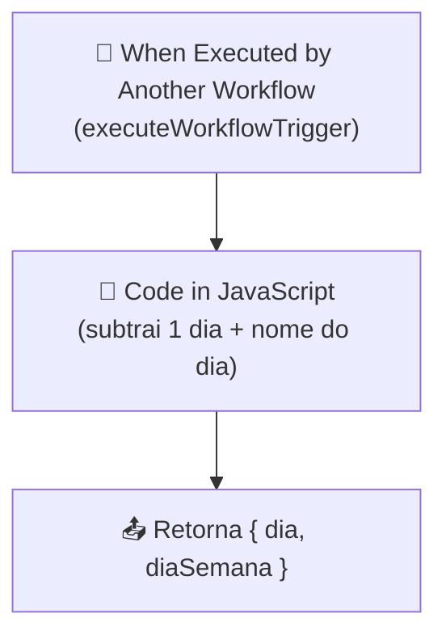

# Workflow: `verifica_dia_da_semana`

> **Status n8n**: Ativo
> **Trigger**: Execute Workflow (sub-workflow, chamado por outro fluxo)
> **ID n8n**: `TsLWZutNGAU6g3S4OEvfJ`
> **Tag**: Mindflow
> **Última execução analisada**: _Sem execuções registradas (executions.json vazio)_

---

## Descrição Geral

Sub-workflow utilitário (helper). Recebe uma data ISO (`dia`) de outro workflow via `executeWorkflowTrigger`, subtrai 1 dia e devolve a data anterior (`YYYY-MM-DD`) junto com o nome do dia da semana em português (`domingo`, `segunda-feira`, ...). É chamado, com alta probabilidade, pelo orquestrador `Disparo Mindflow` para decidir se a referência de "ontem" cai em dia útil antes de disparar campanhas/ligações.

## Diagrama de Fluxo



## Comunicação com Outros Workflows

| Direção | Workflow | Mecanismo | Método | Dados Passados |
|---------|----------|-----------|--------|----------------|
| ← Recebe de | `disparo_mindflow` (provável) | `executeWorkflow` (chamada interna n8n) | n/a | `{ dia: "YYYY-MM-DD" }` |
| → Retorna para | workflow chamador | retorno direto do n8n | n/a | `{ dia, diaSemana }` |

> **Não há chamada HTTP externa**. Toda a comunicação é interna ao n8n via `executeWorkflowTrigger`. Sem webhook, sem credenciais, sem rastreabilidade EDW propagada (o trigger só recebe `dia` — `execution_id`, `from_workflow` e `workflow_id` não chegam aqui).

### Dados de Rastreabilidade

| Campo | Valor/Origem | Obrigatório | Presente? |
|-------|-------------|-------------|-----------|
| `execution_id` | n/a (sub-workflow puro) | ❌ | ❌ |
| `from_workflow` | n/a | ❌ | ❌ |
| `workflow_id` | n/a | ❌ | ❌ |

> **Divergência EDW**: este fluxo opera sem rastreabilidade pois é puramente funcional. Em Python isto NÃO precisa virar um step `workflow_step_executions` — é candidato natural a função helper compartilhada (ver Migration Brief).

## Exemplos de Payload Real (anonimizado)

_Sem execução recente disponível_ (`executions.json` retornou `{"data": [], "nextCursor": null}`).

Exemplo derivado do `pinData` do próprio JSON:

**Trigger input**:
```json
{
  "dia": "2025-12-12"
}
```

**Output esperado** (segundo a lógica do nó Code):
```json
{
  "dia": "2025-12-11",
  "diaSemana": "quinta-feira"
}
```

> **Atenção**: o código retorna o **dia anterior** (`setDate(getDate() - 1)`), não o dia de entrada. O nome `diaSemana` corresponde ao dia anterior, não ao input.

## Detalhamento dos Nós

### 1. `When Executed by Another Workflow` (📝 Trigger)
- **Tipo n8n**: `n8n-nodes-base.executeWorkflowTrigger` (v1.1)
- **Descrição**: Ponto de entrada do sub-workflow. Só dispara quando outro workflow chama este via nó `Execute Workflow`.
- **Configuração**: `workflowInputs.values = [{ name: "dia" }]` — declara um único campo de entrada `dia` (string ISO date).
- **Saídas**: → `Code in JavaScript`

### 2. `Code in JavaScript` (🔧 Transform)
- **Tipo n8n**: `n8n-nodes-base.code` (v2)
- **Descrição**: Função pura. Lê `dia` (ISO date), cria `Date`, subtrai 1 dia, formata `YYYY-MM-DD` e mapeia `getDay()` para nome em português via array fixo `["domingo", "segunda-feira", ..., "sábado"]`.
- **Lógica**:
  ```js
  const data = new Date(diaInput);
  data.setDate(data.getDate() - 1);
  const diaAnterior = data.toISOString().split("T")[0];
  const diaSemana = diasSemana[data.getDay()];
  return [{ json: { dia: diaAnterior, diaSemana } }];
  ```
- **Saídas**: retorno final do sub-workflow (consumido pelo chamador).

## Variáveis de Ambiente Utilizadas

_Nenhuma._ O workflow não acessa env vars, banco, nem APIs externas.

## Credenciais n8n Utilizadas

_Nenhuma._

---

## Migration Brief — Antigravity / Python

> **Endpoint interno: chamado pelo orquestrador, não endpoint HTTP.** Este fluxo é um sub-workflow `executeWorkflowTrigger` — não tem webhook próprio, não recebe payload externo, não retorna 202.

### Recomendação: virar função helper compartilhada (não step EDW completo)

Dada a natureza puramente funcional (data → data−1 + nome do dia, sem I/O, sem efeitos colaterais, sem rastreabilidade), **NÃO** justifica criar:
- registro mestre em `workflow_executions`;
- step em `workflow_step_executions`;
- endpoint FastAPI próprio;
- job ARQ;
- retries (`run_step_with_retry`).

**Proposta**: implementar como utilitário em `utils/datetime_helpers.py` (ou similar), reutilizado por qualquer workflow Python que precise da informação. Segue convenção de timezone (`America/Sao_Paulo`) já estabelecida no `conventions.md`.

#### Assinatura sugerida (documentação, NÃO implementação)

```python
# utils/datetime_helpers.py
from datetime import date
from typing import TypedDict

class DiaAnteriorInfo(TypedDict):
    dia: str          # "YYYY-MM-DD" (dia anterior ao input)
    dia_semana: str   # "domingo" .. "sábado"

def verifica_dia_da_semana(dia_iso: str) -> DiaAnteriorInfo:
    """
    Recebe data ISO (qualquer fuso ou só YYYY-MM-DD), retorna o dia anterior
    formatado em YYYY-MM-DD e o nome do dia da semana em português.

    Substitui o sub-workflow n8n `verifica_dia_da_semana` (TsLWZutNGAU6g3S4OEvfJ).
    """
```

### Pontos de Atenção / Divergências do EDW

- **Não é step EDW**: helper puro, sem persistência. Quem chama (ex: `disparo_mindflow` migrado) é quem registra o step "decisão de dia útil" se necessário.
- **Bug latente no JS atual**: `new Date("2025-12-12")` no Node interpreta como UTC midnight; em fuso `America/Sao_Paulo` (UTC-3) `getDay()` ainda devolve quinta para 11/12/2025, mas para datas próximas a fronteiras de fuso pode haver off-by-one. Na migração Python, usar `datetime.date.fromisoformat()` evita o problema (`date` não tem fuso).
- **Semântica confusa do nome**: o workflow chama-se "Verifica dia da semana" mas faz **dia anterior + nome**. Confirmar com o time se o consumidor realmente quer o dia anterior (lógica de "ontem foi dia útil?") ou se o `-1` é um bug histórico. Na função Python, considerar nome mais claro: `dia_anterior_com_nome()` ou aceitar parâmetro `offset_dias: int = -1`.
- **Não viola stack proibida**: nada de Flask/`requests`/`time.sleep`/`BackgroundTasks`/`APScheduler` — função síncrona pura é OK (não há I/O para justificar async).
- **Sem credenciais, sem env vars**: migração é trivial.

### Status de Migração

- [x] Documentado
- [ ] Helper Python implementado (`utils/datetime_helpers.py::verifica_dia_da_semana`)
- [ ] Consumidores (`disparo_mindflow`, etc.) refatorados para chamar o helper em vez do sub-workflow
- [ ] Sub-workflow n8n desativado
- [ ] Validado em ambiente de teste
