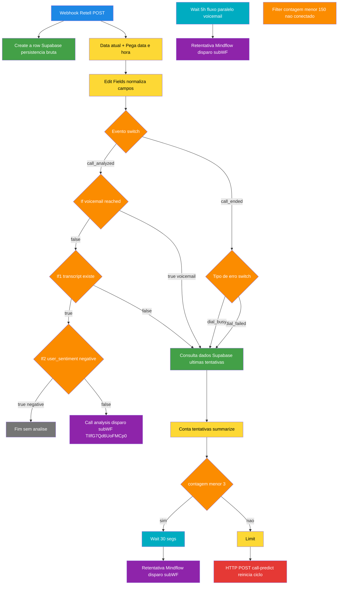

# Workflow: `webhook_ligacao_mindflow_disparo`

> **Status n8n**: Ativo
> **Trigger**: Webhook (POST `/webhook/24694b61-6d8e-43b7-95d3-15d9395d53e1`)
> **ID n8n**: `mMC4xqHJMyTTQmZe`
> **Slug**: `webhook-ligacao-mindflow-disparo`
> **Tag**: `Mindflow`
> **Projeto n8n**: Gabriel (`Lf5I2sykx1cKIGxc`)
> **Última execução analisada**: `494006` em `2026-05-13T22:36:36Z`
> **Total de nós**: 21

---

## 1. Descrição Geral

Este workflow é o **receiver central de eventos pós-chamada da Retell AI no fluxo OUTBOUND/DISPARO** da Mindflow. Recebe webhooks `call_ended` e `call_analyzed` enviados pela Retell ao final de cada ligação disparada pelo agente `Agente Mindflow Disparo` (`agent_1e4cfa23e3910c557d82167949`).

Atua como **hub de decisão pós-call** com três responsabilidades:

1. **Persistência bruta** — grava todos os dados crus da chamada (`call_id`, transcript, custos, agent, recording_url) na tabela `Retell_calls_Mindflow` do Supabase, imediatamente após receber o webhook.
2. **Classificação e retentativa** — para `call_ended`, ramifica conforme `disconnection_reason` (`dial_failed`, `dial_busy`, `voicemail_reached`, etc.) e conta tentativas anteriores nos últimos 10 minutos para decidir se aciona o sub-workflow `Retentativa Mindflow disparo` (`UUWtrT5gnevKHt1p`) ou se inicia um novo ciclo via `call_predict` (HTTP POST).
3. **Disparo de análise pós-chamada** — para `call_analyzed` com transcript válido e sentimento não-negativo, invoca o sub-workflow `Call analisys mindflow disparo` (`TIlfG7Qd6UoFMCp0`) passando transcrição, número, nome, prompt e email do lead.

Diferenciação importante: este workflow é o **par "disparo"** de `webhook_ligacao` (`E4KkBa9...`), que cumpre função análoga no fluxo WhatsApp/inbound. Ambos têm a mesma forma (receiver Retell), mas chamam pipelines distintos.

**Relacionamentos críticos:**
- ⬅ Chamado por: **Retell AI** (webhook configurado no agente de disparo).
- ➡ Chama: `Call analisys mindflow disparo` (análise/classificação da transcrição) + `Retentativa Mindflow disparo` (lógica de retentativa) + `call-predict-github` (recomeço de ciclo via HTTP).

---

## 2. Diagrama de Fluxo



---

## 3. Comunicação com Outros Workflows

### 3.1 Quem chama este workflow

| Origem | Como chama | Path |
|--------|-----------|------|
| **Retell AI** (externo) | Webhook POST configurado no agente `agent_1e4cfa23e3910c557d82167949` | `https://<n8n-host>/webhook/24694b61-6d8e-43b7-95d3-15d9395d53e1` |

A Retell envia evento bruto com header `x-retell-signature: v=<ts>,d=<hmac>` (HMAC para validação — atualmente **não validada** no n8n).

### 3.2 Quem este workflow chama

| Direção | Workflow / Serviço | ID | Endpoint / Método | Quando dispara | Payload Enviado |
|---------|--------------------|----|--------------------|----------------|------------------|
| → SubWF (`executeWorkflow`) | `Call analisys mindflow disparo` | `TIlfG7Qd6UoFMCp0` | invoke local | `event=call_analyzed` + transcript não vazio + sentimento ≠ negative | `transcrição`, `numero`, `nome`, `prompt`, `Email_Lead` |
| → SubWF (`executeWorkflow`) | `Retentativa Mindflow disparo` | `UUWtrT5gnevKHt1p` | invoke local (`waitForSubWorkflow:true`) | (a) Wait 30s após `dial_failed`/`dial_busy`/`voicemail` com `<3` tentativas; (b) Wait 5h em fluxo paralelo | `evento`, `Nome`, `Email`, `data`, `Numero`, `status` (= contexto Retell), `disconnection_reason` |
| → HTTP POST externo | `call-predict-github` (Python EDW já em produção) | n/a | `POST https://call-predict-github.bkpxmb.easypanel.host/webhook/predict` | Após `Limit`, quando ramo `<3?` falso (ciclo de retentativa esgotado → reinicia predict) | `numero`, `agent_id`, `nome`, `email`, `Prompt_id` (= "24"), `contexto` |
| → Supabase | tabela `Retell_calls_Mindflow` | n/a | Insert direto (nó "Create a row") + GetAll (nó "Consulta dados") | Sempre (insert) / quando precisa contar tentativas | dump completo do payload Retell |

### 3.3 Mapa textual da comunicação

```
[Retell AI] ---(POST /webhook/24694b...)---> [webhook_ligacao_mindflow_disparo]
  Payload: { event, call: { call_id, agent_id, transcript, disconnection_reason, call_analysis, retell_llm_dynamic_variables{customer_name, email, contexto, prompt, numero_do_lead}, ... } }
  Auth: x-retell-signature HMAC (NÃO validado no n8n — gap)

[webhook_ligacao_mindflow_disparo] ---(executeWorkflow)---> [call_analisys_disparo (TIlfG7Qd6UoFMCp0)]
  Payload: { transcrição, numero, nome, prompt, Email_Lead }
  Rastreabilidade: NENHUMA (sem execution_id / from_workflow / workflow_id) — gap EDW

[webhook_ligacao_mindflow_disparo] ---(executeWorkflow waitForSubWorkflow:true)---> [retentativa_disparo (UUWtrT5gnevKHt1p)]
  Payload: { evento, Nome, Email, data, Numero, status (=contexto), disconnection_reason }
  Rastreabilidade: NENHUMA — gap EDW

[webhook_ligacao_mindflow_disparo] ---(POST /webhook/predict)---> [call-predict-github]
  Auth: X-API-Key: mf_sk_2026_pre_call_xK9v3Qm7bR4wT1nZ  (hardcoded — gap)
  Payload: { numero, agent_id, nome, email, Prompt_id="24", contexto }
```

---

## 4. Dados de Rastreabilidade EDW

| Campo EDW | Valor / Origem no workflow atual | Obrigatório | Gap |
|-----------|----------------------------------|-------------|-----|
| `workflow_id` | **Ausente** (n8n não passa) | ✅ | ❌ Não emitido nas sub-WF / HTTP |
| `from_workflow` | **Ausente** | ✅ | ❌ Receptor não sabe que veio de cá |
| `execution_id` | n8n internal apenas (não propagado) | ✅ | ❌ Não atravessa fronteiras |
| `workflow_executions` / `workflow_step_executions` | **Não existe** | ✅ | ❌ Persistência bruta vai só p/ `Retell_calls_Mindflow` |

**Observação**: o `body.call.metadata.workflow_execution_id` que aparece no payload da Retell (`67dc3014-...` / `f0df00da-...`) é o `execution_id` do **`pre_call_processing`** (`call_predict`) que originou a chamada — vem propagado pela Retell. Pode ser usado como FK de origem na migração EDW.

---

## 5. Exemplo de Payload Real (anonimizado)

**Trigger input** — execução `494006` em `2026-05-13T22:36:36Z` (HTTP body recebido da Retell):

```json
{
  "event": "call_ended",
  "call": {
    "call_id": "call_4df0d695a64bd225aebe0d36fc4",
    "call_type": "phone_call",
    "agent_id": "agent_1e4cfa23e3910c557d82167949",
    "agent_version": 8,
    "agent_name": "Agente Mindflow Disparo",
    "retell_llm_dynamic_variables": {
      "customer_name": "<NOME>",
      "prompt": "<PROMPT_SDR_KAIQUE_TRUNCADO>",
      "now": "2026-05-13T22:36:01.825847+00:00",
      "contexto": "Primeiro contato. Nome da empresa: <EMPRESA>\nSegmento: <SEGMENTO>. Você já tentou contato com esta pessoa e não obteve sucesso...",
      "numero_do_lead": "+55XX9XXXXXXXX",
      "email": "<EMAIL>"
    },
    "custom_sip_headers": {
      "X-RetellAI-Direction": "Outbound",
      "X-RetellAI-CallId": "call_4df0d695a64bd225aebe0d36fc4",
      "X-RetellAI-OrgId": "org_<REDACTED>"
    },
    "call_status": "not_connected",
    "duration_ms": 0,
    "transcript": "",
    "disconnection_reason": "dial_no_answer",
    "metadata": {
      "workflow_execution_id": "f0df00da-7734-4a46-8cad-a9ee7a887c08",
      "workflow_name": "pre_call_processing"
    },
    "call_cost": { "combined_cost": 0 },
    "from_number": "iatizeia",
    "to_number": "+55XX9XXXXXXXX",
    "direction": "outbound"
  },
  "event_timestamp": 1778711795402
}
```

**Resposta** (nó Webhook):
```
HTTP 200
"sucsess"
```
(typo original mantido no n8n: `responseData: "sucsess"`)

---

## 6. Detalhamento dos Nós (21 nós)

### 6.1 Trigger e persistência paralela
- **`Webhook`** (📨 webhook): `POST /webhook/24694b61-...`. Recebe payload Retell. Resposta imediata `"sucsess"`. Sem auth no n8n.
- **`Create a row`** (🗄️ supabase): Inserção em `Retell_calls_Mindflow` com 22 campos do payload (Nome, Email, Numero, status, `call_id` extraído de `custom_sip_headers["X-RetellAI-CallId"]`, transcript, recording_url, custos `eleven_labs_cost`/`LLM_cost`/`combined_cost`, `from_number`, `to_number`, `Duracao`, `data` formatada `dd/MM/yyyy HH`). Roda em paralelo ao fluxo de decisão.

### 6.2 Normalização
- **`Data_atual`** (🔧 dateTime): obtém `currentDate` (now).
- **`Pega data e hora`** (🔧 dateTime): formata como `dd/MM/yyyy HH` no campo `hora_e_dia`.
- **`Edit Fields`** (🔧 set): empacota `evento`, `Nome`, `Email`, `data(hora)`, `Numero` (= `to_number`), `status` (= `call_status`), `disconnection_reason`, `hora_e_dia` num único item canônico usado pelas decisões adiante.

### 6.3 Switch de evento
- **`Evento`** (⚖️ switch): roteia por `evento`:
  - `call_ended` → **`Tipo de erro`**
  - `call_analyzed` → **`If`** (voicemail check)

### 6.4 Ramo `call_ended` (falhas de discagem)
- **`Tipo de erro`** (⚖️ switch): roteia por `disconnection_reason` em `dial_failed` e `dial_busy` (ambos seguem ao mesmo destino `Consulta dados`). Outros tipos caem implicitamente.
- **`Consulta dados`** (🗄️ supabase getAll): `Retell_calls_Mindflow` filtrado por `Numero = $json.Numero` AND `created_at > now-10min`. **BUG no JSON**: filtro escrito como `$now.minus(10. 'minutes')` (ponto em vez de vírgula) — provavelmente é uma string-literal-fallback que n8n aceita silenciosamente; revisar na migração.
- **`Conta tentativas`** (🔧 summarize): conta linhas no campo `data` → `count_data`.
- **`<3?`** (⚖️ if): `count_data < 4` → caminho de retentativa rápida.
- **`Wait 30 secs`** (⏰ wait 30s) → **`Call 'Retentativa Mindflow disparo'`** (subWF `UUWtrT5gnevKHt1p`, `waitForSubWorkflow:true`).
- **`Limit`** (🔩 limit) → **`HTTP Request`** (📤 POST `call-predict-github/webhook/predict`) — reinicia o ciclo de predição quando o "contador rápido" sai do caminho `Wait+Retentativa` (ramo `false` do `<3?`).

### 6.5 Ramo `call_analyzed`
- **`If`** (⚖️ if): `disconnection_reason == "voicemail_reached"` → ramo true vai para `Consulta dados` (entra na lógica de retentativa); ramo false → `If1`.
- **`If1`** (⚖️ if): `transcript_object[0].content` existe? false → `Consulta dados`; true → `If2`.
- **`If2`** (⚖️ if): `call_analysis.user_sentiment == "negative"`? true → fim sem análise; false → `Call_analysis` (subWF `TIlfG7Qd6UoFMCp0`).
- **`Call_analysis`** (📤 executeWorkflow): chama `Call analisys mindflow disparo` passando `transcrição`, `numero`, `nome`, `prompt`, `Email_Lead`.

### 6.6 Fluxo paralelo "Wait 5h" (não conectado às decisões principais)
- **`Wait`** (⏰ wait 5.23 h) → **`Call 'Retentativa Mindflow disparo'1`** (subWF idêntico ao primeiro): aparentemente um gatilho de retentativa de prazo longo, mas no JSON atual **não tem upstream conectado** — possivelmente disparado manualmente ou órfão de edição.
- **`Filter`** (⚖️ filter `count_data < 150`): também sem upstream conectado, com saída vazia. Provavelmente uma proteção anti-loop (limitar a 150 tentativas globais) que foi desconectada — investigar antes de migrar.

---

## 7. Variáveis de Ambiente Utilizadas (estado atual n8n)

| Variável | Uso no Workflow | Comentário |
|----------|-----------------|------------|
| n/a (Supabase credencial) | Conexão à tabela `Retell_calls_Mindflow` | Resolvida via credencial `supabase Mindflow` |
| `X-API-Key` (hardcoded `mf_sk_2026_pre_call_xK9v3Qm7bR4wT1nZ`) | Auth do POST para `call-predict-github` | ❌ **Hardcoded no nó** — extrair para env var `CALL_PREDICT_API_KEY` na migração |
| URL `call-predict-github.bkpxmb.easypanel.host` | Destino HTTP | ✅ Migrar para `CALL_PREDICT_URL` |

---

## 8. Credenciais n8n Utilizadas

| Nome da Credencial | Tipo | ID interno | Nós que usam |
|--------------------|------|-----------|--------------|
| `supabase Mindflow` | `supabaseApi` | `xPgzw7ayw9gmHNlh` | `Create a row`, `Consulta dados` |

Sem credencial dedicada para a Retell (entrada não validada) nem para o `call-predict` (auth hardcoded).

---

## 9. Migration Brief — Antigravity / Python (EDW)

> Especificação para o agente do Antigravity reimplementar este workflow em Python conforme `Usefull_Skills/docs/conventions.md`.

### 9.1 Camada API (FastAPI)

- **Endpoint sugerido**: `POST /webhook/retell/disparo` (path único; opcionalmente manter o UUID legado `/webhook/24694b61-6d8e-43b7-95d3-15d9395d53e1` como alias durante transição).
- **Resposta**: `202 Accepted` + `{ "execution_id": "<uuid>" }`.
- **Validações** (Pydantic, `schemas.py`):

```python
class RetellWebhookDisparoInput(BaseModel):
    event: Literal["call_ended", "call_analyzed", "call_started"]
    call: RetellCall  # call_id, agent_id, transcript, disconnection_reason,
                     # call_analysis, retell_llm_dynamic_variables (customer_name,
                     # email, contexto, prompt, numero_do_lead), call_cost,
                     # custom_sip_headers, metadata (workflow_execution_id, workflow_name),
                     # to_number, from_number, duration_ms, ...
    event_timestamp: int
```

- **Auth**: validar header `x-retell-signature` (HMAC `v=<ts>,d=<hmac>`) contra secret `RETELL_WEBHOOK_SECRET`. Atualmente NÃO validado — fechar gap na migração.
- **Comportamento da API**: criar registro mestre em `workflow_executions` (status `PENDING`, `input_data` = payload bruto, `workflow_name` = `webhook_ligacao_mindflow_disparo`, `from_workflow` = `retell_ai`, `parent_execution_id` = `call.metadata.workflow_execution_id` se presente). Enfileirar job ARQ `process_retell_event` e responder 202.

### 9.2 Camada Worker (ARQ)

Padrão `{workflow}_{OQF}` com prefixo `webhook_ligacao_mindflow_disparo_`. Cada step via `run_step_with_retry`.

| # | Nó n8n | Step EDW | I/O | Lib Python | Retries | Async |
|---|--------|----------|-----|------------|---------|-------|
| 1 | `Create a row` | `webhook_ligacao_mindflow_disparo_persist_raw_call` | in: payload Retell → out: row_id `Retell_calls_Mindflow` | `supabase` singleton | 3 | sim |
| 2 | `Edit Fields` + `Data_atual` + `Pega data e hora` | `webhook_ligacao_mindflow_disparo_normalize_fields` | in: payload → out: `{evento, Nome, Email, Numero, status, disconnection_reason, hora_e_dia}` | puro Python (zoneinfo) | 0 | sim |
| 3 | `Evento` (switch) | `webhook_ligacao_mindflow_disparo_route_event` | decisão `if event == "call_ended": ... elif event == "call_analyzed": ...` | puro Python | 0 | sim |
| 4 | `Consulta dados` + `Conta tentativas` | `webhook_ligacao_mindflow_disparo_count_recent_attempts` | in: numero, janela=10min → out: count | `supabase` singleton | 3 | sim |
| 5 | `<3?` + `Wait 30 secs` | `webhook_ligacao_mindflow_disparo_schedule_retry` | se `count < 4`: `await arq.enqueue_job("call_retentativa_disparo", payload, _defer_until=now+30s)`. Senão: chama step 6 | `arq` | 0 | sim |
| 6 | `Limit` + `HTTP Request` | `webhook_ligacao_mindflow_disparo_call_predict_restart` | POST `CALL_PREDICT_URL` com `X-API-Key` env | `httpx.AsyncClient` | 3 | sim |
| 7 | `If` (voicemail) + `If1` (transcript) + `If2` (sentiment) | `webhook_ligacao_mindflow_disparo_evaluate_analysis` | retorna `"analyze" | "retry" | "drop"` | puro Python | 0 | sim |
| 8 | `Call_analysis` (subWF) | `webhook_ligacao_mindflow_disparo_invoke_call_analysis` | POST interno `call_analisys_disparo` com `{transcrição, numero, nome, prompt, Email_Lead, execution_id, from_workflow}` | `httpx.AsyncClient` (ou enqueue ARQ se compartilharem Redis) | 3 | sim |
| 9 | `Wait 5h` + `Call 'Retentativa Mindflow disparo'1` | `webhook_ligacao_mindflow_disparo_schedule_long_retry` | `arq.enqueue_job(..., _defer_until=now+5h23min)` | `arq` | 0 | sim |

### 9.3 Comunicação Externa

| Destino | Método | URL | Auth | Payload | Lib |
|---------|--------|-----|------|---------|-----|
| `call_predict` (EDW Python já existente) | POST | `${CALL_PREDICT_URL}/webhook/predict` | header `X-API-Key: ${CALL_PREDICT_API_KEY}` | `{numero, agent_id, nome, email, Prompt_id, contexto, from_workflow, parent_execution_id}` | `httpx.AsyncClient` |
| `call_analisys_disparo` (a migrar) | POST | `${CALL_ANALYSIS_DISPARO_URL}/webhook/analyze` | `X-API-Key` | `{transcrição, numero, nome, prompt, Email_Lead, execution_id, from_workflow}` | `httpx.AsyncClient` |
| `retentativa_disparo` (a migrar) | POST | `${RETENTATIVA_DISPARO_URL}/webhook/retry` | `X-API-Key` | `{evento, Nome, Email, data, Numero, status, disconnection_reason, execution_id, from_workflow}` | `httpx.AsyncClient` |
| Supabase `Retell_calls_Mindflow` | upsert/select | — | service role key | — | `supabase` singleton |

### 9.4 Variáveis de Ambiente (.env)

| Variável | Uso |
|----------|-----|
| `SUPABASE_URL` / `SUPABASE_SERVICE_KEY` | Client singleton |
| `REDIS_URL` | ARQ (Easypanel injeta DSN) — usar `RedisSettings.from_dsn` |
| `RETELL_WEBHOOK_SECRET` | Validar HMAC `x-retell-signature` |
| `CALL_PREDICT_URL` | Base URL `https://call-predict-github.bkpxmb.easypanel.host` |
| `CALL_PREDICT_API_KEY` | Atual `mf_sk_2026_pre_call_xK9v3Qm7bR4wT1nZ` (rotacionar) |
| `CALL_ANALYSIS_DISPARO_URL` / `_API_KEY` | Quando `call_analisys_disparo` for migrado |
| `RETENTATIVA_DISPARO_URL` / `_API_KEY` | Quando `retentativa_disparo` for migrado |

### 9.5 Rastreabilidade Obrigatória

- `workflow_id`: `webhook_ligacao_mindflow_disparo_v1` (constante).
- `from_workflow`: `retell_ai` quando vem da Retell; propagar para os sub-workflows como `webhook_ligacao_mindflow_disparo`.
- `execution_id`: UUID gerado pela API; obrigatório em todos os payloads outbound.
- `parent_execution_id`: extrair de `call.metadata.workflow_execution_id` (Retell propaga o execution_id do `pre_call_processing` que originou a ligação).
- Persistir em `workflow_executions` (master) + `workflow_step_executions` (detail).

### 9.6 Divergências e Pontos de Atenção do EDW

- ❌ **`Wait 5h` órfão**: o nó `Wait` (5.23 h) → `Call 'Retentativa Mindflow disparo'1` não tem upstream conectado no JSON atual. Confirmar com o usuário se é fluxo morto ou se a edição foi quebrada. Se ativo, precisa de gatilho explícito (ex: ramo do `If1`/`If2`) na implementação Python.
- ❌ **`Filter < 150`** também órfão (sem upstream nem downstream útil). Provável guardrail anti-loop desconectado.
- ❌ **`Tipo de erro` saídas duplicadas**: tanto `dial_failed` quanto `dial_busy` apontam para `Consulta dados`. Outras `disconnection_reason` (ex.: `dial_no_answer` — que apareceu na execução real `494006`!) **caem fora do switch** e não acionam retentativa. Bug latente — `dial_no_answer` é o caso mais comum.
- ❌ **Bug na expressão**: `$now.minus(10. 'minutes')` (ponto em vez de vírgula) no nó `Consulta dados`. n8n provavelmente trata como string. Reescrever como `(now() - interval '10 minutes')` ou parâmetro Python.
- ❌ **API Key hardcoded** no nó `HTTP Request`. Mover para env var antes da migração.
- ❌ **Sem validação HMAC** do header `x-retell-signature`. Implementar na API FastAPI.
- ❌ **Sem rastreabilidade EDW** em nenhuma das chamadas inter-workflow atuais — implementar `execution_id`, `from_workflow`, `workflow_id` em todos os payloads outbound.
- ❌ **Persistência paralela ao fluxo de decisão**: `Create a row` roda direto após o Webhook. Em EDW, virar `step 1` (persistência síncrona dentro do worker) com `run_step_with_retry` para garantir registro mesmo se `process_retell_event` falhar.
- ⚠️ **Tabela `Retell_calls_Mindflow` é "tabela legado"** — em EDW, considerar normalizar em `calls` + `call_costs` ou manter como sink legado para compatibilidade com `call_analisys` que lê dela.
- ⚠️ **Tempo de retentativa "rápida" = 30s** parece curto demais para `dial_no_answer` (linha tocou e ninguém atendeu). Confirmar política com produto.
- ⚠️ **`call.metadata.workflow_execution_id`**: Retell propaga o execution_id do `pre_call_processing` original — usar como `parent_execution_id` para correlacionar a árvore de execuções.

### 9.7 Status de Migração

- [x] Documentado
- [ ] Schemas Pydantic definidos
- [ ] Validação HMAC `x-retell-signature` implementada
- [ ] API endpoint `POST /webhook/retell/disparo` implementado
- [ ] Worker steps `webhook_ligacao_mindflow_disparo_*` implementados
- [ ] Integração com `call_analisys_disparo` migrado
- [ ] Integração com `retentativa_disparo` migrado
- [ ] Tabelas `workflow_executions` / `workflow_step_executions` populadas
- [ ] Validado em ambiente de teste
- [ ] Migrado em produção
