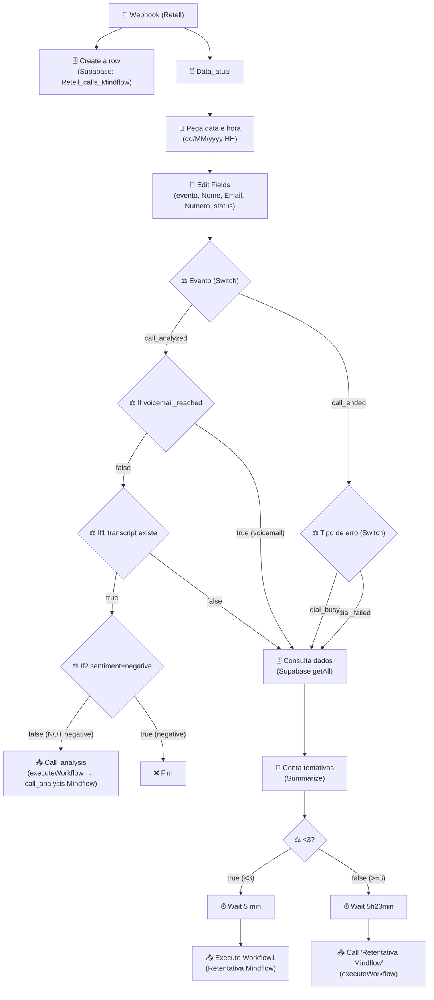

# Workflow: `webhook_ligacao`

> **Status n8n**: Ativo
> **Trigger**: Webhook (POST `/webhook/71ebee5e-0185-42e4-9259-91f4e19252d6`)
> **ID n8n**: `E4KkBa9_ECTmg2wNyxlzj`
> **Tag**: `Mindflow`
> **Última execução analisada**: `489685` em `2026-05-09T13:02:29Z` (status: success, evento `call_ended`)
> **Owner**: Gabriel Neves (`gabriel.neves@iatize-ia.com`)
> **Diferenciação**: este e o receptor de eventos do Retell AI (post-call). Nao confundir com `webhook_ligacao_disparo` (id `mMC4xqHJMyTTQmZe`), que e o disparador de ligacoes.

---

## Descricao Geral

Este workflow recebe webhooks do **Retell AI** com eventos `call_ended` e `call_analyzed` ao final de cada ligacao. Para todo evento, persiste a linha completa da ligacao na tabela `Retell_calls_Mindflow` do Supabase (custos, transcript, agent, duracao, etc.). Em paralelo, ramifica a logica:

- Se `event = call_ended`: classifica a falha (`dial_failed` / `dial_busy`) e, se houve menos de 3 tentativas para o mesmo numero/hora, agenda uma **retentativa** via subworkflow `Retentativa Mindflow` (`B_AOhnNcx8fvQZusnu9N0`) - imediata (5min) ou tardia (5h23min).
- Se `event = call_analyzed`: se a ligacao caiu em **voicemail**, segue a mesma logica de retentativa; caso contrario, se houve transcript e sentimento NAO foi `negative`, dispara o subworkflow `call_analysis Mindflow` (`2W8Is-KvdM-m4nSfM2IHc`) para classificacao da conversa.

## Diagrama de Fluxo



> **Observacao**: a logica do `<3?` esta invertida em relacao ao label - a saida `true` (count<3) leva ao `Wait 5 min` + Retentativa imediata; a saida `false` (count>=3) leva ao `Wait 5h23min` + Retentativa tardia. Esse comportamento deve ser questionado/validado durante a migracao (provavel bug ou semantica nao-obvia).

## Comunicacao Inter-Workflows

| Direcao | Workflow | Endpoint/Mecanismo | Metodo | Dados Passados |
|---------|----------|--------------------|--------|----------------|
| Recebe de | **Retell AI** (externo) | `POST /webhook/71ebee5e-...` | POST | payload Retell (`event`, `call.*`) |
| Envia para | `call_analysis_mindflow` (id `2W8Is-KvdM-m4nSfM2IHc`) | n8n `executeWorkflow` (sub) | n/a | `transcricao`, `numero`, `nome`, `prompt`, `Email_Lead` |
| Envia para | `retentativa_mindflow` (id `B_AOhnNcx8fvQZusnu9N0`) | n8n `executeWorkflow` (sub, `waitForSubWorkflow=true`) | n/a | `evento`, `Nome`, `Email`, `data`, `Numero`, `status`, `disconnection_reason` |

### Dados de Rastreabilidade

| Campo | Valor/Origem | Obrigatorio |
|-------|--------------|-------------|
| `execution_id` | Nao implementado (gerado pelo n8n internamente) | Nao no atual |
| `from_workflow` | Nao implementado | Nao no atual |
| `workflow_id` | Nao implementado | Nao no atual |
| `call_id` (Retell) | `body.call.call_id` | Sim (chave de negocio) |
| `to_number` | `body.call.to_number` | Sim |

> Workflow atual NAO segue rastreabilidade EDW. A migracao precisa adicionar `workflow_id` / `from_workflow` / `execution_id`.

## Payload Real (anonimizado)

**Trigger input** (execucao `489685`, `event=call_ended`):

```json
{
  "headers": {
    "host": "n8n-mcp-n8n.bkpxmb.easypanel.host",
    "user-agent": "axios/1.15.2",
    "content-type": "application/json",
    "x-retell-signature": "v=<REDACTED>,d=<REDACTED>"
  },
  "body": {
    "event": "call_ended",
    "call": {
      "call_id": "call_b7559010ef20eb3a8e72252a524",
      "call_type": "phone_call",
      "agent_id": "agent_2117bcaaf68e8b7cc8e0d160f7",
      "agent_version": 6,
      "agent_name": "Agente Mindflow (Formulario)",
      "retell_llm_dynamic_variables": {
        "customer_name": "<NOME>",
        "prompt": ".",
        "now": "2026-05-09T12:52:29.626Z",
        "contexto": ". ",
        "email": "<EMAIL>",
        "numero_do_lead": "+55XX9XXXXXXXX"
      },
      "custom_sip_headers": {
        "X-RetellAI-CallId": "call_b7559010ef20eb3a8e72252a524",
        "X-RetellAI-Direction": "Outbound",
        "X-RetellAI-OrgId": "org_c4SmbD6TPuQtpq3V"
      },
      "call_status": "ended",
      "start_timestamp": 1778331162298,
      "end_timestamp": 1778331743874,
      "duration_ms": 581576,
      "transcript": "Agent: Oi, <NOME>, tudo bem? ...",
      "transcript_object": [ { "role": "agent", "content": "...", "words": [...] } ],
      "disconnection_reason": "user_hangup",
      "call_cost": {
        "product_costs": [
          {"product": "elevenlabs_tts", "cost": 0.0},
          {"product": "voice_engine", "cost": 0.0},
          {"product": "gpt-4o-mini", "cost": 0.0},
          {"product": "llm_token_usage", "cost": 0.0}
        ],
        "combined_cost": 0
      },
      "from_number": "11111",
      "to_number": "+55XX9XXXXXXXX",
      "direction": "outbound"
    }
  }
}
```

**Output final**: sem resposta HTTP customizada (workflow nao tem `respondToWebhook`); o n8n responde 200 automatico apos o `Webhook` node. Os outputs uteis sao os side-effects:
- INSERT em `Retell_calls_Mindflow`
- Eventual chamada a `call_analysis_mindflow` ou `retentativa_mindflow` (subworkflows).

## Detalhamento dos Nos

### 1. `Webhook` (🔵 Trigger)
- **Tipo n8n**: `n8n-nodes-base.webhook` (v2.1)
- **Path**: `71ebee5e-0185-42e4-9259-91f4e19252d6`, metodo `POST`
- **Descricao**: recebe eventos `call_ended` e `call_analyzed` do Retell AI. Sem auth configurada no node (Retell envia `x-retell-signature` mas o workflow nao valida).
- **Saidas**: dispara em paralelo `Data_atual` (pipeline de logica) e `Create a row` (persistencia).

### 2. `Create a row` (🗄️ Output → Supabase)
- **Tipo**: `n8n-nodes-base.supabase` v1 (operation default `create`)
- **Tabela**: `Retell_calls_Mindflow`
- **Descricao**: insere uma linha por evento recebido, mapeando ~22 campos do `body.call` (Nome, Email, Numero, status, call_id, transcript, custos, durations, etc.). Nao agrega/upserta - duplica linha se `call_ended` e `call_analyzed` chegam para a mesma call (esperado).
- **Credencial**: `supabase Mindflow` (id `xPgzw7ayw9gmHNlh`).

### 3. `Data_atual` (🔧 Transform)
- **Tipo**: `n8n-nodes-base.dateTime` v2 (sem operacao - retorna `currentDate` em ISO).
- **Descricao**: obtem timestamp atual do servidor n8n. Necessario porque o proximo no formata para `dd/MM/yyyy HH` (chave usada para contar tentativas por hora).

### 4. `Pega data e hora` (🔧 Transform)
- **Tipo**: `n8n-nodes-base.dateTime` v2, operation `formatDate`
- **Descricao**: formata `currentDate` em `dd/MM/yyyy HH` e expoe como `hora_e_dia`. Esse campo e usado como filtro composto (numero + hora_e_dia) para contar tentativas dentro da mesma janela horaria.

### 5. `Edit Fields` (🔧 Transform)
- **Tipo**: `n8n-nodes-base.set` v3.4
- **Descricao**: extrai do `Webhook` os campos de negocio para variaveis flat: `evento`, `Nome`, `Email`, `Numero` (= `to_number`), `status` (`call_status`), `disconnection_reason`, `data(hora)` e re-deriva `hora_e_dia` (sobrescreve com `$now.format(...)` - inconsistencia: ja foi feito no no anterior).

### 6. `Evento` (⚖️ Decision - Switch)
- **Tipo**: `n8n-nodes-base.switch` v3.2
- **Regras**:
  - Output 0 (`Call ended`): `evento == "call_ended"` → vai para `Tipo de erro`.
  - Output 1 (`call_analyzed`): `evento == "call_analyzed"` → vai para `If`.
- Sem fallback configurado - eventos diferentes sao descartados (alem do INSERT que ja ocorreu).

### 7. `Tipo de erro` (⚖️ Decision - Switch, ramo `call_ended`)
- **Tipo**: `n8n-nodes-base.switch` v3.2
- **Regras** (sobre `disconnection_reason`):
  - Output 0 `Falha`: `== "dial_failed"` → `Consulta dados`.
  - Output 1 `dial_busy`: `== "dial_busy"` → `Consulta dados`.
- Demais reasons (ex: `user_hangup`) nao seguem - encerram aqui (apos o INSERT).

### 8. `If` (⚖️ Decision - voicemail, ramo `call_analyzed`)
- **Tipo**: `n8n-nodes-base.if` v2.2
- **Condicao**: `body.call.disconnection_reason == "voicemail_reached"`.
- **True** → `Consulta dados` (fluxo de retentativa).
- **False** → `If1`.

### 9. `If1` (⚖️ Decision - transcript existe)
- **Tipo**: `n8n-nodes-base.if` v2.2
- **Condicao**: `body.call.transcript_object[0].content` existe (atende a operator `exists`).
- **True** → `If2` (analisa sentimento).
- **False** → `Consulta dados` (sem transcript = trata como falha de conexao, vai contar tentativa).

### 10. `If2` (⚖️ Decision - sentimento negativo)
- **Tipo**: `n8n-nodes-base.if` v2.2
- **Condicao**: `body.call.call_analysis.user_sentiment == "negative"`.
- **True** → nada (fim - nao analisa nem retenta).
- **False** → `Call_analysis` (dispara classificacao da conversa).

### 11. `Consulta dados` (🗄️ Database - Supabase getAll)
- **Tipo**: `n8n-nodes-base.supabase` v1, operation `getAll`, `returnAll: true`
- **Tabela**: `Retell_calls_Mindflow`
- **Filtros**: `Numero == {{json.Numero}} AND data == {{json.hora_e_dia}}`
- **Descricao**: traz todas as linhas (tentativas) para o mesmo numero dentro da hora atual. Usado para contar tentativas.
- **`alwaysOutputData: true`**: passa adiante mesmo sem resultados.

### 12. `Conta tentativas` (🔧 Transform - Summarize)
- **Tipo**: `n8n-nodes-base.summarize` v1.1
- **Campo**: agrega `data` (count). Resultado vai em `count_data`.

### 13. `<3?` (⚖️ Decision - contagem)
- **Tipo**: `n8n-nodes-base.if` v2.2
- **Condicao**: `count_data < 3`.
- **True** → `Wait 5 min` (retentativa rapida).
- **False** → `Wait 5h23min` (retentativa tardia, ate 3+).
- **Atencao**: a semantica visualmente parece invertida - o nome "<3?" sugere "menos de 3 tentativas → retentar imediatamente", o que e razoavel, mas confirmar com o owner.

### 14. `Wait 5 min` (⏰ Wait)
- **Tipo**: `n8n-nodes-base.wait` v1.1, `unit: minutes`, default 1min (sem `amount` explicito).
- **Descricao**: pausa antes de chamar Retentativa para evitar burst. `webhookId` proprio para resumir o fluxo.

### 15. `Wait` (⏰ Wait 5h23min)
- **Tipo**: `n8n-nodes-base.wait` v1.1, `amount: 5.23, unit: hours`.
- **Descricao**: pausa longa antes de retentar quando ja houve 3+ tentativas na hora atual.

### 16. `Execute Workflow1` (📤 Output - Retentativa, ramo rapido)
- **Tipo**: `n8n-nodes-base.executeWorkflow` v1.2, `waitForSubWorkflow: true`
- **Target**: `B_AOhnNcx8fvQZusnu9N0` (`Retentativa Mindflow`)
- **Payload**: `{evento, Nome, Email, data=$now, Numero, status=contexto, disconnection_reason}`.

### 17. `Call 'Retentativa Mindflow'` (📤 Output - Retentativa, ramo tardio)
- **Tipo**: `n8n-nodes-base.executeWorkflow` v1.2, `waitForSubWorkflow: true`
- **Target**: `B_AOhnNcx8fvQZusnu9N0` (`Retentativa Mindflow`)
- **Payload**: identico ao no 16 exceto `data = Edit Fields.data` (preserva timestamp original do webhook ao inves de `$now`).

### 18. `Call_analysis` (📤 Output - subworkflow de classificacao)
- **Tipo**: `n8n-nodes-base.executeWorkflow` v1.2 (sem `waitForSubWorkflow` - fire-and-forget)
- **Target**: `2W8Is-KvdM-m4nSfM2IHc` (`call_analysis Mindflow`)
- **Payload**: `{transcricao, numero, nome=customer_name, prompt, Email_Lead}`.

## Variaveis de Ambiente Utilizadas

| Variavel | Uso no Workflow |
|----------|------------------|
| (nenhuma `$env.*` referenciada explicitamente) | Workflow usa apenas credencial Supabase armazenada no n8n |

> A URL do Supabase e a service key ficam dentro da credencial `supabase Mindflow` no cofre do n8n.

## Credenciais n8n Utilizadas

| Nome | Tipo | Nos que usam |
|------|------|--------------|
| `supabase Mindflow` (id `xPgzw7ayw9gmHNlh`) | `supabaseApi` | `Create a row`, `Consulta dados` |

---

## 🚀 Migration Brief - Antigravity / Python

> Especificacao para reimplementacao em Python (FastAPI + ARQ + Supabase) conforme `Usefull_Skills/docs/conventions.md`.

### Camada API (FastAPI)

- **Endpoint sugerido**: `POST /webhook/retell/ligacao`
- **Schema Pydantic de entrada** (`schemas.py`, declarativo - sem implementacao):

```python
class RetellCallCost(BaseModel):
    product_costs: list[dict] = []
    combined_cost: float = 0.0
    total_duration_seconds: float = 0.0

class RetellCallAnalysis(BaseModel):
    call_summary: Optional[str] = None
    in_voicemail: bool = False
    user_sentiment: Optional[str] = None   # "Positive" | "Negative" | "Neutral" | "Unknown"
    call_successful: bool = False
    custom_analysis_data: dict = {}

class RetellDynamicVars(BaseModel):
    customer_name: Optional[str] = None
    email: Optional[str] = None
    numero_do_lead: Optional[str] = None
    prompt: Optional[str] = None
    contexto: Optional[str] = None
    now: Optional[str] = None

class RetellCall(BaseModel):
    call_id: str
    call_type: str
    agent_id: str
    agent_version: Optional[int] = None
    agent_name: Optional[str] = None
    call_status: str
    disconnection_reason: Optional[str] = None
    duration_ms: int = 0
    from_number: Optional[str] = None
    to_number: str
    transcript: Optional[str] = None
    transcript_object: list[dict] = []
    transcript_with_tool_calls: list[dict] = []
    recording_url: Optional[str] = None
    retell_llm_dynamic_variables: RetellDynamicVars = RetellDynamicVars()
    custom_sip_headers: dict = {}
    call_cost: RetellCallCost = RetellCallCost()
    call_analysis: RetellCallAnalysis = RetellCallAnalysis()

class WebhookLigacaoInput(BaseModel):
    event: Literal["call_ended", "call_analyzed", "call_started"]
    call: RetellCall
```

- **Resposta**: `202 Accepted` + `{"execution_id": "<uuid>"}` imediatamente apos enfileirar.
- **Validacoes obrigatorias**:
  - Verificar `x-retell-signature` (HMAC com `RETELL_WEBHOOK_SECRET`) antes de enfileirar - hoje o n8n nao valida.
  - `to_number` precisa estar em E.164 (`^\+\d{10,15}$`).
  - Rejeitar `event` desconhecido com 400.

### Camada Worker (ARQ)

Mapa no n8n → step EDW (cada step executado via `run_step_with_retry`):

| # | n8n node | Step EDW (`webhook_ligacao_{OQF}`) | I/O | Lib Python | Retries | Async? |
|---|----------|------------------------------------|-----|------------|---------|--------|
| 1 | Webhook (validacao) | `webhook_ligacao_validate_signature` | in: headers+body; out: bool | `hmac` stdlib | 0 | sim |
| 2 | Create a row | `webhook_ligacao_persist_call_row` | in: payload Retell; out: row_id | `supabase` singleton | 3 | sim |
| 3 | Data_atual + Pega data e hora | `webhook_ligacao_compute_hour_window` | in: now BR; out: "dd/MM/yyyy HH" | stdlib + zoneinfo | 0 | sim |
| 4 | Edit Fields | `webhook_ligacao_extract_business_fields` | in: payload; out: dataclass flat | puro Python | 0 | sim |
| 5 | Evento (switch) | `webhook_ligacao_route_by_event` | in: evento; out: "ended"/"analyzed"/"skip" | logica pura | 0 | sim |
| 6 | Tipo de erro / If voicemail / If1 transcript | `webhook_ligacao_classify_outcome` | in: call; out: enum (RETRY/ANALYZE/SKIP) | logica pura | 0 | sim |
| 7 | If2 sentiment | `webhook_ligacao_check_sentiment` | in: user_sentiment; out: bool | logica pura | 0 | sim |
| 8 | Consulta dados | `webhook_ligacao_fetch_attempts` | in: numero+hora; out: count | `supabase` singleton | 3 | sim |
| 9 | Conta tentativas + <3? | `webhook_ligacao_decide_retry_delay` | in: count; out: timedelta | logica pura | 0 | sim |
| 10 | Wait 5min / Wait 5h23min | `webhook_ligacao_schedule_retry` | in: delay+payload; out: job_id | `arq.enqueue_job(_defer_until=...)` | 0 | sim |
| 11 | Execute Workflow1 / Call Retentativa | `webhook_ligacao_call_retentativa` | in: payload; out: status | `httpx.AsyncClient` (POST p/ API retentativa) | 3 | sim |
| 12 | Call_analysis | `webhook_ligacao_call_call_analysis` | in: transcript+meta; out: status | `httpx.AsyncClient` (POST p/ API call_analysis) | 3 | sim |

### Comunicacao Externa (Saidas)

| Destino | Metodo | Auth | Payload | Retorno esperado |
|---------|--------|------|---------|------------------|
| Supabase `Retell_calls_Mindflow` (INSERT) | `supabase.table().insert()` | service_role key | linha mapeada do `body.call` | row inserida |
| Supabase `Retell_calls_Mindflow` (SELECT) | `supabase.table().select().eq().eq()` | service_role key | filtros Numero+data | lista de linhas |
| API `call_analysis` (sub workflow EDW) | `POST {CALL_ANALYSIS_WEBHOOK_URL}` (httpx async) | header `X-API-Key` | `{transcricao, numero, nome, prompt, Email_Lead, workflow_id, from_workflow, execution_id}` | 202 |
| API `retentativa` (sub workflow EDW) | `POST {RETENTATIVA_WEBHOOK_URL}` (httpx async) | header `X-API-Key` | `{evento, Nome, Email, data, Numero, status, disconnection_reason, workflow_id, from_workflow, execution_id}` | 202 |

### Variaveis de Ambiente Necessarias (.env)

| Variavel | Origem n8n | Uso no Python |
|----------|------------|---------------|
| `SUPABASE_URL` | credencial `supabase Mindflow` | client singleton |
| `SUPABASE_SERVICE_KEY` | credencial `supabase Mindflow` | client singleton |
| `RETELL_WEBHOOK_SECRET` | (nao validado no n8n - adicionar) | HMAC do header `x-retell-signature` |
| `CALL_ANALYSIS_WEBHOOK_URL` | `executeWorkflow` interno | URL do endpoint call_analysis migrado |
| `RETENTATIVA_WEBHOOK_URL` | `executeWorkflow` interno | URL do endpoint retentativa migrado |
| `MINDFLOW_INTERNAL_API_KEY` | n/a (adicionar) | header `X-API-Key` nas chamadas internas |
| `REDIS_URL` | n/a | `RedisSettings.from_dsn` para ARQ |
| `TZ` (logica) | `$now` no n8n usa TZ do container | `zoneinfo.ZoneInfo("America/Sao_Paulo")` |

### Rastreabilidade Obrigatoria (conventions.md)

- `workflow_id`: `webhook_ligacao_v1` (fixo).
- `from_workflow`: `retell_ai_external` quando recebido do Retell; propagado adiante para `call_analysis` / `retentativa`.
- `execution_id`: UUID gerado pela API ao receber webhook.
- Persistir em: `workflow_executions` (Master, status PENDING → RUNNING → SUCCESS/FAILED) + `workflow_step_executions` (Detail, um registro por step do mapa acima).

### Pontos de Atencao / Divergencias do EDW

- [ ] **Sem validacao de assinatura Retell hoje**: o no `Webhook` aceita qualquer POST. Migracao DEVE validar `x-retell-signature` (HMAC) antes de enfileirar.
- [ ] **Sem rastreabilidade EDW**: workflow nao registra `workflow_executions`/`step_executions`. Adicionar `run_step_with_retry` em todos os steps.
- [ ] **`Wait 5h23min` (5.23 horas) e `Wait 5 min` viram `arq.enqueue_job(_defer_until=...)`**: nada de `time.sleep` ou `BackgroundTasks`.
- [ ] **Logica do `<3?` parece invertida na visualizacao** (count<3 → espera 5min, count>=3 → espera 5h23min). Confirmar com owner se a intencao e mesmo limitar para 3 tentativas/hora antes de adicionar o delay longo, ou se o ramo deveria simplesmente parar.
- [ ] **`Edit Fields` recomputa `hora_e_dia`** que ja existia do `Pega data e hora` - simplificar para um unico step `compute_hour_window`.
- [ ] **`Create a row` duplica inserts** quando `call_ended` e `call_analyzed` chegam para a mesma `call_id`. Migrar para **UPSERT** por `call_id` no Supabase (chave natural), agregando os campos de cada evento.
- [ ] **`Tipo de erro` (Switch sobre `disconnection_reason`)** tem dois outputs (`dial_failed`, `dial_busy`) mas ambos convergem para `Consulta dados` - colapsar em um unico if `disconnection_reason in {"dial_failed", "dial_busy"}`.
- [ ] **`Conta tentativas` (Summarize)** depende do filtro por janela de hora `dd/MM/yyyy HH`. Manter essa convencao na migracao OU substituir por `created_at >= now - interval '1 hour'` (mais robusto).
- [ ] **`If2` descarta sentiment=negative silenciosamente**: nao chama `call_analysis` nem retenta. Confirmar se esse drop e desejado (provavelmente sim - ligacao negativa nao retenta).
- [ ] **`from_number = "11111"`** no payload real - aparentemente placeholder do Retell para ligacoes via SIP trunk. Sem impacto.
- [ ] **Subworkflow `executeWorkflow` vira chamada HTTP entre microservicos no EDW** (cada workflow vira seu proprio servico FastAPI/ARQ). Reusar `MINDFLOW_INTERNAL_API_KEY` como auth uniforme.

### Status de Migracao

- [x] Documentado
- [ ] Schemas Pydantic definidos
- [ ] API endpoint implementado
- [ ] Worker steps implementados
- [ ] Validado em ambiente de teste
- [ ] Migrado em producao
