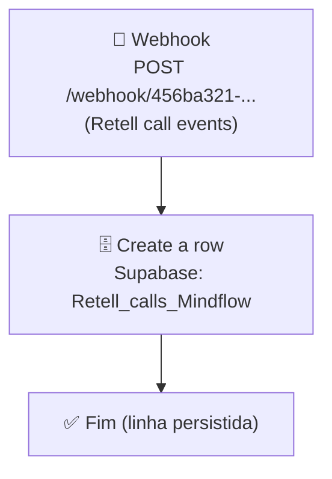

# Workflow: `webhook_ligawhats`

> **Status n8n**: Ativo
> **Trigger**: Webhook (POST)
> **ID n8n**: `2uljqQ6oKkCsz8mhO-xLC`
> **Última execução analisada**: `493679` em `2026-05-13T19:08:15.825Z` (status: success)

---

## Descrição Geral

Workflow receptor de webhooks da Retell AI para o agente "Agente Mindflow (whatsapp)". Recebe eventos do ciclo de vida da ligação (`call_ended`, `call_analyzed`) e persiste os dados detalhados da chamada (custos, transcript, status, agendamento, etc.) em uma única linha na tabela `Retell_calls_Mindflow` do Supabase. Tem responsabilidade exclusiva de ingestão/registro — não dispara ligações nem chama outros workflows.

> ⚠️ Ambiguo: o workflow cria uma nova linha (`create row`) por evento. Como Retell envia múltiplos eventos por ligação (`call_ended` + `call_analyzed` para a mesma `call_id`), o `Retell_calls_Mindflow` provavelmente contém múltiplas linhas para a mesma `call_id` (vide execuções `493678` e `493679`, ambas para `call_8b4ae1c23f55e5126bc4bd42684`). Confirmar com negócio se isso é intencional ou se deveria ser `upsert`.

## Diagrama de Fluxo



## Comunicação com Outros Workflows

| Direção | Workflow / Serviço | Endpoint | Método | Dados Passados |
|---------|--------------------|----------|--------|----------------|
| ← Recebe de | **Retell AI** (webhook externo da plataforma) | `/webhook/456ba321-75bc-4fcf-b0c7-20f922aa764a` | POST | Evento (`call_ended` / `call_analyzed`) + objeto `call` completo (transcript, custos, status, dynamic_variables) |
| → Envia para | **Supabase** (DB Mindflow) | `Retell_calls_Mindflow` (tabela) | INSERT | 22 campos derivados do payload Retell |

> Nenhum workflow interno da Mindflow é acionado por este fluxo. Não há `httpRequest` outbound — o destino final é o banco.

### Dados de Rastreabilidade

| Campo | Valor/Origem | Obrigatório |
|-------|-------------|-------------|
| `call_id` | `$json.body.call.custom_sip_headers["X-RetellAI-CallId"]` | ✅ (chave de correlação com Retell) |
| `agent_id` | `$json.body.call.agent_id` | ✅ |
| `agent_version` | `$json.body.call.agent_version` | ✅ |
| `agent_name` | `$json.body.call.agent_name` | informativo |
| `execution_id` (EDW) | _Ausente no n8n — gerar na migração_ | ⚠️ exigido na migração |
| `workflow_id` (EDW) | _Ausente no n8n — definir constante `webhook_ligawhats_v1`_ | ⚠️ exigido na migração |
| `from_workflow` (EDW) | _N/A (entrada externa Retell)_ | ⚠️ registrar `retell` na migração |

> ⚠️ Ambiguo: o workflow n8n não persiste `workflow_id`, `from_workflow` nem `execution_id` da convenção EDW — apenas o `call_id` da Retell. A migração para Python deve introduzir esses campos em `workflow_executions`.

## Exemplos de Payload Real (anonimizado)

**Trigger input** (execução `493679`, evento `call_analyzed`):
```json
{
  "headers": {
    "host": "n8n-mcp-n8n.bkpxmb.easypanel.host",
    "content-type": "application/json",
    "user-agent": "axios/1.15.2",
    "x-retell-signature": "v=1778699295274,d=<REDACTED>"
  },
  "body": {
    "event": "call_analyzed",
    "call": {
      "call_id": "call_8b4ae1c23f55e5126bc4bd42684",
      "call_type": "phone_call",
      "agent_id": "agent_f95ee856fb3d220f42171318dc",
      "agent_version": 11,
      "agent_name": "Agente Mindflow (whatsapp)",
      "retell_llm_dynamic_variables": {
        "customer_name": "<NOME>",
        "prompt": "<PROMPT_REDACTED>",
        "now": "2026-05-13T19:08:11.333Z",
        "contexto": "Lead acaba de enviar mensagem no whatsapp. Primeira interação",
        "numero_do_lead": "+55XX9XXXXXXXX"
      },
      "custom_sip_headers": {
        "X-RetellAI-CallId": "call_8b4ae1c23f55e5126bc4bd42684",
        "X-RetellAI-Direction": "Outbound",
        "X-RetellAI-OrgId": "org_c4SmbD6TPuQtpq3V"
      },
      "call_status": "not_connected",
      "duration_ms": 0,
      "disconnection_reason": "invalid_destination",
      "transcript": "",
      "transcript_with_tool_calls": [],
      "call_cost": {
        "product_costs": [],
        "combined_cost": 0
      },
      "call_analysis": {
        "call_summary": "",
        "user_sentiment": "Unknown",
        "call_successful": false,
        "custom_analysis_data": {}
      },
      "from_number": "+55XX9XXXXXXXX",
      "to_number": "+55XX9XXXXXXXX",
      "direction": "outbound"
    },
    "event_timestamp": 1778699295274
  }
}
```

**Output final** (linha inserida na tabela `Retell_calls_Mindflow`):
```json
{
  "id": 174922,
  "created_at": "2026-05-13T19:08:15.870697+00:00",
  "Nome": "<NOME>",
  "Email": null,
  "Numero": "+55XX9XXXXXXXX",
  "status": "not_connected",
  "call_id": "call_8b4ae1c23f55e5126bc4bd42684",
  "call_type": "phone_call",
  "agent_id": "agent_f95ee856fb3d220f42171318dc",
  "agent_version": "11",
  "agent_name": "Agente Mindflow (whatsapp)",
  "transcript": "[]",
  "recording_url": null,
  "disconnection_reason": "invalid_destination",
  "eleven_labs_cost": null,
  "LLM": null,
  "LLM_cost": null,
  "combined_cost": "0",
  "LLM_token_usage": null,
  "from_number": "+55XX9XXXXXXXX",
  "to_number": "+55XX9XXXXXXXX",
  "Duracao": "0",
  "Marcada": null
}
```

## Detalhamento dos Nós

### 1. `Webhook` (🔵 Trigger)
- **Tipo n8n**: `n8n-nodes-base.webhook` (typeVersion 2.1)
- **Descrição**: Endpoint público que recebe POSTs da Retell AI para os eventos `call_ended` e `call_analyzed` referentes ao agente "Agente Mindflow (whatsapp)".
- **Configuração**:
  - `httpMethod`: POST
  - `path`: `456ba321-75bc-4fcf-b0c7-20f922aa764a`
  - `authentication`: `none` (segurança apoiada no header `x-retell-signature` enviado pela Retell — não há verificação implementada no fluxo)
  - `responseMode`: `onReceived` (responde imediatamente)
- **URL produção**: `https://n8n-mcp-n8n.bkpxmb.easypanel.host/webhook/456ba321-75bc-4fcf-b0c7-20f922aa764a`
- **Saídas**: → `Create a row`

> ⚠️ Ambiguo: o header `x-retell-signature` está presente nos payloads mas não é validado pelo workflow. Na migração, considerar verificação HMAC contra `RETELL_WEBHOOK_SECRET`.

### 2. `Create a row` (🗄️ Database / Output)
- **Tipo n8n**: `n8n-nodes-base.supabase` (typeVersion 1)
- **Descrição**: Insere uma nova linha na tabela `Retell_calls_Mindflow` com 22 campos derivados do payload Retell (sendo `recording_url` mapeado duas vezes — duplicação no JSON, ver Pontos de Atenção).
- **Configuração**:
  - `resource`: `row`
  - `operation`: `create`
  - `tableId`: `Retell_calls_Mindflow`
  - `dataToSend`: `defineBelow` (mapeamento explícito de cada campo)
- **Mapeamento de campos** (n8n → Supabase):

| Coluna Supabase | Origem no payload Retell |
|-----------------|--------------------------|
| `Nome` | `body.call.retell_llm_dynamic_variables.customer_name` |
| `Email` | `body.call.retell_llm_dynamic_variables.email` |
| `Numero` | `body.call.retell_llm_dynamic_variables.numero_do_lead` |
| `status` | `body.call.call_status` |
| `call_id` | `body.call.custom_sip_headers["X-RetellAI-CallId"]` |
| `call_type` | `body.call.call_type` |
| `agent_id` | `body.call.agent_id` |
| `agent_version` | `body.call.agent_version` |
| `agent_name` | `body.call.agent_name` |
| `transcript` | `body.call.transcript_with_tool_calls` |
| `recording_url` | `body.call.recording_url` (mapeado 2× — duplicado no JSON) |
| `disconnection_reason` | `body.call.disconnection_reason` |
| `eleven_labs_cost` | `body.call.call_cost.product_costs[0].cost` |
| `LLM` | `body.call.call_cost.product_costs[2].product` |
| `LLM_cost` | `body.call.call_cost.product_costs[2].cost` |
| `combined_cost` | `body.call.call_cost.combined_cost` |
| `LLM_token_usage` | `body.call.call_cost.product_costs[3].cost` |
| `from_number` | `body.call.from_number` |
| `to_number` | `body.call.to_number` |
| `Duracao` | `body.call.duration_ms` |
| `Marcada` | `body.call.call_analysis.custom_analysis_data["Reunião Marcada?"]` |

- **Credenciais**: `supabase Mindflow` (tipo `supabaseApi`)
- **Saídas**: nenhuma (nó terminal)

## Variáveis de Ambiente Utilizadas

| Variável | Uso no Workflow |
|----------|-----------------|
| _(nenhuma referenciada explicitamente — webhook público, credenciais via Credential Store do n8n)_ | — |

## Credenciais n8n Utilizadas

| Nome da Credencial | Tipo | Nós que Usam |
|--------------------|------|--------------|
| `supabase Mindflow` | `supabaseApi` | `Create a row` |

---

## Migration Brief — Antigravity / Python

> Especificação para o agente do Antigravity reimplementar este workflow em Python conforme `Usefull_Skills/docs/conventions.md` (EDW).

### Camada API (FastAPI)

- **Endpoint sugerido**: `POST /webhook/retell/ligawhats` (manter compatibilidade com Retell — eventualmente proxiar do path UUID atual via reverse proxy)
- **Schema Pydantic de entrada** (`schemas.py`):

```python
class RetellCallCost(BaseModel):
    product_costs: list[dict] = []
    total_duration_seconds: float = 0
    combined_cost: float = 0

class RetellCallAnalysis(BaseModel):
    call_summary: Optional[str] = None
    in_voicemail: Optional[bool] = None
    user_sentiment: Optional[str] = None
    call_successful: Optional[bool] = None
    custom_analysis_data: dict = {}

class RetellCallObject(BaseModel):
    call_id: str
    call_type: str
    agent_id: str
    agent_version: int
    agent_name: str
    retell_llm_dynamic_variables: dict
    custom_sip_headers: dict
    call_status: str
    duration_ms: int = 0
    transcript: Optional[str] = None
    transcript_with_tool_calls: list = []
    disconnection_reason: Optional[str] = None
    recording_url: Optional[str] = None
    call_cost: RetellCallCost
    call_analysis: Optional[RetellCallAnalysis] = None
    from_number: Optional[str] = None
    to_number: Optional[str] = None
    direction: Optional[str] = None

class WebhookLigawhatsInput(BaseModel):
    event: str  # "call_ended" | "call_analyzed"
    call: RetellCallObject
    event_timestamp: int
```

- **Resposta**: `202 Accepted` + `execution_id` (UUID gerado).
- **Validações obrigatórias**:
  - Verificar `x-retell-signature` (HMAC) contra `RETELL_WEBHOOK_SECRET` — **adicionado em relação ao fluxo n8n original**.
  - Garantir `event in {"call_ended", "call_analyzed"}` — descartar (200 OK silencioso) outros eventos.

### Camada Worker (ARQ)

Mapa nó n8n → step EDW (cada step executa via `run_step_with_retry`):

| # | n8n node | Step EDW (`{wf}_{OQF}`) | I/O | Lib Python | Retries | Async? |
|---|----------|-------------------------|-----|------------|---------|--------|
| 1 | `Webhook` (parsing + verify) | `webhook_ligawhats_verify_signature` | in: raw_body + header; out: payload validado | `hmac`, `hashlib` | 0 | sim |
| 2 | _N/A — mapeamento implícito_ | `webhook_ligawhats_map_payload` | in: payload Retell; out: dict da linha Supabase | puro Python | 0 | sim |
| 3 | `Create a row` (Supabase) | `webhook_ligawhats_persist_call_row` | in: dict mapeado; out: id da linha | `supabase` singleton | 3 | sim |

### Comunicação Externa (Saídas)

- **Supabase** (`Retell_calls_Mindflow`):
  - URL: variável `SUPABASE_URL`
  - Auth: `SUPABASE_SERVICE_KEY` (header `apikey` + `Authorization: Bearer ...`)
  - Operação: `client.table("Retell_calls_Mindflow").insert(row).execute()`
  - Retorno: `{ "id": int, "created_at": iso, ... }`

> Nenhuma chamada HTTP outbound além do Supabase.

### Variáveis de Ambiente Necessárias (.env)

| Variável | Origem n8n | Uso no Python |
|----------|-----------|----------------|
| `SUPABASE_URL` | credencial `supabase Mindflow` | client singleton |
| `SUPABASE_SERVICE_KEY` | credencial `supabase Mindflow` | auth do client |
| `RETELL_WEBHOOK_SECRET` | _ausente no n8n_ | validação HMAC do header `x-retell-signature` |
| `REDIS_URL` | infra EDW | `arq` queue (`RedisSettings.from_dsn`) |

### Rastreabilidade Obrigatória (conventions.md)

- `workflow_id`: `webhook_ligawhats_v1` (constante fixa)
- `from_workflow`: `retell` (entrada externa — não é workflow Mindflow)
- `execution_id`: UUID gerado pela API ao receber o webhook
- Persistir em:
  - `workflow_executions` (master, status `PENDING` → `RUNNING` → `SUCCESS`/`FAILED`)
  - `workflow_step_executions` (detail, um registro por step com `attempt`)
- A inserção na `Retell_calls_Mindflow` permanece, mas adicionar coluna `execution_id` (UUID) para correlacionar com a master.

### Pontos de Atenção / Divergências do EDW

- **Sem validação de assinatura**: o n8n original aceita qualquer POST no path. Migração DEVE adicionar verificação HMAC com `RETELL_WEBHOOK_SECRET`.
- **Duplicação `recording_url`**: o JSON do nó Supabase mapeia `recording_url` duas vezes (fieldId índice 10 e 20). Na migração, manter mapeamento único.
- **Múltiplas linhas por `call_id`**: cada evento Retell (`call_ended`, `call_analyzed`) gera uma nova linha. Avaliar com negócio se a migração deve fazer `upsert` por `call_id` ou manter histórico append-only com coluna `event` distinguindo as linhas.
- **Tipos forçados a string**: o n8n converte `agent_version` (int), `duration_ms` (int) e `combined_cost` (float) para string no Supabase (vide output `"agent_version": "11"`, `"Duracao": "0"`, `"combined_cost": "0"`). Na migração, padronizar tipos numéricos reais ou aceitar string consciente (manter compat com leitores downstream).
- **Sem rastreabilidade EDW no banco**: tabela `Retell_calls_Mindflow` não tem `execution_id`/`workflow_id`. Migração adiciona essas colunas + master `workflow_executions`.
- **Sem retries no n8n**: o nó Supabase não tem retry configurado. Na migração, `run_step_with_retry(max_retries=3)`.
- **Email/`Marcada` frequentemente null**: payloads Retell podem omitir `email` em `dynamic_variables` e `custom_analysis_data["Reunião Marcada?"]` em chamadas que não foram conectadas (vide execução real `not_connected`). Aceitar `None` no schema é OK; só validar quando `call_status == "ended"` e `call_successful == true`.
- **Sem `BackgroundTasks` / `time.sleep`**: persistência ocorre no worker ARQ via `arq.enqueue_job`, API responde 202 imediatamente.

### Status de Migração

- [x] Documentado
- [ ] Schemas Pydantic definidos
- [ ] API endpoint implementado
- [ ] Worker steps implementados
- [ ] Validado em ambiente de teste
- [ ] Migrado em produção
