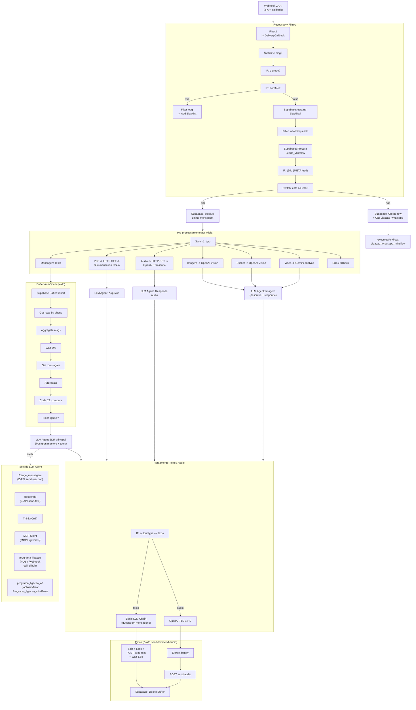

# Workflow: `z_api`

> **Status n8n**: Ativo
> **Trigger**: Webhook `POST /webhook/ZAPI` (provedor Z-API / WhatsApp)
> **ID n8n**: `titwcyjWYvdBTF5Bj3pAN`
> **Última atualização**: 2026-05-12
> **Execução analisada**: `493992` em 2026-05-13 22:21:46Z (sucesso, callback de imagem de newsletter — filtrada)
> **Tamanho**: aproximadamente 140 nós — workflow gigante, candidato fortíssimo a modularização

---

## Descrição Geral

`z_api` é o **hub central de atendimento por WhatsApp** da MindFlow. Recebe todos os eventos do provedor Z-API (mensagens recebidas/enviadas, callbacks de status), faz segmentação (grupo? fromMe? blacklist? lead novo?), trata cada formato de mídia (texto, áudio, imagem, PDF, sticker, vídeo) com sumarização/transcrição via OpenAI/Gemini, agrupa mensagens em buffer Supabase (anti-spam de mini mensagens), passa para um **LLM Agent SDR** com memória Postgres e ferramentas (MCP, send-text, send-reaction, programar ligação), e devolve resposta quebrada em chunks via texto ou áudio (TTS). Também aciona o sub-workflow `Ligacao_whatsapp_mindflow` quando entra um lead novo e oferece à IA a tool `programa_ligação` para disparar ligações on-demand pelo backend de chamadas.

## Diagrama de Fluxo (compactado por função macro)



## Comunicacao com Outros Workflows / Sistemas

**Este workflow e o hub central** — todos os outros agentes de WhatsApp orbitam em torno dele.

| Direcao | Workflow / Sistema | Endpoint / Modo | Metodo | Dados Passados | Observacoes |
|---------|--------------------|-----------------|--------|----------------|-------------|
| Recebe de | Provedor Z-API | `/webhook/ZAPI` | POST | callback bruto do WhatsApp (text/audio/image/document/sticker/video, fromMe, isGroup, phone, messageId, etc) | Externo. Header `z-api-token` |
| Envia para | `Ligacao_whatsapp_mindflow` | `executeWorkflow` id `1KRSGQYXjxvIMJdHWQant` | sub-workflow (in-process) | `numero`, `nome`, `contexto` (string fixa "Lead acaba de enviar mensagem...") | Dispara somente em LEAD NOVO |
| Envia para (tool LLM) | `Programa_ligacao_mindflow` | `toolWorkflow` id `kpHlIJlHiDTaUEBr9GtsP` | sub-workflow via LLM tool | `numero`, `nome`, `contexto`, `tempo` | Tool "programa_ligacao_off" — desligada/legado, mantida ao lado da nova |
| Envia para (tool LLM) | API externa **call-github** (pre_call_processing/EDW) | `POST https://call-github.bkpxmb.easypanel.host/webhook` | HTTP via tool | `numero`, `nome`, `contexto`, `quando_ligar`, `execution_id` (hardcoded "123"), `agent_id` (`agent_f95ee856fb3d220f42171318dc`), `prompt_id` (`20`), `workflow_name` (`z-api`), `empresa`, `segmento`, `from_number` (`+555196506656`) | Header `X-API-Key` hardcoded. **Esta e a tool ativa** para programar ligacao via IA |
| Envia para (tool LLM) | **MCP Ligawhats** | `https://n8n-mcp-n8n.bkpxmb.easypanel.host/mcp/c9259be0-6d0a-4859-81a5-00f058f09a36` | MCP client | depende das tools expostas pelo MCP | LLM agent decide quais tools chamar |
| Envia para (Supabase) | tabelas Mindflow | `Leads_Mindflow`, `Blacklist_Mindflow`, `Buffer` | CRUD | `Numero`, `Nome`, `Ultima msgm`, `Ultima msgm (texto)`, `Mensagem` | Persistencia / dedupe / contexto |
| Envia para (memoria LLM) | Postgres `MindFlow` | chat memory | langchain memoryPostgresChat | session por `phone` | Tres memorias separadas (texto, audio, e branch META) |
| Envia para (Z-API) | API Z-API (`api.z-api.io`) | `/send-text`, `/send-audio`, `/send-reaction` | POST | `phone`, `message` / `audio` / `reaction`, `messageId`, `delayTyping` | Header `Client-Token` |
| Envia para (OpenAI) | OpenAI API | transcribe (whisper), analyze (gpt-4o-mini), TTS (tts-1-hd voz `nova`), chat (gpt-4.1-mini) | SDK | conteudo de midia / prompt | Credencial `OpenAi account` |
| Envia para (Google) | Gemini API (`gemini-2.5-flash`) | analyze video | SDK | `videoUrl` | Credencial `Google Gemini(PaLM) Api account` |

### Dados de Rastreabilidade EDW

| Campo | Valor / Origem | Obrigatorio |
|-------|----------------|-------------|
| `workflow_id` | nao gerado nativamente — workflow nao registra `workflow_executions`/`workflow_step_executions` | ❌ (gap) |
| `from_workflow` | NAO envia em `executeWorkflow` para `Ligacao_whatsapp_mindflow` (gap — devia ser `z_api`) | ❌ (gap) |
| `execution_id` | HARDCODED `"123"` na tool `programa_ligacao` (gap critico — deveria ser UUID) | ❌ (gap) |
| `workflow_name` | enviado como `"z-api"` no payload da tool `programa_ligacao` | ✅ |
| `agent_id` | hardcoded `agent_f95ee856fb3d220f42171318dc` | ⚠️ deveria vir de configuracao |
| `prompt_id` | hardcoded `20` | ⚠️ |
| `from_number` | hardcoded `+555196506656` | ⚠️ |

## Exemplo de Payload Real (anonimizado)

**Trigger input** (execucao `493992` — callback de newsletter Band Jornalismo, filtrada por META/blacklist):
```json
{
  "headers": {
    "host": "n8n-mcp-n8n.bkpxmb.easypanel.host",
    "user-agent": "Mozilla/5.0 ...",
    "origin": "https://api.z-api.io",
    "z-api-token": "<REDACTED>"
  },
  "body": {
    "isStatusReply": false,
    "connectedPhone": "<REDACTED>",
    "isGroup": false,
    "isNewsletter": true,
    "instanceId": "<REDACTED>",
    "messageId": "3EB09A203AEB0E109A5D6D",
    "phone": "120363172681284610@newsletter",
    "fromMe": false,
    "momment": 1778710895000,
    "status": "RECEIVED",
    "chatName": "<CANAL>",
    "senderName": "",
    "type": "ReceivedCallback",
    "fromApi": false,
    "image": {
      "imageUrl": "https://f004.backblazeb2.com/.../...jpg",
      "caption": "<CAPTION>",
      "mimeType": "image/jpeg"
    }
  },
  "webhookUrl": "https://n8n-mcp-n8n.bkpxmb.easypanel.host/webhook/ZAPI"
}
```

**Payload de tool `programa_ligacao` (saida critica)**:
```json
{
  "numero": "+55XX9XXXXXXXX",
  "nome": "<NOME>",
  "contexto": "<briefing gerado pelo LLM>",
  "quando_ligar": "<ISO8601 ou '0' p/ imediato>",
  "execution_id": "123",
  "agent_id": "agent_f95ee856fb3d220f42171318dc",
  "prompt_id": "20",
  "workflow_name": "z-api",
  "empresa": "<EMPRESA>",
  "segmento": "<SEGMENTO>",
  "from_number": "+555196506656"
}
```

## Detalhamento dos Nos (AGRUPADO por funcao — 10 grupos)

### G1. Recepcao + Filtros de Bot (~9 nos)
- `Webhook` (POST /ZAPI) → `Filter2` (descarta DeliveryCallback) → `É msg?` (Switch tem `messageId`) → `É Grupo?` (IF) → `From me?` (IF) → branch superior `msgm de Pare?` (Filter `obg`) → `Add to blacklist` (Supabase Blacklist_Mindflow) → branch inferior `Está na Blacklist?` (Supabase get) → `Filter` (descarta se na blacklist) → `Procura na base de leads` (Supabase Leads_Mindflow) → `META lead?` (IF `phone contains @lid`) → `Está na lista?` (Switch sobre coluna Numero).
- **EDW**: vira validador FastAPI + queries Supabase singleton.

### G2. Onboarding de Lead Novo (~3 nos)
- `Está na lista?` (output `não`) → `Create a row` (Leads_Mindflow) → `Call 'Ligação_whatsapp'` (**executeWorkflow → `Ligacao_whatsapp_mindflow`**, id `1KRSGQYXjxvIMJdHWQant`).
- Output `sim` → `Atualiza ultima mensagem (data)` → segue para `Switch1`.

### G3. Switch de Midia (Switch1) + 6 ramos SET (~7 nos)
- `Switch1` (7 outputs: texto / audio / imagem / PDF / sticker / video=fallback `Outro` para `Edit Fields` / erro).
- `Mensagem Texto1`, `Mensagem Audio1`, `Mensagem Imagem1`, `Mensagem Documento PDF`, `Sticker`, `Edit Fields`, `Mensagem Erro1` — apenas SET de variaveis canonicas.

### G4. Audio (~3 nos)
- `Mensagem Audio1` → `HTTP Request` (GET audioUrl, binario) → `Transcrever Áudio1` (OpenAI Whisper, lang=pt) → LLM Agent `Responde audio`.

### G5. Imagem / Sticker (~4 nos)
- `Mensagem Imagem1` / `Sticker` → `OpenAI1` / `OpenAI` (vision `gpt-4o-mini` descreve) → LLM Agent `Imagem` (gera resposta contextualizada).

### G6. PDF / Documento (~3 nos)
- `Mensagem Documento PDF` → `HTTP Request1` (GET documentUrl) → `Summarization Chain` (langchain, map-reduce) com `Recursive Character Text Splitter` + `OpenAI Chat Model8` → LLM Agent `Arquivos`.

### G7. Video (~2 nos)
- `Edit Fields` → `Analyze video` (Gemini 2.5 Flash, maxOutputTokens 300, descricao textual) → entra no fluxo de imagem.

### G8. Buffer Anti-Spam de Texto (~7 nos)
- `Mensagem Texto1` → `Create a row1` (Buffer) → `Get a row` → `Aggregate` (junta mensagens por numero) → `Wait1` (20s) → `Get a row1` → `Aggregate1` → `Get a row2` → `Code in JavaScript` (compara) → `Filter1` (so segue se conteudo estabilizou).
- **Logica**: agrupa varias mini-mensagens do usuario antes de chamar o LLM, evita responder linha a linha.

### G9. LLM Agents Principais (~3 agents + 4 chat models + 3 memorias + 4 parsers)
- **`Responde texto`** (`langchain.agent`, prompt vem de `$json.Prompt_Text` carregado anteriormente — provavelmente vem da tabela Leads/empresa) — usa `OpenAI Chat Model1/2` + `Postgres Chat Memory` + `Auto-fixing Output Parser2` + `Structured Output Parser [Schema]2`.
- **`Responde audio`** — similar, prompt instrui `<Mandatory> use a tool Consulta_Documento_SDR </Mandatory>` (RAG).
- **`Imagem` / `Arquivos`** — prompts proprios para receber midia, sempre `[AGRADECER] + [COMENTAR O QUE VIU] + [PERGUNTA]`.
- **3a memoria Postgres** `MindFlow` por `phone`.

### G10. Tools do LLM (~6 tools + Think + MCP)
- `Reage_mensagem` (POST `/send-reaction`) — emoji condizente com emocao.
- `Responde` (POST `/send-text`, max 600 chars) — quando o agente decide responder texto direto.
- `Think` (`toolThink`) — Chain-of-Thought interno.
- `MCP Client` → MCP Ligawhats (ja documentado em `workflow-mcp-ligawhats.md`).
- `programa_ligacao` (POST call-github webhook EDW) — **tool ativa para disparo de ligacao**.
- `programa_ligacao_off` (`toolWorkflow` → `Programa_ligacao_mindflow`) — versao legada / desativada.

### G11. Roteamento + Quebra + Envio (~12 nos, ramos duplicados para texto/META)
- `Audio ou txt` (IF `output.type == texto`) → texto: `Basic LLM Chain` (formata em array `mensagens[]` com schema) → `Split Out` → `Loop Over Items` → `Enviar mensagem` (POST send-text com `delayTyping=3`) → `Wait` 1.5s → loop → `Delete a row2` (limpa Buffer).
- Audio: `Generate audio` (OpenAI TTS-1-HD, voz `nova`) → `Extract from File1` → `Enviar Audio` (POST send-audio base64) → `Delete a row2`.
- **Ramo META** (`META lead?` true): branch paralelo praticamente identico (`Basic LLM Chain2`, `Loop Over Items2`, `Enviar mensagem3`, etc) — duplicacao de logica.

### G12. Trigger Auxiliar
- `When clicking 'Execute workflow'` (manualTrigger) + `Enviar mensagem2` (hardcoded `oie` para 554896027108) — botao de teste isolado.
- `When Executed by Another Workflow` (`executeWorkflowTrigger`) com inputs `numero`, prompt longo, `tempo` — sinaliza que este workflow tambem poderia ser invocado como sub-workflow, mas o trigger nao parece estar conectado em fluxo ativo (resquicio).

## Variaveis de Ambiente Utilizadas

| Variavel / Secret | Uso no Workflow | Status |
|-------------------|-----------------|--------|
| `Z_API_INSTANCE_ID` (atualmente hardcoded `3E5F252F583800117B3E5ED75F1870FF`) | URLs `api.z-api.io/instances/<id>/token/<token>/send-*` | Hardcoded — extrair |
| `Z_API_TOKEN` (hardcoded `B2DBDB410613AA53131EC271`) | URL Z-API | Hardcoded — extrair |
| `Z_API_CLIENT_TOKEN` (hardcoded `F0d852a09139d4b6b94b23c77c8a67debS`) | Header `Client-Token` em todos os envios | Hardcoded — extrair |
| `CALL_GITHUB_WEBHOOK_URL` (= `https://call-github.bkpxmb.easypanel.host/webhook`) | Tool `programa_ligacao` | Hardcoded |
| `CALL_GITHUB_API_KEY` (hardcoded `mf_sk_2026_pre_call_xK9v3Qm7bR4wT1nZ`) | Header `X-API-Key` | Hardcoded — extrair |
| `MCP_LIGAWHATS_URL` | endpoint MCP | Hardcoded |
| `SUPABASE_URL` / `SUPABASE_KEY` | Credencial `supabase Mindflow` (Leads/Blacklist/Buffer) | Em credencial |
| `OPENAI_API_KEY` | Credencial `OpenAi account` (transcribe, vision, chat, TTS) | Em credencial |
| `GEMINI_API_KEY` | Credencial `Google Gemini(PaLM) Api account` (video) | Em credencial |
| `POSTGRES_DSN` (memoria) | Credencial `MindFlow` (Postgres chat memory) | Em credencial |
| `AGENT_ID` (`agent_f95ee856fb3d220f42171318dc`), `PROMPT_ID` (`20`), `FROM_NUMBER` (`+555196506656`) | Payload tool `programa_ligacao` | Hardcoded — extrair |

## Credenciais n8n Utilizadas

| Nome da Credencial | Tipo n8n |
|--------------------|----------|
| `OpenAi account` | `openAiApi` |
| `supabase Mindflow` | `supabaseApi` |
| `MindFlow` | `postgres` (memoria langchain) |
| `Google Gemini(PaLM) Api account` | `googlePalmApi` |
| `Mindflow` | header auth (MCP) |

---

## Migration Brief — Antigravity / Python

> Este workflow e o **maior do ecossistema** (cerca de 140 nos, mais de 10 tools de LLM, multiplas branches de midia + buffer anti-spam + LLM agent SDR). Recomendacao forte: **NAO migrar como um unico servico**. Quebrar em multiplos modulos/servicos no Antigravity.

### Estrategia de Decomposicao Sugerida

| Modulo | Responsabilidade | Nos n8n agrupados |
|--------|------------------|-------------------|
| `z_api_ingress` (FastAPI) | recebe webhook Z-API, valida, filtra DeliveryCallback/group/fromMe, blacklist, persiste lead | G1 + G2 |
| `z_api_media_normalizer` (worker arq) | normaliza midia (transcribe, vision, summarize PDF, gemini video) para string unica `mensagem_normalizada` | G3 + G4 + G5 + G6 + G7 |
| `z_api_buffer` (worker arq + Redis) | buffer anti-spam (substitui Wait 20s do n8n por `arq enqueue _defer_until` ou Redis Stream com debounce por phone) | G8 |
| `z_api_sdr_agent` (servico LLM proprio, possivelmente workflow Antigravity dedicado) | agente SDR conversacional com tools (Reage, Responde, MCP, programa_ligacao, Think) — **forte candidato a virar um servico LLM autonomo, talvez ate fora do EDW** | G9 + G10 |
| `z_api_egress` (worker arq) | envio para Z-API (send-text com loop + delay, send-audio com TTS) — substitui Wait 1.5s do Loop Over Items por jitter no arq | G11 |
| Branch META (`@lid`) | duplicado no n8n — no Python **unificar** com o fluxo principal | G11 META |

### Camada API (FastAPI)

- **Endpoint sugerido**: `POST /webhook/z-api`
- **Schema Pydantic de entrada** (`schemas.py`):
```python
class ZApiCallback(BaseModel):
    instanceId: str
    messageId: Optional[str] = None
    phone: str
    fromMe: bool
    isGroup: bool
    isNewsletter: Optional[bool] = False
    momment: int
    status: str
    type: str  # ReceivedCallback / DeliveryCallback / ...
    chatName: Optional[str] = None
    senderName: Optional[str] = None
    text: Optional[dict] = None
    audio: Optional[dict] = None
    image: Optional[dict] = None
    document: Optional[dict] = None
    sticker: Optional[dict] = None
    video: Optional[dict] = None
```
- **Resposta**: `202 Accepted` + `execution_id` (UUID) — _hoje o workflow nao retorna `execution_id`; precisa gerar_.
- **Validacoes**: rejeitar `type=DeliveryCallback`, `fromMe=true && message != 'obg'`, `phone contains @newsletter`, `isGroup=true`.

### Camada Worker (ARQ) — steps `z_api_<OQF>`

| # | n8n node(s) | Step EDW | Lib Python | Retries | Async |
|---|-------------|----------|-----------|---------|-------|
| 1 | Filter2 / É msg? / É Grupo? / From me? | `z_api_validate_event` | puro Python | 0 | sim |
| 2 | Está na Blacklist? / Filter / msgm de Pare? | `z_api_check_blacklist` | `supabase` singleton | 3 | sim |
| 3 | Procura na base de leads / Está na lista? / Create row / Atualiza data | `z_api_upsert_lead` | `supabase` singleton | 3 | sim |
| 4 | Call 'Ligação_whatsapp' | `z_api_enqueue_first_call` | `httpx` para webhook do `ligacao_whatsapp_mindflow` (mesmo padrao do n8n executeWorkflow) | 3 | sim |
| 5 | Switch1 + SETs de midia | `z_api_classify_media` | puro Python | 0 | sim |
| 6 | HTTP Request (audio) + Transcrever Áudio1 | `z_api_transcribe_audio` | `httpx` + OpenAI Whisper async | 3 | sim |
| 7 | OpenAI1 (vision) | `z_api_analyze_image` | OpenAI client async (gpt-4o-mini) | 3 | sim |
| 8 | HTTP Request1 + Summarization Chain | `z_api_summarize_document` | langchain async ou chamada direta gpt-4.1 | 3 | sim |
| 9 | Analyze video | `z_api_analyze_video` | Gemini SDK async | 3 | sim |
| 10 | Create a row1 + Wait1 (20s) + Get/Aggregate + Code JS + Filter1 | `z_api_debounce_buffer` | Redis stream/ZSET + `arq enqueue_job(_defer_until=now+20s)` | n/a | sim |
| 11 | Responde texto / Responde audio / Imagem / Arquivos (agents) | `z_api_run_sdr_agent` | Servico LLM dedicado (talvez fora do EDW) | 2 | sim |
| 12 | Basic LLM Chain (split em chunks) | `z_api_chunk_response` | OpenAI async + Pydantic | 2 | sim |
| 13 | Generate audio (TTS) + Extract | `z_api_tts` | OpenAI tts-1-hd async, retorna bytes | 3 | sim |
| 14 | Loop Over Items + Enviar mensagem/Audio + Wait 1.5s + Delete Buffer | `z_api_send_messages` | `httpx` POST + `asyncio.sleep` NAO (proibido `time.sleep`); usar `_defer_until` por mensagem | 3 | sim |
| 15 | MCP Client / Reage / Responde / programa_ligacao / Think | tools do agente — implementadas como funcoes async chamadas pelo LLM | `httpx` / MCP client | 2 | sim |

> Buffer de 20s (Wait1) — substituir por `arq enqueue_job(_defer_until=...)` com chave de dedupe por `phone`; cada mensagem nova cancela/reescalona o job de processamento.
>
> Wait de 1.5s entre mensagens enviadas — usar `arq` agendado, _nunca_ `time.sleep`.

### Comunicacao Externa (Saidas)

1. **Z-API API** — `POST https://api.z-api.io/instances/<id>/token/<token>/send-text`, `/send-audio`, `/send-reaction` com header `Client-Token: <Z_API_CLIENT_TOKEN>`. Payload: `phone`, `message`/`audio`/`reaction`, `messageId`, `delayTyping`.
2. **call-github EDW** — `POST https://call-github.bkpxmb.easypanel.host/webhook` com `X-API-Key`. Payload do programa_ligacao (ver acima). **Substituir `execution_id` hardcoded `"123"` por UUID real; passar `from_workflow="z_api"`**.
3. **Sub-workflows** — `Ligacao_whatsapp_mindflow` (chamado em Lead novo), `Programa_ligacao_mindflow` (tool LLM legada). No EDW vira chamada HTTP para os respectivos servicos migrados.
4. **MCP Ligawhats** — endpoint MCP a ser ou re-exposto como tool ou substituido por chamada HTTP direta as funcoes equivalentes.
5. **OpenAI / Gemini** — SDKs async (audios/imagens/textos/TTS).
6. **Supabase** — singleton client (Leads_Mindflow, Blacklist_Mindflow, Buffer).
7. **Postgres MindFlow** — memoria por phone (manter ou trocar por Redis/conversation store proprio).

### Variaveis de Ambiente Necessarias (.env)

| Variavel | Origem n8n | Uso no Python |
|----------|-----------|---------------|
| `Z_API_INSTANCE_ID` | URLs hardcoded | montar URL |
| `Z_API_TOKEN` | URLs hardcoded | montar URL |
| `Z_API_CLIENT_TOKEN` | header hardcoded | header `Client-Token` |
| `Z_API_FROM_NUMBER` | hardcoded `+555196506656` | campo `from_number` |
| `CALL_GITHUB_WEBHOOK_URL` | hardcoded | tool programa_ligacao |
| `CALL_GITHUB_API_KEY` | hardcoded `X-API-Key` | header |
| `SUPABASE_URL` / `SUPABASE_KEY` | credencial | client singleton |
| `OPENAI_API_KEY` | credencial | SDK |
| `GEMINI_API_KEY` | credencial | SDK |
| `POSTGRES_DSN` | credencial MindFlow | chat memory |
| `MCP_LIGAWHATS_URL` | hardcoded | MCP client |
| `SDR_AGENT_ID` (`agent_f95ee856fb3d220f42171318dc`) | hardcoded | payload programa_ligacao |
| `SDR_PROMPT_ID` (`20`) | hardcoded | payload |
| `REDIS_URL` | (novo) | arq scheduler + debounce |

### Rastreabilidade Obrigatoria (conventions.md)

- `workflow_id`: `z_api_v1` (constante)
- `from_workflow`: `z_api` (e quando este chama sub-workflows, passar `from_workflow="z_api"`)
- `execution_id`: UUID gerado na API ao receber callback Z-API — **substituir o hardcoded `"123"` da tool `programa_ligacao`**.
- Persistir em `workflow_executions` (master, `PENDING`→`RUNNING`→`SUCCESS`/`FAILED`) e `workflow_step_executions` (cada step listado acima, via `run_step_with_retry`).
- Forte candidato a registrar tambem em tabela proxima a "conversations" para o agente SDR ter contexto persistente alem do Postgres da langchain.

### Pontos de Atencao / Divergencias do EDW

1. **Tamanho do workflow** — 140 nos em um unico fluxo viola separacao de responsabilidades. **Modularizar em 5–6 servicos** (ver tabela "Estrategia de Decomposicao").
2. **LLM Agent como workflow proprio no Antigravity** — o agente SDR (G9 + G10) tem prompt longo, tools, memoria, RAG (`Consulta_Documento_SDR`) — extrair para servico LLM dedicado, possivelmente um workflow Antigravity independente que `z_api` chama via HTTP.
3. **`execution_id` hardcoded `"123"`** na tool `programa_ligacao` quebra rastreabilidade fim-a-fim. Critico.
4. **Branch META duplicado** (`META lead?` ramo true tem `Basic LLM Chain2`, `Loop Over Items2`, `Enviar mensagem3`) — unificar no Python.
5. **Wait1 (20s)** anti-spam — incompativel com `time.sleep`; usar `arq _defer_until` com debounce por phone.
6. **Wait 1.5s entre mensagens enviadas** — mesmo problema; usar agendamento `arq` por mensagem.
7. **Credenciais hardcoded** (Z-API tokens, X-API-Key call-github) — mover para `.env`.
8. **`Code in JavaScript`** comparando `MensagensInput` vs `MensagensAggregate` — vira funcao Python pura.
9. **`Summarization Chain`** map-reduce langchain — pode virar chamada direta gpt-4.1 com chunking via `langchain` ou logica propria (preferivel manter `langchain` async se a equipe ja tem).
10. **Manual Trigger + Enviar mensagem2 (oie hardcoded)** — descartar na migracao.
11. **`executeWorkflowTrigger` solto** (When Executed by Another Workflow) — descartar ou avaliar se algum workflow invoca `z_api` como sub-workflow (nenhum identificado).
12. **Postgres Chat Memory** com 3 instancias separadas (texto/audio/META) — unificar por `phone` no servico SDR.

### Status de Migracao

- [x] Documentado
- [ ] Decisao tomada sobre quebra em servicos (`z_api_ingress` + `z_api_sdr_agent` + ...)
- [ ] LLM Agent SDR migrado para workflow Antigravity dedicado
- [ ] Schemas Pydantic definidos
- [ ] API endpoint `/webhook/z-api` implementado
- [ ] Worker steps implementados (debounce via arq, envio em batch, tools do agent)
- [ ] `execution_id` real propagado a `programa_ligacao` (corrige gap critico)
- [ ] Validado em ambiente de teste
- [ ] Migrado em producao
