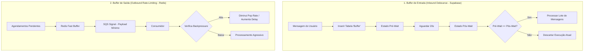

# Documentação de Arquitetura: Buffers de Mensagens (Inbound & Outbound)

Este documento detalha o funcionamento das duas arquiteturas de buffer de mensagens implementadas no ecossistema da **MindFlow / Ifood Gateway**, explicando suas finalidades, mecânicas internas e fornecendo um guia passo a passo de como replicar estas fórmulas em outros projetos.

---

## 1. Visão Geral dos Buffers

No desenvolvimento de agentes de IA conversacionais e gateways de mensageria de alta vazão, deparamo-nos com dois problemas clássicos:

1. **Inbound (Fragmentação de Mensagens):** Usuários de WhatsApp costumam enviar múltiplas mensagens curtas e consecutivas (ex: *"Olá"*, *"Quero agendar"*, *"Às 15h"*). Enviar cada uma individualmente para a LLM causa custos excessivos, perda de contexto e respostas fragmentadas.
2. **Outbound (Limitação de Taxa e Custo de Fila):** Enviar payloads pesados de mensagens agendadas diretamente para filas como SQS de forma desordenada pode sobrecarregar a API de envio e elevar os custos de infraestrutura.

Para solucionar esses problemas, estruturamos dois tipos de buffers:



---

## 2. Buffer de Entrada: Debounce e Agrupamento (Supabase / n8n)

### Finalidade
Evitar o processamento fragmentado de mensagens consecutivas de um mesmo usuário em um curto intervalo de tempo. O buffer agrupa mensagens em blocos consolidados antes de enviá-las para a inteligência artificial.

### Como Funciona (Fluxo Passo a Passo)
1. **Gravação**: Toda nova mensagem recebida é imediatamente gravada na tabela `Buffer` com o identificador do remetente (número do WhatsApp) e o texto correspondente.
2. **Captura Inicial (Pré-Wait)**: O fluxo consulta todas as mensagens atualmente existentes na tabela `Buffer` para aquele número e junta-as (snapshot prévio).
3. **Pausa Estratégica (Debounce)**: O fluxo faz uma pausa (wait) de **20 segundos**. Durante este intervalo, se o usuário enviar novas mensagens, outras instâncias paralelas do fluxo serão criadas e também gravarão novas linhas na tabela `Buffer`.
4. **Captura Final (Pós-Wait)**: Após os 20 segundos, o fluxo faz uma nova consulta na tabela `Buffer` para o mesmo remetente.
5. **Divergência de Estado**: O fluxo compara o snapshot consolidado de mensagens antes do wait com o snapshot consolidado após o wait.
   - **Caso Sejam Iguais**: Nenhuma nova mensagem chegou nos últimos 20 segundos. Isso significa que esta execução é a última e mais atualizada ("vencedora"). Ela prossegue para consolidar o texto completo e acionar o Agente de IA.
   - **Caso Sejam Diferentes**: Novas mensagens chegaram durante a espera. Esta instância de execução é descartada com segurança, pois a execução mais recente iniciada pelas novas mensagens se encarregará de concluir o processo com o lote atualizado.

---

### Como Replicar a Fórmula do Buffer Inbound em Outro Projeto

#### Passo 1: Estrutura do Banco de Dados (PostgreSQL / Supabase)
Crie uma tabela simples de buffer com expiração automática ou limpeza após leitura:

```sql
CREATE TABLE message_buffer (
    id BIGSERIAL PRIMARY KEY,
    contact_id VARCHAR(255) NOT NULL,
    message_text TEXT NOT NULL,
    created_at TIMESTAMPTZ DEFAULT NOW()
);

-- Índice para busca rápida por contato
CREATE INDEX idx_message_buffer_contact ON message_buffer(contact_id);
```

#### Passo 2: Implementar a Lógica no seu Orquestrador (Node.js / Python / n8n)

Aqui está a receita de código em **JavaScript/TypeScript** para replicar o algoritmo:

```javascript
async function handleIncomingMessage(contactId, text) {
  // 1. Grava no Buffer do Banco
  await db.insert('message_buffer', { contact_id: contactId, message_text: text });

  // 2. Tira o Snapshot Pré-Wait
  const preWaitMessages = await db.select('message_buffer', { contact_id: contactId });
  const preWaitString = preWaitMessages.map(m => m.message_text).join('\n');

  // 3. Debounce (Espera de 20 segundos)
  await new Promise(resolve => setTimeout(resolve, 20000));

  // 4. Tira o Snapshot Pós-Wait
  const postWaitMessages = await db.select('message_buffer', { contact_id: contactId });
  const postWaitString = postWaitMessages.map(m => m.message_text).join('\n');

  // 5. Comparação e Decisão
  if (preWaitString === postWaitString) {
    // ESTA EXECUÇÃO É A VENCEDORA
    // Remove as mensagens processadas do buffer para limpar o banco
    await db.delete('message_buffer', { contact_id: contactId });
    
    // Envia o bloco consolidado para a LLM / Agente
    return processConsolidatedMessages(contactId, postWaitString);
  } else {
    // DESCARTA SILENCIOSAMENTE: Outra execução concorrente posterior fará o trabalho
    console.log(`Lote desatualizado para ${contactId}. Descartando esta thread.`);
    return null;
  }
}
```

---

## 3. Buffer de Saída: Otimização e Rate-Limiting (Redis / Fila SQS)

### Finalidade
Reduzir o tamanho dos payloads transmitidos por filas de mensagens (ex: SQS), acelerar a gravação temporária e implementar um controle dinâmico de vazão (*backpressure*) por canal de comunicação.

### Como Funciona (Hydration Pattern)
1. **Hydration**: Em vez de enviar o payload completo da mensagem de envio para o SQS (que é lento e limitado a 256KB), salvamos apenas as IDs das mensagens no Redis (`fup_buffer:{channel_id}`) no formato FIFO.
2. **Sinalização Leve**: Enviamos um payload extremamente enxuto contendo apenas o `channel_id` e o `buffer_length` atual para o SQS. Isso reduz o tamanho das mensagens SQS em ~50% e acelera o tempo de postagem.
3. **Consumo Controlado**: O consumidor da fila recebe o sinal com o ID do canal, consulta o Redis e remove um número controlado de IDs (`RPOP` / `pop_count`).
4. **Verificação de Backpressure**:
   - Se o tamanho do buffer no Redis exceder um determinado limite (ex: > 1000 IDs), o produtor envia o sinal do SQS com atraso (`DelaySeconds = 5`), diminuindo a velocidade de processamento dos consumidores.
   - De forma equivalente, o consumidor ajusta seu `pop_count` dinamicamente: se o buffer estiver muito cheio, consome de forma mais conservadora para dar tempo ao sistema de digerir os dados.

---

### Como Replicar a Fórmula do Buffer Outbound em Outro Projeto

#### Passo 1: Interface de Conexão com o Redis (Port)
Defina os comandos básicos de Push e Pop atômico no Redis usando as estruturas de lista (`LPUSH` e `RPOP` / `LPOP`).

#### Passo 2: Implementação do Produtor (Python / Redis)
Ao enfileirar mensagens, salve as chaves no Redis e envie apenas a notificação de existência de dados para a fila do broker (RabbitMQ/SQS/etc.).

```python
async def enqueue_messages(channel_id: str, message_ids: list[str]):
    # 1. Pushes IDs to Redis List with TTL
    redis_key = f"buffer_list:{channel_id}"
    await redis.lpush(redis_key, *message_ids)
    await redis.expire(redis_key, 3600)  # 1 hora TTL para segurança
    
    # 2. Verifica tamanho atual para backpressure
    buffer_len = await redis.llen(redis_key)
    delay_seconds = 0
    if buffer_len > 1000:
        delay_seconds = 5  # Throttling
        
    # 3. Envia o sinal leve à fila de mensageria
    signal_payload = {
        "channel_id": channel_id,
        "buffer_length": buffer_len
    }
    await message_broker.publish(payload=signal_payload, delay=delay_seconds)
```

#### Passo 3: Implementação do Consumidor (Python / Redis)
Ao receber o sinal leve, o consumidor faz o *dehydration* carregando as IDs do Redis e buscando as entidades reais no banco de dados principal.

```python
async def consume_signal(signal: dict):
    channel_id = signal["channel_id"]
    redis_key = f"buffer_list:{channel_id}"
    
    # Define pop count de acordo com o nível de backpressure
    buffer_len = await redis.llen(redis_key)
    pop_count = 20 if buffer_len < 1000 else 5  # Menos se estiver saturado
    
    # 1. Pop do Redis
    pipeline = redis.pipeline()
    for _ in range(pop_count):
        pipeline.rpop(redis_key)
    ids_to_process = [id.decode() for id in await pipeline.execute() if id]
    
    if not ids_to_process:
        return
        
    # 2. Carrega em lote (bulk select) do Banco de Dados para processar
    items = await db.query("SELECT * FROM messages WHERE id = ANY($1)", ids_to_process)
    
    # 3. Executa envio das mensagens
    await dispatch_messages_to_gateway(items)
```

---

## 4. Resumo Comparativo dos Padrões

| Característica | Buffer de Entrada (Inbound Debounce) | Buffer de Saída (Outbound Redis) |
| :--- | :--- | :--- |
| **Tecnologia Principal** | PostgreSQL / Supabase | Redis (Lista FIFO) + SQS |
| **Objetivo** | Evitar fragmentação e IA respondendo duplicado | Otimização de vazão, payload menor, controle de taxa |
| **Mecânica Principal** | Wait temporal (20s) e comparação de igualdade | Hydration (IDs no Redis) e Sinais na Fila |
| **Tratamento de Carga** | Descarte automático de execuções obsoletas | Backpressure dinâmico (Delay / Pop-rate adaptativo) |
